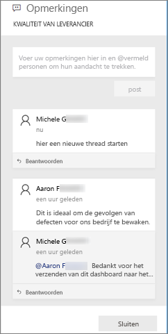
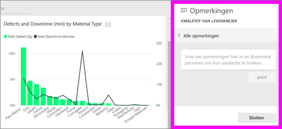
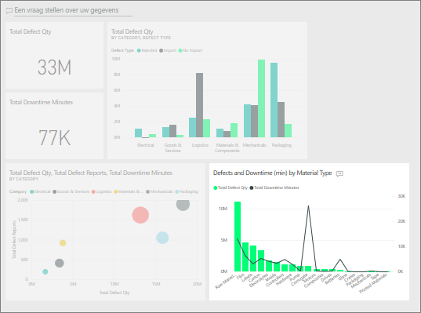

# Opmerkingen toevoegen aan een dashboard
Voeg een persoonlijke opmerking toe of start een discussie over een dashboard met uw collega's. De functie **Opmerkingen** is slechts een van de manieren waarop een *gebruiker* met anderen kan samenwerken. 

## De functie voor opmerkingen gebruiken
Opmerkingen kunnen worden toegevoegd aan een volledig dashboard of aan afzonderlijke visuals op een dashboard. Voeg een algemene opmerking toe of een opmerking gericht aan specifieke collega's.  

### Een algemene opmerking aan een dashboard toevoegen
1. Open Power BI-dashboard en selecteer het pictogram **Opmerkingen**. Hiermee opent u het dialoogvenster Opmerkingen.

    

    Hier zien we dat de maker van het dashboard al een algemene opmerking heeft toegevoegd.  Iedereen met toegang tot dit dashboard ziet deze opmerking.

    

2. Als u wilt reageren, selecteert u **Antwoord**, typt u uw reactie en selecteert u **Post**.  

    

    Standaard stuurt Power BI uw reactie naar de collega die de opmerkingen-thread heeft gestart, in dit geval Aaron F. 

    

 3. Als u een dashboardopmerking wilt toevoegen die geen deel uitmaakt van een bestaande thread, voert u uw opmerking in het bovenste tekstveld in.

    

    De opmerkingen voor dit dashboard zien er nu als volgt uit.

    

### Een opmerking toevoegen aan een specifieke dashboard-visual
1. Beweeg de muisaanwijzer over de visual en selecteer het beletselteken (...).    
2. Selecteer **Een opmerking toevoegen** in de vervolgkeuzelijst.

      

3.  Hiermee opent u het dialoogvenster **Opmerkingen**. Deze visual bevat nog geen opmerkingen. 

      

4. Typ de opmerking en selecteer **Post**.

      

    Het diagrampictogram  laat ons weten dat deze opmerking is gekoppeld aan een specifieke visual. Selecteer het pictogram dat hoort bij de bijbehorende visual op het dashboard.

    

5. Selecteer **Sluiten** om terug te gaan naar het dashboard of rapport.

### Vraag de aandacht van uw collega's met behulp van het @-teken
Of u nu dashboardopmerkingen plaatst of een opmerking plaatst bij een bepaalde visual, u trekt de aandacht van uw collega's met het @-teken.  Wanneer u het @-symbool typt, opent Power BI een vervolgkeuzelijst waarin u personen van uw organisatie kunt zoeken en selecteren. Elke geverifieerde naam met een @ ervoor verschijnt in een blauw lettertype. 

Hier volgt een gesprek dat ik heb met de *ontwerper* van de visualisatie. Hij gebruikt het teken @ om er zeker van te zijn dat ik de opmerking zie. Ik weet zo dat deze opmerking voor mij is. Ik open dit app-dashboard in Power BI en selecteer **Opmerkingen** in de kop. Ons gesprek verschijnt in het deelvenster **Opmerkingen**.

  

## Volgende stappen
Terug naar [visualisaties voor gebruikers](end-user-visualizations.md)    
<!--[Select a visualization to open a report](end-user-open-report.md)-->