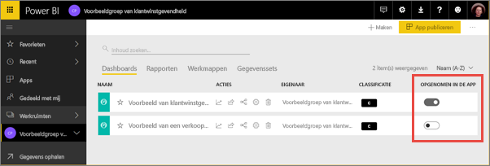
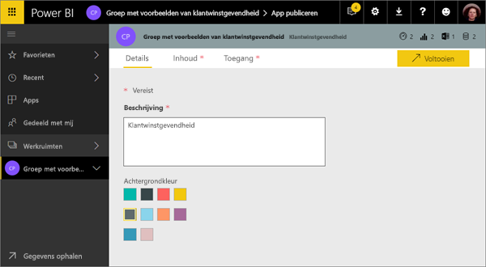
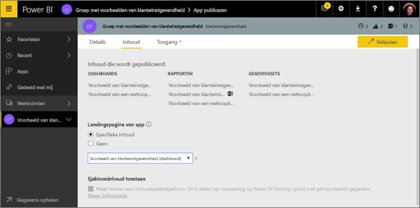
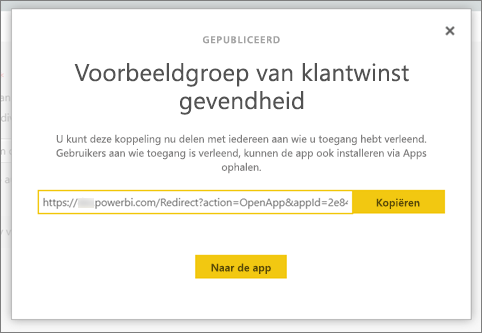
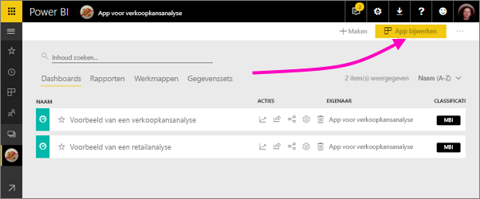
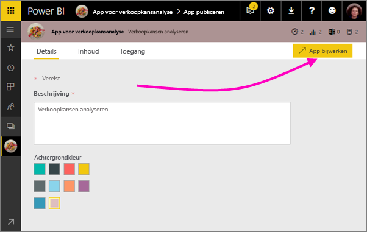
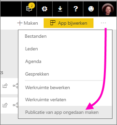

# Apps met dashboards en rapporten publiceren in Power BI

In Power BI kunt u *apps* met verzamelingen gerelateerde dashboards en rapporten publiceren. U maakt apps in *app-werkruimten*, waar u samen met uw collega's aan Power BI-inhoud kunt werken. Vervolgens kunt u de voltooide apps naar grote groepen mensen in uw organisatie publiceren. Meer informatie over [app-werkruimten maken](../service-create-workspaces.md).

Uw zakelijke gebruikers hebben vaak meerdere Power BI-dashboards en rapporten nodig voor hun bedrijfsvoering. Met Power BI-apps kunt u verzamelingen van dashboards en rapporten maken en deze apps naar uw hele organisatie of naar specifieke personen of groepen publiceren. Apps maken het u als beheerder of rapportmaker gemakkelijker om machtigingen voor deze verzamelingen te beheren.

Zakelijke gebruikers kunnen uw apps op een aantal verschillende manieren installeren. Als de Power BI-beheerder u toestemming geeft, kunt u apps automatisch installeren in de Power BI-accounts van uw collega's. Anders kunnen ze uw apps vanuit Microsoft AppSource installeren, of u kunt ze via een directe koppeling verzenden. Ze kunnen uw inhoud eenvoudig vinden en opnieuw bekijken, omdat alles op één plek staat. Ze kunnen de inhoud van de app niet wijzigen, maar ze kunnen wel bepaalde acties uitvoeren in de Power BI-service of een van de mobiele apps: filteren, markeren en de gegevens sorteren. Ze ontvangen automatisch updates en u kunt bepalen hoe vaak de gegevens worden vernieuwd. Meer informatie over de [app-ervaring voor zakelijke gebruikers](end-user-apps.md).

**Wist u dat?** Met Power BI is een preview-versie van een nieuwe werkruimte-ervaring beschikbaar. Lees [De nieuwe werkruimten maken (preview)](../service-create-the-new-workspaces.md) om te zien hoe werkruimten in de toekomst worden gewijzigd. 

## Apps en organisatie-inhoudspakketten
Apps zijn verbeterde organisatie-inhoudspakketten. Inhoudspakketten zijn niet beschikbaar in de preview voor nieuwe werkruimten. Nadat de nieuwe werkruimte-ervaring algemeen beschikbaar is gesteld, kunt u geen inhoudspakketten gebruiken in de nieuw gemaakte werkruimten. Begin met het migreren van uw inhoudspakketten naar apps als u dat nog niet hebt gedaan.

## Video: Apps en app-werkruimten
<iframe width="640" height="360" src="https://www.youtube.com/embed/Ey5pyrr7Lk8?showinfo=0" frameborder="0" allowfullscreen></iframe>

## Licenties voor apps
Elk lid van een app-werkruimte heeft een Power BI Pro-licentie nodig. Voor app-gebruikers zijn er twee opties.

* Optie 1: alle zakelijke gebruikers moeten **Power BI Pro**-licenties hebben om uw app te bekijken. 
* Optie 2: als uw app zich in een Power BI Premium-capaciteit bevindt, kunnen gratis gebruikers in uw organisatie de app-inhoud bekijken. Lees [Wat is Power BI Premium?](../service-premium.md) voor meer informatie.

## Uw app publiceren
Wanneer de dashboards en rapporten in uw werkruimte klaar zijn, kiest u welke dashboards en rapporten u wilt publiceren en publiceert u deze vervolgens als een app. U kunt een directe koppeling naar een breder publiek verzenden, of ze kunnen uw app vinden op het tabblad Apps door naar **Download and explore more apps from AppSource** (Meer apps downloaden en verkennen vanuit AppSource) te gaan. 

1. Kies in de lijstweergave van de werkruimte welke dashboards en rapporten u in de app wilt opnemen.

     

     Als u ervoor kiest om een rapport niet te publiceren, wordt er een waarschuwing naast het rapport en het bijbehorende dashboard weergegeven. U kunt de app nog steeds publiceren, maar in het bijbehorende dashboard ontbreken dan de tegels uit het rapport.

     

2. Selecteer de knop **App publiceren** in de rechterbovenhoek om het proces voor het delen van alle inhoud in de werkruimte te starten.
   
     

3. Geef bij **Details** een beschrijving op om mensen te helpen de app te vinden. U kunt een achtergrondkleur instellen om de app te personaliseren.
   
     

4. Bij **Inhoud** ziet u alle inhoud die wordt gepubliceerd als onderdeel van de app: alles wat u in de werkruimte hebt geselecteerd. U kunt ook de startpagina van de app instellen: het dashboard of rapport dat mensen als eerste zien wanneer ze naar uw app gaan. U kunt **Geen** kiezen. Vervolgens komen ze op een lijst van alle inhoud in de app te staan. 
   
     

5. Bepaal bij **Toegang** wie toegang tot de app heeft: ofwel iedereen in uw organisatie, of specifieke personen of Active Directory-beveiligingsgroepen. Als u toestemming hiervoor hebt, kunt u de app automatisch voor de ontvangers installeren. U kunt deze instelling inschakelen in de [Power BI-beheerportal](#how-to-enable-pushing-apps). Meer overwegingen voor het [pushen van een app](#how-to-enable-pushing-apps).

    

6. Wanneer u **Voltooien** selecteert, wordt er een bevestigingsbericht weergegeven dat de app gereed is om te publiceren. U kunt in het dialoogvenster dat na het voltooien wordt weergegeven, de URL voor de directe koppeling naar de app kopiëren en verzenden naar de personen waarmee u de app hebt gedeeld.
   
     

Meer informatie over de [app-ervaring voor zakelijke gebruikers](end-user-apps.md).

## Uw gepubliceerde app wijzigen
Nadat u uw app hebt gepubliceerd, kunt u deze wijzigen of bijwerken. Het is gemakkelijk om de app bij te werken als u een beheerder of lid van de app-werkruimte of een inzender in een nieuwe app-werkruimte bent. 

1. Open de app-werkruimte die bij de app hoort. 
   
     
2. Open het dashboard of het rapport. U kunt de gewenste wijzigingen aanbrengen.
   
     De app-werkruimte is uw faseringsplek. Uw wijzigingen worden pas live in de app wanneer u de app opnieuw publiceert. Dit betekent dat u wijzigingen kunt aanbrengen zonder dat dit de gepubliceerde apps beïnvloedt.  
 
3. Ga terug naar de lijst met inhoud van de app-werkruimte en selecteer **App bijwerken**.
   
     

4. Werk indien nodig **Details**, **Inhoud** en **Toegang** bij en selecteer **App bijwerken**.
   
     

De mensen waarnaar u de app heeft gepubliceerd, zien automatisch de bijgewerkte versie van de app. 

## Automatisch apps voor eindgebruikers installeren
Apps leveren gegevens die uw eindgebruikers nodig hebben om hun werkzaamheden te kunnen uitvoeren. Als u toestemming van een beheerder krijgt, kunt u automatisch apps installeren voor eindgebruikers, zodat u eenvoudiger de juiste apps naar de juiste personen of groepen kunt distribueren. Uw app wordt automatisch weergegeven in de lijst met apps van uw eindgebruikers zodat het niet meer nodig is de apps in Microsoft AppSource te zoeken of een installatiekoppeling te volgen. Dit maakt het voor u eenvoudiger om standaardinhoud voor Power BI te implementeren voor uw gebruikers.

### Procedure voor het automatisch installeren van een app voor eindgebruikers
Nadat de beheerder u machtigingen heeft verleend, hebt u een nieuwe optie om **de app automatisch te installeren**. Wanneer u het selectievakje inschakelt en **Voltooien** selecteert (of **App bijwerken** voor bestaande apps), wordt de app gepusht naar alle gebruikers of groepen die zijn gedefinieerd in de sectie **Machtigingen** van de app op het tabblad **Toegang**.

### Hoe krijgen gebruikers de apps die naar ze zijn gepusht?
Nadat u een app hebt gepusht, wordt deze automatisch weergegeven in de lijst met apps. U kunt de apps cureren die specifieke gebruikers of gebruikersrollen in uw organisatie paraat moeten hebben.

### Overwegingen voor het automatisch installeren van apps
Hier volgt een aantal zaken waarmee u rekening moet houden wanneer u apps naar eindgebruikers pusht:

* Het automatisch installeren van apps voor gebruikers kan enige tijd in beslag nemen. De meeste apps worden direct voor gebruikers geïnstalleerd, maar het pushen van apps kan enige tijd duren.  Hoe lang dit duurt, is afhankelijk van het aantal items in de app en het aantal personen dat toegang tot de app heeft. U wordt aangeraden apps buiten bedrijfsuren te pushen en te zorgen dat er voldoende tijd voor de installatie is voordat gebruikers de app nodig hebben. Voordat u een algemene mededeling over de beschikbaarheid van de app verzendt, kunt u bij meerdere gebruikers controleren of de app is geïnstalleerd.

* Vernieuw de browser. Voordat de gepushte app in de lijst Apps wordt weergegeven, kan het zijn dat gebruikers de browser moeten vernieuwen of moeten sluiten en vervolgens opnieuw moeten openen.

* Als gebruikers de app niet direct in de lijst met apps zien, moeten ze de browser vernieuwen of sluiten en opnieuw openen.

* Probeer gebruikers niet te overspoelen met apps. Zorg ervoor dat u niet te veel apps pusht, zodat gebruikers het gevoel hebben dat de vooraf geïnstalleerde apps ook daadwerkelijk nuttig voor ze zijn. Voor een goed afstemming van de timing is het verstandig te bepalen wie apps naar eindgebruikers mag pushen. U kunt in uw organisatie een contactpersoon toewijzen die verantwoordelijk is voor het pushen van apps naar eindgebruikers.

* Gastgebruikers die een uitnodiging niet hebben geaccepteerd, krijgen geen apps die automatisch voor hen worden geïnstalleerd.  

## Een app publiceren ongedaan maken
Elk lid van een app-werkruimte kan het publiceren van de app ongedaan maken.

* Selecteer in een app-werkruimte het weglatingsteken (**...**) in de rechterbovenhoek > **Publicatie van app ongedaan maken**.
  
     

Met deze actie wordt de app verwijderd voor iedereen waarnaar u deze hebt gepubliceerd, waarna ze geen toegang meer tot de app hebben. De app-werkruimte en de inhoud ervan worden niet verwijderd.

## Volgende stappen
* [Een app-werkruimte maken](../service-create-workspaces.md)
* [Apps in Power BI installeren en gebruiken](end-user-apps.md)
* [Power BI-apps voor externe services](end-user-connect-to-services.md)
* [Power BI-beheerportal](https://docs.microsoft.com/power-bi/service-admin-portal)
* Vragen? [Misschien dat de Power BI-community het antwoord weet](http://community.powerbi.com/)
