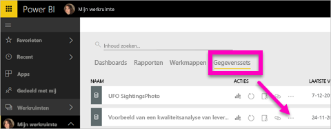
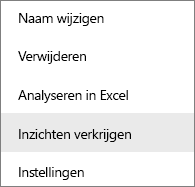
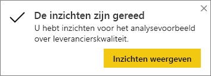
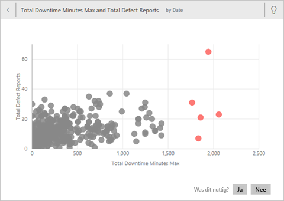
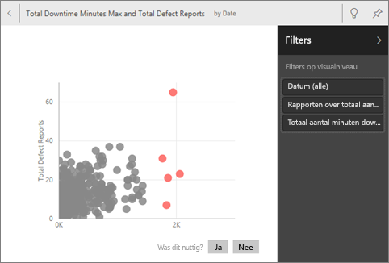
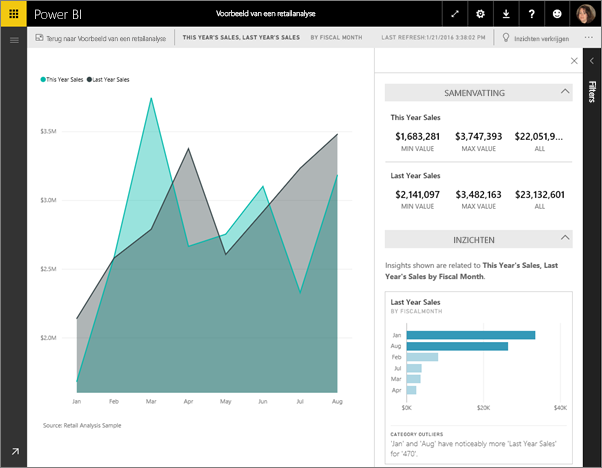

# Automatisch gegevensinzichten genereren met Power BI
Hebt u een nieuwe gegevensset en weet niet precies waar u moet beginnen?  Moet u snel een dashboard bouwen?  Wilt u snel inzichten zoeken die u hebt gemist?

Voer Snelle inzichten uit om interessante interactieve visualisaties op basis van uw gegevens te genereren. Snelle inzichten kan worden uitgevoerd op een volledige gegevensset (Snelle inzichten) of op een specifieke dashboardtegel (Scoped inzichten). U kunt inzichten zelfs uitvoeren op een inzicht.

> **Opmerking**: inzichten werkt niet met DirectQuery, maar alleen met gegevens die zijn geüpload naar Power BI.
> 

De functie voor inzichten is gebouwd op een groeiende [set geavanceerde analytische algoritmen](end-user-insight-types.md) die zijn ontwikkeld samen met Microsoft Research. We blijven Microsoft Research gebruiken om ervoor te zorgen dat meer mensen op nieuwe en intuïtieve manieren inzichten in hun gegevens kunnen vinden.

## Snelle inzichten uitvoeren op een gegevensset
Kijk hoe Amanda snelle inzichten uitvoert op een gegevensset, een inzicht opent in de focusmodus, een van de inzichten vastmaakt aan haar dashboard en vervolgens inzichten verkrijgt voor haar dashboardtegel.

<iframe width="560" height="315" src="https://www.youtube.com/embed/et_MLSL2sA8" frameborder="0" allowfullscreen></iframe>

Nu is het uw beurt. Verken inzichten door gebruik te maken van het de [voorbeeld van kwaliteitsanalyse van leveranciers](../sample-supplier-quality.md).

1. Selecteer op het tabblad **Gegevenssets** het beletselteken (...) en kies **Inzichten verkrijgen**.
   
    
   
    
2. Er worden [verschillende algoritmen](end-user-insight-types.md) in Power BI gebruikt om trends in uw gegevensset te zoeken.
   
    
3. Uw inzichten zijn binnen enkele seconden klaar.  Selecteer **Inzichten weergeven** om visualisaties weer te geven.
   
    
   
   > **Opmerking**: met sommige gegevenssets kunt u geen inzichten genereren, omdat de gegevens niet statistisch significant zijn.  Zie [Uw gegevens optimaliseren voor inzichten](../service-insights-optimize.md) voor meer informatie.
   > 
   > 
1. De visualisaties worden weergeven op een speciaal canvas voor **Snelle inzichten** met maximaal 32 afzonderlijke kaarten met inzichten. Elke kaart bevat een grafiek of diagram plus een korte beschrijving.
   
    

## Interactie met de kaarten met inzichten
  

1. Beweeg de muisaanwijzer over de kaart en selecteer het speldpictogram om de visualisatie toe te voegen aan een dashboard.
2. Beweeg de muisaanwijzer over een kaart, selecteer het beletselteken (...) en kies **Inzichten weergeven**. Hiermee opent u het inzicht in een volledig scherm.
   
    
3. In de focusmodus kunt u het volgende:
   
   * De visualisaties filteren.  Selecteer de pijl in de rechterbovenhoek van het deelvenster Filters om de filters weer te geven.
        
   * Maak de kaart met inzichten vast aan een dashboard door het speldpictogram  of **Visueel element vastmaken** te selecteren.
   * Voer inzichten uit op de kaart zelf. Dit wordt vaak aangeduid als **scoped inzichten**. Selecteer in de rechterbovenhoek het gloeilamppictogram  of selecteer **Inzichten verkrijgen**.
     
       
     
     Het inzicht wordt aan de linkerkant weergegeven en de nieuwe kaarten, die uitsluitend zijn gebaseerd op dit ene inzicht, worden aan de rechterkant weergegeven.
     
       
4. Selecteer in de linkerbovenhoek **Focusmodus sluiten** om terug te keren naar het oorspronkelijk canvas inzichten.

## Inzichten uitvoeren op een dashboardtegel
In plaats dat u inzichten zoekt in een complete gegevensset, kunt u uw zoekopdracht afbakenen tot de gegevens die zijn gebruikt om een dashboardtegel te maken. Ook dit wordt vaak aangeduid als **scoped inzichten**.

1. Open een dashboard.
2. Beweeg de muisaanwijzer over een tegel. Selecteer het beletselteken (...) en kies **Inzichten verkrijgen**. De tegel wordt geopend in de [focusmodus](end-user-focus.md) met de kaarten voor inzichten weergegeven aan de rechterkant.    
   
        
4. Wekt een bepaald inzicht uw interesse? Selecteer deze kaart om dieper te graven. Het geselecteerde inzicht wordt aan de linkerkant weergegeven en de nieuwe kaarten met inzichten, die uitsluitend zijn gebaseerd op dit ene inzicht, worden aan de rechterkant weergegeven.    
6. Blijf in uw gegevens spitten, en wanneer u een interessant inzicht hebt gevonden, kunt u dit vastmaken aan uw dashboard door in de rechterbovenhoek **Visueel element vastmaken** te selecteren.

## Volgende stappen
Als u de eigenaar van een gegevensset bent, kunt u deze [optimaliseren voor Snelle inzichten](../service-insights-optimize.md)

Meer informatie over de [typen Snelle inzichten die beschikbaar zijn](end-user-insight-types.md)

Nog vragen? [Misschien dat de Power BI-community het antwoord weet](http://community.powerbi.com/)

