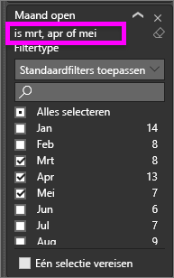
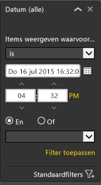

# Rondleiding door het deelvenster Filters van het rapport
In dit artikel wordt een overzicht van het deelvenster rapportfilters in Power BI-service. De filters gebruiken om nieuwe inzichten in uw gegevens te ontdekken.

Er zijn veel verschillende manieren om gegevens te filteren in Power BI. Wij raden u aan om te beginnen met het lezen van [Filters en markeren](../power-bi-reports-filters-and-highlighting.md).

## Het deelvenster Filters van het rapport gebruiken
Als een collega een rapport met u deelt, bekijk dan het deelvenster **Filters**. Het wordt soms samengevouwen aan de rechterzijde van het rapport. Selecteer het om het uit te breiden.   

Het deelvenster Filters bevat filters die aan het rapport zijn toegevoegd door de *rapportontwerper*. *Consumenten* , zoals u kunt werken met de bestaande filters en sla de wijzigingen, maar geen nieuwe filters toevoegen aan het rapport. In de bovenstaande schermopname heeft de ontwerper bijvoorbeeld twee filters op paginaniveau toegevoegd: Segmenteer en jaar uitgevoerd. U kunt deze filters gebruiken en wijzigen, maar u kunt geen derde filter op paginaniveau toevoegen.

Rapporten behouden van wijzigingen die u in het deelvenster Filters aanbrengt en deze wijzigingen worden doorgevoerd in de mobiele versie van het rapport in de Power BI-service. Als u de standaardinstellingen die de ontwerper heeft geconfigureerd voor het deelvenster Filters wilt herstellen, selecteert u **Standaardinstellingen herstellen** in de bovenste menubalk.  

   

## De filters voor rapportpagina's weergeven
Het deelvenster Filters weergegeven alle filters die zijn toegevoegd aan het rapport door de *designer*. Het deelvenster Filters is ook het gebied waar u informatie bekijken over de filters en er interactie mee. U kunt de wijzigingen die u gebruikt of opslaan **standaardinstellingen herstellen** om terug te keren naar de oorspronkelijke filterinstellingen.

Als er wijzigingen die u wilt opslaan, kunt u ook een persoonlijke bladwijzer maken.  Zie voor meer informatie, [een bladwijzer toevoegen aan een rapport](end-user-bookmarks.md).

Er zijn verschillende typen rapportfilters die worden weergegeven en beheerd in het deelvenster Filters die worden toegepast op een visueel element, op een rapportpagina en naar het volledige rapport.

In dit voorbeeld hebben we een visueel element waarvoor 2 filters geselecteerd. De rapportagepagina heeft ook filters, onder de **Filters op deze pagina** kop. En het hele rapport heeft een filter voor datum.

Naast sommige filters staat het woord **Alle**, wat betekent dat alle waarden in het filter worden opgenomen.  Bijvoorbeeld, **Segment(All)** in de bovenstaande schermafbeelding kan worden achterhaald dat deze rapportpagina gegevens over alle segmenten van het product bevat.  Aan de andere kant, het paginaniveau van de filteren van **regio West is** aangeeft dat de rapportpagina alleen gegevens voor de regio West bevat.

Iedereen die dit rapport bekijkt, kan met deze filters werken.

### Alleen deze filters toegepast op een visueel element weergeven
Als u nog eens kijken de filters toegepast op een specifieke visual, Beweeg de muisaanwijzer over het visuele element om weer te geven van het filterpictogram . Selecteer dit filterpictogram om te zien van een pop-upvenster met de filters, slicers en enzovoort, die betrekking hebben op deze visual. De filters op het pop-upvenster weergegeven op dezelfde filters zijn de **Filters** deelvenster. 

 
Dit zijn de typen filters die in deze weergave kan worden weergegeven:
- Standaardfilters
- Slicers
- Kruislings markeren
- Kruislings filteren
- Geavanceerde filters
- Top N-filters
- Relatieve datumfilters
- Synchroonslicers
- Opname-/uitsluitingsfilters
- Filters die via een URL zijn doorgegeven

In het voorbeeld hieronder:
1. U ziet dat het kolomdiagram gefilterd is.
2. **Opgenomen** aangeeft dat het kruislings filteren is bedoeld voor **Segment**, en drie worden opgenomen. 
3. Een slicer is toegepast voor **kwartaal**.
4. **Regio** een filter is toegepast op deze pagina van het rapport, en
5. **isVanArsdel** en **jaar** zijn filters zijn toegepast op deze visual.

### Zoeken in een filter
Een filter kan soms een lange lijst met waarden hebben. Gebruik het zoekvak om te zoeken en selecteer de gewenste waarde. 

### Details van de filters weergeven
Voor meer informatie over een filter, bekijk de beschikbare waarden en aantallen.  Bekijk de details van het filter door te bewegen en de pijl naast de filternaam te selecteren. 
  

### Filterselecties wijzigen
Er is één manier om te zoeken naar inzichten in gegevens om te communiceren met de filters. U kunt met behulp van de pijl naast de veldnaam van het filterselecties kunt wijzigen.  Afhankelijk van het filter en het type gegevens dat wordt gefilterd, wordt de opties variëren van eenvoudige selecties in een lijst met bereiken van datums of nummers identificeren. In het onderstaande geavanceerde filter was een wijziging van het filter **totale eenheden YTD** op de treemap tussen 2000 en 3000. U ziet dat dit Prirum uit de treemap wordt verwijderd. 
  

> [!TIP]
> Als u wilt meer dan één filterwaarde tegelijkertijd selecteren, houdt u de CTRL-toets. De meeste filters bieden ondersteuning voor meervoudige selectie. 

### Filter op standaardwaarden opnieuw instellen
Als u wilt back-ups maken van alle wijzigingen u hebt aangebracht in de filters, selecteer **standaardinstellingen herstellen** in de bovenste menubalk.  Hierdoor wordt de filters in de oorspronkelijke staat, zoals ingesteld door het rapport *designer*. 

    
### Een filter wissen
Als er slechts één filter dat u wilt instellen wordt op **(alle)** , schakelt u het door het gumpictogram  naast de filternaam.
  
<!--  too much detail for consumers

## Types of filters: text field filters
### List mode
Ticking a checkbox either selects or deselects the value. The **All** checkbox can be used to toggle the state of all checkboxes on or off. The checkboxes represent all the available values for that field.  As you adjust the filter, the restatement updates to reflect your choices. 

Note how the restatement now says "is Mar, Apr or May".

### Advanced mode
Select **Advanced Filtering** to switch to advanced mode. Use the dropdown controls and text boxes to identify which fields to include. By choosing between **And** and **Or**, you can build complex filter expressions. Select the **Apply Filter** button when you've set the values you want.  

## Types of filters: numeric field filters
### List mode
If the values are finite, selecting the field name displays a list.  See **Text field filters** &gt; **List mode** above for help using checkboxes.   

### Advanced mode
If the values are infinite or represent a range, selecting the field name opens the advanced filter mode. Use the dropdown and text boxes to specify a range of values that you want to see. 

By choosing between **And** and **Or**, you can build complex filter expressions. Select the **Apply Filter** button when you've set the values you want.

## Types of filters: date and time
### List mode
If the values are finite, selecting the field name displays a list.  See **Text field filters** &gt; **List mode** above for help using checkboxes.   

### Advanced mode
If the field values represent date or time, you can specify a start/end time when using Date/Time filters.  

-->

## Volgende stappen
[Leer hoe en waarom visuals elkaar in een rapport kruislings filteren en markeren](end-user-interactions.md)