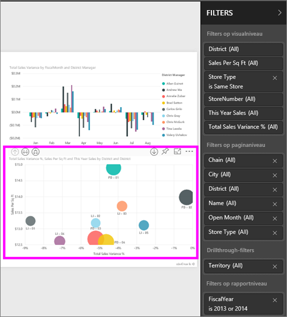
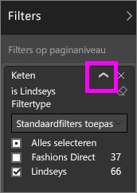
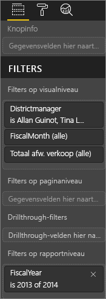
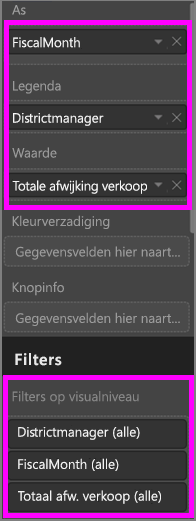
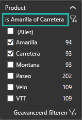
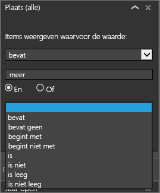

# Rondleiding door het deelvenster Filters van het rapport
In dit artikel wordt het rapportvenster Filters diepgaand besproken. U ziet het deelvenster in de [bewerkweergave en leesweergave van Power BI-service](end-user-reading-view.md) en in de [rapportweergave van Power BI Desktop](../desktop-report-view.md).

Er zijn veel verschillende manieren om gegevens te filteren in Power BI. Wij raden u aan om te beginnen met het lezen van [Filters en markeren](../power-bi-reports-filters-and-highlighting.md).

## Het deelvenster Filters van het rapport gebruiken
Rapporten worden in Power BI Desktop geopend in de rapportweergave. Rapporten in de Power BI-service kunnen in de [bewerkingsweergave of leesweergave](end-user-reading-view.md) worden geopend. In de bewerkingsweergave en in de rapportweergave van Power BI Desktop kunnen rapporteigenaren [filters aan een rapport toevoegen](../power-bi-report-add-filter.md). Deze filters worden met het rapport opgeslagen. Gebruikers die het rapport in de leesweergave bekijken, kunnen de filters gebruiken en hun wijzigingen opslaan. Ze kunnen echter geen nieuwe filters toevoegen aan het rapport.

In de Power BI-service worden wijzigingen die u aanbrengt in het deelvenster Filters bewaard en deze wijzigingen worden doorgevoerd in de mobiele versie van het rapport. Als u de standaardinstellingen die de maker heeft geconfigureerd voor het deelvenster Filters wilt herstellen, selecteert u **Standaardinstellingen herstellen** in de bovenste menubalk.     

## Het deelvenster Filters openen
Wanneer een rapport is geopend, wordt het deelvenster Filters aan de rechterkant van het rapportcanvas weergegeven. Als u het deelvenster niet ziet, selecteert u de pijl in de rechterbovenhoek om het uit te vouwen. Als u de leesweergave van de Power BI-service gebruikt, is het deelvenster Filters het enige deelvenster dat aan de rechterkant beschikbaar is.

In dit voorbeeld hebben we een visualisatie met 6 filters geselecteerd. De rapportagepagina heeft ook filters, onder de kop **Filters op paginaniveau**. Er is één [Drillthrough-filter](../power-bi-report-add-filter.md) en het hele rapport heeft ook een filter: **FiscalYear** (Boekjaar) is 2013 of 2014.

Naast sommige filters staat het woord **Alle**, wat betekent dat alle waarden in het filter worden opgenomen.  Zo zien we aan **Chain (All)** (Keten (Alle)) in onderstaande schermafbeelding dat deze rapportpagina gegevens bevat over alle winkelketens.  Aan de andere kant blijkt uit het filter op rapportniveau **FiscalYear is 2013 or 2014** (Boekjaar is 2013 of 2014) dat het rapport alleen gegevens voor de boekjaren 2013 en 2014 bevat.

Iedereen die dit rapport bekijkt, kan met deze filters werken.

* Bekijk de details van het filter door de pijl naast het filter aan te wijzen en te selecteren.
  
   
* Wijzig het filter, bijvoorbeeld door **Lindseys** te wijzigen in **Fashions Direct**.
  
     

* Herstel de oorspronkelijke staat van de filters door **Standaardinstellingen herstellen** in de bovenste menubalk te selecteren.    
    
    
* Verwijder het filter door de **x** naast de filternaam te selecteren.
  
  Het verwijderen van een filter verwijdert het uit de lijst, maar verwijdert de gegevens niet uit het rapport.  Als u bijvoorbeeld het filter **FiscalYear is 2013 or 2014** (Boekjaar is 2013 of 2014) verwijdert, blijven de boekjaargegevens in het rapport staan. De gegevens worden niet meer gefilterd, zodat nu niet alleen de gegevens voor 2013 en 2014, maar voor alle belastingjaren die voorkomen in de gegevens worden weergegeven.  Als u het filter eenmaal hebt verwijderd kunt u het echter niet meer wijzigen, omdat het uit de lijst is verwijderd. Een betere optie is het filter te wissen door het gumpictogram  te selecteren.
  
  

## Filters in de Bewerkweergave
Wanneer een rapport is geopend in Power BI Desktop of in de bewerkingsweergave van de Power BI-service, wordt het deelvenster Filters aan de rechterkant van het rapportcanvas weergegeven, in het onderste deel van het **deelvenster Visualisaties**. Als u het deelvenster niet ziet, selecteert u de pijl in de rechterbovenhoek om het uit te vouwen.

.  

Als er geen visualisatie is geselecteerd in het canvas, worden in het deelvenster Filters alleen de filters weergegeven die van toepassing zijn op de gehele rapportpagina of het volledige rapport, en eventuele drillthrough-filters (als die zijn ingesteld). In het onderstaande voorbeeld is er geen visualisatie geselecteerd en zijn er geen filters op paginaniveau of drillthrough-filters, maar wel een filter op rapportniveau.  

  

Als er een visualisatie is geselecteerd in het canvas, ziet u ook de filters die alleen van toepassing zijn op die visualisatie:   

Als u opties voor een bepaald filter wilt weergeven, selecteert u de pijl omlaag naast de filternaam.  In onderstaand voorbeeld is het rapportniveaufilter ingesteld op 2013 en 2014. Dit is een voorbeeld van het toepassen van **standaardfilters**.  Als u de geavanceerde opties wilt weergeven, selecteert u **Geavanceerd filteren**.

## Een filter wissen
 Selecteer in de geavanceerde modus of standaardfiltermodus het gumpictogram  om het filter te wissen. 

## Een filter toevoegen
* Voeg in Power BI Desktop of in de bewerkingsweergave van de Power BI-service een filter toe aan een visual, pagina, drillthrough of rapport door een veld uit het deelvenster Velden te selecteren en het naar het betreffende vak voor filters te slepen, waar u de woorden **Sleep velden hierheen** ziet. Nadat een veld als filter is toegevoegd, kunt u het verfijnen met behulp van de besturingselementen Standaardfilters toepassen en Geavanceerd filteren (zie hieronder).

* **Door een nieuw veld naar het filtergebied op niveau van visuele elementen te slepen, wordt dat veld niet aan het visuele element toegevoegd** maar kunt u wel filteren op dit visuele element met het nieuwe veld. In onderstaand voorbeeld wordt **Chain** (Keten) aan de visualisatie toegevoegd als nieuw filter. Merk op dat het toevoegen van **Chain** als filter de visualisatie niet verandert, totdat u het besturingselement Standaardfilters toepassen of Geavanceerd filteren gebruikt.

    

* Alle velden die worden gebruikt om een visualisatie te maken, zijn ook beschikbaar als filters. Selecteer eerst een visueel element om het te activeren. De velden die in de visual worden gebruikt, worden vermeld in het deelvenster Visualisaties en in het deelvenster Filters onder de kop **Filters op niveau van visual**.
  
     
  
   U kunt elk van deze velden verfijnen met behulp van de besturingselementen Standaardfilters toepassen en Geavanceerd filteren (zie hieronder).

## Typen filters: tekstveldfilters
### Lijstmodus
Als u een selectievakje aanvinkt, selecteert of deselecteert u de waarde. Het selectievakje **Alle** kan worden gebruikt om alle selectievakjes in of uit te schakelen. De selectievakjes geven alle beschikbare waarden voor dat veld weer.  Terwijl u het filter aanpast, wordt de herformulering aangepast aan uw keuzes. 

U ziet dat de herformulering nu luidt:"is Amarilla of Carretera"

### Geavanceerde modus
Selecteer **Geavanceerd filteren** om over te schakelen naar de geavanceerde modus. Gebruik de vervolgkeuzelijsten en tekstvakken om aan te geven welke velden u wilt opnemen. Door te kiezen tussen **En** en **Of**, kunt u complexe filterexpressies maken. Selecteer de knop **Filter toepassen** wanneer u de gewenste waarden hebt ingesteld.  

## Typen filters: numerieke veldfilters
### Lijstmodus
Als er een eindig aantal waarden is, wordt er een lijst weergegeven als u de veldnaam selecteert.  Zie **Tekstveldfilters** &gt; **Lijstmodus** hierboven voor hulp bij het gebruik van selectievakjes.   

### Geavanceerde modus
Als het aantal waarden oneindig is of als de waarden een bereik aangeven, wordt de geavanceerde filtermodus geopend als u de veldnaam selecteert. Gebruik de vervolgkeuzelijst en tekstvakken om een bereik met waarden aan te geven dat u wilt zien. 

Door te kiezen tussen **En** en **Of**, kunt u complexe filterexpressies maken. Selecteer de knop **Filter toepassen** wanneer u de gewenste waarden hebt ingesteld.

## Typen filters: datum en tijd
### Lijstmodus
Als er een eindig aantal waarden is, wordt er een lijst weergegeven als u de veldnaam selecteert.  Zie **Tekstveldfilters** &gt; **Lijstmodus** hierboven voor hulp bij het gebruik van selectievakjes.   

### Geavanceerde modus
Als de veldwaarden datums of tijden vertegenwoordigen, kunt u een begin-/eindtijd opgeven wanneer u datum-/tijdfilters gebruikt.  

## Volgende stappen
[Filters en markeren in rapporten](../power-bi-reports-filters-and-highlighting.md)  
[Interact with filters and highlighting in report Reading View](end-user-reading-view.md) (Werken met filters en markeringen in de leesweergave voor rapporten)  
[Filters maken in de Bewerkweergave van rapporten](../power-bi-report-add-filter.md)  
[Change how report visuals cross-filter and cross-highlight each other](end-user-interactions.md) (Wijzigen hoe visuele rapportelementen elkaar kruislings filteren en markeren)

Lees meer over [rapporten in Power BI](end-user-reports.md)  
[Power BI - basisconcepten](end-user-basic-concepts.md)

Hebt u nog vragen? [Misschien dat de Power BI-community het antwoord weet](http://community.powerbi.com/)

