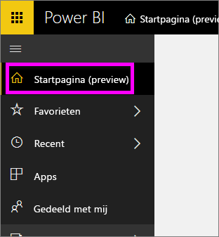
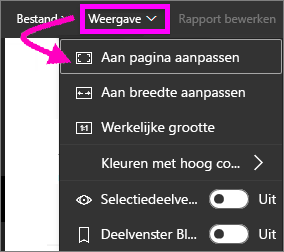
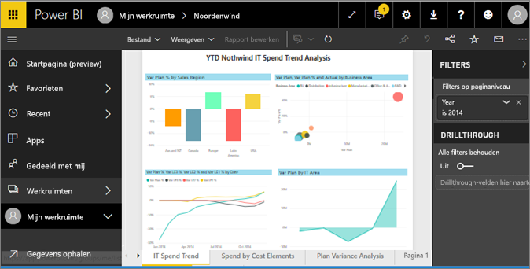
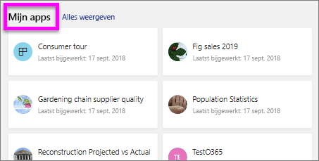
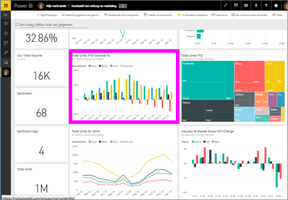
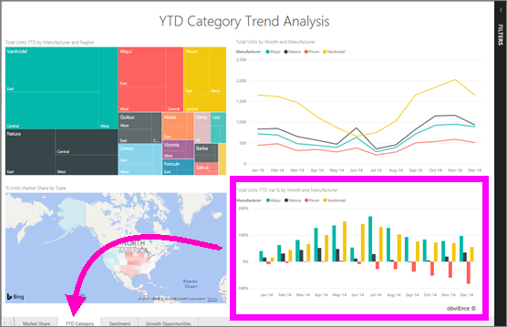

# Een rapport weergeven in de Power BI-service voor *gebruikers*
Een rapport bestaat uit een of meer pagina's met visuals. Rapporten worden gemaakt door Power BI-*rapportontwerpers* en [gedeeld met *gebruikers*, rechtstreeks](end-user-shared-with-me.md) of als onderdeel van een [app](end-user-apps.md). 

U kunt een rapport op veel verschillende manieren openen. We laten u twee van deze manieren zien: openen vanaf de Startpagina en openen vanaf een dashboard. 

<!-- add art-->

## Een rapport openen vanaf de Startpagina
We gaan eerst een rapport openen dat rechtstreeks met u is gedeeld en vervolgens een rapport dat is gedeeld als onderdeel van een app.

   

### Een rapport openen dat met u is gedeeld
Power BI-*ontwerpers* kunnen een rapport rechtstreeks met u delen door boven in hun menubalk op de knop **Delen** te klikken. Inhoud die op deze manier wordt gedeeld, wordt weergegeven in de container **Gedeeld met mij** in de linkernavigatiebalk en in de sectie **Gedeeld met mij** van uw Startpagina.

1. Open de Power BI-service (app.powerbi.com).

2. Selecteer in de linkernavigatiebalk de optie **Startpagina (preview)** om uw Startpagina te openen.  

   
   
3. Schuif omlaag totdat u **Gedeeld met mij** ziet. Zoek het . Op deze schermopname zien we twee rapporten: *Financieel* en *Northwind*. 
   
   

4. Selecteer een van de *rapportkaarten* om het bijbehorende rapport te openen.

   

5. Onderaan ziet u een reeks tabbladen. Elk tabblad vertegenwoordigt een *pagina* van het rapport. Momenteel is de pagina *IT Spend Trend* geopend. Selecteer een ander tabblad om de bijbehorende rapportpagina te openen. 

   

6. Op dit moment is slechts een gedeelte van de rapportpagina zichtbaar. Als u de weergave (in-/uitzoomen) van de pagina wilt wijzigen, selecteert u **Weergave** > **Aan pagina aanpassen**.

   

   

### Een rapport openen dat onderdeel is van een app
Als u apps hebt ontvangen van collega’s of van AppSource, zijn deze apps beschikbaar op uw Startpagina en vanuit de container **Apps** in de linkernavigatiebalk. Een [app](end-user-apps.md) is een bundel met dashboards en rapporten.

1. Ga terug naar de Startpagina door in de linkernavigatiebalk **Startpagina (preview)** te selecteren.

7. Schuif omlaag totdat u **Mijn apps** ziet.

   

8. Selecteer een van de apps om deze te openen. Afhankelijk van de opties die de *ontwerper* van de app heeft ingesteld, wordt met de app een dashboard, een rapport of een lijst met app-inhoud geopend. Als bij het selecteren van de app:
    - het rapport wordt geopend, kunt u direct aan de slag gaan.
    - een dashboard wordt geopend, gaat u hieronder naar [Een rapport openen vanaf een dashboard](#Open-a-report-from-a-dashboard).
    - de lijst met app-inhoud wordt geopend, kunt u onder **Rapporten** een rapport selecteren om het rapport te openen.

## Een rapport openen vanaf een dashboard
Rapporten kunnen worden geopend vanaf een dashboard. De meeste tegels voor dashboards zijn *vastgemaakt* vanuit rapporten. Als u een tegel selecteert, wordt het rapport geopend dat is gebruikt om de tegel te maken. 

1. Selecteer een tegel in het dashboard. In dit voorbeeld hebben we de kolomgrafiektegel 'Totaal aantal eenheden JTD...' geselecteerd.

    

2.  Het bijbehorende rapport wordt geopend. U ziet dat we op de pagina 'Categorie JTD' zijn. Dit is de rapportpagina die de kolomgrafiek bevat die we in het dashboard hebben geselecteerd.

    

> [!NOTE]
> Niet alle tegels leiden naar een rapport. Als u een tegel selecteert die is [gemaakt met V&A](end-user-q-and-a.md), wordt het scherm V&A geopend. Als u een tegel selecteert die [is gemaakt met de dashboardwidget **Tegel toevoegen**](../service-dashboard-add-widget.md), kunnen er verschillende dingen gebeuren.  

##  Nog meer manieren om een rapport te openen
Naarmate u vertrouwder raakt met het navigeren door de Power BI-service, moet u nagaan welke werkstromen het meest voor u geschikt. Enkele andere manieren om rapporten te benaderen:
- Vanuit het linkernavigatiedeelvenster via **Favorieten** of **Recent**    
- [Gerelateerde items weergeven](end-user-related.md) gebruiken    
- In een e-mail wanneer iemand [met u deelt](../service-share-reports.md) of als u [een waarschuwing hebt ingesteld](end-user-alerts.md)    
- Vanaf uw [Meldingencentrum](end-user-notification-center.md)    
- en meer

## Volgende stappen
Er zijn [veel verschillende manieren om met een rapport te werken](end-user-reading-view.md).  U kunt elke tabblad onder in het rapportcanvas selecteren om de gegevens te bekijken.

