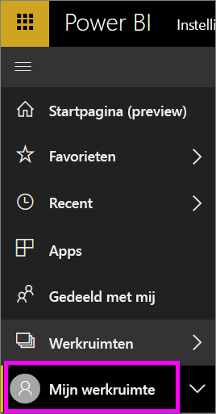
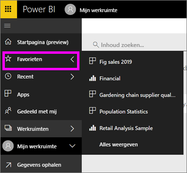

# Navigatie: inhoud zoeken en sorteren in de Power BI-service
Er zijn veel manieren om door uw inhoud in de Power BI-service te bladeren. De inhoud in werkruimten wordt geordend op vier tabbladen: Dashboards, Rapporten, Werkmappen en Gegevenssets.  De inhoud wordt ook ingedeeld per gebruik: Favorieten, Recent, Apps, Gedeeld met mij en Aanbevolen. Omdat u op de Startpagina alle inhoud op één pagina kunt vinden, is het de centrale plek voor navigatie. Via deze verschillende paden naar uw inhoud kunt u snel vinden wat u nodig hebt in de Power BI-service.  

## Navigatie in werkruimten

Power BI-*gebruikers* hebben meestal maar één werkruimte: **Mijn werkruimte**. **Mijn werkruimte** bevat alleen inhoud als u Microsoft-voorbeelden hebt gedownload, of uw eigen inhoud hebt gemaakt of gedownload.  

Binnen **Mijn werkruimte** in de Power BI-service wordt de inhoud van uw werkruimte gescheiden op type: dashboards, rapporten, werkmappen en gegevenssets. U ziet deze organisatie wanneer u een werkruimte selecteert. In dit voorbeeld bevat **Mijn werkruimte** één dashboard, twee rapporten, geen werkmap en twee gegevenssets.

________________________________________

## Navigatie met behulp van de linkernavigatiebalk
In de linkernavigatiebalk wordt uw inhoud zodanig geclassificeerd dat u nog gemakkelijker en sneller kunt vinden wat u nodig hebt.  

- Inhoud die met u wordt gedeeld, is beschikbaar in **Gedeeld met mij**.
- Uw laatst bekeken inhoud is beschikbaar in **Recent**. 
- U kunt uw apps vinden door **Apps** te selecteren.
- **Startpagina** is een weergave met één pagina met daarop uw belangrijkste inhoud en suggesties voor inhoud en onderwijsbronnen.

Bovendien kunt u inhoud labelen als [favoriet](end-user-favorite.md) en [aanbevolen](end-user-featured.md). Kies één dashboard dat u verwacht het meeste weer te geven en stel dit in als uw *aanbevolen* dashboard. Telkens wanneer u de Power BI-service opent, wordt uw aanbevolen dashboard als eerste weergegeven. Hebt u enkele dashboards en apps die u vaak bezoekt? Wanneer u deze instelt als favorieten, zijn ze altijd beschikbaar via de navigatiebalk links.

.

## Aandachtspunten en probleemoplossing
* Voor gegevenssets is **sorteren op** eigenaar niet beschikbaar.

## Volgende stappen
[Power BI - basisconcepten](end-user-basic-concepts.md)

Hebt u nog vragen? [Misschien dat de Power BI-community het antwoord weet](http://community.powerbi.com/)