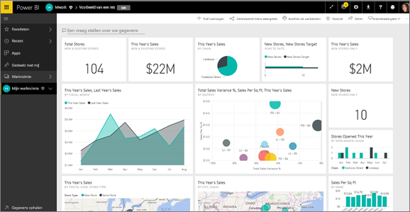
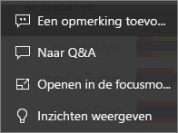
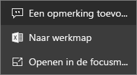
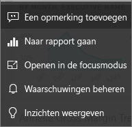

# Dashboardtegels in Power BI
Een tegel is een momentopname van uw gegevens en wordt door een *ontwerper* vastgemaakt aan het dashboard. Een tegel kan worden gemaakt vanuit een rapport, een gegevensset, een dashboard, het Q&A-vragenvak, Excel, SQL Server Reporting Services (SSRS) en meer.  Deze schermopname laat verschillende tegels zien die zijn vastgemaakt aan een dashboard.

Afgezien van tegels die vanuit rapporten zijn vastgemaakt, kunnen *ontwerpers* rechtstreeks zelfstandige tegels aan het dashboard toevoegen met **Tegel toevoegen**. Zelfstandige tegels bevatten: tekstvakken, afbeeldingen, video's, streaminggegevens en webinhoud.

Hulp nodig om de bouwstenen van Power BI te begrijpen?  Zie [Power BI - Basisconcepten](end-user-basic-concepts.md).

## Interactie met tegels op een dashboard

1. Beweeg de muisaanwijzer over de tegel om de weglatingstekens weer te geven.
   
    
2. Selecteer de weglatingstekens om het actiemenu van de tegel te openen. De beschikbare opties variëren per visualtype en de methode die is gebruikt om de tegel te maken. Hier volgen enkele voorbeelden van wat u zou kunnen zien.

    - tegel gemaakt met behulp van Q&A
   
        

    - tegel gemaakt vanuit een werkmap
   
        

    - tegel gemaakt vanuit een rapport
   
        
   
    Hier kunt u het volgende doen:
   
   * [Het rapport openen waarmee deze tegel is gemaakt ](end-user-reports.md)   
   
   * [De Q&A-vraag openen die is gebruikt om de tegel te maken ](end-user-reports.md)   
   

   * [Het werkblad openen waarmee deze tegel is gemaakt ](end-user-reports.md)   
    * [De tegel bekijken in de focusmodus ](end-user-focus.md)   
     * [Inzichten uitvoeren](end-user-insights.md) 
    * [Een opmerking toevoegen en een discussie starten](end-user-comment.md) 

3. Selecteer een leeg gebied op het canvas om het actiemenu te sluiten.

### Selecteer (klik op) een tegel
Als u een tegel selecteert, hangt wat er daarna gebeurt af van de manier waarop de tegel is aangemaakt en of deze een [aangepaste koppeling](../service-dashboard-edit-tile.md) heeft. Als de tegel een aangepaste koppeling heeft, wordt de koppeling geopend als u de tegel selecteert. Anders gaat u door het selecteren van de tegel naar het rapport, het Excel Online werkmap, het SSRS-rapport dat on-premises is of naar de Q&A-vraag die werd gebruikt om de tegel te maken.

> [!NOTE]
> Uitzondering hierop zijn videotegels die rechtstreeks op het dashboard zijn gemaakt met **Tegel toevoegen**. Als u een videotegel selecteert (die op deze manier is gemaakt), wordt de video direct op het dashboard afgespeeld.   
> 
> 

## Overwegingen en probleemoplossing
* Als het rapport waarmee de visualisatie is gemaakt, niet is opgeslagen, leidt het selecteren van de tegel niet tot een actie.
* Als de tegel is gemaakt vanuit een werkmap in Excel Online, en u hebt geen leesrechten voor deze werkmap, wordt door het selecteren van de tegel de werkmap niet in Excel Online geopend.
* Voor tegels die direct op het dashboard zijn gemaakt met behulp van **Tegel toevoegen**, wordt als een aangepaste hyperlink is ingesteld, de URL geopend wanneer u de titel, subtitel en/of tegel selecteert.  Het selecteren van een van deze tegels die direct op het dashboard zijn gemaakt voor een afbeelding, webcode of tekstvak, leidt anders standaard niet tot een actie.
* Als u geen machtiging hebt voor het rapport binnen SSRS en u een tegel selecteert die vanuit SSRS is gemaakt, wordt een pagina geproduceerd die aangeeft dat u geen toegang hebt (rsAccessDenied).
* Als u geen toegang hebt tot het netwerk waar de SSRS-server zich bevindt en u een tegel selecteert die is gemaakt op basis van SQL Server Reporting Services, een pagina geproduceerd die aangeeft dat de server niet kan worden gevonden (HTTP 404). Uw apparaat heeft netwerktoegang tot de rapportserver nodig om het rapport te kunnen weergeven.
* Als de oorspronkelijke visualisatie waarmee de tegel is gemaakt wijzigt, verandert de tegel niet.  Als de *ontwerper* bijvoorbeeld een lijndiagram uit een rapport heeft vastgemaakt en het lijndiagram vervolgens wijzigt in een staafdiagram, blijft de dashboardtegel een lijndiagram weergeven. De gegevens worden vernieuwd, maar het visualisatietype niet.

## Volgende stappen
[Gegevens vernieuwen](../refresh-data.md)

[Power BI - basisconcepten](end-user-basic-concepts.md)
