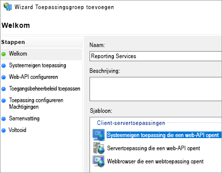
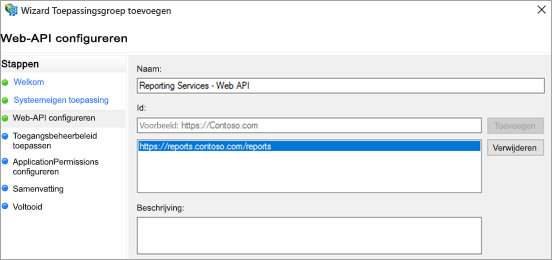
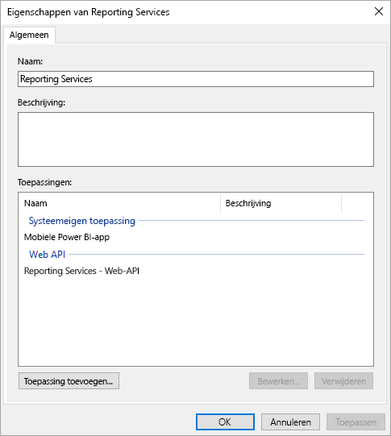
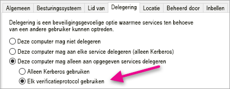
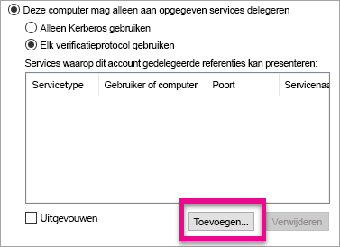
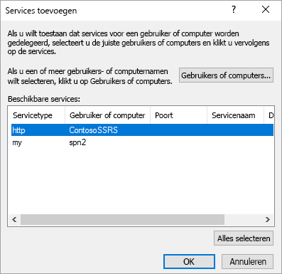

# <a name="using-oauth-to-connect-to-power-bi-report-server-and-ssrs"></a>OAuth gebruiken om verbinding te maken met Power BI Report Server en SSRS
Lees meer over het configureren van uw omgeving voor de ondersteuning van OAuth-verificatie met de Power BI-app voor mobiel om verbinding te maken met Power BI Report Server en SQL Server Reporting Services 2016 of hoger.


U kunt OAuth gebruiken om verbinding te maken met Power BI Report Server en Reporting Services; u kunt dan mobiele rapporten en KPI's weergeven. Windows Server 2016 biedt een aantal verbeteringen voor de webtoepassingsproxyrol (WAP) om dit type verificatie toe te staan. Houd er rekening mee dat het weergeven van Power BI-rapporten die worden gehost in Power BI Report Server en waarbij WAP wordt gebruikt om te verifiëren, momenteel niet officieel wordt ondersteund.

## <a name="requirements"></a>Vereisten
Windows Server 2016 is vereist voor de webtoepassingsproxy-servers (WAP) en ADFS-servers (Active Directory Federation Services). U hoeft niet een Windows 2016-domein op functioneel niveau te hebben.

## <a name="domain-name-services-dns-configuration"></a>DNS-configuratie (Domain Name Services)
U moet de openbare URL bepalen waarmee de Power BI-app voor mobiel verbinding moet maken. Deze zou er ongeveer als volgt uit kunnen zien.

```
https://reports.contoso.com
```

U moet uw DNS-record voor **rapporten** laten verwijzen naar het openbare IP-adres van de WAP-server. U moet ook een openbare DNS-record voor uw ADFS-server configureren. U kunt de ADFS-server bijvoorbeeld met de volgende URL hebben geconfigureerd.

```
https://fs.contoso.com
```

U moet uw DNS-record voor **fs** laten verwijzen naar het openbare IP-adres van de WAP-server, omdat deze als onderdeel van de WAP-toepassing wordt gepubliceerd.

## <a name="certificates"></a>Certificaten
U moet certificaten voor de WAP-toepassing en de ADFS-server configureren. Beide certificaten moeten deel uitmaken van een geldige certificeringsinstantie die door uw mobiele apparaten wordt herkend.

## <a name="reporting-services-configuration"></a>Reporting Services-configuratie
Wat Reporting Services betreft, hoeft er niet veel te worden geconfigureerd. U hebt wel een geldige Service Principal Name (SPN) nodig, zodat de juiste Kerberos-verificatie kan worden uitgevoerd en de Reporting Services-server is ingeschakeld voor negotiate-verificatie.

### <a name="service-principal-name-spn"></a>Service Principal Name (SPN)
De SPN is een unieke id voor een service die Kerberos-verificatie gebruikt. U moet ervoor zorgen dat er een geschikte HTTP-SPN aanwezig is voor de rapportserver.

Zie [Een Service Principal Name (SPN) voor een rapportserver registreren](https://msdn.microsoft.com/library/cc281382.aspx) voor meer informatie over het configureren van de juiste Service Principal Name (SPN) voor de rapportserver.

### <a name="enabling-negotiate-authentication"></a>Negotiate-verificatie inschakelen
Het verificatietype van de rapportserver moet als RSWindowsNegotiate worden geconfigureerd om een rapportserver Kerberos-verificatie te laten gebruiken. Dit wordt gedaan binnen het bestand rsreportserver.config.

```
<AuthenticationTypes>  
    <RSWindowsNegotiate />  
    <RSWindowsKerberos />  
    <RSWindowsNTLM />  
</AuthenticationTypes>
```

Zie [Een Reporting Services-configuratiebestand wijzigen](https://msdn.microsoft.com/library/bb630448.aspx) en [Windows-verificatie op een rapportserver configureren](https://msdn.microsoft.com/library/cc281253.aspx) voor meer informatie.

## <a name="active-directory-federation-services-adfs-configuration"></a>Configuratie van ADFS (Active Directory Federation Services)
ADFS moet op een Windows 2016-server binnen uw omgeving worden geconfigureerd. Dit kan via serverbeheer worden gedaan door onder Beheren Functies en onderdelen toevoegen te selecteren. Zie [Active Directory Federation Services](https://technet.microsoft.com/windows-server-docs/identity/active-directory-federation-services) voor meer informatie.

### <a name="create-an-application-group"></a>Een toepassingsgroep maken
Maak een toepassingsgroep voor Reporting Services in het scherm Beheer van AD FS met informatie over de mobiele apps van Power BI.

U kunt de toepassingsgroep maken met de volgende stappen.

1. Klik in de app Beheer van AD FS met de rechtermuisknop op **Toepassingsgroepen** en selecteer **Toepassingsgroep toevoegen...**
   
   
2. Geef in de wizard Toepassingsgroep toevoegen een **naam** op voor de toepassingsgroep en selecteer **Systeemeigen toepassing en web-API**.
   
   
3. Selecteer **Volgende**.
4. Geef een **naam** op voor de toepassing die u toevoegt. 
5. De **client-id** wordt automatisch gegenereerd, maar voer *484d54fc-b481-4eee-9505-0258a1913020* in voor zowel iOS als Android.
6. Voeg de volgende **omleidings-URL's** toe:
   
   **De vermeldingen voor Power BI voor mobiel – iOS:**  
   msauth://code/mspbi-adal://com.microsoft.powerbimobile  
   msauth://code/mspbi-adalms://com.microsoft.powerbimobilems  
   mspbi-adal://com.microsoft.powerbimobile  
   mspbi-adalms://com.microsoft.powerbimobilems
   
   **Voor Android-apps is alleen het volgende nodig:**  
   urn:ietf:wg:oauth:2.0:oob
   
   
7. Selecteer **Volgende**.
8. Geef de URL voor de rapportserver op. Dit is de externe URL die uw webtoepassingsproxy bereikt. Deze moet de volgende indeling hebben.
   
   > [!NOTE]
   > Deze URL is hoofdlettergevoelig.
   > 
   > 
   
   *https://<url to report server>/reports*
   
   
9. Selecteer **Volgende**.
10. Kies het **Toegangsbeheerbeleid** dat bij de behoeften van uw organisatie past.
    
    
11. Selecteer **Volgende**.
12. Selecteer **Volgende**.
13. Selecteer **Volgende**.
14. Selecteer **Sluiten**.

Wanneer dit is voltooid, zouden de eigenschappen van uw toepassingsgroep er als volgt uit moeten zien.



## <a name="web-application-proxy-wap-configuration"></a>Configuratie van WAP (webtoepassingsproxy)
Schakel de Windows-rol webtoepassingsproxy in op een server in uw omgeving. Dit moet op een Windows 2016-server gebeuren. Zie voor meer informatie [Webtoepassingsproxy in Windows Server 2016](https://technet.microsoft.com/windows-server-docs/identity/web-application-proxy/web-application-proxy-windows-server) en [Toepassingen publiceren met behulp van AD FS-verificatie](https://technet.microsoft.com/windows-server-docs/identity/web-application-proxy/publishing-applications-using-ad-fs-preauthentication#a-namebkmk14apublish-an-application-that-uses-oauth2-such-as-a-windows-store-app).

### <a name="constrained-delegation-configuration"></a>Configuratie van beperkte delegatie
U moet beperkte delegatie met protocolovergang gebruiken om van OAuth-verificatie op Windows-verificatie over te gaan. Dit is onderdeel van de Kerberos-configuratie. U hebt de SPN van Reporting Services al gedefinieerd in de Reporting Services-configuratie.

U moet beperkte delegatie configureren op het computeraccount voor de WAP-server in Active Directory. U moet mogelijk een domeinbeheerder inzetten als u geen rechten voor Active Directory hebt.

Doe het volgende om beperkte delegatie te configureren.

1. Start **Active Directory: gebruikers en computers** op een computer waarop de Active Directory-hulpprogramma's zijn geïnstalleerd.
2. Zoek het computeraccount voor de WAP-server. Standaard staat dit in de container van de computer.
3. Klik met de rechtermuisknop op de WAP-server en ga naar **Eigenschappen**.
4. Selecteer het tabblad **Delegatie**.
5. Selecteer **Deze computer mag alleen aan opgegeven services delegeren** en vervolgens **Elk protocol voor authenticatie gebruiken**.
   
   
   
   Hiermee stelt u beperkte delegatie voor het computeraccount van deze WAP-server in. Vervolgens moet u de services opgeven waarnaar deze computer mag delegeren.
6. Selecteer **Toevoegen…** onder het servicesvak.
   
   
7. Selecteer **Gebruikers of computers...**
8. Voer het serviceaccount in dat u voor Reporting Services gebruikt. Dit is het account waaraan u de SPN hebt toegevoegd in de Reporting Services-configuratie.
9. Selecteer de SPN voor Reporting Services en selecteer vervolgens **OK**.
   
   > [!NOTE]
   > Mogelijk wordt alleen de SPN voor NetBIOS weergegeven. De SPN's voor NetBIOS en FQDN worden beide geselecteerd als ze beide bestaan.
   > 
   > 
   
   
10. Het resultaat moet er ongeveer als volgt uitzien wanneer het selectievakje **Uitgevouwen** is ingeschakeld.
    
    
11. Selecteer **OK**.

### <a name="add-wap-application"></a>WAP-toepassing toevoegen
U kunt toepassingen in de toegangsbeheerconsole voor rapporten publiceren, maar u kunt het beste de toepassing via PowerShell maken. Hier volgt de opdracht voor het toevoegen van de toepassing.

```
Add-WebApplicationProxyApplication -Name "Contoso Reports" -ExternalPreauthentication ADFS -ExternalUrl https://reports.contoso.com/reports/ -ExternalCertificateThumbprint "0ff79c75a725e6f67e3e2db55bdb103efc9acb12" -BackendServerUrl http://ContosoSSRS/reports/ -ADFSRelyingPartyName "Reporting Services - Web API" -BackendServerAuthenticationSPN "http/ContosoSSRS.contoso.com" -UseOAuthAuthentication
```

| Parameter | Opmerkingen |
| --- | --- |
| **ADFSRelyingPartyName** |Dit is de naam van de web-API die u hebt gemaakt als onderdeel van de toepassingsgroep in ADFS. |
| **ExternalCertificateThumbprint** |Dit is het certificaat dat voor externe gebruikers moet worden gebruikt. Het is belangrijk dat dit certificaat geldig is op mobiele apparaten en afkomstig is van een vertrouwde certificeringsinstantie. |
| **BackendServerUrl** |Dit is de URL naar de rapportserver vanaf de WAP-server. Als de WAP-server zich in een perimeternetwerk bevindt, moet u wellicht een volledig gekwalificeerde domeinnaam gebruiken. Zorg ervoor dat u deze URL vanaf de webbrowser op de WAP-server kunt bereiken. |
| **BackendServerAuthenticationSPN** |Dit is de SPN die u hebt gemaakt als onderdeel van de Reporting Services-configuratie. |

### <a name="setting-integrated-authentication-for-the-wap-application"></a>Geïntegreerde verificatie voor de WAP-toepassing instellen
Nadat u de WAP-toepassing hebt toegevoegd, moet u de BackendServerAuthenticationMode instellen om IntegratedWindowsAuthentication te gebruiken. U hebt de id van de WAP-toepassing nodig om dit in te stellen.

```
Get-WebApplicationProxyApplication “Contoso Reports” | fl
```


Voer de volgende opdracht uit om de BackendServerAuthenticationMode in te stellen om de id van de WAP-toepassing te gebruiken.

```
Set-WebApplicationProxyApplication -id 30198C7F-DDE4-0D82-E654-D369A47B1EE5 -BackendServerAuthenticationMode IntegratedWindowsAuthentication
```


## <a name="connecting-with-the-power-bi-mobile-app"></a>Verbinding maken met de Power BI-app voor mobiel
Maak in de Power BI-app voor mobiel verbinding met uw exemplaar van Reporting Services. Geef hiervoor de **externe URL** van uw WAP-toepassing op.


Wanneer u **Verbinden** selecteert, wordt u omgeleid naar de aanmeldingspagina van ADFS. Geef geldige referenties voor uw domein op.


Nadat u **Aanmelden** hebt geselecteerd, ziet u de onderdelen van uw Reporting Services-server.


## <a name="multi-factor-authentication"></a>Meervoudige verificatie
U kunt meervoudige verificatie inschakelen om extra beveiliging voor uw omgeving mogelijk te maken. Zie [AD FS 2016 en Azure MFA configureren](https://technet.microsoft.com/windows-server-docs/identity/ad-fs/operations/configure-ad-fs-2016-and-azure-mfa) voor meer informatie.

## <a name="troubleshooting"></a>Problemen oplossen

### <a name="you-receive-the-error-failed-to-login-to-ssrs-server-please-verify-server-configuration"></a>U ziet de volgende fout: kan niet aanmelden bij de SSRS-server. Controleer de serverconfiguratie.


U kunt [Fiddler](http://www.telerik.com/fiddler) instellen om als proxy te fungeren voor uw mobiele apparaten, zodat u kunt bekijken hoe ver de aanvraag is gekomen. Als u een Fiddler-proxy voor uw telefoon wilt inschakelen, moet u de [CertMaker voor iOS en Android](http://www.telerik.com/fiddler/add-ons) instellen op de computer waarop Fiddler wordt uitgevoerd. Dit is een invoegtoepassing van Telerik voor Fiddler.

Als de aanmelding lukt wanneer u Fiddler gebruikt, is er mogelijk een certificaatprobleem met de WAP-toepassing of de ADFS-server. U kunt een hulpprogramma zoals [Microsoft Message Analyzer](https://www.microsoft.com/download/details.aspx?id=44226) gebruiken om te controleren of de certificaten geldig zijn.

## <a name="next-steps"></a>Volgende stappen
[Een Service Principal Name (SPN) voor een rapportserver registreren](https://msdn.microsoft.com/library/cc281382.aspx)  
[Een Reporting Services-configuratiebestand wijzigen](https://msdn.microsoft.com/library/bb630448.aspx)  
[Windows-verificatie op een rapportserver configureren](https://msdn.microsoft.com/library/cc281253.aspx)  
[Active Directory Federation Services](https://technet.microsoft.com/windows-server-docs/identity/active-directory-federation-services)  
[Webtoepassingsproxy in Windows Server 2016](https://technet.microsoft.com/windows-server-docs/identity/web-application-proxy/web-application-proxy-windows-server)  
[Toepassingen publiceren met behulp van AD FS-verificatie](https://technet.microsoft.com/windows-server-docs/identity/web-application-proxy/publishing-applications-using-ad-fs-preauthentication#a-namebkmk14apublish-an-application-that-uses-oauth2-such-as-a-windows-store-app)  
[AD FS 2016 en Azure MFA configureren](https://technet.microsoft.com/windows-server-docs/identity/ad-fs/operations/configure-ad-fs-2016-and-azure-mfa)  
Nog vragen? [Misschien dat de Power BI-community het antwoord weet](http://community.powerbi.com/)

