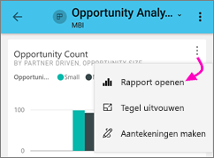
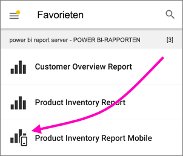
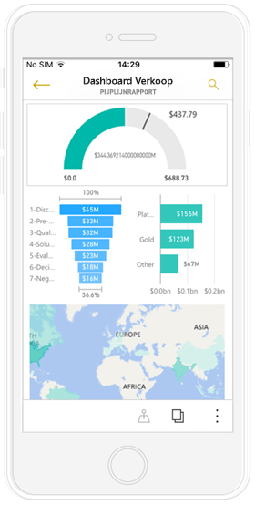
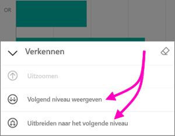

# Rapporten verkennen in de mobiele Power BI-apps
Van toepassing op:

|  |  |  |  |  |
|:--- |:--- |:--- |:--- |:--- |
| iPhones |iPads |Android-telefoons |Android-tablets |Windows 10-apparaten |

Een Power BI-rapport is een interactieve weergave van uw gegevens met visuele elementen die verschillende bevindingen en inzichten van die gegevens vertegenwoordigen. Rapporten weergeven in de mobiele Power BI-apps is de derde stap in een proces dat uit drie stappen bestaat.

1. [Rapporten maken in Power BI Desktop](../../desktop-report-view.md). U kunt zelfs [een rapport optimaliseren voor telefoons](mobile-apps-view-phone-report.md) in Power BI Desktop. 
2. Deze rapporten publiceren naar de Power BI-service [(https://powerbi.com)](https://powerbi.com) of [Power BI Report Server](../../report-server/get-started.md).  
3. Vervolgens kunt u de rapporten gebruiken in de mobiele Power BI-apps.

## Een Power BI-rapport openen in de mobiele app
Power BI-rapporten worden opgeslagen op verschillende plaatsen in de mobiele app, afhankelijk van waar hoe u eraan bent gekomen. Ze kunnen worden opgeslagen in Apps, Gedeeld met mij, werkruimten (met inbegrip van Mijn werkruimte) of op een rapportserver. Soms doorloopt u een gerelateerd dashboard om bij een rapport te komen en soms worden ze in een lijst weergegeven.

* Tik op de drie puntjes (...) in de rechterbovenhoek van een tegel > **Rapport openen**.
  
  
  
  Niet alle tegels hebt de optie om een rapport te openen. Tegels die zijn gemaakt door een vraag te stellen in vak Q&A, openen bijvoorbeeld geen rapporten wanneer u erop tikt. 
  
  Op een telefoon wordt het rapport geopend in de liggende modus, tenzij het rapport is [geoptimaliseerd voor weergave op een telefoon](mobile-reports-in-the-mobile-apps.md#view-reports-optimized-for-phones).
  
  

## Rapporten weergeven die zijn geoptimaliseerd voor telefoons
Makers van Power BI-rapporten kunnen een rapportindeling maken die speciaal is geoptimaliseerd voor telefoons. Rapportpagina's die zijn geoptimaliseerd voor telefoons beschikken over een extra functionaliteit: u kunt bijvoorbeeld inzoomen op visualisaties en deze sorteren, en u krijgt toegang tot de [filters die de auteur van het rapport heeft toegevoegd aan de rapportpagina](mobile-apps-view-phone-report.md#filter-the-report-page-on-a-phone). Het rapport wordt op uw telefoon geopend en is gefilterd op de waarden zoals die zijn gefilterd in het webrapport. Er wordt ook een bericht weergegeven waarin staat dat er filters actief zijn op de pagina. U kunt de filters op uw telefoon wijzigen.

In een lijst met rapporten heeft een geoptimaliseerd rapport een speciaal pictogram :

Wanneer u een rapport op een telefoon bekijkt, wordt dit geopend in de staande weergave.

 Een rapport kan bestaan uit een combinatie van pagina's die wel en niet zijn geoptimaliseerd voor telefoons. Wanneer u in dat geval door het rapport bladert, schakelt de weergave voor elke pagina zo nodig van liggend naar staand of omgekeerd.

Lees meer over [rapporten die zijn geoptimaliseerd voor weergave op een telefoon](mobile-apps-view-phone-report.md).

## Slicers gebruiken om een rapport te filteren
Overweeg [slicers aan een rapportpagina toe te voegen](../../visuals/power-bi-visualization-slicers.md) bij het ontwerpen van een rapport in Power BI Desktop of de Power BI-service. U en uw collega's kunnen de slicers gebruiken om de pagina in een browser en in de mobiele apps te filteren. Wanneer u het rapport op een telefoon bekijkt, kunt u de slicers zowel in de liggende modus zien en er interactie mee hebben als in een pagina die is geoptimaliseerd voor de staande modus van de telefoon. Als u in de browser een waarde selecteert in een slicer of filter, wordt die waarde ook geselecteerd wanneer u de pagina in de mobiele app bekijkt. U ziet een bericht waarin staat dat er op de pagina filters actief zijn.  

* Wanneer u een waarde selecteert in een slicer op de rapportpagina, worden de andere visuele elementen op de pagina gefilterd.
  
  
  
  In deze afbeelding filtert de slicer het kolomdiagram zodat alleen de waarden voor juli worden weergegeven.

## Een rapport kruislings filteren en markeren
Wanneer u een waarde in een visueel element selecteert, worden de andere visuele elementen niet gefilterd. Wel worden de gerelateerde waarden in de andere visuele elementen gemarkeerd.

* Tik op een waarde in een visueel element.
  
  
  
  Als u tikt op de kolom Large in het ene visuele element, worden de gerelateerde waarden in de andere visuele elementen gemarkeerd. 

## Een visueel element sorteren op een iPad of tablet
* Tik op het diagram, tik op de drie puntjes (**...** ) en tik op de veldnaam.
  
   
* Als u de sorteervolgorde wilt omkeren, tikt u nogmaals op de drie puntjes (**...** ) en tikt u nogmaals op dezelfde veldnaam.

## In- en uitzoomen op een visueel element
Als de maker van een rapport de mogelijkheid om in te zoomen heeft toegevoegd aan een visual, kunt u inzoomen op de visual om de waarden te bekijken waaruit één onderdeel ervan bestaat. U kunt [inzoomen op een visueel element toevoegen](../../power-bi-visualization-drill-down.md) in Power BI Desktop of de Power BI-service. 

* Klik op een specifieke balk of een specifiek punt in een visual en houd de muisknop ingedrukt om de knopinfo weer te geven. Als inzoomen beschikbaar is, heeft de onderkant van de knopinfo pijlen waarop u kunt tikken. 
  
  

* Als u weer wilt uitzoomen, tikt u op de pijl-omhoog in de knopinfo.
  
  

* U kunt ook inzoomen op alle gegevenspunten in een visual. Open de visual in de focusmodus, tik op het pictogram Verkennen en kies ervoor het volledige volgende niveau weer te geven of uit te breiden om het huidige en het volgende niveau weer te geven.

   

## In detail analyseren van de ene pagina naar de andere

Als u met *drillthrough* op een bepaald deel van een visual tikt, wordt u door Power BI naar een andere pagina in het rapport geleid, gefilterd op de waarde waarop u hebt getikt. De schrijver van het rapport kan een of meer mogelijkheden voor drillthrough instellen, waarmee u per mogelijkheid naar een andere pagina wordt geleid. In dat geval kunt u kiezen wat u in detail wilt analyseren. Als u in het volgende voorbeeld op de waarde in de meter tikt, kunt u kiezen tussen analyseren op **uitgaven per bedrijfsgebied** of **plannen per bedrijfsgebied**.

Wanneer u een detailanalyse hebt gemaakt, gaat u met de knop terug weer terug naar de vorige pagina van het rapport.

Meer informatie over [detailanalyse toevoegen in Power BI Desktop](../../desktop-drillthrough.md).

## Volgende stappen
* [Voor uw telefoon geoptimaliseerde Power BI-rapporten weergeven en gebruiken](mobile-apps-view-phone-report.md)
* [Een versie van een rapport maken die is geoptimaliseerd voor telefoons](../../desktop-create-phone-report.md)
* Vragen? [Misschien dat de Power BI-community het antwoord weet](http://community.powerbi.com/)

