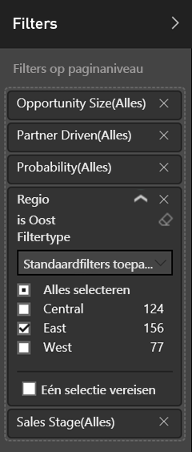
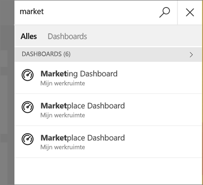

# Rapporten weergeven in de presentatiemodus op Surface Hub en Windows 10 - Power BI
U kunt rapporten weergeven in de presentatiemodus op Surface Hub en dashboards, rapporten en tegels in de modus Volledig scherm weergeven op Windows 10-apparaten. 

De presentatiemodus en de modus Volledig scherm zijn handig bij voor het weergeven van Power BI tijdens een vergadering, conferentie of op een specifieke projector in een kantoor, of zelfs om de ruimte op een klein scherm te maximaliseren. 

In de modus Volledig scherm in de mobiele Power BI-app worden alle ‘extra’s’ zoals de navigatie en menubalken verwijderd, met uitzondering van de tabbladen en filterdeelvenster in rapporten.

Wanneer u een rapport in de presentatiemodus weergeeft op Surface Hub, kunt u met verschillende kleuren inkt tekenen op de pagina's en navigeren tussen de pagina's van het rapport.

U kunt ook [dashboards en rapporten weergeven in de modus Volledig scherm van de Power BI-service](../end-user-focus.md) op het web.

> [!NOTE]
> De presentatiemodus is niet hetzelfde als de [focusmodus voor tegels](mobile-tiles-in-the-mobile-apps.md).
> 
> 

## Dashboards, rapporten en tegels weergeven in de modus Volledig scherm
1. Tik in de mobiele Power BI-app op een dashboard, rapport of tegel en tik op het pictogram **Volledig scherm**  om naar de modus Volledig scherm te gaan.
2. In de presentatiemodus kunt u een rapport filteren of zoeken naar andere dashboards en rapporten.
   
    Vouw het deelvenster Filters uit om filters in te stellen of te verwijderen.
   
    
   
     Tik op het zoekpictogram  om te zoeken naar andere dashboards.
   
    
3. Tik op het pictogram met twee naar elkaar gerichte pijlen op de taakbalk om de modus Volledig scherm af te sluiten  of veeg vanaf de bovenkant omlaag en tik op de twee naar elkaar gerichte pijlen .

## De presentatiemodus voor Surface Hub inschakelen
De presentatiemodus is standaard ingeschakeld in Surface Hub, maar als deze uitgeschakeld, kunt u deze weer inschakelen.

1. Tik op het pictogram Instellingen  onder aan de linkernavigatiebalk.
2. Tik op **Opties** en schuif de schuifregelaar **Microsoft Surface Hub-presentatiemodus inschakelen** naar **Aan**.
   
    

## Rapporten weergeven en erop tekenen op Surface Hub
1. Tik in een rapport op het pictogram **Volledig scherm**  om naar de presentatiemodus van Surface Hub te gaan.
   
    U ziet een actiebalk die kan worden samengevouwen aan beide zijden van het scherm. 
   
   * Veeg naar binnen of tik op de greep om de actiebalk te openen.
   * Veeg naar buiten of tik op de X bovenaan om de actiebalk te sluiten.
2. Op apparaten die ondersteuning bieden voor het schrijven met een pen, kunt u meteen starten met schrijven. 
3. U wijzigt de inktkleur door op de pen in de actiebalk links of rechts te tikken.
   
    
4. Tik op de gum of de pijl Ongedaan maken om een beetje of alle inkt te verwijderen.
5. Tik op de cirkelvormige pijl om de rapportinhoud te vernieuwen.
6. Tik op de pijlen aan de zijkant om naar andere pagina's in het rapport te gaan.
   
    
7. Veeg vanaf de bovenkant omlaag en tik op de twee naar elkaar gerichte pijlen  om de modus Volledig scherm af te sluiten.

## Volgende stappen
* [Dashboards en rapporten weergeven in de modus Volledig scherm van de Power BI-service](../end-user-focus.md)
* Vragen? [Misschien dat de Power BI-community het antwoord weet](http://community.powerbi.com/)

