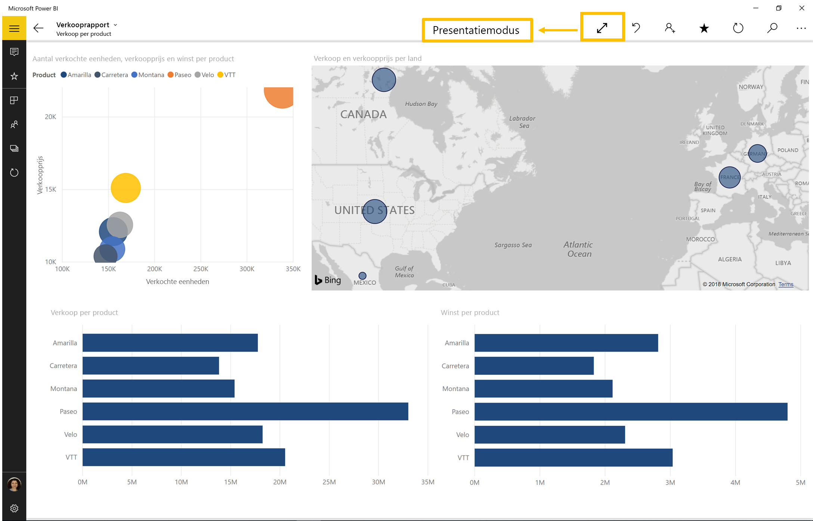

# Rapporten en dashboards weergeven in de presentatiemodus op Surface Hub en Windows 10-apparaten
U kunt de presentatiemodus gebruiken om rapporten en dashboards op Windows 10-apparaten en de Surface Hub in volledig scherm weer te geven. 

De presentatiemodus is handig voor het weergeven van Power BI tijdens een vergadering, conferentie of op een specifieke projector in een kantoor, of zelfs om de ruimte op een klein scherm te maximaliseren. 

In de presentatiemodus in de mobiele Power BI-app voor Windows 10 worden alle 'extra's', zoals de navigatieopties en menubalken, verwijderd zodat uw teamleden en uzelf zich kunnen concentreren op de gegevens in uw rapport. Er wordt een werkbalk met acties weergegeven zodat u met uw gegevens kunt werken terwijl de presentatiemodus is ingeschakeld.

U kunt ook [dashboards en rapporten weergeven in de modus Volledig scherm van de Power BI-service](../end-user-focus.md) op het web.

> [!NOTE]
> De presentatiemodus is niet hetzelfde als de [focusmodus voor tegels](mobile-tiles-in-the-mobile-apps.md).
> 
> 

## De presentatiemodus gebruiken
In de mobiele Power BI-app tikt u op het pictogram voor **volledig scherm** om de modus Volledig scherm te openen.
: alle extra's in de app verdwijnen en er wordt een werkbalk onder in het scherm (of aan de rechter- en linkerzijde) weergegeven, afhankelijk van de schermgrootte.

Via de werkbalk kunt u de volgende acties uitvoeren:

1. Tik op het pictogram Terug  om terug te gaan naar de vorige pagina. Houd uw vinger lang op het pictogram om het padvenster weer te geven. Hierin kunt u naar de map navigeren waar het rapport of het dashboard in staat.
2. Met het inktpictogram  kunt u een kleur kiezen als u gebruikmaakt van uw Surface-pen om op de rapportpagina te tekenen en er aantekeningen op te maken. 
3. Gebruik het paginapictogram  om de rapportpagina te vervangen die u op dat moment presenteert.
4. Pictogram voor afspelen   de actiebalk verbergen en start diavoorstelling, waar de app wordt automatisch draaien tussen de rapportpagina's. 
5. Tik op het zoekpictogram  om te zoeken naar andere artefacten in Power BI.
6. Tik op het pictogram met twee naar elkaar gerichte pijlen om de presentatiemodus te sluiten  Deze staat op de werkbalk.

U kunt de werkbalk loskoppelen en naar een willekeurige plaats op het scherm slepen. Dit is handig op grote schermen, als u zich wilt richten op een specifiek gedeelte in het rapport en u de hulpprogramma's in de buurt wilt hebben. Plaats hiervoor uw vinger op de werkbalk en swipe deze naar het rapportcanvas.

## Volgende stappen
* [Dashboards en rapporten weergeven in de modus Volledig scherm van de Power BI-service](../end-user-focus.md)
* Vragen? [Misschien dat de Power BI-community het antwoord weet](http://community.powerbi.com/)

