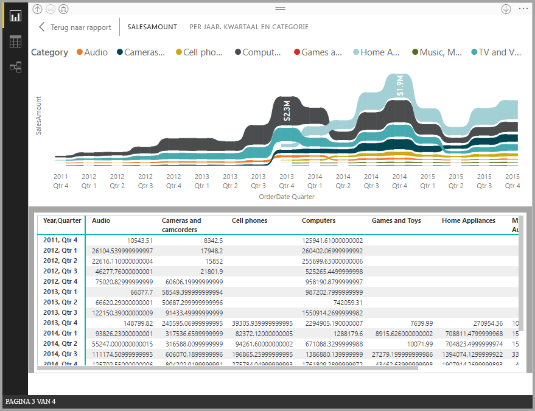
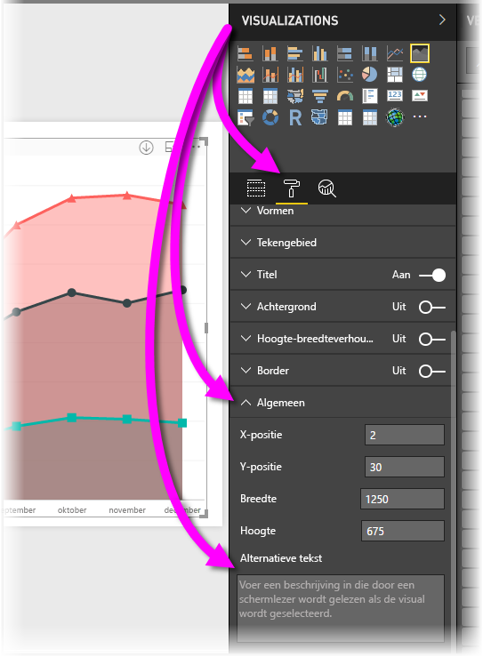

# Toegankelijkheid in Power BI Desktop-rapporten
**Power BI Desktop** bevat functies die het gebruikers met een handicap gemakkelijker maken om **Power BI Desktop**-rapporten te gebruiken en ermee te werken. Deze functies omvatten de mogelijkheid om een rapport te gebruiken met het toetsenbord of een schermlezer, de focus te verplaatsen naar verschillende objecten op een pagina met de tabtoets, en handig gebruik te maken van markeringen in visualisaties.

> [!NOTE]
> Deze toegankelijkheidsfuncties zijn beschikbaar in de versie van **Power BI Desktop** van juni 2017 en hoger. Voor toekomstige versies zijn nog meer toegankelijkheidsfuncties gepland.
> 
> 

## Een Power BI Desktop-rapport gebruiken met een toetsenbord of schermlezer
Vanaf de versie van **Power BI Desktop** van september 2017 kunt u op de toets **?** drukken om een venster weer te geven met een beschrijving van de beschikbare sneltoetsen voor toegankelijkheid in **Power BI Desktop**.

Dankzij deze verbeteringen voor toegankelijkheid, kunt u een **Power BI Desktop**-rapport gebruiken met een toetsenbord of een schermlezer. Dit kan met behulp van de volgende technieken:

U kunt de focus verplaatsen tussen de tabbladen van het rapport of de objecten op een rapportpagina met **Ctrl+F6**.

* Als een van de *rapportpaginatabs* de focus heeft, kunt u focus van de ene naar de andere rapportpagina verplaatsen met de *tabtoets* of de *pijltoetsen*. De titel van de rapportpagina wordt gelezen door de schermlezer, en ook of de rapportpagina momenteel is geselecteerd. Om de rapportpagina met de focus te laden, drukt u op *Enter* of de *spatiebalk*.
* Wanneer een geladen *rapportpagina* de focus heeft, drukt u op de *tabtoets* om de focus te verplaatsen tussen alle objecten op de pagina, zoals tekstvakken, afbeeldingen, vormen en diagrammen. De schermlezer leest het type object en de beschrijving van dat object die door de auteur is opgegeven. 

U kunt op **Alt+Shift+F10** drukken om de focus te verplaatsen naar het menu van een visueel element.

U kunt op **Alt+Shift+F11** drukken om een toegankelijke versie van het venster *Gegevens weergeven* weer te geven.

Deze toegankelijkheidsfuncties zijn toegevoegd zodat gebruikers volledig gebruik kunnen maken van **Power BI Desktop**-rapporten met behulp van een schermlezer en toetsenbordnavigatie.

## Tips voor het maken van toegankelijke rapporten
De volgende tips kunt u helpen bij het maken van **Power BI Desktop**-rapporten die beter toegankelijk zijn.

* Schakel markeringen in voor visuele elementen (zoals een **regel**, **gebied** en **keuzelijst met invoervak**) en voor **spreidingsdiagrammen** en **beldiagrammen**, enzovoort, en gebruik een andere *vorm van markering* voor elke regel.
  
  * Om *markeringen* in te schakelen, selecteert u de sectie **Opmaak** in het deelvenster **Visualisaties** en vouwt u de sectie **Vormen** uit. Schuif vervolgens omlaag naar de schakeloptie **Markeringen** en zet deze op *Aan*.
  * Selecteer vervolgens de naam van elke regel (of elk gebied, als u een **vlakdiagram** gebruikt) in de vervolgkeuzelijst in de sectie **Vormen**. Onder de vervolgkeuzelijst kunt u veel aspecten van de gebruikte markering voor de geselecteerde regel aanpassen, met inbegrip van de vorm, kleur en grootte.
  
  
  
  * Als u voor elke lijn een andere *vorm van markering* gebruikt, is het makkelijker voor gebruikers om verschillende lijnen (of vlakken) van elkaar te onderscheiden.
* Ter aanvulling op het vorige punt: vertrouw niet alleen op kleuren om informatie over te brengen. Het is handig om vormen te gebruiken voor lijnen (markeringen, zoals beschreven in de vorige punten).
* Selecteer in de themagalerie een *thema* met een hoog contrast dat geschikt is voor kleurenblinden, en importeer dit met behulp van de [preview-functie **Thema's**](desktop-report-themes.md).
* Geef voor elk object in een rapport *Alternatieve tekst* op. Hiermee zorgt u ervoor dat gebruikers van uw rapport begrijpen wat u probeert te communiceren met een visueel element, zelfs als ze een visueel element, afbeelding, vorm of tekstvak niet kunnen zien. U kunt als volgt *alternatieve tekst* opgeven voor elk gewenst object in een **Power BI Desktop**-rapport: selecteer het object (een visual, vorm enzovoort) en selecteer in het deelvenster **Visualisaties** de sectie **Opmaak**, vouw **Algemeen** uit, schuif naar beneden en vul het tekstvak **Alternatieve tekst** in.
  
  
* Zorg ervoor dat er in uw rapporten voldoende contrast is tussen tekst en de achtergrondkleuren.
* Gebruik tekengrootten en lettertypen die gemakkelijk kunnen worden gelezen. Teksten met een kleine tekengrootte of lettertypen die moeilijk leesbaar zijn, komen de toegankelijkheid niet ten goede.
* Neem een titel, aslabels en gegevenslabels op in alle visuele elementen.

## Overwegingen en beperkingen
Er zijn enkele bekende problemen en beperkingen met betrekking tot de toegankelijkheidsfuncties, zoals beschreven in de volgende lijst:

* JAWS wordt ondersteund in rapporten die worden weergegeven in de **Power BI-service**, inclusief alle ingesloten rapporten. JAWS wordt ook ondersteund in **Power BI Desktop**, maar dan moet u wel eerst de schermlezer openen voordat u **Power BI Desktop**-bestanden opent, anders werkt de schermlezer niet goed.

## Volgende stappen
* [Rapportthema's gebruiken in Power BI Desktop (preview)](desktop-report-themes.md)

