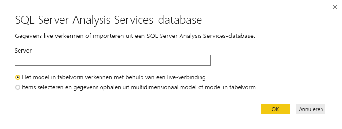
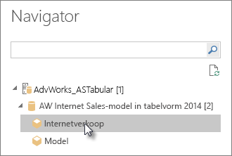
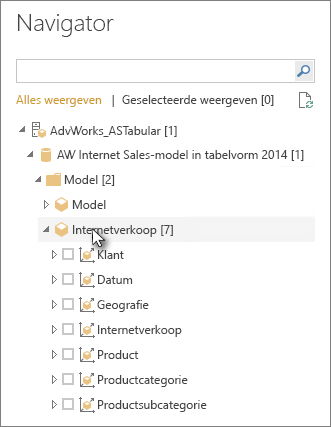
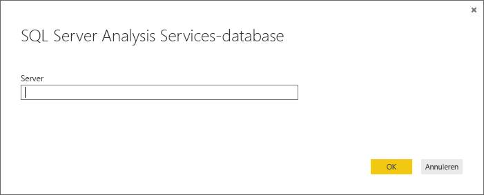

# Werken met tabellaire Analysis Services-gegevens in Power BI Desktop
Er zijn twee manieren om met Power BI Desktop verbinding te maken met en gegevens op te halen uit tabellaire SQL Server Analysis Services-modellen: verkennen met behulp van een liveverbinding of items selecteren en importeren in Power BI Desktop.

Laten we deze mogelijkheden eens nader bekijken.

**Verkennen met behulp van een liveverbinding**: wanneer u een liveverbinding gebruikt, worden de items in uw tabellaire model of perspectief, zoals tabellen, kolommen en metingen, weergegeven in de lijst met Power BI Desktop-velden. Met de geavanceerde hulpprogramma's voor visualisatie en rapportage van Power BI Desktop kunt u uw tabellaire model op nieuwe, zeer interactieve manieren verkennen.

Bij een liveverbinding worden er geen gegevens vanuit het tabellaire model geïmporteerd in Power BI Desktop. Bij elke interactie met een visualisatie wordt er een query op het tabellaire model uitgevoerd in Power BI Desktop en worden de resultaten daarvan berekend en weergegeven. U ziet altijd de meest recente gegevens. Tabellaire modellen zijn hierdoor hoogst nauwkeurig. Welke items in Power BI Desktop worden weergegeven is afhankelijk van uw machtigingen voor het tabellaire model waarmee u bent verbonden.

Als u dynamische rapporten in Power BI Desktop hebt gemaakt, kunt u deze delen door ze te publiceren op uw Power BI-site. Wanneer u een Power BI Desktop-bestand met een liveverbinding met een tabellair model op uw Power BI-site publiceert, moet er een on-premises gegevensgateway zijn geïnstalleerd en geconfigureerd door een beheerder. Zie [On-premises gegevensgateway](service-gateway-onprem.md) voor meer informatie.

**Items selecteren en importeren in Power BI Desktop**: wanneer u verbinding maakt met deze optie, kunt u items zoals tabellen, kolommen en metingen in uw tabellaire model of perspectief selecteren en deze items laden in een Power BI Desktop-model. Met de geavanceerde query-editor van Power BI Desktop kunt u de gegevens verder vormgeven. Met de modelleringsfuncties van Power BI Desktop kunt u de gegevens verder modelleren. Er wordt geen liveverbinding tussen Power BI Desktop en het tabellaire model tot stand gebracht. U kunt uw Power BI Desktop-model vervolgens offline verkennen of het publiceren op uw Power BI-site.

## Verbinding maken met een tabellair model
1. Klik in Power BI Desktop, op het tabblad **Start**, op **Gegevens ophalen**.
   
   
2. Klik op **SQL Server Analysis Services-database** en klik vervolgens op **Verbinding maken**.
   
   
3. Voer de naam van de server in en selecteer een verbindingsmodus. 
   
   
4. Deze stap is afhankelijk van de verbindingsmodus die u hebt geselecteerd:

* Als u een liveverbinding gebruikt, selecteert u in Navigator een tabellair model of een perspectief.
  
  
* Als u items selecteert en gegevens ophaalt, selecteert u in Navigator een tabellair model of een perspectief. Verder kunt u alleen bepaalde tabellen of kolommen selecteren en laden. Als u de gegevens wilt vormgeven voordat deze worden geladen, klikt u op Bewerken om Query-editor te openen. Wanneer u klaar bent, klikt u op Laden om de gegevens in Power BI Desktop te importeren.

## Veelgestelde vragen
**Vraag:** heb ik een on-premises gegevensgateway nodig?

**Antwoord:** dat hangt ervan af. Als u Power BI Desktop gebruikt om live verbinding te maken met een tabellair model, maar dat model niet wilt publiceren op uw Power BI-site, hebt u geen gateway nodig. Als u het model wel wilt publiceren op uw Power BI-site, is een gegevensgateway noodzakelijk voor veilige communicatie tussen de Power BI-service en uw on-premises Analysis Services-server. Neem contact op met uw Analysis Services-serverbeheerder voordat u een gegevensgateway installeert.

Als u ervoor kiest items te selecteren en gegevens op te halen, importeert u tabellaire modelgegevens rechtstreeks in uw Power BI Desktop-bestand en hebt u ook geen gateway nodig.

**Vraag:** wat is het verschil tussen een liveverbinding met een tabellair model van de Power BI-service en een liveverbinding van Power BI Desktop?

**Antwoord:** bij een liveverbinding tussen een tabellair model op uw site in de Power BI-service en een on-premises Analysis Services-database in uw organisatie, is een on-premises gegevensgateway vereist voor veilige communicatie tussen deze twee. Bij een liveverbinding met een tabellair model van Power BI Desktop, is geen gateway vereist omdat zowel Power BI Desktop als de Analysis Services-server waarmee u verbinding maakt on-premises worden uitgevoerd in uw organisatie. Als u uw Power BI Desktop-bestand echter wilt publiceren op uw Power BI-site publiceert, is wel een gateway vereist.

**Vraag:** kan ik, als ik een liveverbinding heb gemaakt, verbinding maken met een andere gegevensbron via hetzelfde Power BI Desktop-bestand?

**Antwoord:** nee. U kunt niet live gegevens verkennen en verbinding maken met een ander type gegevensbron via hetzelfde bestand. Als u al gegevens hebt geïmporteerd of al verbinding hebt gemaakt met een andere gegevensbron via een Power BI Desktop-bestand, moet u een nieuw bestand maken om deze live te kunnen verkennen.

**Vraag:** kan ik, als ik een liveverbinding heb gemaakt, het model bewerken of importeren in Power BI Desktop?

**Antwoord:** u kunt in Power BI Desktop metingen op rapportniveau maken, maar alle overige query- en modelleringsfuncties zijn uitgeschakeld wanneer u gegevens live verkent.

**Vraag:** als ik een liveverbinding heb gemaakt, is die dan wel veilig?

**Antwoord:** ja. Uw huidige Windows-referenties worden gebruikt voor de verbinding met de Analysis Services-server. U kunt geen basisreferenties of opgeslagen referenties gebruiken in de Power BI-service of Power BI Desktop bij het live verkennen.

**Vraag:** in Navigator zie ik een model en een perspectief. Wat is het verschil?

**Antwoord:** een perspectief is een bepaalde weergave van een tabellair model. Een perspectief bevat mogelijk alleen bepaalde tabellen, kolommen of metingen die nodig zijn voor een specifieke gegevensanalyse. Een tabellair model bevat altijd ten minste één perspectief, dat al dan niet alles in het model kan omvatten. Neem contact op met de beheerder als u twijfelt over wat u moet selecteren.

## De naam van de server wijzigen na de initiële verbinding
Het kan voorkomen dat u een Power BI Desktop-bestand met een liveverbinding voor verkenning hebt gemaakt, maar de verbinding later wilt configureren voor een andere server. Stel, u hebt een Power BI Desktop-bestand gemaakt voor een verbinding met een ontwikkelaarsserver en u wilt, voordat u het model publiceert naar de Power BI-service, de server wijzigen in de productieserver.

1. Selecteer **Query's bewerken** in het lint.
   
   
2. Voer de naam van de nieuwe server in.
   
   

