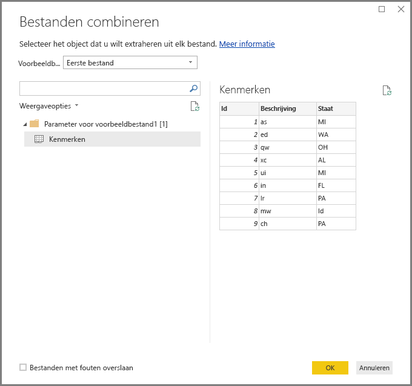
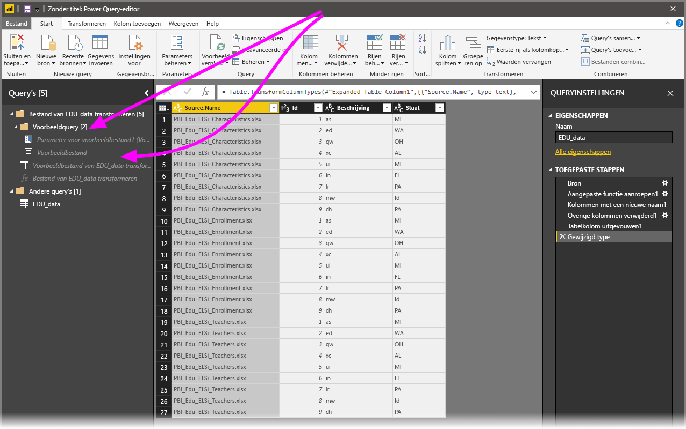

# Bestanden (binaire) combineren in Power BI Desktop
Een krachtige aanpak voor het importeren van gegevens in **Power BI Desktop** bestaat uit het combineren van meerdere bestanden, die hetzelfde schema hebben, tot één logische tabel. Met de release van **Power BI Desktop** van november 2016 (en volgende releases) is deze aanpak nog eenvoudiger en uitgebreider gemaakt, zoals in dit artikel is beschreven.

Selecteer **Gegevens ophalen > Bestand > Map** om het proces van het combineren van bestanden vanuit dezelfde map te starten.

## Gedrag van het vorige proces van het combineren van (binaire) bestanden
Vóór de release van **Power BI Desktop** van november 2016 werd deze functionaliteit **Binaire bestanden combineren** genoemd en kon u bepaalde bestandstypen combineren met de transformatie **Binaire bestanden combineren**. Dit had echter zijn beperkingen:

* De transformaties werden niet voor elk afzonderlijk bestand in overweging genomen voordat de bestanden tot één tabel werden gecombineerd. Daarom moesten bestanden vaak worden gecombineerd om vervolgens de *koptekstwaarden* eruit te filteren door rijen te filteren als onderdeel van het bewerkingsproces.
* De transformatie **Binaire bestanden combineren** werkte alleen voor *tekstbestanden* of *CSV-bestanden* en niet voor andere ondersteunde bestandsindelingen, zoals Excel-werkmappen, JSON-bestanden en andere.

Klanten vroegen om een meer intuïtieve benadering van de bewerking **Binaire bestanden combineren**. Daarom hebben we de transformatie uitgebreid en de nieuwe naam **Bestanden combineren** gegeven.

## Gedrag van het huidige proces van het combineren van bestanden
**Power BI Desktop** gaat nu efficiënter om met het **combineren van (binaire) bestanden**. Eerst selecteert u **Bestanden combineren** op het linttabblad **Start** in **Query-editor**, of in de kolom zelf.

De transformatie **Bestanden combineren** werkt nu als volgt:

* De transformatie **Bestanden combineren** analyseert elk invoerbestand en bepaalt de juiste bestandsindeling, bijvoorbeeld *tekstbestand*, *Excel-werkmap* of *JSON-bestand*.
* Met de transformatie kunt u uit het eerste bestand een specifiek object selecteren, bijvoorbeeld om een *Excel-werkmap* te extraheren.
  
  
* Door **Bestanden combineren** worden vervolgens de volgende query's automatisch uitgevoerd:
  
  * Er wordt een voorbeeldquery gemaakt waarmee alle vereiste extractiestappen in één bestand worden uitgevoerd.
  * Er wordt een *functiequery* gemaakt waarmee de (binaire) bestandsinvoer in parameters wordt uitgedrukt voor de *voorbeeldquery*. De voorbeeldquery en de functiequery worden gekoppeld, zodat de wijzigingen aan de voorbeeldquery in de functiequery worden weerspiegeld.
  * De *functiequery* wordt toegepast op de oorspronkelijke query met binaire invoerbestanden (bijvoorbeeld de query *Map*). De functiequery wordt dus op elke rij toegepast voor binaire invoer. Vervolgens wordt de resulterende gegevensextractie als kolommen op het bovenste niveau uitgevouwen.
    
    

Dankzij het nieuwe gedrag van **Bestanden combineren** kunt u eenvoudig alle bestanden in een bepaalde map combineren, zolang ze hetzelfde bestandstype en dezelfde structuur hebben (zoals dezelfde kolommen).

Bovendien kunt u eenvoudig aanvullende transformaties of extractiestappen toepassen door de automatisch gemaakte *voorbeeldquery* te wijzigen, zonder dat u zich zorgen hoeft te maken over het wijzigen of maken van aanvullende stappen voor een *functiequery*. Wijzigingen aan de *voorbeeldquery* worden automatisch in de gekoppelde *functiequery* gegenereerd.

## Volgende stappen
Met Power BI Desktop kunt u verbinding maken met allerlei andere gegevens. Bekijk de volgende bronnen voor meer informatie over gegevensbronnen:

* [Getting Started with Power BI Desktop](desktop-getting-started.md) (Aan de slag met Power BI Desktop)
* [Data Sources in Power BI Desktop](desktop-data-sources.md) (Gegevensbronnen in Power BI Desktop)
* [Shape and Combine Data with Power BI Desktop](desktop-shape-and-combine-data.md) (Gegevens vormgeven en combineren met Power BI Desktop)
* [Connect to CSV files in Power BI Desktop](desktop-connect-csv.md) (Verbinding met CSV-bestanden maken in Power BI Desktop)   
* [Enter data directly into Power BI Desktop](desktop-enter-data-directly-into-desktop.md) (Rechtstreeks gegevens in Power BI Desktop invoeren)   

