# Algemene querytaken in Power BI Desktop
Wanneer u werkt in het venster **Query-editor** van Power BI Desktop, beschikt u over een aantal veelgebruikte taken. In dit document worden die taken gedemonstreerd en ziet u koppelingen voor meer informatie. 

De hier gedemonstreerde algemene querytaken zijn de volgende:

* Verbinding maken met gegevens
* Gegevens vormgeven en combineren
* Rijen groeperen
* Kolommen draaien
* Aangepaste kolommen maken
* Queryformules

We maken gebruik van enkele gegevensverbindingen om deze taken uit te voeren. De gegevens zijn beschikbaar voor downloaden of om er verbinding mee te maken voor het geval u deze taken zelf wilt doorlopen.

De eerste gegevensverbinding bestaat uit een Excel-werkmap die u kunt downloaden via [deze koppeling](http://download.microsoft.com/download/5/7/0/5701F78F-C3C2-450C-BCCE-AAB60C31051D/PBI_Edu_ELSi_Enrollment_v2.xlsx). De andere is een webbron (die ook in andere help-inhoud van Power BI Desktop wordt gebruikt) die vanaf hieruit kan worden geopend:

[*http://www.bankrate.com/finance/retirement/best-places-retire-how-state-ranks.aspx*](http://www.bankrate.com/finance/retirement/best-places-retire-how-state-ranks.aspx)

De stappen om met beide gegevensbronnen verbinding te maken, vormen het begin van de algemene querytaken.

## Verbinding maken met gegevens
U maakt verbinding met gegevens in Power BI Desktop door de knop **Gegevens ophalen** te selecteren op het tabblad **Start** op het lint. Power BI Desktop geeft een menu met de meest voorkomende gegevensbronnen weer. Voor een volledige lijst met gegevensbronnen waarmee Power BI Desktop verbinding kan maken, selecteert u de knop **Meer...**  onderaan het menu. Zie [Data Sources in Power BI Desktop](https://docs.microsoft.com/power-bi/desktop-data-sources) (Gegevensbronnen in Power BI Desktop) voor meer informatie.

Selecteer als eerste **Excel**, navigeer naar de werkmap en selecteer deze. Query inspecteert de werkmap en geeft de gegevens weer die zijn gevonden in het **Navigator**-venster.

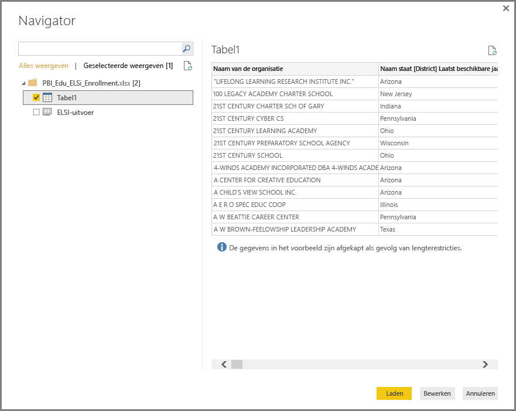

U kunt **Bewerken** selecteren om de gegevens aan te passen, of *vorm te geven*, voordat deze in Power BI Desktop worden geladen. Een query bewerken voordat gegevens worden geladen is met name nuttig wanneer u werkt met grote gegevenssets die u wilt verkleinen voordat ze worden geladen. Omdat we dat zeker willen doen, selecteert u **Bewerken**.

Verbinding maken met verschillende soorten gegevens is net zo gemakkelijk. We willen ook verbinding maken met een webbron. Selecteer **Gegevens ophalen \> Meer...**  en selecteer vervolgens **Overige\> Web**.

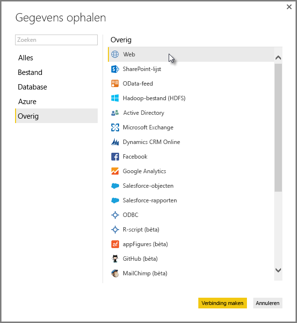

Het venster **Van web** wordt weergegeven, waar u de URL van de webpagina typt.

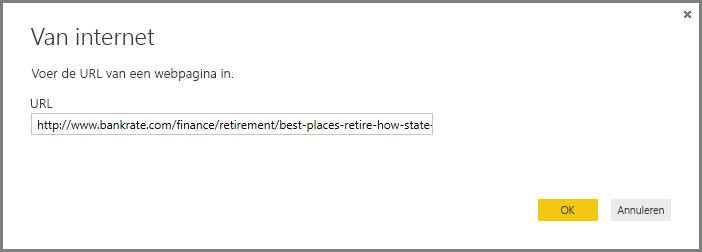

Selecteer **OK** en net als voorheen inspecteert Power BI Desktop de werkmap en worden de gevonden gegevens weergegeven in het **Navigator**-venster.

Andere gegevensverbindingen lijken daar op. Als verificatie vereist is voor het maken van een gegevensverbinding, vraagt Power BI Desktop u de juiste referenties op te geven.

Zie [Connect to Data in Power BI Desktop](https://docs.microsoft.com/power-bi/desktop-connect-to-data) (Verbinding maken met gegevens in Power BI Desktop) voor een stapsgewijze demonstratie over het verbinding maken met gegevens in Power BI Desktop.

## Gegevens vormgeven en combineren
U kunt gegevens eenvoudig vormgeven en combineren met de Query-editor. Deze sectie bevat enkele voorbeelden van de manieren waarop u gegevens kunt vormgeven. Zie **[Gegevens vormgeven en combineren met Power BI Desktop](https://docs.microsoft.com/power-bi/desktop-shape-and-combine-data)** voor een volledigere demonstratie van hoe men gegevens kan vormgeven en combineren.

In de vorige sectie hebben we verbinding gemaakt met twee gegevenssets: een Excel-werkmap en een webbron. Nadat de sets in de Query-editor zijn geladen, is het volgende te zien, met de query van de webpagina geselecteerd (overgenomen uit de lijst met de beschikbare query's zoals weergegeven in het deelvenster **Query's** aan de linkerkant van het venster van de Query-editor).

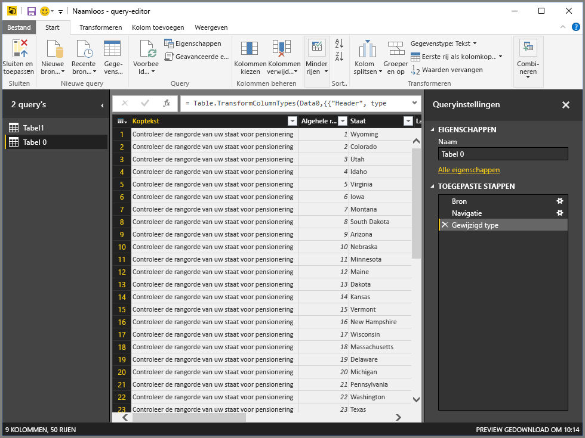

Wanneer u gegevens vormgeeft, zet u een gegevensbron om in de vorm en indeling die aan uw behoeften voldoen. In dit geval is die eerste kolom, met de titel *Kop*, niet nodig. Daarom zullen we die verwijderen.

De **Query-editor** biedt veel opdrachten op het lint en in een contextgevoelig snelmenu. Wanneer u bijvoorbeeld met de rechtermuisknop op de kolom *Kop* klik, kunt u de kolom verwijderen met het menu dat wordt geopend. U kunt ook de kolom selecteren en vervolgens de knop **Kolommen verwijderen** op het lint selecteren.

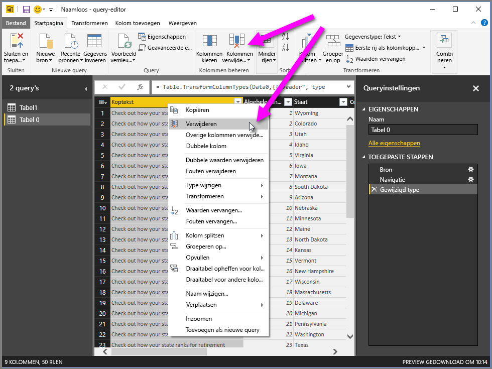

Er zijn veel andere manieren waarop u de gegevens in deze query zou kunnen vormgeven. U kunt een onbeperkt aantal rijen vanaf de bovenkant of de onderkant verwijderen. U kunt kolommen toevoegen, kolommen splitsen, waarden vervangen en andere vormgevingstaken uitvoeren om de Query-editor duidelijk te maken welke gegevens u wilt.

## Rijen groeperen
In de Query-editor kunt u de waarden uit meerdere rijen samenbrengen in één enkele waarde. Dit kan nuttig zijn bij het samenvatten van het aantal aangeboden producten, de totale verkoopcijfers of het aantal studenten.

In dit voorbeeld groeperen we rijen in een gegevensset met inschrijvingen voor een onderwijsinstelling. De gegevens zijn afkomstig uit een Excel-werkmap en zijn in de Query-editor zodanig vormgegeven dat alleen de kolommen worden opgehaald die we nodig hebben, de tabel een andere naam te geven en enkele andere transformaties uit te voeren.

Laten we eens nagaan hoeveel instanties (uitgaande van schooldistricten en andere onderwijsinstanties zoals regionale servicegebieden, enzovoort) er in elke Amerikaanse staat zijn. We selecteren de kolom *State Abbr* en klikken vervolgens op de knop **Groeperen op** op het tabblad **Transformeren** of op het tabblad **Start** op het lint (**Groeperen op** is op beide tabbladen beschikbaar).

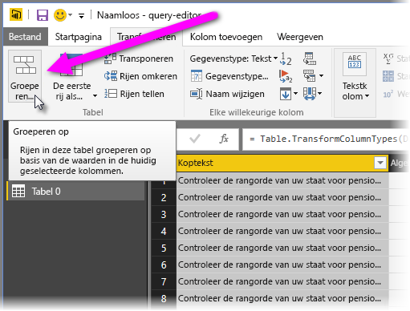

Het venster **Groeperen op…** wordt weergegeven. Wanneer de Query-editor rijen groepeert, wordt er een nieuwe kolom gemaakt waarin de resultaten van **Groeperen op** worden opgenomen. U kunt de **Groeperen op**-bewerking op verschillende manieren aanpassen:

1. *Groeperen op*: dit is de kolom die moet worden gegroepeerd. De Query-editor kiest de geselecteerde kolom, maar u kunt in dit venster ook een andere kolom in de tabel kiezen.
2. *Nieuwe kolomnaam*: de Query-editor stelt een naam voor de nieuwe kolom voor op basis van de bewerking die wordt toegepast op de kolom die wordt gegroepeerd, maar u kunt de nieuwe kolom elke gewenste naam geven.
3. *Bewerking*: hier geeft u de bewerking op die de Query-editor toepast.
4. *Groepering toevoegen* en *Aggregatie toevoegen*: deze opties worden weergegeven na het selecteren van de optie **Geavanceerd**. U kunt groeperingsbewerkingen (**Groeperen op**-acties) uitvoeren op meerdere kolommen en meerdere aggregaties uitvoeren, en dat allemaal in het venster **Groeperen op** met een en dezelfde bewerking. De Query-editor maakt een nieuwe kolom (gebaseerd op uw selecties in dit venster) die op meerdere kolommen van toepassing zijn. 

Selecteer de knop **Groepering toevoegen** of **Aggregatie toevoegen** om meer groeperingen of aggregaties toe te voegen aan een **Groeperen op**-bewerking. U kunt een groepering of aggregatie verwijderen door het **...** -pictogram te selecteren en **Verwijderen** te selecteren. Probeer het eens om na te gaan hoe dat er uitziet.
   
   

Wanneer we **OK** selecteren, wordt de **Groeperen op**-bewerking uitgevoerd en worden de resultaten weergegeven. En wat blijkt: Ohio, Texas, Illinois en Californië hebben nu elk meer dan duizend instanties!

Met de Query-editor kunt u altijd de laatste vormgevingsbewerking verwijderen door de **X** naast de zojuist voltooide stap te selecteren. Ga dus gerust uw gang en experimenteer, voer de stap opnieuw uit als de resultaten niet bevallen, totdat de Query-editor uw gegevens volledig naar wens heeft vormgegeven.

## Kolommen draaien
Met Power BI Desktop kunt u kolommen draaien en een tabel maken die geaggregeerde waarden voor elke unieke waarde in een kolom bevat. Als u bijvoorbeeld wilt weten hoeveel verschillende producten u in elke productcategorie hebt, kunt u snel een tabel maken die dat precies aangeeft.

Een voorbeeld. De volgende **Products**-tabel is zodanig vormgegeven dat alleen elk uniek product (op naam) wordt weergegeven, samen met de categorie waartoe elk product behoort. Als u een nieuwe tabel wilt maken die het aantal producten voor elke categorie weergeeft (op basis van de kolom *CategoryName*), selecteert u de kolom en vervolgens **Draaikolom** op het tabblad **Transformeren** op het lint.

Het venster **Draaikolom** wordt weergegeven, zodat u weet welke waarden in de kolom worden gebruikt om nieuwe kolommen te maken (1). Wanneer u **Geavanceerde opties** (2) uitvouwt, kunt u de functie selecteren die wordt toegepast op de geaggregeerde waarden (3).

Wanneer u **OK** selecteert, wordt de tabel weergegeven op basis van de transformatie-instructies in het venster **Draaikolom**.

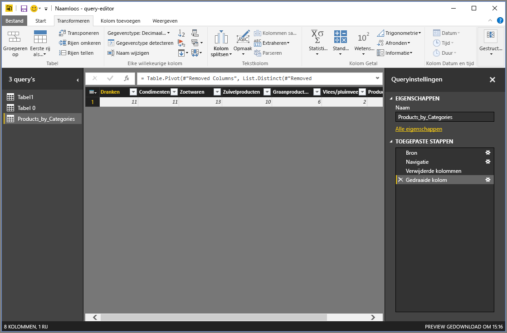

## Aangepaste kolommen maken
In de Query-editor kunt u aangepaste formules maken die worden uitgevoerd op meerdere kolommen in uw tabel, waarna u de resultaten van dergelijke formules in een nieuwe (aangepaste) kolom kunt opnemen. De Query-editor maakt het gemakkelijk om aangepaste kolommen te maken.

In de Query-editor selecteert u **Aangepaste kolom** op het tabblad **Kolom toevoegen** op het lint.

Het volgende venster wordt weergegeven. In het volgende voorbeeld maken we een aangepaste kolom met de naam *Percent ELL* waarin van het totaal aantal studenten het percentage wordt berekend dat Engels studeert.

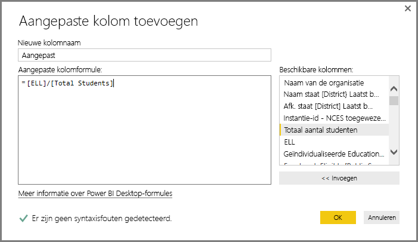

Net zoals bij elke andere toegepaste stap in de Query-editor geldt dat als de nieuwe aangepaste kolom niet de gegevens bevat die u zoekt, u de stap gewoon uit de sectie **Toegepaste stappen** van het deelvenster **Query-instellingen** kunt verwijderen door de **X** naast de stap **Aangepaste kolom toegevoegd** te selecteren.

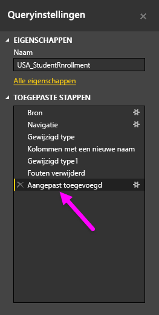

## Queryformules
U kunt de door Query-editor gegenereerde stappen bewerken en u kunt aangepaste formules maken om nauwkeurige controle over het verbinden met en het vormgeven van uw gegevens te krijgen. Wanneer de Query-editor een actie uitvoert op gegevens, wordt de aan de actie gekoppelde formule weergegeven in de **Formulebalk**. U kunt de **Formulebalk** weergeven door het selectievakje naast **Formulebalk** in te schakelen op het tabblad **Weergeven** van het lint.

De Query-editor bewaart alle toegepaste stappen voor elke query in de vorm van tekst die u kunt weergeven of wijzigen. U kunt de tekst voor een query weergeven of wijzigen met de **Geavanceerde editor**, die wordt weergegeven wanneer u **Geavanceerde editor** selecteert op het tabblad **Weergeven** van het lint.

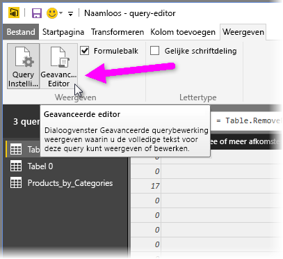

Hier ziet u de **Geavanceerde editor** met de querystappen die zijn gekoppeld aan de weergegeven **USA\_StudentEnrollment**-query. Deze stappen zijn gemaakt in de Power Query-formuletaal, die vaak wordt aangeduid als **M**. Zie [Meer informatie over Power Query-formules](https://support.office.com/article/Learn-about-Power-Query-formulas-6bc50988-022b-4799-a709-f8aafdee2b2f) voor meer informatie. Zie [Specificatie van de formuletaal van Microsoft Power Query voor Excel](http://go.microsoft.com/fwlink/?linkid=320633) als u de taalspecificatie zelf wilt weergeven.

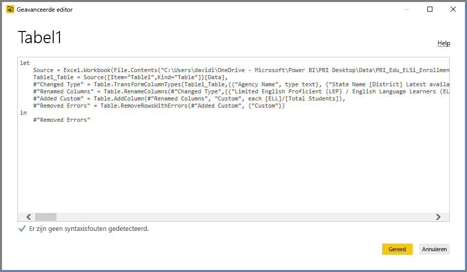

Power BI Desktop biedt een uitgebreide reeks formulecategorieën. Ga naar [Formulecategorieën voor Power Query](https://support.office.com/article/Power-Query-formula-categories-125024ec-873c-47b9-bdfd-b437f8716819) voor meer informatie en een volledig overzicht van alle formules in Query-editor.

Dit zijn de formulecategorieën voor de Query-editor:

* Getal
  * Constanten
  * Informatie
  * Conversie en opmaak
  * Indeling
  * Afronden
  * Bewerkingen
  * Willekeurig
  * Trigonometrie
  * Bytes
* Tekst
  * Informatie
  * Tekstvergelijkingen
  * Extractie
  * Wijziging
  * Lidmaatschap
  * Transformaties
* Logisch
* Datum
* Tijd
* Datum/tijd
* Datum/tijdzone
* Duur
* Vastleggen
  * Informatie
  * Transformaties
  * Selectie
  * Serialisatie
* Lijst
  * Informatie
  * Selectie
  * Transformatie
  * Lidmaatschap
  * Bewerkingen instellen
  * Ordenen
  * Gemiddelden
  * Optelling
  * Numerieke waarden
  * Generators
* Tabel
  * Tabel samenstellen
  * Conversies
  * Informatie
  * Rijbewerkingen
  * Kolombewerkingen
  * Lidmaatschap
* Waarden
* Rekenkundige bewerkingen
* Parametertypen
* Metagegevens
* Toegang tot gegevens
* URI
* Binaire indelingen
  * Getallen lezen
* Binair
* Lijnen
* Expressie
* Functie
* Fout
* Vergelijkingsfunctie
* Splitser
* Combinatiefunctie
* Vervangingsfunctie
* Type

## Volgende stappen
U kunt allerlei handelingen uitvoeren met Power BI Desktop. Bekijk de volgende bronnen voor meer informatie over de vele mogelijkheden:

* [Wat is Power BI Desktop?](desktop-what-is-desktop.md)
* [Query Overview with Power BI Desktop](desktop-query-overview.md) (Queryoverzicht met Power BI Desktop)
* [Data Sources in Power BI Desktop](desktop-data-sources.md) (Gegevensbronnen in Power BI Desktop)
* [Connect to Data in Power BI Desktop](desktop-connect-to-data.md) (Verbinding maken met gegevens in Power BI Desktop)
* [Gegevens vormgeven en combineren met Power BI Desktop](desktop-shape-and-combine-data.md)

