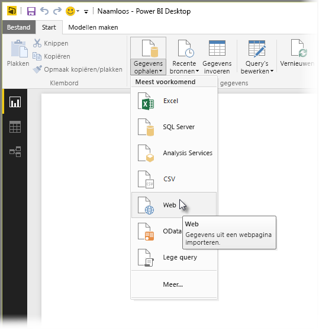
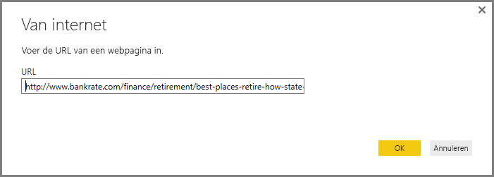
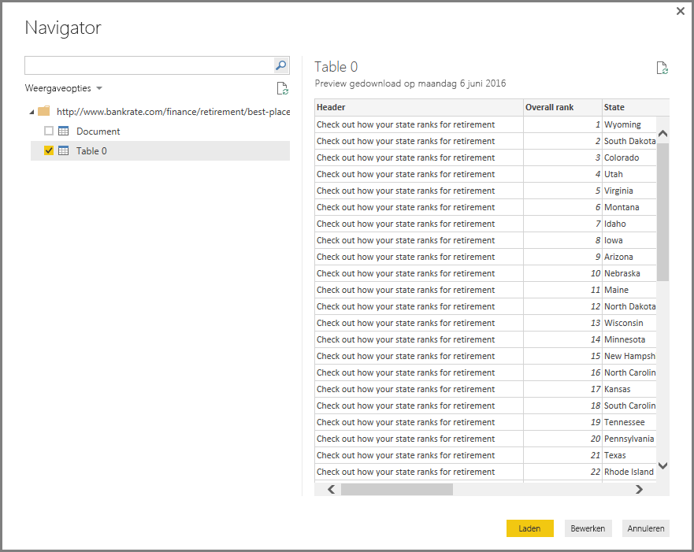
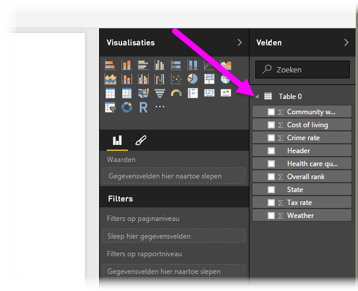

# Verbinding met een webpagina maken vanuit Power BI Desktop
U kunt verbinding maken met een webpagina en de gegevens in Power BI Desktop importeren voor gebruik in uw visuele elementen en gegevensmodellen.

In Power BI Desktop selecteert u op het lint **Start** de opties **Gegevens ophalen > Web**.

Er wordt een dialoogvenster weergegeven, waarin wordt gevraagd om de URL van de webpagina van waaruit u gegevens wilt importeren.

Als u de URL hebt getypt (of geplakt), selecteert u **OK**. Er wordt verbinding met deze pagina gemaakt en de gegevens op die pagina worden in het venster **Navigator** gepresenteerd. Wanneer u een van de beschikbare gegevenselementen selecteert, bijvoorbeeld een tabel van de hele pagina, wordt aan de rechterkant van het venster **Navigator** een voorbeeld van die gegevens weergegeven.

U kunt de knop **Bewerken** kiezen, waarmee **Query-editor** wordt gestart. Hierin kunt u de gegevens van die webpagina vormgeven en transformeren voordat u ze in Power BI Desktop importeert. U kunt ook de knop **Laden** selecteren en alle gegevenselementen importeren die u in het linker deelvenster hebt geselecteerd.

Als **Laden** wordt geselecteerd, worden de geselecteerde items geïmporteerd en beschikbaar gemaakt in het deelvenster **Velden** aan de rechterkant van de weergave Rapporten in Power BI Desktop.

Meer hoeft u niet te doen om verbinding te maken met een webpagina en de gegevens in Power BI Desktop te importeren.

Hier kunt u de velden naar het rapportcanvas slepen en alle visuele elementen maken die u wilt. U kunt de gegevens van de webpagina ook gebruiken net als alle andere gegevens. U kunt ze vormgeven, relaties maken tussen deze gegevens en andere gegevensbronnen in uw gegevensmodel, en verder doen wat u wilt om een Power BI-rapport naar wens te maken.

Kijk eens in de [handleiding voor Power BI Desktop](desktop-getting-started.md) (Engelstalig) voor meer informatie over het verbinding maken met een webpagina.

### Volgende stappen
Met Power BI Desktop kunt u verbinding maken met allerlei andere gegevens. Bekijk de volgende bronnen voor meer informatie over gegevensbronnen:

* [Data Sources in Power BI Desktop](desktop-data-sources.md) (Gegevensbronnen in Power BI Desktop)
* [Shape and Combine Data with Power BI Desktop](desktop-shape-and-combine-data.md) (Gegevens vormgeven en combineren met Power BI Desktop)
* [Connect to Excel workbooks in Power BI Desktop](desktop-connect-excel.md) (Verbinding maken met Excel-werkmappen in Power BI Desktop)   
* [Connect to CSV files in Power BI Desktop](desktop-connect-csv.md) (Verbinding met CSV-bestanden maken in Power BI Desktop)   
* [Enter data directly into Power BI Desktop](desktop-enter-data-directly-into-desktop.md) (Rechtstreeks gegevens in Power BI Desktop invoeren)   

