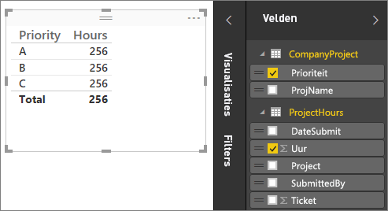
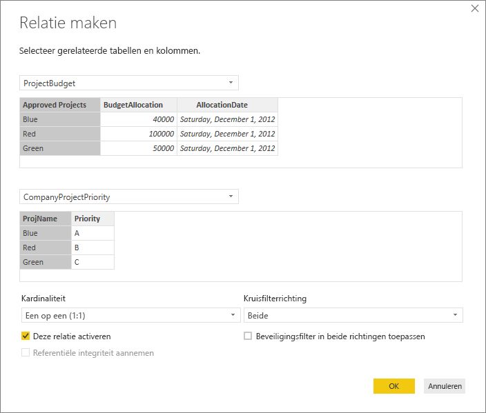
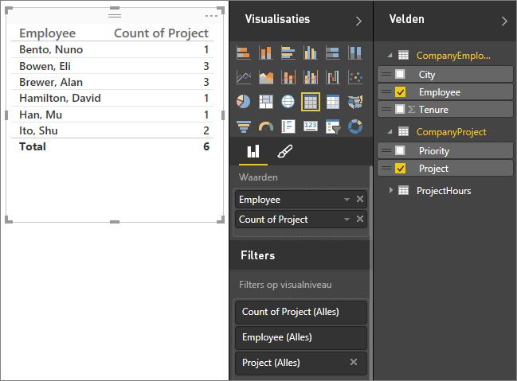
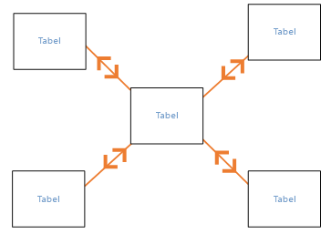
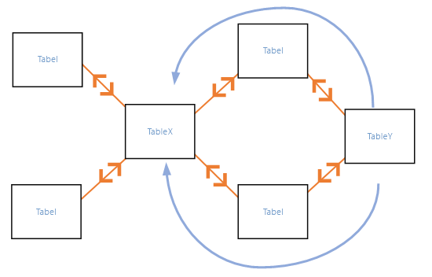
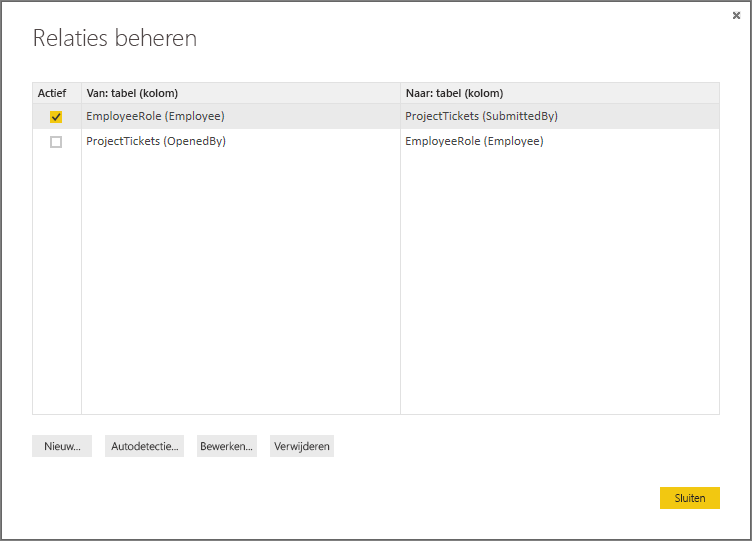

# Relaties maken en beheren in Power BI Desktop
Wanneer u meerdere tabellen importeert, gaat u waarschijnlijk analyses uitvoeren met gegevens uit de tabellen. Relaties tussen deze tabellen zijn nodig om nauwkeurig resultaten te berekenen en de juiste gegevens in uw rapporten weer te geven. Met Power BI Desktop is het maken van deze relaties eenvoudig. In de meeste gevallen hoeft u niets eens iets te doen en kan de functie Autodetectie dit voor u doen. In sommige gevallen moet u echter mogelijk zelf relaties maken of moet u enkele wijzigingen in een relatie aanbrengen. Hoe dan ook is het belangrijk om relaties in Power BI Desktop te begrijpen en te weten hoe u ze maakt en bewerkt.

## Autodetectie tijdens laden
Als u query's uitvoert op twee of meer tabellen tegelijk, probeert Power BI Desktop tijdens het laden van de gegevens relaties te zoeken en te maken. De eigenschappen voor Kardinaliteit, Kruisfilterrichting en Actief worden automatisch ingesteld. Power BI Desktop kijkt naar kolomnamen in de tabellen waarop u query's toepast om te bepalen of er mogelijke relaties zijn. Als dat het geval is, worden de relaties automatisch gemaakt. Als Power BI Desktop niet met grote zekerheid kan vaststellen of er een overeenkomst is, wordt er niet automatisch een relatie gemaakt. U kunt nog steeds het dialoogvenster Relaties beheren gebruiken om relaties te maken of te bewerken.

## Een relatie maken met behulp van Autodetectie
Klik op het tabblad **Start** op **Relaties beheren** \> **Autodetectie**.

## Handmatig een relatie maken
1. Klik op het tabblad **Start** op **Relaties beheren** \> **Nieuw**.
2. Selecteer in het dialoogvenster **Relatie maken**, in de eerste vervolgkeuzelijst met tabellen, een tabel en selecteer vervolgens de kolom die u in de relatie wilt gebruiken.
3. Selecteer in de tweede vervolgkeuzelijst met tabellen de andere gewenste tabel voor de relatie, selecteer vervolgens de andere kolom die u wilt gebruiken en klik op **OK**.

Standaard configureert Power BI Desktop automatisch de eigenschappen voor Kardinaliteit (richting), Kruisfilterrichting en Actief voor uw nieuwe relatie. U kunt deze indien nodig wijzigen. Zie het gedeelte 'Inzicht in extra opties' verderop in dit artikel voor meer informatie.

## Een relatie bewerken
1. Klik op het tabblad **Start** op **Relaties beheren**.
2. Selecteer in het dialoogvenster **Relaties beheren** de relatie en klik op **Bewerken**.

## Extra opties configureren
Wanneer u een relatie maakt of bewerkt, kunt u extra opties configureren.  Standaard worden extra opties automatisch geconfigureerd op basis van een schatting. Dit kan voor iedere relatie verschillen, op basis van de gegevens in de kolommen.

## Kardinaliteit
**Veel op één (\*: 1)**: dit is het meest voorkomende, standaard type. Dit betekent dat de kolom in de ene tabel meer dan één exemplaar van een waarde kan hebben en dat de andere, gerelateerde tabel, vaak de opzoektabel genoemd, slechts één exemplaar van een waarde heeft.

**Eén op één (1:1)**: dit houdt in dat de kolom in de ene tabel slechts één exemplaar van een bepaalde waarde heeft en dat de andere, gerelateerde tabel slechts één exemplaar van een bepaalde waarde heeft.

Zie het gedeelte Inzicht in extra opties verderop in dit artikel voor meer informatie over wanneer kardinaliteit het beste kan worden gewijzigd.

## Kruisfilterrichting
**Beide**: dit is de meest voorkomende, standaard richting. Dit betekent dat voor filterdoeleinden beide tabellen worden behandeld alsof ze één tabel vormen.  Dit werkt ook goed bij een tabel met een aantal opzoektabellen eromheen.  Een voorbeeld is een tabel van de actuele verkoop met een opzoektabel voor afdelingen.  Dit wordt vaak een configuratie met een stervormig schema genoemd (een centrale tabel met verschillende opzoektabellen.)  Als u twee of meer tabellen hebt die ook opzoektabellen hebben (met een aantal gemeenschappelijke), kunt u de instelling Beide beter niet gebruiken.  We gaan door met het vorige voorbeeld. Stel dat u ook een tabel voor verkoopbudget hebt die het beoogde budget voor elke afdeling bevat.  Daarnaast is de afdelingstabel gekoppeld aan de verkoop- en de budgettabel.  Vermijd de instelling Beide voor dit type configuratie.

**Enkel**: dit betekent dat filterkeuzes in gekoppelde tabellen worden toegepast op de tabel waarin de waarden worden samengevoegd. Als u een Power Pivot in een Excel 2013-gegevensmodel of een eerder gegevensmodel importeert, hebben alle relaties één richting. 

Zie het gedeelte 'Inzicht in extra opties' verderop in dit artikel voor meer informatie over wanneer de kruisfilterrichting het beste kan worden gewijzigd.

## Deze relatie activeren
Wanneer deze optie is ingeschakeld, betekent dit dat de relatie als de actieve, standaard relatie fungeert.  In gevallen waarbij er meer dan één relatie tussen twee tabellen bestaat, helpt de actieve relatie Power BI Desktop om automatisch visualisaties te maken die beide tabellen bevatten.

Zie het gedeelte 'Inzicht in extra opties' verderop in dit artikel voor meer informatie over wanneer u het beste een bepaalde relatie actief kunt maken.

## Inzicht in relaties
Als u een relatie tussen twee tabellen tot stand hebt gebracht, kunt u in beide tabellen met de gegevens werken alsof ze één tabel vormen. Zo hoeft u zich niet druk te maken om relatiegegevens of het samenvoegen van tabellen tot één tabel voordat u ze importeert.  In veel gevallen kan Power BI Desktop automatisch relaties voor u maken, zodat u deze relaties misschien niet eens zelf hoeft te maken. Als Power BI Desktop echter niet met een hoge mate van zekerheid kan vaststellen dat er een relatie tussen twee tabellen bestaat, wordt er niet automatisch een relatie gemaakt. In dat geval moet u de relatie maken.   

Hierna volgt een korte zelfstudie waarmee u meer inzicht krijgt in hoe relaties in Power BI Desktop werken.

>[!TIP]
>U kunt deze les zelf afronden. Kopieer de onderstaande ProjectHours-tabel naar een Excel-werkblad, selecteert alle cellen en klik op **INVOEGEN** \> **Tabel**. Klik in het dialoogvenster **Tabel maken** op **OK**. Bij **Tabelnaam** typt u **ProjectHours**. Doe hetzelfde voor de tabel CompanyProject. U kunt de gegevens vervolgens importeren met behulp van **Gegevens ophalen** in Power BI Desktop. Selecteer uw werkmap en tabellen als gegevensbron.

De eerste tabel, ProjectHours, is een overzicht van werktickets met het aantal uren dat een persoon aan een bepaald project heeft gewerkt.  

**ProjectHours**

| **Ticket** | **SubmittedBy** | **Hours** | **Project** | **DateSubmit** |
| ---:|:--- | ---:|:--- | ---:|
| 1001 |Brewer, Alan |22 |Blauw |1/1/2013 |
| 1002 |Brewer, Alan |26 |Rood |2/1/2013 |
| 1003 |Ito, Shu |34 |Geel |12/4/2012 |
| 1004 |Brewer, Alan |13 |Oranje |1/2/2012 |
| 1005 |Bowen, Eli |29 |Paars |10/1/2013 |
| 1006 |Bento, Nuno |35 |Groen |2/1/2013 |
| 1007 |Hamilton, David |10 |Geel |10/1/2013 |
| 1008 |Han, Mu |28 |Oranje |1/2/2012 |
| 1009 |Ito, Shu |22 |Paars |2/1/2013 |
| 1010 |Bowen, Eli |28 |Groen |10/1/2013 |
| 1011 |Bowen, Eli |9 |Blauw |10/15/2013 |

Deze tweede tabel, CompanyProject, is een lijst met projecten met een toegewezen prioriteit: A, B of C. 

**CompanyProject**

| **ProjName** | **Priority** |
| --- | --- |
| Blauw |A |
| Rood |B |
| Groen |C |
| Geel |C |
| Paars |B |
| Oranje |C |

U ziet dat elke tabel een projectkolom bevat. Elke kolom heeft een net iets andere naam, maar de waarden lijken hetzelfde te zijn. Dat is belangrijk en we komen er zo op terug.

Nu we de twee tabellen in een model hebben geïmporteerd, gaan we een rapport maken. Het eerste dat we willen ophalen, is het aantal uren dat is ingediend per projectprioriteit. Daarvoor selecteren we **Priority** en **Hours** in Velden.

 

Als u de tabel in het rapportcanvas bekijkt, ziet u dat het aantal uren **256,00** is voor elk project, en dat is ook het totale aantal. Dat is duidelijk niet correct. Hoe kan dat? Dit komt doordat we niet een totaalaantal van waarden uit één tabel kunnen berekenen (Hours in de tabel Project) en dit kunnen delen door waarden in een andere tabel (Priority in de tabel CompanyProject) zonder dat er een relatie tussen deze twee tabellen bestaat.

Daarom gaan we een relatie tussen deze twee tabellen maken.

Weet u nog, die kolommen in beide tabellen met een projectnaam, maar met waarden die op elkaar lijken? We gaan deze twee kolommen gebruiken om een relatie tussen de tabellen te maken.

Waarom deze kolommen? Als we kijken naar de kolom Project in de tabel ProjectHours, zien we waarden zoals blauw, rood, geel, oranje enzovoort. Er zijn zelfs meerdere rijen die dezelfde waarde hebben. We hebben veel kleurwaarden voor Project.

In de kolom ProjName in de tabel CompanyProject zien we dat er maar één van elk van de kleurwaarden voor project is. Elke kleurwaarde in deze tabel is uniek, en dat is belangrijk, omdat we een relatie tussen deze twee tabellen kunnen maken. In dit geval een veel-op-een-relatie. Bij een veel-op-een-relatie moet ten minste één kolom in een van de tabellen unieke waarden bevatten. Er zijn voor sommige relaties een aantal extra opties; deze bekijken we later. We maken in dit voorbeeld een relatie tussen de kolommen Project in elk van de twee tabellen.

### De nieuwe relatie maken
1. Klik op **Relaties beheren**.
2. Klik in **Relaties beheren** op **Nieuw**. Hiermee wordt het dialoogvenster **Relatie maken** geopend, waarin u de tabellen, kolommen en extra instellingen voor de relatie kunt selecteren.
3. Selecteer in de eerste tabel **ProjectHours** en selecteer vervolgens de kolom **Project**. Dit is de 'veel'-zijde van de relatie.
4. Selecteer in de tweede tabel **CompanyProject** en selecteer vervolgens de kolom **ProjName**. Dit is de 'een'-zijde van de relatie.  
5. Klik op **OK** in zowel het dialoogvenster **Relatie maken** als het dialoogvenster **Relaties beheren**.

We moet er wel bij vertellen dat u de relatie net op de moeilijke manier hebt gemaakt. U had ook in het dialoogvenster Relaties beheren op de knop Autodetectie kunnen klikken. Autodetect had de relatie kunnen maken toen u de gegevens laadde als beide kolommen dezelfde naam hadden gehad. Maar daar zit natuurlijk geen uitdaging in.

Kijk nu nog eens naar de tabel in het Rapportcanvas.

 

Dat ziet er een stuk beter uit, toch?

Als we uren optellen per Priority, zoekt Power BI Desktop naar elke instantie van de unieke kleurwaarden in de opzoektabel CompanyProject, en vervolgens naar elke instantie van die waarden in de tabel CompanyProject, waarna het totale aantal voor elke unieke waarde wordt berekend.

Dat was vrij eenvoudig, en met Autodetectie gaat het waarschijnlijk nog veel eenvoudiger.

## Inzicht in extra opties
Wanneer een relatie is gemaakt, met Autodetectie of handmatig, configureert Power BI Desktop automatisch extra opties op basis van de gegevens in de tabellen. U kunt deze extra relatie-eigenschappen die zich in de laagste gedeelte bevinden van het dialoogvenster van de relatie maken/bewerken.

 

Zoals gezegd, worden deze eigenschappen meestal automatisch ingesteld en hoeft u er niks aan te veranderen. Er zijn echter een aantal situaties waarin u mogelijk deze opties zelf wilt configureren.

## Toekomstige updates voor de gegevens vereisen een andere kardinaliteit
Power BI Desktop kan normaal gesproken automatisch de beste kardinaliteit voor de relatie bepalen.  Als u de automatische instelling wilt overschrijven omdat u weet dat de gegevens in de toekomst veranderen, selecteert u deze in het besturingselement Kardinaliteit. Hieronder volgt een voorbeeld waarin een andere kardinaliteit moet worden geselecteerd.

De tabel CompanyProjectPriority hieronder bevat een lijst met alle bedrijfsprojecten en de bijbehorende prioriteit. De tabel ProjectBudget bevat de projecten waarvoor het budget is goedgekeurd.

**ProjectBudget**

| **Approved Projects** | **BudgetAllocation** | **AllocationDate** |
|:--- | ---:| ---:|
| Blauw |40,000 |12/1/2012 |
| Rood |100,000 |12/1/2012 |
| Groen |50,000 |12/1/2012 |

**CompanyProjectPriority**

| **Project** | **Priority** |
| --- | --- |
| Blauw |A |
| Rood |B |
| Groen |C |
| Geel |C |
| Paars |B |
| Oranje |C |

We maken als volgt een relatie tussen de kolom Project in de tabel CompanyProjectPriority en de kolom ApprovedProjects in de tabel ProjectBudget:

 

De kardinaliteit is automatisch ingesteld op Eén-op-één (1:1) en kruislings filteren op Beide (zoals weergegeven).  Dit komt doordat voor Power BI Desktop de beste combinatie van de twee tabellen er als volgt uitziet:

| **Project** | **Priority** | **BudgetAllocation** | **AllocationDate** |
|:--- | --- | ---:| ---:|
| Blauw |A |40,000 |12/1/2012 |
| Rood |B |100,000 |12/1/2012 |
| Groen |C |50,000 |12/1/2012 |
| Geel |C |  |  |
| Paars |B |  |  |
| Oranje |C |  |  |

Er is een één-op-éénrelatie tussen de twee tabellen omdat er geen herhaalde waarden zijn in de kolom Project van de gecombineerde tabel. De kolom Project is uniek, omdat elke waarde slechts één keer voorkomt. Daardoor kunnen de rijen van de twee tabellen rechtstreeks zonder duplicatie worden gecombineerd.

Maar stel dat u weet dat de gegevens worden gewijzigd de volgende keer dat u ze vernieuwd. Een vernieuwde versie van de tabel ProjectBudget bevat nu extra rijen voor blauw en rood:

**ProjectBudget**

| **Approved Projects** | **BudgetAllocation** | **AllocationDate** |
| --- | ---:| ---:|
| Blauw |40,000 |12/1/2012 |
| Rood |100,000 |12/1/2012 |
| Groen |50,000 |12/1/2012 |
| Blauw |80,000 |6/1/2013 |
| Rood |90,000 |6/1/2013 |

 Dit betekent dat de beste combinatie van de twee tabellen er nu zo uitziet: 

| **Project** | **Priority** | **BudgetAllocation** | **AllocationDate** |
| --- | --- | ---:| ---:|
| Blauw |A |40,000 |12/1/2012 |
| Rood |B |100,000 |12/1/2012 |
| Groen |C |50,000 |12/1/2012 |
| Geel |C |  |  |
| Paars |B |  |  |
| Oranje |C |  |  |
| Blauw |A |80000 |6/1/2013 |
| Rood |B |90000 |6/1/2013 |

In deze nieuwe gecombineerde tabel bevat de kolom Project herhaalde waarden.  De twee oorspronkelijke tabellen hebben geen één-op-éénrelatie meer zodra de tabel wordt vernieuwd. Omdat in dit geval toekomstige updates ertoe leiden dat de kolom Project dubbele waarden krijgt, kunt u de kardinaliteit het beste op Veel-op-een (\*: 1) instellen, met 'veel' aan de zijde van ProjectBudget en 'een' aan de zijde van CompanyProjectPriority.

## De kruisfilterrichting aanpassen voor een complexe reeks tabellen en relaties
Voor de meeste relaties wordt de richting voor kruislings filteren ingesteld op 'Beide'.  Er zijn echter enkele meer ongewone gevallen waarin u van de standaardinstelling wilt afwijken, bijvoorbeeld als u een model vanuit een oudere versie van Power Pivot wilt importeren, waarbij elke relatie in één richting is ingesteld. 

Met de instelling Beide kan Power BI Desktop alle aspecten van de gekoppelde tabellen behandelen alsof ze bij één tabel horen.  Er zijn echter een aantal situaties waarin Power BI Desktop de kruisfilterrichting van een relatie niet op Beide kan instellen en tegelijkertijd een ondubbelzinnige set standaardinstellingen kan bieden voor rapportagedoeleinden. Als de kruisfilterrichting van een relatie niet op Beide wordt ingesteld, komt dit meestal omdat er anders dubbelzinnigheid zou ontstaan.  Als de standaardinstelling voor kruislings filteren niet handig is, kunt u proberen het filteren op een bepaalde tabel of op Beide in te stellen.

Kruislings filteren in één richting werkt in de meeste gevallen.  Als u een model uit Power Pivot in Excel 2013 of eerder hebt geïmporteerd, worden alle relaties op één richting ingesteld.  Eén richting betekent dat filterkeuzes in gekoppelde tabellen worden toegepast op de tabel waarin waarden worden samengevoegd.  Kruislings filteren kan soms lastig te begrijpen zijn. Daarom volgt hier een voorbeeld.

 

Als u kruislings filteren in één richting gebruikt, kunt u een rapport maken dat een overzicht van de projecturen bevat, en u kunt ervoor kiezen om deze vervolgens te sorteren (of te filteren) op CompanyProject, Priority of CompanyEmployee, City.   U kunt echter niet het aantal werknemers per project tellen (een minder gebruikelijke opdracht). U krijgt een kolom met waarden die allemaal hetzelfde zijn.  In het voorbeeld hieronder is de kruisfilterrichting van beide relaties ingesteld op één richting: in de richting van de tabel ProjectHours:

 

De filterspecificatie wordt overgebracht van CompanyProject naar CompanyEmployee (zoals weergegeven in de onderstaande afbeelding), maar niet naar CompanyEmployee.  Als u de kruisfilterrichting echter instelt op Beide, werkt het wel.  De instelling Beide zorgt ervoor dat de filterspecificatie naar Employee kan worden overgebracht.

 

Wanneer de kruisfilterrichting op Beide is ingesteld, wordt het rapport correct weergegeven:

 

Kruislings filteren in beide richtingen is geschikt voor een patroon van relaties tussen tabellen die lijkt op het bovenstaande patroon. Dit wordt meestal een stervormig schema genoemd en ziet er als volgt uit:

 

De kruisfilterrichting werkt niet goed met een meer algemeen patroon dat vaak geldt voor databases, zoals in dit diagram:

 

Als u een dergelijk tabelpatroon hebt, met lussen, kan kruislings filteren een reeks dubbelzinnige relaties vormen. Als u bijvoorbeeld een veld van TableX optelt en vervolgens filtert op een veld in TableY, is het niet duidelijk hoe het filter moet worden toegepast: via de bovenste of onderste tabel. Een veelvoorkomend voorbeeld voor dit type patroon is wanneer TableX een verkooptabel is met actuele gegevens en TableY budgetgegevens is. In dat geval zijn de tabellen in het midden opzoektabellen die door beide tabellen worden gebruikt, zoals Division of Region. 

Net als bij actieve/inactieve relaties staat Power BI Desktop niet toe dat een relatie wordt ingesteld op Beide als er daardoor dubbelzinnigheid in rapporten ontstaat. Er zijn verschillende manieren om dit op te lossen. We noemen hier de twee meest voorkomende:

* Verwijder relaties of stel ze in als inactief om dubbelzinnigheid te verminderen. Vervolgens kunt u kruislings filteren voor een relatie mogelijk op Beide instellen.
* Haal een tabel twee keer op (de tweede keer met een andere naam) om lussen te voorkomen.  Hierdoor wordt het patroon van relaties vergelijkbaar met een stervormig schema.  Bij een stervormig schema kunnen alle relaties op Beide worden ingesteld.

## Verkeerde actieve relatie
Wanneer Power BI Desktop automatisch relaties maakt, wordt er soms meer dan één relatie tussen twee tabellen aangetroffen.  In een dergelijk geval wordt maar een van de relaties als actief ingesteld.  De actieve relatie fungeert als de standaardrelatie, zodat Power BI Desktop automatisch een visualisatie voor u kan maken wanneer u velden uit twee verschillende tabellen kiest.  In sommige gevallen is de automatisch geselecteerde relatie echter de verkeerde.  U kunt in het dialoogvenster Relaties beheren een relatie als actief of inactief instellen. U kunt ook de actieve relatie instellen in het dialoogvenster Relatie bewerken. 

Power BI Desktop staat slechts één actieve relatie tegelijk tussen twee tabellen toe om ervoor te zorgen dat er een standaardrelatie is.  Eerst moet de huidige relatie dus als inactief worden ingesteld en vervolgens de gewenste relatie op actief worden ingesteld.

Hier volgt een voorbeeld. De eerste tabel is ProjectTickets en de volgende tabel is EmployeeRole.

**ProjectTickets**

| **Ticket** | **OpenedBy** | **SubmittedBy** | **Hours** | **Project** | **DateSubmit** |
| ---:|:--- |:--- | ---:|:--- | ---:|
| 1001 |Perham, Tom |Brewer, Alan |22 |Blauw |1/1/2013 |
| 1002 |Roman, Daniel |Brewer, Alan |26 |Rood |2/1/2013 |
| 1003 |Roth, Daniel |Ito, Shu |34 |Geel |12/4/2012 |
| 1004 |Perham, Tom |Brewer, Alan |13 |Oranje |1/2/2012 |
| 1005 |Roman, Daniel |Bowen, Eli |29 |Paars |10/1/2013 |
| 1006 |Roth, Daniel |Bento, Nuno |35 |Groen |2/1/2013 |
| 1007 |Roth, Daniel |Hamilton, David |10 |Geel |10/1/2013 |
| 1008 |Perham, Tom |Han, Mu |28 |Oranje |1/2/2012 |
| 1009 |Roman, Daniel |Ito, Shu |22 |Paars |2/1/2013 |
| 1010 |Roth, Daniel |Bowen, Eli |28 |Groen |10/1/2013 |
| 1011 |Perham, Tom |Bowen, Eli |9 |Blauw |10/15/2013 |

**EmployeeRole**

| **Employee** | **Role** |
| --- | --- |
| Bento, Nuno |Project Manager |
| Bowen, Eli |Project Lead |
| Brewer, Alan |Project Manager |
| Hamilton, David |Project Lead |
| Han, Mu |Project Lead |
| Ito, Shu |Project Lead |
| Perham, Tom |Project Sponsor |
| Roman, Daniel |Project Sponsor |
| Roth, Daniel |Project Sponsor |

Er bestaan hier eigenlijk twee relaties. De ene relatie is tussen SubmittedBy in de tabel ProjectTickets en Employee in de tabel EmployeeRole, en de andere is tussen OpenedBy in de tabel ProjectTickets en Employee in de tabel EmployeeRole.

 

Als we beide relaties aan het model toevoegen (OpenedBy eerst), wordt in het dialoogvenster Relaties beheren weergegeven dat OpenedBy actief is:

 

Als we vervolgens een rapport maken dat de velden Role en Employee uit EmployeeRole gebruikt, en het veld Hours uit ProjectTickets in een tabelvisualisatie in het rapportcanvas, worden er alleen projectsponsoren weergegeven omdat zij de enigen zijn die een projectticket hebben geopend.

 

We kunnen de actieve relatie wijzigen en SubmittedBy in plaats van OpenedBy ophalen. In Relaties beheren schakelt u de relatie van ProjectTickets(OpenedBy) naar EmployeeRole(Employee) uit en schakelt u vervolgens de relatie Project Tickets(SubmittedBy) naar EmployeeRole(Employee) in.

## Al uw relaties bekijken in de weergave van relaties
Soms heeft uw model meerdere tabellen en complexe relaties tussen deze tabellen. De relatieweergave in Power BI Desktop bevat alle relaties in het model, de bijbehorende richting en de kardinaliteit in een eenvoudig en aanpasbaar diagram. Zie [Relatieweergave in Power BI Desktop](desktop-relationship-view.md) voor meer informatie.

