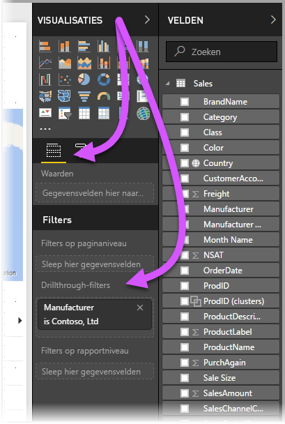
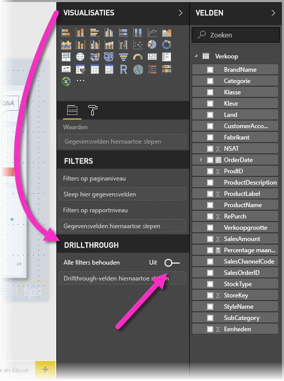
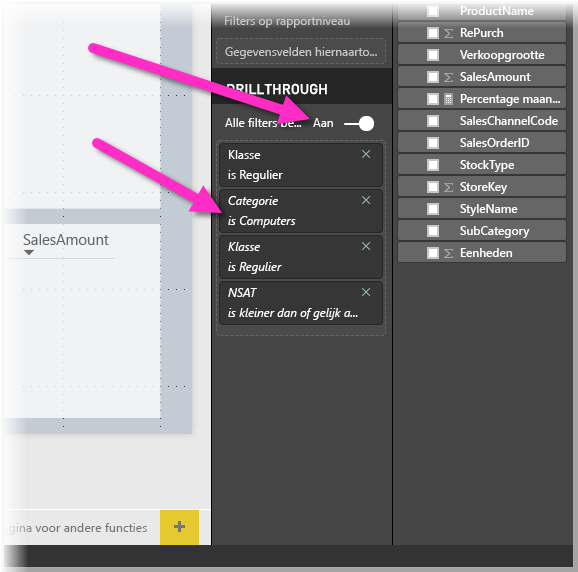

# Drillthrough gebruiken in Power BI Desktop
Met **drillthrough** in **Power BI Desktop** kunt u een pagina in uw rapport maken die zich op een bepaalde entiteit richt, zoals een leverancier, klant of fabrikant. Met die specifieke rapportpagina kunnen gebruikers met de rechtermuisknop op een gegevenspunt in andere rapportpagina's klikken en inzoomen op die specifieke pagina voor gefilterde details met betrekking tot die context.

## Drillthrough gebruiken
1. Als u **drillthrough** wilt gebruiken, maakt u een rapportpagina met visuals voor het type entiteit waarop u drillthrough wilt toepassen. 

    Stel dat u drillthrough voor fabrikanten beschikbaar wilt maken. Dan kunt u een drillthrough-pagina maken met visuele elementen met de totale omzet, het totale aantal verzonden eenheden, omzet per categorie of per regio, enzovoort. Als u vervolgens op die pagina inzoomt, ziet u de visuals die specifiek zijn voor de fabrikant die u hebt geselecteerd.

2. Op de drillthrough-pagina gaat u vervolgens naar de sectie **Velden** van het deelvenster **Visualisaties** en sleept u het veld waarop u drillthrough wilt toepassen eveneens naar de verdieping **Drillthrough-filters**.

    

    Als u een veld toevoegt aan de verdieping **Drillthrough-filters**, wordt automatisch de knop **Terug** als visueel element gemaakt. Dit visuele element wordt een knop in gepubliceerde rapporten. Gebruikers die het rapport gebruiken in de **Power BI-service** kunnen er makkelijk mee teruggaan naar de rapportpagina waar ze vandaan kwamen (de pagina waar ze voor de drillthrough hebben gekozen).

    

## Uw eigen afbeelding gebruiken voor een knop Terug    
 Omdat de knop Terug een afbeelding is, kunt u deze vervangen door een andere afbeelding naar keuze. De knop werkt dan nog steeds als knop Terug om gebruikers van het rapport te laten terugkeren naar de oorspronkelijke pagina.

1. Klik op het tabblad **Start** op **Afbeelding**, zoek uw afbeelding en plaats deze op de pagina Drillthrough.
2. Selecteer de nieuwe afbeelding op de pagina Drillthrough. Activeer de schuifknop **Koppeling** in de sectie Afbeelding opmaken en stel het **Type** in op **Terug**. De afbeelding fungeert nu als een knop Terug.

    

    Als uw **drillthrough**-pagina is voltooid en een gebruiker in het rapport met de rechtermuisknop klikt op een gegevenspunt waarvoor het veld wordt gebruikt dat u in de verdieping **Drillthrough-filters** hebt geplaatst, wordt een snelmenu weergegeven waarmee de gebruiker op die pagina kan inzoomen.

    

    Als de gebruiker voor drillthrough kiest, wordt de pagina gefilterd en wordt informatie weergegeven over het gegevenspunt waarop met de rechtermuisknop is geklikt. Als de gebruiker bijvoorbeeld met de rechtermuisknop heeft geklikt op een gegevenspunt over Contoso (een fabrikant) en voor drillthrough heeft gekozen, dan is de weergegeven drillthrough-pagina op Contoso gefilterd.

## Alle filters in drillthrough goedkeuren

Vanaf de versie van mei 2018 van **Power BI Desktop**, kunt u alle filters die toegepast worden op het drillthrough-venster goedkeuren. U hebt bijvoorbeeld alleen een bepaalde categorie van producten geselecteerd en de visuele elementen gefilterd voor die categorie, dan kunt u drillthrough selecteren. U bent wellicht geïnteresseerd in hoe drillthrough er uit ziet wanneer al deze filters toegepast worden.

Om alle toegepaste filters te behouden zet u in de sectie **Drillthrough** van het venster **Visualisaties** de schakelaar **alle filters goedkeuren** op **aan**. 

In versies van **Power BI Desktop** voor mei 2018 is het gedrag gelijk aan wanneer de schakelaar op **uit** staat.

Wanneer u drillthrough toepast op een visual kunt u zien welke filters er zijn toegepast als resultaat van tijdelijke filters die op de bronvisual zijn toegepast. In het venster drillthrough zijn deze tijdelijke filters cursief weergegeven. 

U kunt dit doen met tooltips-pagina’s, maar dat zou een vreemde ervaring zijn (de tooltip wordt niet op de juiste manier werkend weergegeven) dus het wordt niet aanbevolen om dit te doen met tooltips.

## Een meting aan drillthrough toevoegen

Naast het doorgeven van alle filters aan het drillthrough-venster, kunt u ook een meting (of een samengevatte numerieke kolom) toevoegen aan het drillthrough-gebied. Sleep het veld drillthrough naar de kaart Drillthrough om dit toe te passen. 

Wanneer u een meting (of samengevatte numerieke kolom) toevoegt, kunt u inzoomen op de pagina als het veld wordt gebruikt het gebied *Waarde* van een visual.

Meer hoeft u niet te doen om **drillthrough** in uw rapporten te gebruiken. Het is een uitstekende manier om een uitgebreid overzicht te krijgen over de entiteitsgegevens die u voor uw drillthrough-filter selecteert.

## Volgende stappen

Wellicht bent u ook geïnteresseerd in de volgende artikelen:

* [Slicers Power BI Desktop gebruiken](visuals/desktop-slicers.md)

