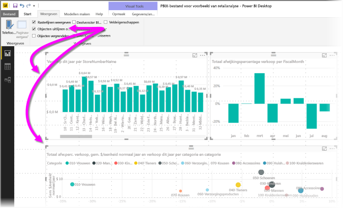
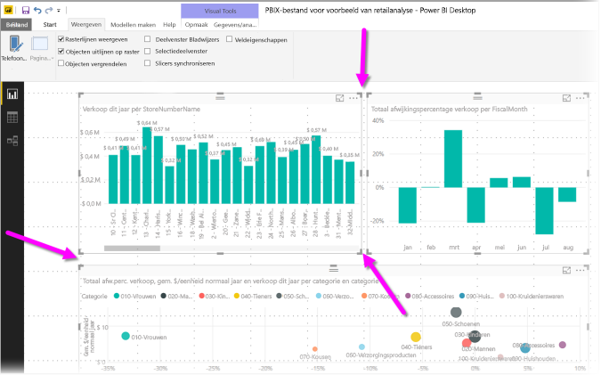
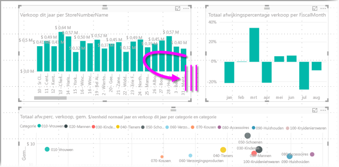
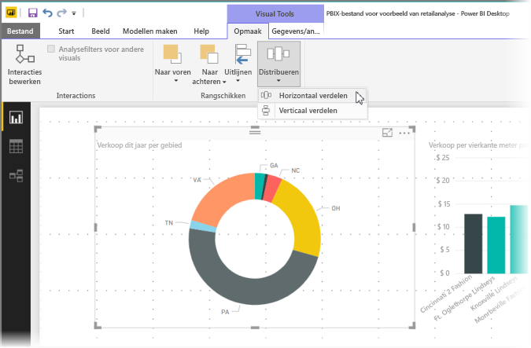

# Rasterlijnen en Uitlijnen op raster gebruiken in Power BI Desktop-rapporten
Op het canvas van het **Power BI Desktop**-rapport vindt u rasterlijnen waarmee u visuele elementen netjes op een rapportpagina kunt uitlijnen. Het bevat ook de functie Uitlijnen op raster, waarmee u de visuele elementen in uw rapporten op gelijkmatige afstand kunt zetten en ze een professioneel en uitgelijnd uiterlijk geven.

In **Power BI Desktop** kunt u ook de z-volgorde van objecten in een rapport wijzigen (naar voren of naar achteren). En u kunt geselecteerde visuele elementen op het canvas uitlijnen of gelijkmatig verdelen.

### Rasterlijnen en Uitlijnen op raster inschakelen
Als u Rasterlijnen en Uitlijnen op raster wilt inschakelen, selecteert u het lint **Weergave** en schakelt u de selectievakjes in bij **Rasterlijnen weergeven** en **Objecten uitlijnen op raster**.  U kunt één vakje of beide vakjes inschakelen. Ze werken onafhankelijk van elkaar.

> [!NOTE]
> Als **Rasterlijnen weergeven** en **Objecten uitlijnen op raster** zijn uitgeschakeld, kunt u ze weer inschakelen door verbinding te maken met een gegevensbron.
> 
> 

### Rasterlijnen gebruiken
Rasterlijnen zijn visuele hulplijnen waarmee u kunt zien of twee of meer visuele elementen goed zijn uitgelijnd. Wanneer u wilt bepalen of twee (of meer) visuele elementen horizontaal of verticaal zijn uitgelijnd, gebruikt u de rasterlijnen om visueel vast te stellen of de randen zijn uitgelijnd.

Met *Ctrl+klik* kunt u meerdere visuele elementen tegelijk selecteren. Hiermee worden alle geselecteerde randen van de elementen weergegeven, zodat u eenvoudig kunt zien of de visuele elementen goed zijn uitgelijnd.

#### Rasterlijnen binnen visuele elementen gebruiken
In Power BI zijn ook rasterlijnen binnen visuele elementen aanwezig, waarmee u over visuele hulplijnen beschikt voor het vergelijken van gegevenspunten en waarden. Sinds de release van **Power BI Desktop** in september 2017 kunt u rasterlijnen binnen visuele elementen beheren met behulp van de kaarten **X-as** of **Y-as** (te gebruiken afhankelijk van het type visuele element). Deze vindt u in de sectie **Indeling** van het deelvenster **Visualisaties**. U kunt de volgende elementen van rasterlijnen binnen een visueel element beheren:

* Rasterlijnen in- of uitschakelen
* De kleur van rasterlijnen wijzigen
* De streek (breedte) van rasterlijnen aanpassen
* De lijnstijl van de rasterlijnen in het visuele element selecteren, bijvoorbeeld ononderbroken, onderbroken of gestippeld

Het wijzigen van bepaalde elementen van rasterlijnen kan met name handig zijn in rapporten waar een donkere achtergrond voor visuele elementen wordt gebruikt. De volgende afbeelding toont de sectie *Rasterlijnen* in de kaart **X-as**.

### Uitlijnen op raster gebruiken
Wanneer u **Objecten uitlijnen op raster** inschakelt, worden alle visuele elementen op het **Power BI Desktop**-canvas die u verplaatst (of van grootte verandert) automatisch uitgelijnd met de meest nabije rasteras. Hierdoor kunt u veel makkelijker zien of twee of meer visuele elementen zijn uitgelijnd met dezelfde horizontale of verticale locatie (of grootte).

Meer hebt u niet nodig als u **Rasterlijnen** en **Objecten uitlijnen op raster** wilt gebruiken om ervoor te zorgen dat de visuele elementen in uw rapporten netjes zijn uitgelijnd.

### Z-volgorde, Uitlijnen en Verdelen gebruiken
U kunt ook de volgorde beheren waarin visuele elementen van voor naar achteren in een rapport worden weergegeven. Dit wordt de *Z-volgorde* van de elementen genoemd. Hiermee kunt u visuele elementen elkaar in een willekeurige volgorde laten overlappen, waarna u de volgorde van voor naar achteren kunt aanpassen. Het ordenen wordt uitgevoerd via de knoppen **Naar voren** en **Naar achteren**. Deze bevinden zich in de sectie **Schikken** van het lint **Indeling**. Het lint verschijnt zodra u een of meer visuele elementen op de pagina selecteert.

Via het lint **Indeling** kunt u ook de visuele elementen op diverse manieren uitlijnen. U kunt de visuele elementen dus uitlijnen op een manier die voor u het best past.

Als u één visueel element hebt geselecteerd, kunt u het met de knop **Uitlijnen** uitlijnen met de rand (of het midden) van het rapportcanvas, zoals weergegeven in de volgende afbeelding.

Als u twee of meer visuele elementen hebt geselecteerd, worden ze samen uitgelijnd en wordt de bestaande, uitgelijnde grens van de visuele elementen voor het uitlijnen gebruikt. Als u bijvoorbeeld twee visuele elementen hebt geselecteerd en hiervoor de knop *Links uitlijnen* selecteert, worden de visuele elementen uitgelijnd met de meest linkse begrenzing van alle geselecteerde visuele elementen.

U kunt uw visuele elementen ook gelijkmatig over het rapportcanvas verdelen, zowel verticaal als horizontaal. Gebruik hiervoor de knop **Verdelen** op het lint **Indeling**.

met behulp van slechts enkele selecties van deze hulpmiddelen kunt u uw rapporten er naar eigen wens laten uitzien.

