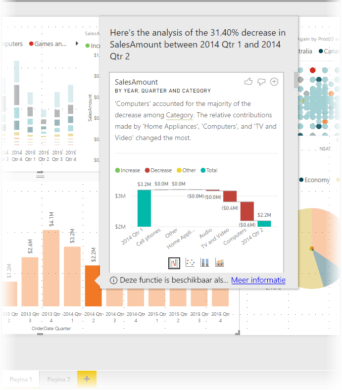
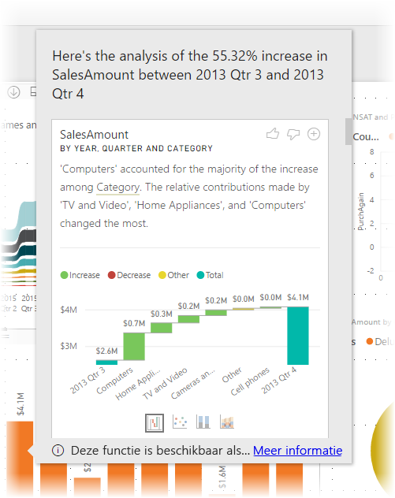
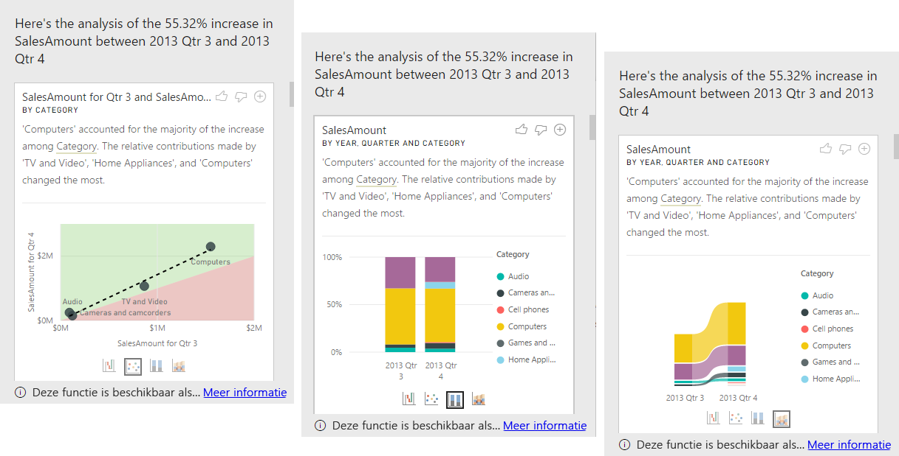

# Inzichten gebruiken in Power BI Desktop (preview)
U kunt **Power BI Desktop** vragen toe- of afnames in diagrammen uit te leggen en om snelle, geautomatiseerde en inzichtelijke analyses over uw gegevens. Klik hiertoe met de rechtermuisknop op een gegevenspunt en selecteer **Analyseren > Leg de afname uit** (toename, als de vorige staaf lager is) en u krijgt inzicht in een gebruiksvriendelijk venster.

De inzichtfunctie is contextueel en gebaseerd op het gegevenspunt dat er onmiddellijk aan vooraf gaat, zoals de vorige staaf of kolom.

> [!NOTE]
> De functie is een preview-versie en kan nog worden gewijzigd. De inzichtfunctie is vanaf de **Power BI Desktop**-versie van september 2017 standaard ingeschakeld (u hoeft geen selectievakje Preview in te schakelen).
> 
> 

## Inzichten gebruiken
Als u inzichten wilt gebruiken, klikt u met de rechtermuisknop op een gegevenspunt in een staaf of lijn en selecteert u **Analyseren > Leg de toename uit** (of *Leg de afname uit*, omdat alle inzichten zijn gebaseerd op de wijziging sinds het vorige gegevenspunt).

Vervolgens worden door **Power BI Desktop** de gegevens met machine-learning algoritmen geanalyseerd en wordt in een venster een visueel element en een beschrijving weergegeven. Hieraan ziet u welke categorieën de meeste invloed hebben gehad op de toe- of afname. De inzichten worden standaard gepresenteerd als een visueel element met een *waterval*, zoals in de volgende afbeelding is getoond.

Als u de kleine pictogrammen onder aan de waterval selecteert, kunt u ervoor kiezen of in de inzichten een spreidingsdiagram, een gestapeld kolomdiagram of lintdiagram wordt weergegeven.

Met de pictogrammen met *duim omhoog* of *duim omlaag* boven aan de pagina kunt u feedback geven over het visuele element en de functie.

Belang rijk is ook de **+**-knop boven aan het visuele element. Hiermee kunt u het geselecteerde visuele element aan uw rapport toevoegen, alsof u het zelf had gemaakt. Vervolgens kunt u het toegevoegde visuele element opmaken of op andere wijze aanpassen, net zoals u dat voor een ander visueel element in uw rapport zou kunnen doen. U kunt een geselecteerd visueel inzicht alleen toevoegen als u een rapport bewerkt in **Power BI Desktop**.

U kunt inzichten gebruiken als uw rapport in lees- of bewerkmodus is. U kunt er dan gegevens mee analyseren en visuele elementen mee maken die u makkelijk aan uw rapporten kunt toevoegen.

## Overwegingen en beperkingen
Inzichten zijn gebaseerd op de wijziging van het voorgaande gegevenspunt, dus zijn ze niet beschikbaar als u het eerste gegevenspunt in een visueel element selecteert. 

In de volgende lijst vindt u een aantal scenario's voor **inzichten** die worden ondersteund:

* TopN-filters
* Opname-/uitsluitingsfilters
* Maateenheidfilters
* Niet-additieve metingen en samentellingen
* Waarde weergeven als
* Gefilterde metingen (iets nieuws dat voor spreidingsdiagrammen in inzichten wordt gebruikt)
* Categorische kolommen op de X-as, tenzij er een scalaire kolomsortering wordt gedefinieerd. Als er een hiërarchie wordt gebruikt, moet elke kolom in de actieve hiërarchie aan deze voorwaarde voldoen
* Niet-numerieke metingen

Daarnaast worden de volgende modeltypen en gegevensbronnen niet voor inzichten ondersteund:

* DirectQuery
* Live Connect
* On-premises Reporting Services
* Insluiten

## Volgende stappen
Lees de volgende artikelen voor meer informatie over **Power BI Desktop** en hoe u aan de slag kunt.

* [Getting Started with Power BI Desktop](desktop-getting-started.md) (Aan de slag met Power BI Desktop)
* [Query Overview with Power BI Desktop](desktop-query-overview.md) (Queryoverzicht met Power BI Desktop)
* [Data Sources in Power BI Desktop](desktop-data-sources.md) (Gegevensbronnen in Power BI Desktop)
* [Connect to Data in Power BI Desktop](desktop-connect-to-data.md) (Verbinding maken met gegevens in Power BI Desktop)
* [Shape and Combine Data with Power BI Desktop](desktop-shape-and-combine-data.md) (Gegevens vormgeven en combineren met Power BI Desktop)
* [Common Query Tasks in Power BI Desktop](desktop-common-query-tasks.md) (Algemene querytaken in Power BI Desktop)   

