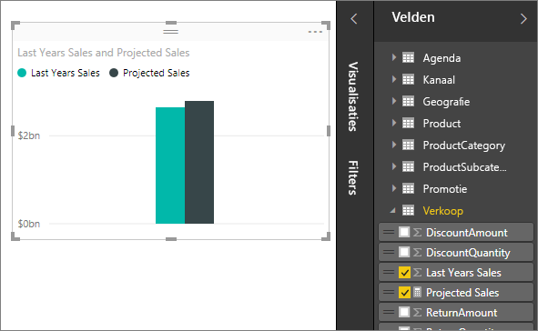

# Metingen in Power BI Desktop

Met **Power BI Desktop** kunt u met een paar klikken inzicht in uw gegevens krijgen. Maar soms bevatten die gegevens niet de antwoorden op uw belangrijkste vragen. Dankzij metingen kunt u die wel krijgen.

Metingen worden gebruikt in enkele van de meest voorkomende data-analyses. Bijvoorbeeld bij totalen, gemiddelden, minimum- of maximumwaarden, tellingen of meer geavanceerde berekeningen die u zelf maakt met een DAX-formule. De berekende resultaten van metingen zijn altijd onderhevig aan wijzigingen, afhankelijk van uw interactie met de rapporten, waardoor een snelle en dynamische ad-hocverkenning van de gegevens mogelijk is. Laten we dit eens nader bekijken.

## Informatie over metingen

In **Power BI Desktop** worden metingen gemaakt en gebruikt in een **rapportweergave** of **gegevensweergave**. Metingen die u zelf maakt, worden met een rekenmachinepictogram aangegeven in de lijst Velden. U kunt de metingen elke naam geven die u wilt en ze toevoegen aan een nieuwe of bestaande visualisatie, net zoals elk ander veld.

> [!NOTE]
> Wellicht bent u ook geïnteresseerd in **snelle metingen**. Dit zijn kant-en-klare metingen die u in een dialoogvenster kunt selecteren. Hiermee kunt u snel metingen maken en tevens de syntaxis van DAX leren. U kunt de automatisch gemaakte DAX-formules in een snelle meting namelijk ook weergeven. Zie het artikel over [quick measures](desktop-quick-measures.md) (snelle metingen).
> 
> 

## Data Analysis Expressions

Metingen berekenen een resultaat van een expressieformule. Als u uw eigen metingen maakt, gebruikt u de formuletaal [Data Analysis Expressions](https://msdn.microsoft.com/library/gg413422.aspx) (DAX). DAX bevat een bibliotheek met meer dan 200 functies, operatoren en constructies. Deze biedt zodoende een uitgebreide flexibiliteit bij het maken van metingen voor het berekenen van resultaten voor vrijwel elke gegevensanalyse.

DAX-formules lijken veel op Excel-formules. DAX bevat zelfs veel dezelfde functies als Excel, zoals DATUM, SOM en LINKS. Maar de functies in DAX worden gebruikt voor het werken met relationele gegevens, zoals die in Power BI Desktop.

## Een voorbeeld
Elsje is salesmanager bij Contoso. Ze is gevraagd naar de verkoopprognoses van de wederverkopers voor het volgende belastingjaar. Elsje besluit haar prognoses te baseren op de omzetten van het vorige jaar en gaat uit van een jaarlijkse toename van zes procent als gevolg van diverse reclamecampagnes die de komende zes maanden op stapel staan.

Voor de rapportage importeert Elsje de verkoopcijfers van het vorige jaar in Power BI Desktop. Ze zoekt het veld Omzet in de tabel Verkopen wederverkopers. Omdat de geïmporteerde gegevens slechts de omzetten van het vorige jaar bevatten, geeft Elsje het veld Omzet de naam Verkoop afgelopen jaar. Vervolgens sleept Elsje Verkoop afgelopen jaar naar het rapportcanvas. De gegevens worden in een diagram als één waarde weergegeven, die de som is van de verkopen van alle wederverkopers van het afgelopen jaar.

Hoewel Elsje zelf geen berekening heeft opgegeven, ziet ze dat er een automatisch wordt voorgesteld. Power BI Desktop heeft zelf een meting gemaakt door alle waarden in Verkoop afgelopen jaar bij elkaar op te tellen.

Maar Elsje heeft een meting nodig om de verkoopprognoses te berekenen voor het komende jaar. Deze wordt gebaseerd op de verkopen van het afgelopen jaar, vermenigvuldigt met 1,06 vanwege de verwachte stijging in de verkoopcijfers met zes procent. Voor deze berekening maakt ze haar eigen meting. Met de functie Nieuwe meting maakt ze een nieuwe meting. Vervolgens voert ze de volgende DAX-formule in:

    Projected Sales = SUM('Sales'[Last Years Sales])*1.06

Vervolgens sleept Elsje de meting Geraamde verkoop naar het diagram.

Ze beschikt nu snel en nagenoeg moeiteloos over een meting om de geraamde verkopen te berekenen. Elsje kan de prognoses verder analyseren door te filteren op specifieke wederverkopers of door andere velden aan het rapport toe te voegen.

## Gegevenscategorieën voor metingen

U kunt ook gegevenscategorieën voor metingen kiezen. 

Hiermee kunt u onder andere met behulp van metingen dynamisch URL's maken en de gegevenscategorie markeren als Web-URL. 

U kunt tabellen maken die de metingen als Web-URL's weergeven en op de URL klikken die op basis van uw selectie is gemaakt. Dit is vooral nuttig als u deze wilt koppelen aan andere Power BI-rapporten met [URL-filterparameters](service-url-filters.md).

## Meer informatie
U hebt zojuist een korte inleiding over metingen gehad, maar er is nog veel meer om u te leren hoe u zelf metingen maakt. Bekijk vooral [Tutorial: Create your own measures in Power BI Desktop](desktop-tutorial-create-measures.md) (Zelfstudie: uw eigen metingen maken in Power BI Desktop), waar u een voorbeeldbestand kunt downloaden en stapsgewijze lessen krijgt over het maken van metingen.  

Als u meer wilt weten over DAX, lees dan zeker [DAX basics in Power BI Desktop](desktop-quickstart-learn-dax-basics.md) (Standaard DAX-bewerkingen in Power BI Desktop). In [Naslag voor Data Analysis Expressions (DAX)](https://msdn.microsoft.com/library/gg413422.aspx) vindt u uitgebreide artikelen over al deze functies, de syntaxis, operatoren en naamgevingsconventies. DAX bestaat al enkele jaren in Power Pivot in Excel en SQL Server Analysis Services. Er zijn dus ook nog vele andere bronnen beschikbaar. Bekijk ook de wiki [DAX Resource Center](http://social.technet.microsoft.com/wiki/contents/articles/1088.dax-resource-center.aspx) (Bronnenmateriaal voor DAX) waar invloedrijke leden van de BI-community hun kennis van DAX delen.

