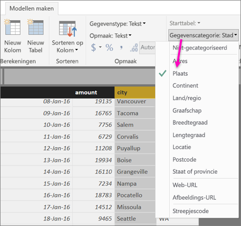
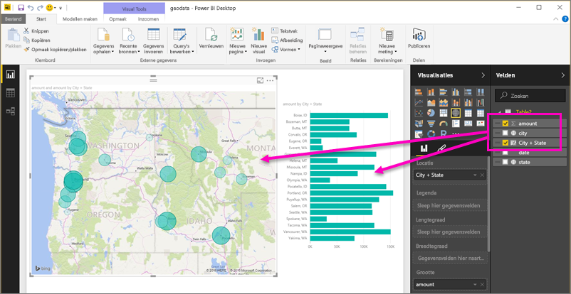
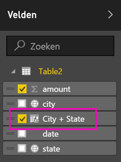

# Geografische filters in Power BI Desktop instellen voor de mobiele apps
In Power BI Desktop kunt u [geografische gegevens categoriseren](desktop-data-categorization.md) voor een kolom, zodat Power BI Desktop weet hoe waarden in visuele elementen moeten worden afgehandeld in een rapport. Een extra voordeel is dat wanneer uw collega's het desbetreffende rapport weergeven in de mobiele Power BI-apps voor iOS, automatisch de geografische filters in Power BI worden verstrekt die overeenkomen met waar u zich bevindt. 

Stel dat u een verkoopmanager bent en reist om met klanten af te spreken en u snel de totale verkoop en omzet wilt filteren voor de specifieke klant die u een bezoek gaat brengen. U wilt de gegevens opsplitsen voor uw huidige locatie, of dit nu per provincie, plaats of een exact adres is. Later, als u tijd over hebt, wilt u andere klanten in de buurt een bezoek brengen. U kunt [het rapport filteren op uw locatie om die klanten te vinden](consumer/mobile/mobile-apps-geographic-filtering.md).

> [!NOTE]
> U kunt alleen filteren op locatie in de mobiele app als de geografische namen in het rapport in het Engels zijn, bijvoorbeeld ‘New York’ of ‘Germany’.
> 
> 

## Geografische gegevens in uw rapport identificeren
1. Schakel over naar Gegevensweergave in Power BI Desktop .
2. Selecteer een kolom met geografische gegevens, bijvoorbeeld de kolom Plaats.
   
    
3. Selecteer op het tabblad **Model maken** de optie **Gegevenscategorie**, en vervolgens de juiste categorie, in dit voorbeeld **Plaats**.
   
    
4. Ga verder met het instellen van de categorieën met geografische gegevens voor alle andere velden in het model. 
   
   > [!NOTE]
   > U kunt meerdere kolommen voor elke gegevenscategorie instellen in een model, maar als u het model maakt, kunt u niet filteren op geografische locatie in de mobiele Power BI-app. Voor het gebruik van geografische filters in de mobiele apps, stelt u slechts één kolom in voor elke gegevenscategorie; bijvoorbeeld slechts één kolom **Plaats**, één kolom **Staat of provincie** en één kolom **Land**. 
   > 
   > 

## Visuele elementen maken bij uw geografische gegevens
1. Schakel over naar Rapportweergave en maak visuele elementen die gebruikmaken van de geografische velden in uw gegevens. 
   
    
   
    In dit voorbeeld bevat het model ook een berekende kolom, die de plaats en provincie in één kolom samenbrengt. Lees meer over [het maken van berekende kolommen in Power BI Desktop](desktop-calculated-columns.md).
   
    
2. Publiceer het rapport naar de Power BI-service.

## Het rapport weergeven in de mobiele Power BI-app
1. Open het rapport in een van de [mobiele Power BI-apps](consumer/mobile/mobile-apps-for-mobile-devices.md).
2. Als u zich op een geografische locatie bevindt waarover het rapport gegevens bevat, kunt u het automatisch filteren op uw locatie.
   
    

Lees meer over het [filteren van een rapport op locatie in de mobiele Power BI-apps](consumer/mobile/mobile-apps-geographic-filtering.md).

## Volgende stappen
* [Gegevenscategorisatie in Power BI Desktop](desktop-data-categorization.md)  
* Vragen? [Misschien dat de Power BI-community het antwoord weet](http://community.powerbi.com/)

