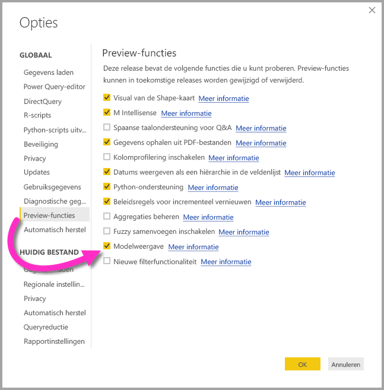
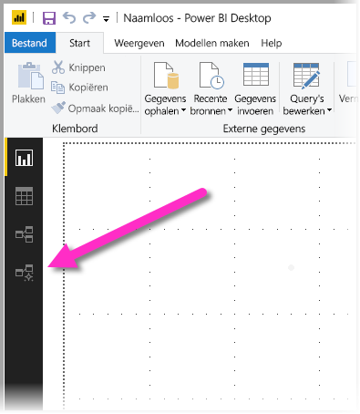
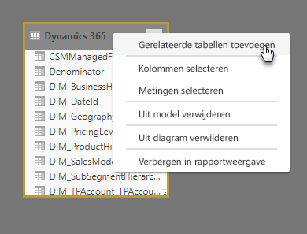
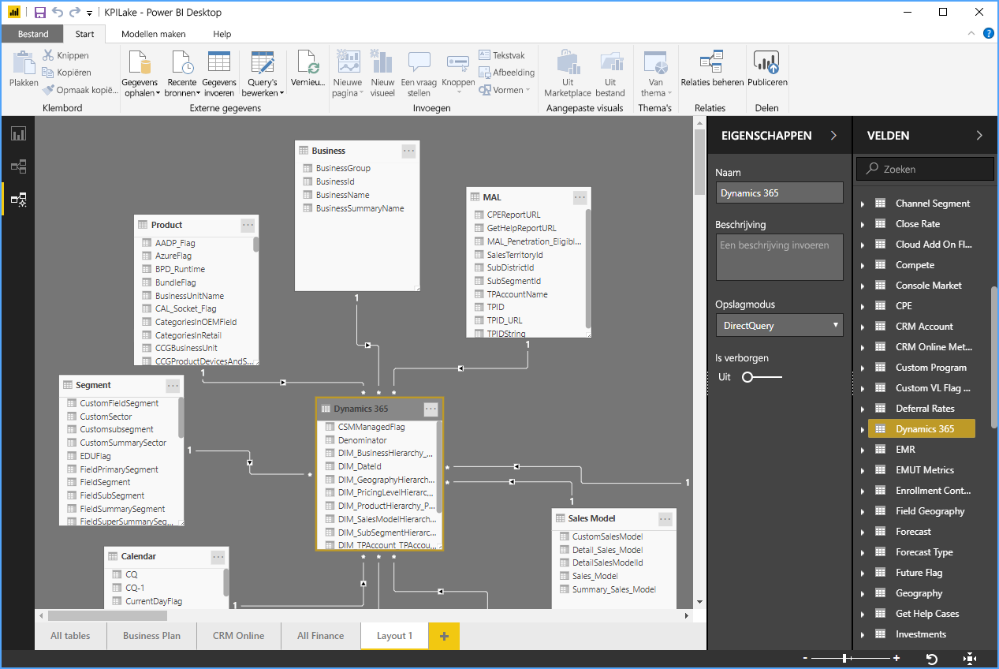

# Modelweergave in Power BI Desktop (preview)

Met de **Modelweergave** in **Power BI Desktop** kunt u complexe gegevenssets met veel tabellen bekijken en gebruiken. Met de Modelweergave kunt u het volgende doen:

## De preview-functie Modelweergave inschakelen

De functie Modelweergave is nog in preview en moet worden ingeschakeld in **Power BI Desktop**. Als u de Modelweergave wilt inschakelen, selecteert u **Bestand > Opties en instellingen > Opties > Previewfuncties**. Vervolgens selecteert u het selectievakje **Modelweergave** die in de volgende afbeelding wordt weergegeven.

U wordt gevraagd om **Power BI Desktop** opnieuw op te starten om de preview-functie in te schakelen. 

## Modelweergave gebruiken

Selecteer het pictogram Modelweergave aan de linkerzijde van **Power BI Desktop**, die in de volgende afbeelding wordt weergegeven, om de Modelweergave te openen.

## Afzonderlijke diagrammen maken

Met de Modelweergave kunt u diagrammen van uw model maken die alleen een subset van de tabellen in uw model bevatten. Hiermee krijgt u een duidelijker beeld van de tabellen waarmee u wilt werken en is het eenvoudiger om met complexe gegevenssets te werken. Als u een nieuw diagram wilt maken met alleen een subset van de tabellen, klikt u op het teken **+** naast het tabblad **Alle tabellen** aan de onderkant van het Power BI Desktop-venster.

Vervolgens is het mogelijk om de tabel vanuit de lijst **Velden** naar het oppervlak van de diagram te slepen. Klik met de rechtermuisknop op de tabel en selecteer vervolgens **Gerelateerde tabellen toevoegen** in het menu dat verschijnt.

Wanneer u dit doet worden aan de originele tabel gerelateerde tabellen weergegeven in een nieuw diagram. In de volgende afbeelding ziet u hoe gerelateerde tabellen worden weergegeven nadat u de menu-optie **Gerelateerde tabellen toevoegen** hebt geselecteerd.

## Algemene eigenschappen instellen

U kunt meerdere objecten tegelijkertijd selecteren in de Modelweergave door de toets **CTRL** in te houden en meerdere tabellen aan te klikken. Wanneer u meerdere tabellen selecteert, worden deze gemarkeerd in de Modelweergave. Wanneer er meerdere tabellen zijn gemarkeerd, worden wijzigingen in het venster **Eigenschappen** ook toegepast op de geselecteerde tabellen.

U kunt bijvoorbeeld de [opslagmodus](desktop-storage-mode.md) voor meerdere tabellen in de diagramweergave wijzigen door de toets **CTRL** in te houden, tabellen te selecteren en vervolgens de instelling Opslagmodus te wijzigen in het venster **Eigenschappen**.

## Volgende stappen

De volgende artikelen bevatten meer informatie over gegevensmodellen, evenals een gedetailleerde beschrijving van DirectQuery.

* [Aggregaties in Power BI Desktop (preview-versie)](desktop-aggregations.md)
* [Samengestelde modellen in Power BI Desktop (preview-versie)](desktop-composite-models.md)
* [Opslagmodus in Power BI Desktop (preview-versie)](desktop-storage-mode.md)
* [Veel-op-veel-relaties in Power BI Desktop (preview-versie)](desktop-many-to-many-relationships.md)

DirectQuery-artikelen:

* [DirectQuery gebruiken in Power BI](desktop-directquery-about.md)
* [Gegevensbronnen die worden ondersteund door DirectQuery in Power BI](desktop-directquery-data-sources.md)
