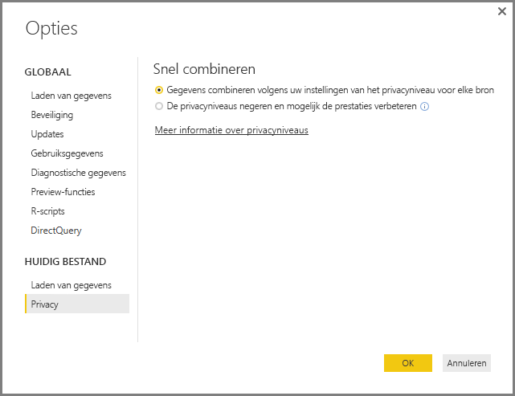

# Privacyniveaus in Power BI Desktop
In **Power BI Desktop** duiden privacyniveaus op een isolatieniveau dat aangeeft in welke mate gegevensbronnen zijn geïsoleerd van andere gegevensbronnen. Hoewel een beperkend isolatieniveau voorkomt dat informatie tussen gegevensbronnen wordt uitgewisseld, kan het de functionaliteit en prestaties verminderen.

Onder **Bestand > Opties en instellingen** en vervolgens **Huidig bestand > Privacy** vindt u de instelling **Privacyniveaus**. Deze bepaalt of Power BI Desktop gebruikmaakt van uw privacyniveau-instellingen bij het combineren van gegevens. Dit dialoogvenster bevat een koppeling naar de documentatie van Power BI Desktop over privacyniveaus (dit artikel).

 Het dialoogvenster met de instellingen voor **Privacy** voor elke gegevensbron bevindt zich onder **Bestand > Opties en instellingen > Instellingen voor gegevensbron**. Selecteer de gegevensbron en vervolgens **Bewerken**. Het dialoogvenster **Instellingen voor gegevensbron** verschijnt, waar u het desbetreffende privacyniveau in het vervolgkeuzemenu onderaan het dialoogvenster kunt selecteren, zoals in de volgende afbeelding wordt getoond.

 

> [!CAUTION]
> U dient een gegevensbron met uiterst gevoelige of vertrouwelijke gegevens als **Privé** te configureren.
> 
> 

## Een privacyniveau configureren
Met instellingen voor privacyniveaus kunt u een isolatieniveau opgeven dat aangeeft in welke mate gegevensbronnen moeten worden geïsoleerd van andere gegevensbronnen.

| Instelling | Beschrijving | Voorbeelden van gegevensbronnen |
| --- | --- | --- |
| **Privégegevensbron** |Een **privégegevensbron** bevat gevoelige of vertrouwelijke informatie. De zichtbaarheid van de gegevensbron kan worden beperkt tot gemachtigde gebruikers. Een privégegevensbron is volledig geïsoleerd van andere gegevensbronnen. |Facebook-gegevens, een tekstbestand met toewijzingen in aandelen of een werkmap met beoordelingsgegevens van werknemers. |
| **Gegevensbron op organisatieniveau** |Een gegevensbron op **organisatieniveau** beperkt de zichtbaarheid van een gegevensbron tot een groep vertrouwde personen. Een gegevensbron op **organisatieniveau** is geïsoleerd van alle **openbare** gegevensbronnen, maar zichtbaar voor andere gegevensbronnen op **organisatieniveau**. |Een **Microsoft Word-document** op een SharePoint-intranetsite met machtigingen voor een vertrouwde groep. |
| **Openbare gegevensbron** |Een **openbare** gegevensbron bevat gegevens die voor iedereen zichtbaar zijn. Alleen bestanden, gegevensbronnen op internet of werkmapgegevens kunnen als **Openbaar** worden gemarkeerd. |Vrij beschikbare gegevens van Microsoft Azure Marketplace, gegevens van Wikipedia, of lokale bestanden met gegevens die van een openbare webpagina afkomstig zijn |

## Instellingen voor privacyniveau configureren
Het dialoogvenster met de instellingen voor **Privacy** voor elke gegevensbron bevindt zich onder **Bestand > Opties en instellingen > Instellingen voor gegevensbron**.

Als u het privacyniveau van een gegevensbron wilt configureren, selecteert u de gegevensbron en vervolgens **Bewerken**. Het dialoogvenster **Instellingen voor gegevensbron** verschijnt, waar u het desbetreffende privacyniveau in het vervolgkeuzemenu onderaan het dialoogvenster kunt selecteren, zoals in de volgende afbeelding wordt getoond.

> [!CAUTION]
> U dient een gegevensbron met uiterst gevoelige of vertrouwelijke gegevens als **Privé** te configureren.
> 

## Privacyniveaus configureren
**Privacyniveaus** is een instelling die standaard is ingesteld op **Gegevens combineren volgens uw instellingen van het privacyniveau voor elke bron**, wat inhoudt dat **Privacyniveaus** niet is ingeschakeld.

| Instelling | Beschrijving |
| --- | --- |
| **Gegevens combineren volgens uw instellingen van het privacyniveau voor elke bron** (aan, de standaardinstelling) |Instellingen voor privacyniveaus worden gebruikt om bij het combineren van gegevens het isolatieniveau tussen gegevensbronnen vast te stellen. |
| **De privacyniveaus en mogelijk verbeterde prestaties negeren** (uit) |Privacyniveaus worden bij het combineren van gegevens niet in overweging genomen; prestaties en functionaliteit van de gegevens kunnen toenemen. |

> **Opmerking over de beveiliging:** het inschakelen van **Privacyniveaus** door **De privacyniveaus en mogelijk verbeterde prestaties negeren** in het dialoogvenster **Privacyniveaus** te selecteren, kan gevoelige of vertrouwelijke gegevens blootstellen aan niet-gemachtigde personen. Schakel **Privacyniveaus** niet in, tenzij u zeker weet dat de gegevensbron geen gevoelige of vertrouwelijke gegevens bevat.
> 
> 

> [!CAUTION]
> Het item **De privacyniveaus en mogelijk verbeterde prestaties negeren** werkt niet in Power BI-service. Als zodanig vertonen Power BI Desktop-rapporten waarbij deze instelling is ingeschakeld en die vervolgens met Power BI-service worden gepubliceerd, *niet* dit gedrag wanneer deze in de service worden gebruikt.
> 

**Privacyniveaus configureren**

Selecteer in Power BI Desktop of in Query-editor **Bestand > Opties en instellingen > Opties** en selecteer vervolgens **Huidig bestand > Privacy**.

a. Als **Gegevens combineren volgens uw instellingen van het privacyniveau voor elke bron** is geselecteerd, worden gegevens gecombineerd volgens uw instelling voor Privacyniveaus. Het samenvoegen van gegevens in privacyisolatiezones leidt tot enig bufferen van gegevens.

b. Als **De privacyniveaus en mogelijk verbeterde prestaties negeren** is geselecteerd, worden gegevens gecombineerd waarbij uw instelling voor Privacyniveaus wordt genegeerd. Hierdoor kunnen gevoelige of vertrouwelijke gegevens aan niet-gemachtigde gebruikers worden blootgesteld. De instelling kan de prestaties en functionaliteit verhogen.

> **Opmerking over de beveiliging:** het inschakelen van **De privacyniveaus en mogelijk verbeterde prestaties negeren** kan de prestaties mogelijk verbeteren. De privacy van gegevens die in het Power BI Desktop-bestand zijn samengevoegd, kan echter niet worden gegarandeerd.
> 
> 

