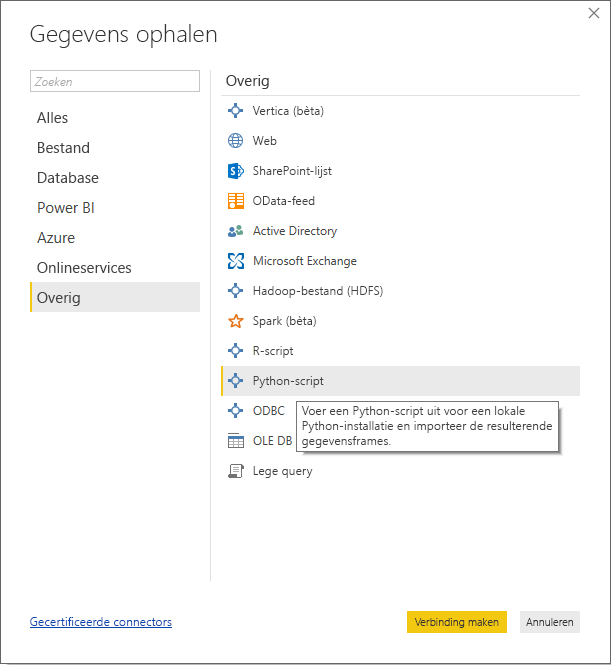
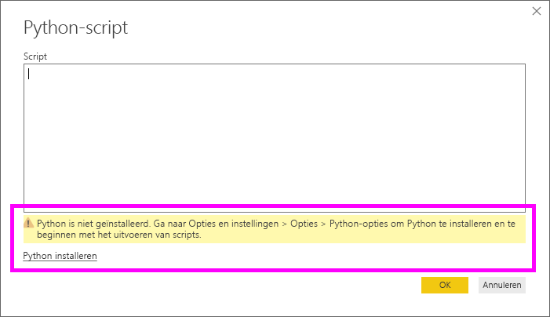
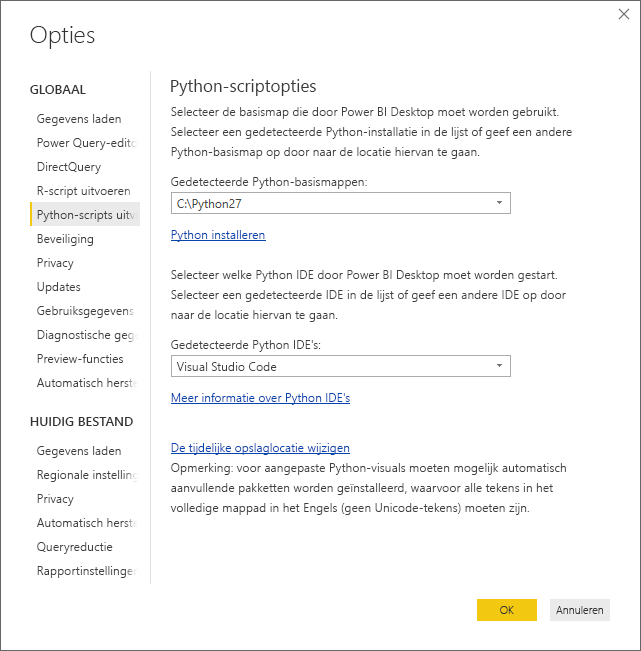

# Python-scripts uitvoeren in Power BI Desktop
U kunt Python-scripts rechtstreeks in **Power BI Desktop** uitvoeren en de resulterende gegevenssets in een Power BI Desktop-gegevensmodel importeren.

## Python installeren
Als u Python-scripts wilt uitvoeren in Power BI Desktop, moet u **Python** afzonderlijk installeren op de lokale computer. U kunt **Python** gratis downloaden en installeren vanaf tal van locaties, waaronder de [officiële Python-downloadpagina](https://www.python.org/) en de [Anaconda](https://anaconda.org/anaconda/python/). De huidige release van Python-scripts in Power BI Desktop biedt ondersteuning voor Unicode-tekens en spaties (lege tekens) in het installatiepad.

## Python-scripts uitvoeren
In Power BI Desktop kunt in slechts enkele stappen Python-scripts uitvoeren en een gegevensmodel maken. Hiermee kunt u rapporten maken en deze via de Power BI-service delen.

### Een Python-script voorbereiden
Als u een Python-script wilt uitvoeren in Power BI Desktop, maakt u het script in uw lokale omgeving voor Python-ontwikkeling en controleert u of het foutloos wordt uitgevoerd.

Als u het script wilt uitvoeren in Power BI Desktop, dient u ervoor te zorgen dat het foutloos in een nieuwe en ongewijzigde werkruimte wordt uitgevoerd. Dat betekent dat alle pakketten en afhankelijkheden expliciet moeten worden geladen en uitgevoerd.

Als u een Python-script in Power BI Desktop voorbereidt en uitvoert, gelden er enkele beperkingen:

* Er worden alleen Pandas-gegevensframes geïmporteerd. Zorg er dus voor dat de gegevens die u in Power BI wilt importeren, in een gegevensframe worden weergegeven
* Python-scripts waarvan het uitvoeren langer duurt dan dertig minuten, worden door een time-out afgebroken
* Bij interactieve aanroepen in het Python-script, zoals het wachten op gebruikersinvoer, wordt het uitvoeren van het script onderbroken
* Als de werkmap in het Python-script wordt ingesteld, *moet* u een volledig pad naar de werkmap definiëren in plaats van een relatief pad
* Geneste tabellen (tabel van tabellen) worden momenteel niet ondersteund 

### Python-script uitvoeren en gegevens importeren
1. In Power BI Desktop bevindt de Python-scriptgegevensconnector zich in **Gegevens ophalen**. Als u het Python-script wilt uitvoeren, selecteert u **Gegevens ophalen &gt; Meer...** en vervolgens **Overige &gt; Python-script**, zoals in de volgende afbeelding is weergegeven:
   
   
2. Als Pythonop de lokale computer is geïnstalleerd, wordt de meest recente installatie geselecteerd als de Python-engine. Kopieer het script in het scriptvenster en selecteer **OK**.
   
   
3. Als Python niet is geïnstalleerd of niet wordt herkend, of als er meerdere installaties op uw lokale computer zijn, wordt er een waarschuwing weergegeven.
   
   
   
   Installatie-instellingen voor Python bevinden zich centraal in de sectie Python-script van het dialoogvenster Opties. Als u de installatie-instellingen voor Python wilt opgeven, selecteert u **Bestand > Opties en instellingen** en vervolgens **Opties > Python-script**. Als er meerdere installaties van Python beschikbaar zijn, verschijnt er een vervolgkeuzemenu waarin u de gewenste installatie kunt selecteren. U kunt ook **Overige** selecteren en een aangepast pad opgeven.
   
   
4. Selecteer **OK** om het Python-Script uit te voeren. Wanneer het script wordt uitgevoerd, kunt u vervolgens de resulterende gegevensframes toevoegen aan het Power BI-model.

### Vernieuwen
U kunt een Python-script in Power BI Desktop vernieuwen. Als u een Python-script vernieuwt, wordt het Python-script opnieuw uitgevoerd in de Power BI Desktop-omgeving.

## Volgende stappen
Raadpleeg de volgende aanvullende informatie over Python in Power BI.

* [Python-visuals maken in Power BI Desktop](desktop-python-visuals.md)
* [Een externe Python IDE met Power BI gebruiken](desktop-python-ide.md)