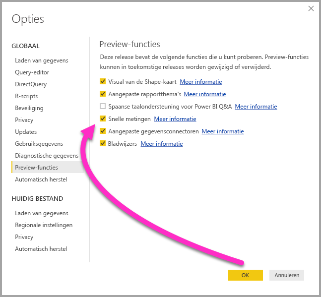
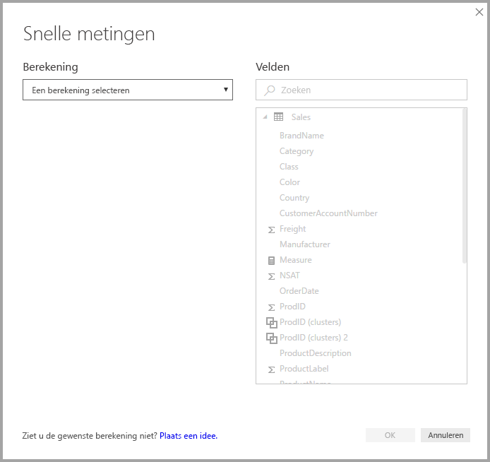
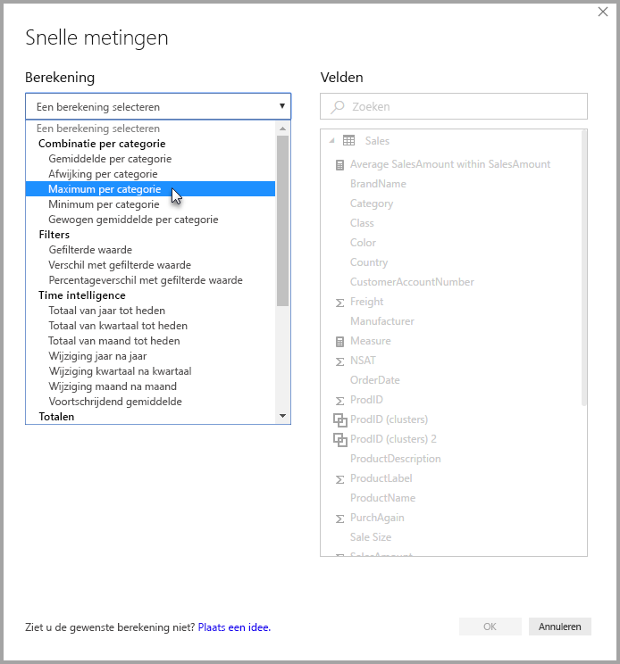
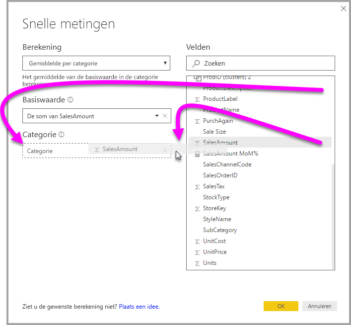
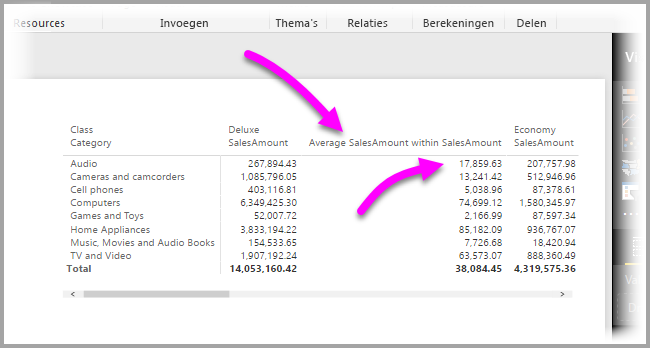
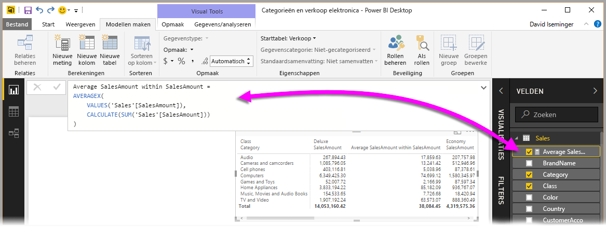
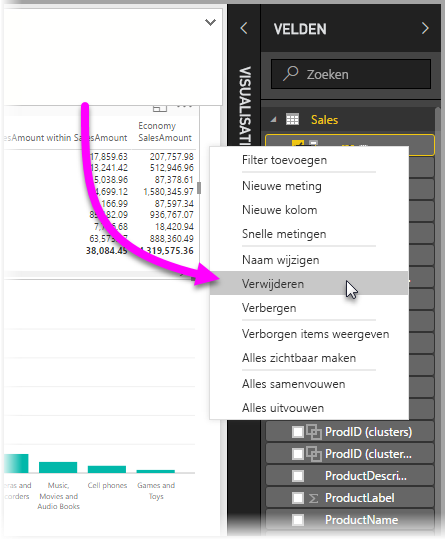

# Gebruik Snelle metingen om eenvoudig algemene en krachtige berekeningen uit te voeren
U kunt **Snelle metingen** gebruiken om snel en eenvoudig algemene, krachtige berekeningen uit te voeren. Een **Snelle meting** voert een reeks DAX-opdrachten uit op de achtergrond (de DAX is al voor u geschreven) op basis van wat u in een dialoogvenster opgeeft, en genereert vervolgens de resultaten die u in uw rapport kunt gebruiken. Bovendien kunt u de DAX bekijken die door de Snelle meting wordt uitgevoerd en zo uw eigen kennis van DAX uitbreiden.

U maakt **Snelle metingen** door met de rechtermuisknop op een veld in de bron **Velden** te klikken en vervolgens in het menu dat wordt weergegeven **Snelle metingen** te selecteren. U kunt ook met de rechtermuisknop op elke waarde in het deelvenster **Waarden** van een bestaande visual klikken (zoals het veld *Waarden* in een *Staafdiagram*-visual). Er zijn veel beschikbare categorieën voor berekeningen en manieren om elke berekening naar wens aan te passen.

### Snelle metingen zijn nu algemeen beschikbaar

Vanaf de versie van **Power BI Desktop** van februari 2018 zijn snelle metingen algemeen beschikbaar (niet meer als preview-versie). Als u een eerdere versie van **Power BI Desktop** gebruikt, kunt u de functie **Snelle metingen** proberen vanaf de versie van **Power BI Desktop** van **april 2017**: selecteer **Bestand > Opties en instellingen > Opties > Preview-functies** en vink het selectievakje naast **Snelle metingen** aan.

**Power BI Desktop** moet opnieuw worden opgestart nadat u de selectie hebt gemaakt.

## Snelle metingen gebruiken
Als u een **Snelle meting** wilt maken, klikt u met de rechtermuisknop op een willekeurig veld in de bron **Velden** in **Power BI Desktop** en selecteert u in het menu dat wordt weergegeven **Snelle meting**.

Modellering moet beschikbaar zijn op de gegevensset die momenteel is geladen, anders is **Snelle metingen** niet beschikbaar. Liveverbindingen (zoals een verbinding met een gegevensset van een Power BI-service) geven niet het menu-item **Snelle metingen** weer wanneer u met de rechtermuisknop op de lijst **Velden** klikt, met uitzondering van SSAS-liveverbindingen. 

Wanneer u SSAS-liveverbindingen (SQL Server Analysis Services) gebruikt, zijn alleen sommige **Snelle metingen** beschikbaar. **Power BI Desktop** geeft alleen de verzamelde **Snelle metingen** weer die worden ondersteund voor de versie van SSAS waarmee de verbinding is gemaakt. Als u bent verbonden met een live SSAS-gegevensbron en bepaalde **Snelle metingen** niet in de lijst staan, komt dat omdat de SSAS-versie waarmee u bent verbonden, niet de DAX-meting ondersteunt die wordt gebruikt om die **Snelle meting** te implementeren.

Het volgende venster **Snelle metingen** wordt weergegeven wanneer u het vanuit het snelmenu selecteert. In dit venster kunt u de gewenste berekening en de velden waarop u de berekening wilt uitvoeren selecteren.

Als u het vervolgkeuzemenu opent, wordt er een lange lijst met beschikbare **Snelle metingen** weergegeven.

Er zijn vijf verschillende berekeningsgroepen voor Snelle metingen, die elk een verzameling berekeningen omvatten. Het betreft de volgende groepen en berekeningen:

* **Samenvoegen per categorie**
  * Gemiddelde binnen een categorie
  * Afwijking binnen een categorie
  * Maximum binnen een categorie
  * Minimum binnen een categorie
  * Gewogen gemiddelde per categorie
* **Filters**
  * Gefilterde waarde
  * Verschil met basislijn
  * Percentageverschil met gefilterde waarde
  * Verkopen van nieuwe categorieën
* **Time intelligence**
  * Totaal van jaar tot heden
  * Totaal van kwartaal tot heden
  * Totaal van maand tot heden
  * Jaar-tot-jaarwijziging
  * Kwartaal-tot-kwartaalwijziging
  * Wijziging maand na maand
  * Voortschrijdend gemiddelde
* **Totalen**
  * Voorlopig totaal
  * Totaal voor de categorie (filters toegepast)
  * Totaal voor de categorie (filters niet toegepast)
* **Wiskundige bewerkingen**
  * Optelling
  * Aftrekking
  * Vermenigvuldiging
  * Deling
  * Percentageverschil
  * Correlatiecoëfficiënt
* **Tekst**
  * Sterwaardering
  * Samengevoegde lijst met waarden

We zijn van plan nog meer berekeningen toe te voegen. We horen graag van u welke **Snelle metingen** u graag zou gebruiken en of u ideeën heeft (inclusief onderliggende DAX-formules) voor **Snelle metingen** die u ter overweging wilt indienen. Meer informatie hierover vindt u aan het eind van dit artikel.

## Voorbeeld van Snelle metingen
Laten we een voorbeeld van deze **Snelle metingen** in actie bekijken.

De volgende **Matrix**-visual bevat een tabel voor de verkoop van verschillende elektronische producten. Het is een basistabel die het totale aantal voor elke categorie bevat.

Wanneer u met de rechtermuisknop op de veldbron **Waarden** klikt en **Snelle metingen** selecteert, kunt u *Gemiddelde binnen een categorie* als de *Berekening* selecteren, en daarna *Som van SalesAmount* als de *Basiswaarde*. Vervolgens geeft u de *SalesAmount* op door dat veld van het vak *Velden*  naar het rechterdeelvenster in het gedeelte *Categorie* aan de linkerkant te slepen.

Wanneer u **OK** selecteert, doen enkele interessante zaken zich voor, zoals wordt weergegeven in de afbeelding na deze lijst:

1. De **Matrix**-visual heeft nu een nieuwe kolom met de berekening (in dit geval *Gemiddelde SalesAmount binnen SalesAmount*).
2. Er is een nieuwe **meting** gemaakt die beschikbaar is in de bron **Velden** en is gemarkeerd (Power BI zet er een geel vak omheen). Deze meting is beschikbaar voor alle andere visuals in het rapport, niet alleen voor de visual waarvoor de meting oorspronkelijk is gemaakt.
3. De DAX-formule die voor de **Snelle meting** is gemaakt, wordt in de formulebalk weergegeven.

Controleer eerst of de **Snelle meting** is toegepast op de visual. U ziet een nieuwe kolom en de gekoppelde waarde, beide gebaseerd op de gemaakte **Snelle meting**.

Verder wordt de **Snelle meting** weergegeven in de bron **Velden** van het gegevensmodel en kan deze net als andere velden in het model worden gebruikt, en voor elke andere visual. In de volgende afbeelding wordt een snelle **staafdiagram**-visual gemaakt met behulp van het nieuwe veld dat door de **Snelle meting** is gemaakt.

In het volgende gedeelte worden DAX-formules besproken.

## DAX leren kennen met Snelle metingen
Een ander groot voordeel van de functie **Snelle metingen** is dat u hiermee direct de DAX-formule kunt zien die is gemaakt om de meting te implementeren. In de volgende afbeelding is de meting geselecteerd die door de **Snelle meting** is gemaakt (deze bevindt zich nu in de bron **Velden** en u hoeft er alleen op te klikken). Als u dit doet, wordt de **formulebalk** weergegeven met daarin de DAX-formule die Power BI heeft gemaakt voor het implementeren van de meting.

Dit is op zichzelf al handig, omdat u zo de formule achter de meting ziet. Maar belangrijker is misschien wel dat u **Snelle metingen** kunt gebruiken om te bekijken hoe de onderliggende DAX formules moeten worden gemaakt.

U wilt bijvoorbeeld een jaar-op-jaarberekening uitvoeren, maar u weet niet goed hoe u de DAX-formule moet opbouwen. In plaats van naar het scherm te staren, kunt u ook een **Snelle meting** maken met behulp van de berekening **Wijziging jaar na jaar** en zien wat er gebeurt. Maak de **Snelle meting** en controleer of deze wordt weergegeven in de visual. Bekijk de DAX-formule en breng vervolgens wijzigingen rechtstreeks in de DAX aan of maak een andere meting totdat de berekeningen voldoen aan uw behoeften of verwachtingen.

Het is alsof u een heel attente leraar hebt die onmiddellijk op uw vragen reageert in maar een paar klikken. U kunt deze metingen altijd uit het model verwijderen als ze niet bevallen. U hoeft alleen maar met de rechtermuisknop op de meting te klikken en **Verwijderen** te selecteren.

En wanneer de meting perfect is, kunt u deze een handige andere naam geven met behulp van hetzelfde snelmenu (klikken met de rechtermuisknop).

## Beperkingen en overwegingen
Er zijn enkele beperkingen en overwegingen waar u rekening mee moet houden.

* **Snelle metingen** is alleen beschikbaar als u het model kunt aanpassen. Dit kan niet wanneer u met DirectQuery of de meeste liveverbindingen werkt (SSAS-liveverbindingen worden wel ondersteund, zoals eerder beschreven).
* De meting die wordt toegevoegd aan de bron **Velden** kan voor elke visual in het rapport worden gebruikt.
* U kunt de DAX die is gekoppeld aan een **Snelle meting** op elk moment bekijken door in de bron **Velden** de meting te selecteren en vervolgens de formule in de **formulebalk** te bekijken.

> [!WARNING]
> Snelle metingen genereren momenteel *alleen* DAX-instructies met een komma als scheidingsteken. Als uw versie van **Power BI Desktop** is gelokaliseerd in een taal die komma's als decimaaltekens gebruikt, werkt Snelle metingen niet goed.
> 
> 

### Time intelligence en Snelle metingen
Vanaf de update voor **Power BI Desktop** van oktober 2017 kunt u uw eigen aangepaste datumtabellen gebruiken met **Snelle metingen** voor time intelligence. Als uw gegevensmodel een aangepaste datumtabel heeft, kunt u de primaire datumkolom in de tabel gebruiken voor snelle metingen voor time intelligence. Het is *essentieel* dat tijdens het maken van het model de primaire datumkolom in de tabel als datumtabel is gemarkeerd, zoals beschreven in [dit artikel](https://docs.microsoft.com/sql/analysis-services/tabular-models/specify-mark-as-date-table-for-use-with-time-intelligence-ssas-tabular).

### Aanvullende informatie en voorbeelden
We zijn van plan om voorbeelden en richtlijnen voor alle **Snelle metingen**-berekeningen te geven. Bekijk het artikel dus regelmatig opnieuw voor updates.

Hebt u een idee voor een nieuwe **Snelle meting**? Geweldig! Ga naar [deze pagina](https://go.microsoft.com/fwlink/?linkid=842906) en stuur uw ideeën (en DAX-formule) in voor de **Snelle meting** die u graag in **Power BI Desktop** zou willen zien. We bekijken vervolgens of uw suggestie aan de lijst met **Snelle metingen** kan worden toegevoegd in een toekomstige release.

