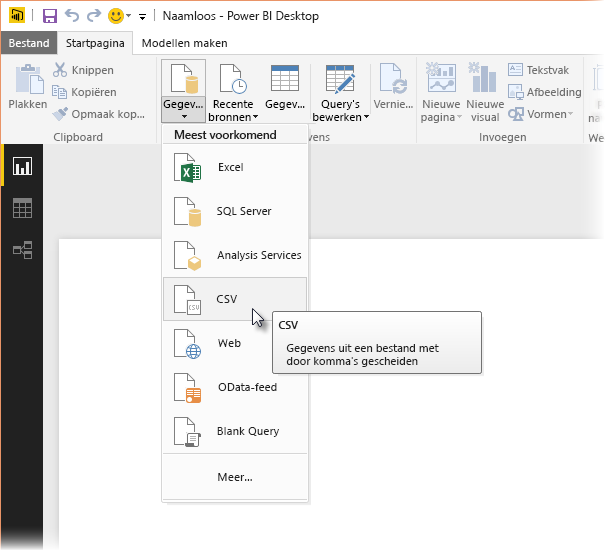
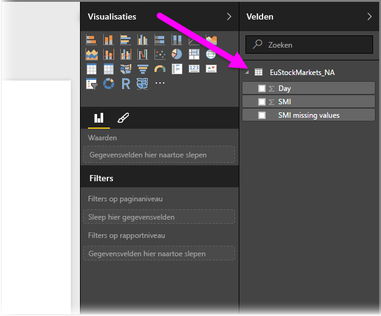
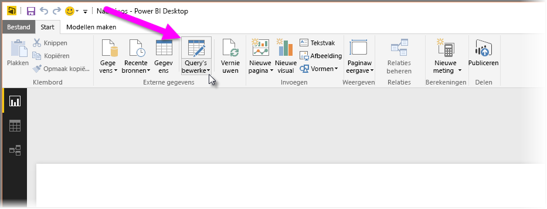
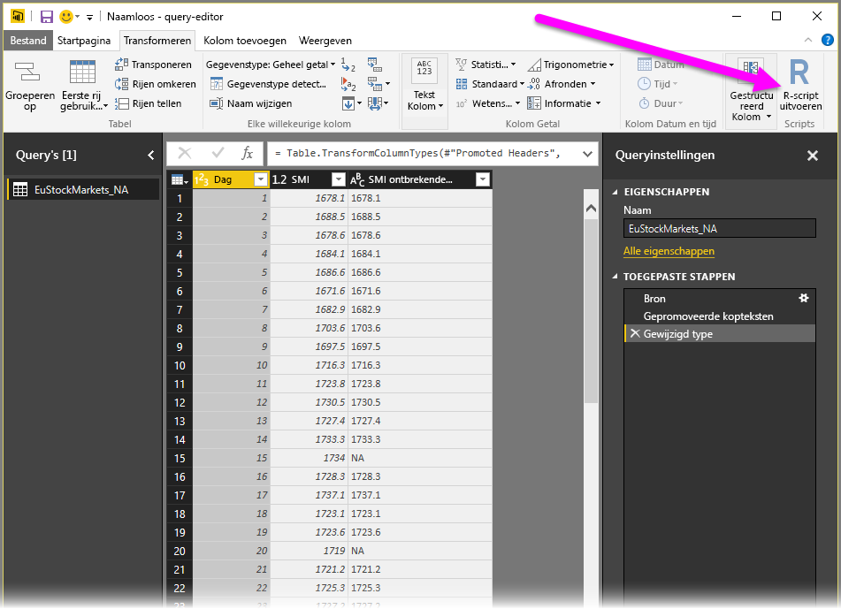
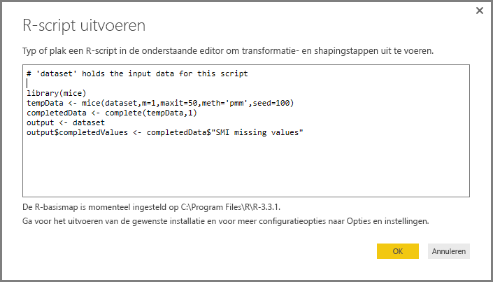
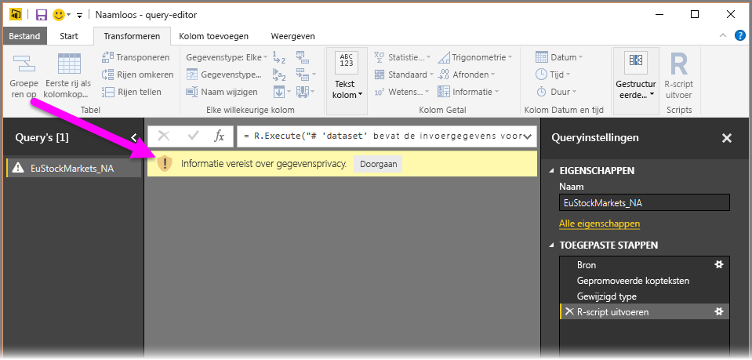
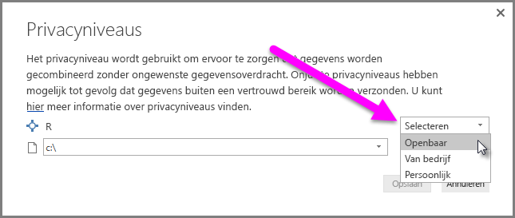
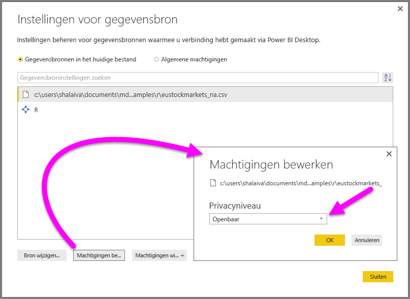

# R gebruiken in Query-editor
U kunt **R**, een programmeertaal die veel door statistici, gegevenswetenschappers en gegevensanalisten wordt toegepast, gebruiken in **Query-editor** van Power BI Desktop. Dankzij de integratie van R in **Query-editor** kunt u met R gegevens opschonen en geavanceerde data shaping en analyses in gegevenssets uitvoeren, met inbegrip van het aanvullen van ontbrekende gegevens, voorspellingen en clustering. **R** is een krachtige programmeertaal en kan in **Query-editor** worden gebruikt om uw gegevensmodel voor te bereiden en rapporten te maken.

## R installeren
Als u **R** wilt gebruiken in **Query-editor** van Power BI Desktop, moet u **R** op de lokale computer installeren. U kunt **R** gratis downloaden en installeren vanaf tal van locaties, waaronder de [Revolution Open-downloadpagina](https://mran.revolutionanalytics.com/download/) en de [CRAN-opslagplaats](https://cran.r-project.org/bin/windows/base/).

## R gebruiken in Query-editor
Bekijk aan de hand van dit voorbeeld hoe u **R** in **Query-editor** kunt gebruiken voor een beursgegevensset, die is gebaseerd op een .CSV-bestand dat u [hier kunt downloaden](http://download.microsoft.com/download/F/8/A/F8AA9DC9-8545-4AAE-9305-27AD1D01DC03/EuStockMarkets_NA.csv) en volgen. Hieronder volgen de stappen voor dit voorbeeld:

1. Laad eerst uw gegevens in **Power BI Desktop**. Laad in dit voorbeeld het bestand *EuStockMarkets_NA.csv* en selecteer **Gegevens ophalen > CSV** in het lint **Start** in **Power BI Desktop**.
   
   
2. Selecteer het bestand en selecteer **Openen**. De CSV wordt nu weergegeven in het dialoogvenster **CSV-bestand**.
   
   
3. Wanneer de gegevens zijn geladen, worden deze weergegeven in het deelvenster **Velden** in Power BI Desktop.
   
   
4. Open **Query-editor** door in het lint **Start** van **Power BI Desktop** **Query's bewerken** te selecteren.
   
   
5. Selecteer op het tabblad **Transformeren** de optie **R-Script uitvoeren**. De editor **R-script uitvoeren** wordt geopend (weergegeven in de volgende stap). U ziet dat er in de rijen 15 en 20 gegevens ontbreken, net als in andere rijen die niet in de volgende afbeelding te zien zijn. De stappen hieronder laten zien hoe R die rijen voor u kan invullen.
   
   
6. Vul in dit voorbeeld de volgende scriptcode in:
   
       library(mice)
       tempData <- mice(dataset,m=1,maxit=50,meth='pmm',seed=100)
       completedData <- complete(tempData,1)
       output <- dataset
       output$completedValues <- completedData$"SMI missing values"
   
   > [!NOTE]
   > Deze scriptcode werkt alleen goed als de bibliotheek *mice* in uw R-omgeving is geïnstalleerd. Als u mice wilt installeren, voert u de volgende opdracht uit in uw R-installatie: |      > install.packages('mice')
   > 
   > 
   
   De code ziet er als volgt uit wanneer deze in het dialoogvenster **R-script uitvoeren** wordt ingevoerd:
   
   
7. Wanneer u **OK** hebt geselecteerd, geeft **Query-editor** een waarschuwing over de privacy van gegevens weer.
   
   
8. R-scripts werken alleen goed in de Power BI-service als alle gegevensbronnen op *openbaar* zijn ingesteld. Zie [Privacyniveaus](desktop-privacy-levels.md) voor meer informatie over privacy-instellingen en de implicaties ervan.
   
   
   
   U ziet een nieuwe kolom in het deelvenster **Velden** met de naam *completedValues*. Er ontbreken een aantal gegevenselementen, bijvoorbeeld in rijen 15 en 18. Bekijk in het volgende gedeelte hoe R hiermee omgaat.
   

Met slechts vijf regels R-script kan **Query-editor** de ontbrekende waarden invullen met behulp van een voorspellend model.

## Visuals maken vanuit R-scriptgegevens
U kunt nu een visual maken om te zien hoe de R-scriptcode met behulp van de bibliotheek *mice* de ontbrekende waarden voltooit, zoals weergegeven in de volgende afbeelding:

Zodra deze visual en eventuele andere visuals die u met behulp van **Power BI Desktop** wilt maken zijn voltooid, kunt u het **Power BI Desktop**-bestand opslaan (als een .pbix-bestand) en vervolgens het gegevensmodel, met inbegrip van bijbehorende R-scripts, in de Power BI-service gebruiken.

> [!NOTE]
> Wilt u een voltooid .pbix-bestand bekijken dat via deze stappen is gemaakt? Dat kan: u kunt het voltooide **Power BI Desktop**-bestand dat in deze voorbeelden wordt gebruikt [hier](http://download.microsoft.com/download/F/8/A/F8AA9DC9-8545-4AAE-9305-27AD1D01DC03/Complete Values with R in PQ.pbix) downloaden.
> 
> 

Zodra u het .pbix-bestand in de Power BI-service hebt geüpload, zijn er nog een aantal stappen nodig om gegevensvernieuwing (in de service) mogelijk te maken en om ervoor te zorgen dat visuals in de service kunnen worden bijgewerkt (visuals worden alleen bijgewerkt als de gegevens toegang tot R hebben). De extra stappen zijn de volgende:

* **Geplande vernieuwing voor de gegevensset inschakelen**: als u geplande vernieuwing wilt inschakelen voor de werkmap die uw gegevensset met R-scripts bevat, bekijkt u [Configuring scheduled refresh](refresh-scheduled-refresh.md) (Geplande vernieuwing configureren). Hierin vindt u ook informatie over **Persoonlijke gateway**.
* **De persoonlijke gateway installeren**: er moet een **persoonlijke gateway** zijn geïnstalleerd op de computer waarop het bestand zich bevindt en waarop R is geïnstalleerd. De Power BI-service heeft toegang tot die werkmap nodig om bijgewerkte visuals opnieuw te genereren. U kunt meer informatie krijgen over het [installeren en configureren van Personal Gateway](personal-gateway.md).

## Beperkingen
Er gelden enkele beperkingen voor query's met R-scripts die zijn gemaakt in **Query-editor**:

* Alle R-gegevensbroninstellingen moeten op *Openbaar* zijn ingesteld, en alle overige stappen in een query gemaakt in **Query-editor** moeten ook openbaar zijn. Om de gegevensbroninstellingen te openen, selecteert u in **Power BI Desktop** **Bestand > Opties en instellingen > Instellingen voor gegevensbron**.
  
  
  
  In het dialoogvenster **Instellingen voor gegevensbron** selecteert u de gegevensbron(nen) en vervolgens **Machtigingen bewerken...**. Controleer of **Privacyniveau** is ingesteld op *Openbaar*.
  
      
* Om geplande vernieuwing van uw R-visuals of gegevensset in te schakelen, moet **Geplande vernieuwing** zijn ingeschakeld en moet er een **persoonlijke gateway** zijn geïnstalleerd op de computer waarop de werkmap en de R-installatie staan. Zie het vorige gedeelte van dit artikel voor koppelingen naar meer informatie over beide vereisten.

U kunt verschillende handelingen uitvoeren met R en aangepaste query's, dus verken uw gegevens en deel ze in zoals u wilt.

