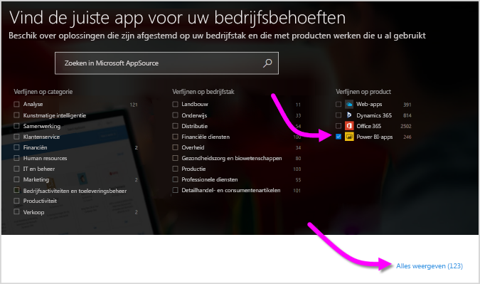
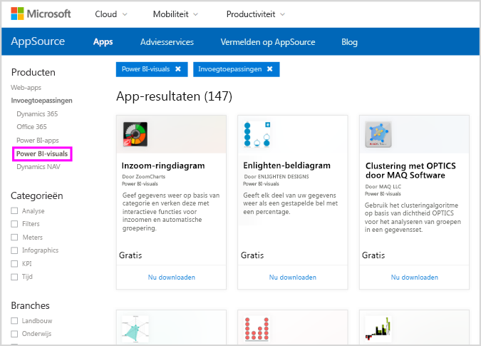
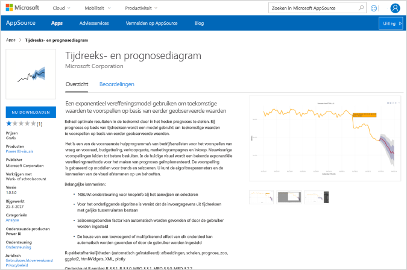
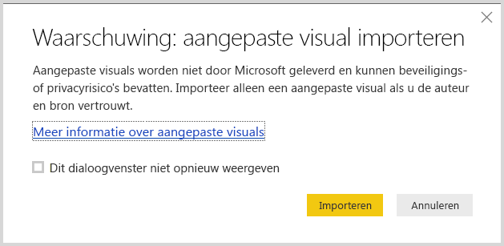
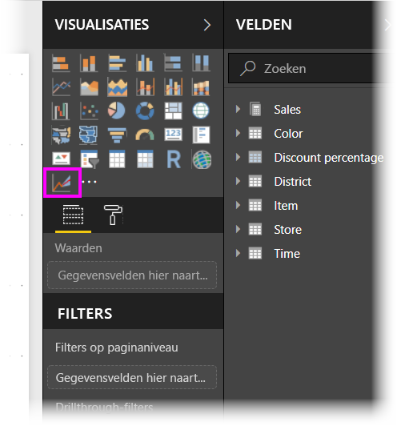
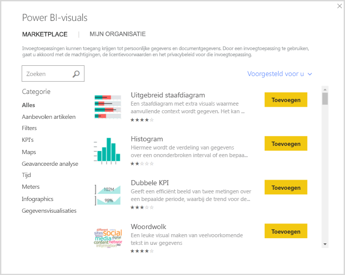

# Met R gemaakte aangepaste visuele elementen gebruiken in Power BI
In **Power BI Desktop** en de **Power BI-service** kunt u met R gemaakte aangepaste visuele elementen gebruiken zonder enige kennis van R of R-scripts. Zo kunt u gebruikmaken van de krachtige visuele analyse-elementen van R, en R-scripts, zonder R te hoeven leren of zelf te moeten programmeren.

Om met R gemaakte aangepaste visuele elementen te gebruiken, selecteert en downloadt u eerst het aangepaste visuele R-element dat u wilt gebruiken vanuit de [**AppSource**](https://appsource.microsoft.com/marketplace/apps?product=power-bi-visuals&page=1)-galerie met **aangepaste visuele elementen** voor Power BI.

In de volgende secties wordt beschreven hoe u met R gemaakte visuele elementen kunt selecteren, laden en gebruiken in **Power BI Desktop**.

## Met R gemaakte aangepaste visuele elementen gebruiken
Als u met R gemaakte aangepaste visuele elementen wilt gebruiken, moet u deze downloaden uit de bibliotheek met **aangepaste visuele elementen**. Vervolgens kunt u de visuele elementen gebruiken zoals elk ander type visueel element in **Power BI Desktop**. Er zijn twee manieren om aangepaste visuele elementen op te halen: u kunt ze downloaden van de website van **AppSource** of zoeken en ophalen in **Power BI Desktop**. 

### Aangepaste visuele elementen ophalen van AppSource

Hieronder worden de stappen beschreven voor het bladeren en selecteren van visuele elementen van de website van **AppSource**:

1. Navigeer naar de bibliotheek met [visuele elementen voor Power BI](https://appsource.microsoft.com/marketplace/apps?product=power-bi-visuals&page=1) op [https://appsource.microsoft.com](https://appsource.microsoft.com/). Schakel het selectievakje *Power BI-apps* onder *Verfijnen op product* in, en selecteer de koppeling **Alles weergeven**.
   
   

2. Selecteer **Visuele elementen voor Power BI** in de lijst met invoegtoepassingen in het linkerdeelvenster. 

   

3. Selecteer het gewenste **visuele element** in de galerie. Er wordt een pagina weergegeven met een beschrijving van het visuele element. Selecteer de knop **Nu downloaden** om het element te downloaden.
   
   > [!NOTE]
> Om te kunnen ontwerpen in **Power BI Desktop**, moet R zijn geïnstalleerd op uw lokale computer. Maar om een met R gemaakt visueel element in de **Power BI-service** te bekijken hoeft R *niet* lokaal geïnstalleerd te zijn.
   > 
   > 
   
   
   
   U hoeft R niet te installeren R om met R gemaakte aangepaste visuele elementen te kunnen gebruiken in de **Power BI-service**. Als u echter met R gemaakte aangepaste visuele elementen wilt gebruiken in **Power BI Desktop**, *moet* u R installeren op uw lokale computer. U kunt R downloaden van de volgende websites:
   
   * [CRAN](https://cran.r-project.org/)
   * [MRO](https://mran.microsoft.com/)

4. Nadat u het visuele element hebt gedownload (zoals elk ander bestand dat u downloadt met uw browser), gaat u naar **Power BI Desktop** en klikt u met de rechtermuisknop op het beletselteken (...) in het deelvenster **Visualisaties**. Vervolgens selecteert u **Importeren vanuit bestand**.
   
   
5. Er wordt een waarschuwing weergegeven over het importeren van aangepaste visuele elementen, die eruitziet als de volgende afbeelding:
   
   
6. Navigeer naar de locatie waar het bestand van het visuele element is opgeslagen en selecteer het bestand. Aangepaste visuele elementen hebben de extensie .pbiviz in **Power BI Desktop**.
   
   
7. Wanneer u terug gaat naar Power BI Desktop, kunt u het nieuwe visuele element zien in het deelvenster **Visualisaties**.
   
   
8. Wanneer u het nieuwe visuele element importeert (of een rapport opent dat een met R gemaakt aangepast visueel element bevat), worden de vereiste R-pakketten in **Power BI Desktop** geïnstalleerd.
   
   

Vervolgens kunt u in **Power BI Desktop** gegevens aan het visuele element toevoegen, net zoals bij elk ander visueel element in Power BI Desktop. Als u klaar bent, kunt u het voltooide visuele element weergeven op het canvas. In het volgende voorbeeld is het met R gemaakte visuele element **Forecasting** (prognose) gebruikt in combinatie met het visuele element aan de linkerkant, de verwachte geboortecijfers van de Verenigde Naties (VN).

Zoals bij elk ander visueel element in **Power BI Desktop**, kunt u dit rapport, inclusief de met R gemaakte visuele elementen, naar de **Power BI-service** publiceren en met anderen delen.

Bezoek de bibliotheek regelmatig, want er worden voortdurend nieuwe visuele elementen aan toegevoegd.

### Aangepaste visuele elementen ophalen vanuit **Power BI Desktop**

U kunt ook aangepaste visuele elementen ophalen vanuit **Power BI Desktop**. Klik in **Power BI Desktop** met de rechtermuisknop op het beletselteken (...) in het deelvenster **Visualisaties** en selecteer **Importeren uit de store**.
   
   

Het dialoogvenster **Aangepaste visuals van Power BI** wordt weergegeven. In dit dialoogvenster kunt u lijst met beschikbare aangepaste visuele elementen doorbladeren en de gewenste elementen selecteren. U kunt zoeken op naam, een categorie selecteren, of gewoon bladeren in de lijst met beschikbare visuele elementen. Wanneer u klaar bent, selecteert u **Toevoegen** om de aangepaste visuele elementen toe te voegen aan **Power BI Desktop**.

## Met R gemaakte aangepaste visuele elementen bijdragen
Als u zelf in R visuele elementen hebt gemaakt voor gebruik in rapporten, kunt u die delen met de wereld door uw aangepaste visuele element(en) toe te voegen aan de **galerie met aangepaste visuele elementen**. Bijdragen moeten worden aangeleverd via GitHub. Het proces daarvoor wordt beschreven op de volgende locatie:

* [Bijdragen aan de galerie met aangepaste visuele elementen die met R zijn gemaakt](https://github.com/Microsoft/PowerBI-visuals#building-r-powered-custom-visual-corrplot)

## Problemen met aangepaste visuele elementen die met R zijn gemaakt oplossen
Met R gemaakte aangepaste visuele elementen moeten voldoen aan bepaalde afhankelijkheden, anders werken ze niet correct. Als met R gemaakte aangepaste visuele elementen niet correct worden uitgevoerd of geladen, heeft dat probleem meestal een van de volgende oorzaken:

* De R-engine ontbreekt
* Fouten in het R-script waarop het visuele element is gebaseerd
* R-pakketten ontbreken of zijn verouderd

In de volgende sectie wordt beschreven welke stappen u kunt ondernemen om het probleem op te lossen.

### Ontbrekende of verouderde R-pakketten
Wanneer u probeert een met R gemaakt aangepast visueel element te installeren, kunnen er fouten optreden als sommige R-pakketten ontbreken of als deze zijn verouderd. Veelvoorkomende oorzaken hiervan zijn:

* De installatie van R is incompatibel met het R-pakket
* R kan geen verbinding met internet maken vanwege een firewall, anti-virussoftware of proxy-instellingen
* De internetverbinding is traag of er is een probleem met de internetverbinding

Het Power BI-team werkt actief aan oplossingen voor deze problemen voordat ze zich bij u voordoen. De volgende versie van Power BI Desktop bevat updates om deze problemen te verhelpen. Tot die tijd kunt u een of meer van de volgende stappen uitvoeren om de kans op problemen te verminderen:

1. Verwijder het aangepaste visuele element en installeer het opnieuw. Hierdoor worden ook de R-pakketten opnieuw geïnstalleerd.
2. Als de installatie van R niet up-to-date is, voert u een upgrade van de installatie van R uit. Vervolgens verwijdert u het aangepaste visuele element en installeert u het opnieuw, zoals beschreven in de vorige stap.
   
   * Ondersteunde versies van R worden vermeld in de beschrijving van elk met R gemaakt aangepast visueel element, zoals weergegeven in de volgende afbeelding.
     
     > [!NOTE]
> U kunt de oorspronkelijke installatie van R behouden en Power BI Desktop alleen koppelen aan de huidige versie die u installeert. Ga naar **Bestand > Opties en instellingen > Opties > R-script**.
3. Installeer R-pakketten handmatig, met behulp van een R-console. De stappen voor deze methode luiden als volgt:
   
   a.  Download het installatiescript voor het met R gemaakte visuele element en sla dat bestand op een lokaal station op.
   
   b.  Voer de volgende opdrachtregel uit vanuit de R-console:
   
       > source(“C:/Users/david/Downloads/ScriptInstallPackagesForForecastWithWorkarounds.R”)    
   
   Typische standaardlocaties voor installatie zijn de volgende:
   
       c:\Program Files\R\R-3.3.x\bin\x64\Rterm.exe (for CRAN-R)
       c:\Program Files\R\R-3.3.x\bin\x64\Rgui.exe (for CRAN-R)
       c:\Program Files\R\R-3.3.x\bin\R.exe (for CRAN-R)
       c:\Program Files\Microsoft\MRO-3.3.x\bin\R.exe (for MRO)
       c:\Program Files\Microsoft\MRO-3.3.x\bin\x64\Rgui.exe (for MRO)
       c:\Program Files\RStudio\bin\rstudio.exe (for RStudio)
4. Als de vorige stappen niet werken, probeert u het volgende:
   
   a. Gebruik **R Studio** en voer stap 3 b. uit, zoals hierboven beschreven (voer de scriptopdrachtregel uit vanuit de R-console).
   
   b. Als de vorige stap niet werkt, gaat u naar **Tools > Global Options > Packages** in **R Studio**, en schakelt u het selectievakje **Use Internet Explorer library/proxy for HTTP** in. Voer vervolgens stap 3 b. nogmaals uit (zie de vorige stappen).

## Volgende stappen
Raadpleeg de volgende aanvullende informatie over R in Power BI.

* [Galerie met aangepaste visuele elementen voor Power BI](https://app.powerbi.com/visuals/)
* [R-scripts uitvoeren in Power BI Desktop](desktop-r-scripts.md)
* [Visuele R-elementen maken in Power BI Desktop](desktop-r-visuals.md)
* [Een externe R IDE met Power BI gebruiken](desktop-r-ide.md)

