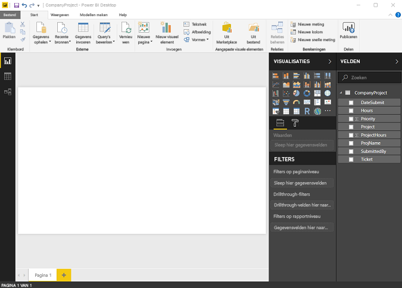
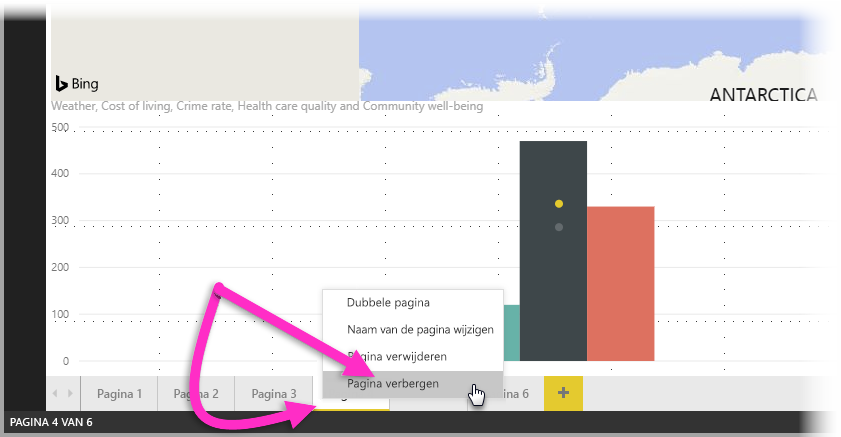
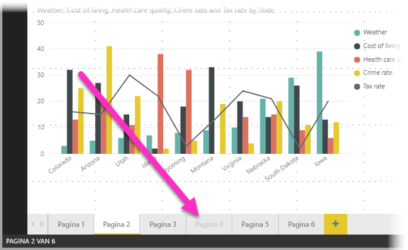

# Rapportweergave in Power BI Desktop
Als u met Power BI hebt gewerkt, dan weet u hoe eenvoudig het is om rapporten te maken met dynamische perspectieven en inzichten in uw gegevens. Power BI heeft nog meer geavanceerde functies in Power BI Desktop. Met Power BI Desktop kunt u geavanceerde query's uitvoeren, een mashup maken van gegevens uit meerdere bronnen, relaties tussen tabellen maken en nog veel meer.

Power BI Desktop omvat een **rapportweergave**, waarin u een willekeurig aantal rapportpagina's met visuele elementen kunt maken. De rapportweergave kent vrijwel hetzelfde ontwerp als de bewerkweergave van een rapport in de Power BI-service. U kunt er visualisaties verplaatsen, kopiëren en plakken, samenvoegen enzovoort.

Het verschil is dat u in Power BI Desktop met uw query's kunt werken en gegevens kunt modelleren om ervoor te zorgen dat uw rapporten de beste inzichten geven in uw gegevens. U kunt uw Power BI Desktop-bestand vervolgens opslaan waar u wilt, bijvoorbeeld op de lokale harde schijf of in de cloud.

## Laten we dit eens bekijken.
Wanneer u de eerste keer uw gegevens in Power BI Desktop laadt, ziet u de **rapportweergave** met een leeg canvas.

U kunt schakelen tussen de **rapportweergave**, **gegevensweergave** en **relatieweergave** door de pictogrammen in de linkernavigatiebalk te selecteren:

Zodra u gegevens hebt toegevoegd, kunt u velden aan een nieuw visueel element op het canvas toevoegen.

Als u het visualisatietype wilt wijzigen, kunt u dit selecteren in de groep **Visualisatie** in het lint. U kunt ook met de rechtermuisknop klikken en een ander type selecteren via het pictogram **Visualisatietype wijzigen**.

> [!TIP]
> Experimenteer met verschillende visualisatietypen. Het is belangrijk dat uw visuele elementen de informatie over uw gegevens duidelijk naar voren brengen.
> 
> 

Een rapport bevat ten minste één lege pagina om mee te beginnen. De pagina's worden links van het canvas in de navigatiebalk weergegeven. U kunt allerlei soorten visuele elementen aan een pagina toevoegen, maar het is belangrijk dat u er niet te veel gebruikt. Te veel visuele elementen op een pagina maken deze onoverzichtelijk, waardoor de juiste informatie lastig te vinden is. U kunt nieuwe pagina's toevoegen aan het rapport. U klikt in het lint gewoon op **Nieuwe pagina**.

Als u een pagina wilt verwijderen, klikt u op de **x** op het tabblad van de pagina onder aan de rapportweergave.

> [!NOTE]
> Rapporten en visuele elementen kunnen in Power BI Desktop niet worden vastgemaakt aan een dashboard. Als u dat wilt doen, moet u [publiceren vanuit Power BI Desktop](desktop-upload-desktop-files.md) (Engelstalig) naar uw Power BI-site.

## Rapportpagina’s verbergen

Als u een rapport maakt, kunt u ook pagina's uit een rapport verbergen. Dit kan nuttig zijn als u onderliggende gegevens of visuals in een rapport wilt maken, maar u niet wilt dat anderen deze pagina's kunnen zien, bijvoorbeeld als u tabellen of ondersteunende visuals maakt die ook voor andere rapportpagina’s worden gebruikt. Er zijn veel andere creatieve redenen te bedenken waarom u een rapportpagina zou willen maken die u vervolgens wilt verbergen voor een rapport dat u wilt publiceren. 

Een rapportpagina verbergen is eenvoudig. Klik met uw rechtermuisknop op het tabblad Rapportpagina en selecteer **Verbergen** in het menu dat dan verschijnt.

Er zijn enkele overwegingen waarmee u rekening moet houden als u een rapportpagina verbergt:

* In **Power BI Desktop** kunt u nog steeds een weergave van een verborgen rapport zien, zelfs als de titel van de pagina in het grijs wordt weergegeven. In de volgende afbeelding is pagina 4 verborgen.

    

* U kunt een verborgen rapportpagina *niet* zien als u het rapport weergeeft met de **Power BI-service**.

* Een rapportpagina verbergen is *geen* veiligheidsmaatregel. Gebruikers kunnen nog steeds toegang krijgen tot de pagina en de inhoud is nog steeds toegankelijk door middel van detailanalyse of andere methoden.

* Als een pagina in de Weergavemodus verborgen is, worden er geen navigatiepijlen weergegeven.

