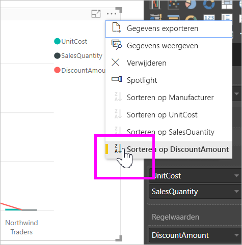
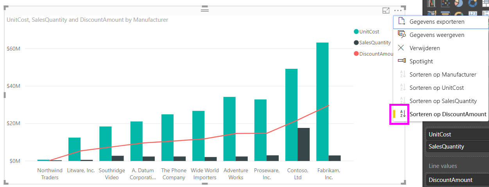
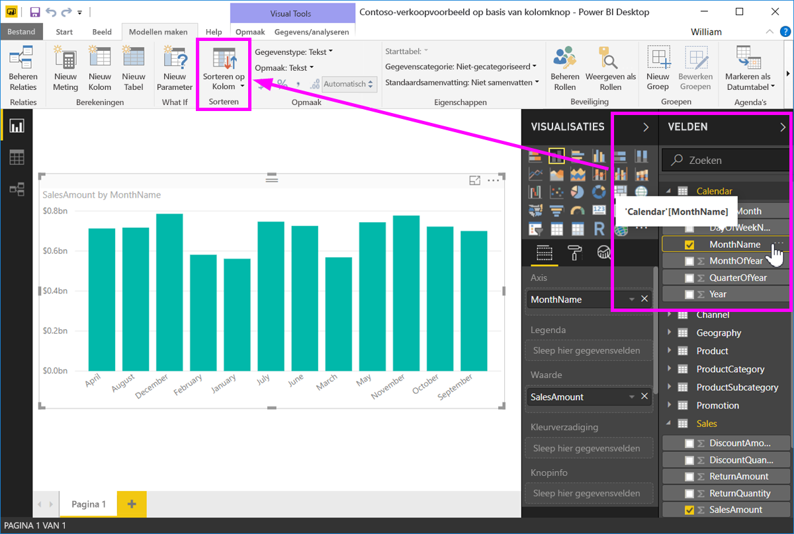
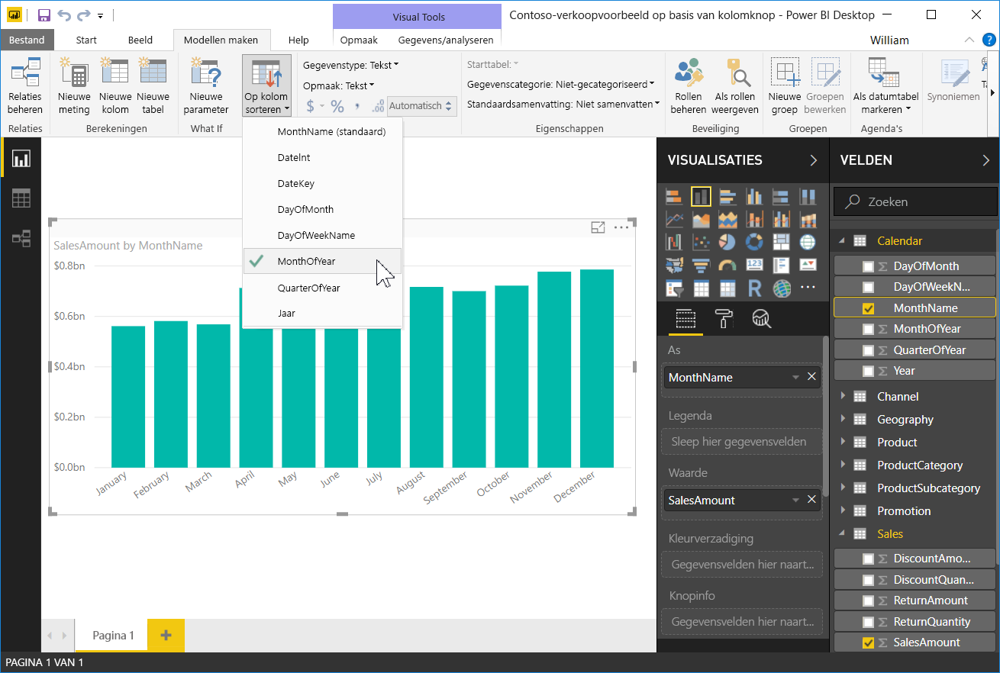
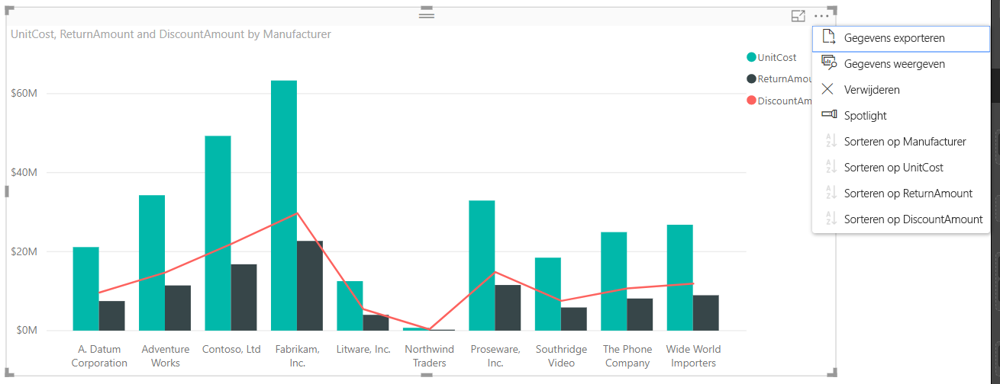

# Op kolom sorteren in Power BI Desktop
In **Power BI Desktop** en de **Power BI-service** kunt u de weergave van een visueel element wijzigen door deze op andere gegevensvelden te sorteren. Als u de sortering van een visueel element wijzigt, kunt u de informatie markeren die u wilt overbrengen en ervoor zorgen dat het visuele element de trend (of de nadruk) die u wilt overbrengen weergeeft.

Of u nu numerieke gegevens (zoals verkoopcijfers) of tekstgegevens (zoals provincienamen) gebruikt, u kunt uw visualisaties sorteren zoals u wilt en ze eruit laten zien zoals u wilt.  **Power BI** biedt veel flexibiliteit voor het sorteren en snelle menu's die u kunt gebruiken. Op een visueel element selecteert u het beletseltekenmenu (...) en vervolgens **Sorteren op**. Selecteer vervolgens het veld waarop u wilt sorteren, zoals wordt weergegeven in de volgende afbeelding.

## Meer diepgang en een voorbeeld
We nemen een voorbeeld met meer diepgang en bekijken hoe dit werkt in **Power BI Desktop**.

De volgende visualisatie geeft de top 15 staten weer wat het weer betreft (meeste zonnige dagen met een cijfer van 1 tot 50, waarbij nummer 1 de meeste zonnige dagen heeft). De visualisatie ziet er als volgt uit voordat we gaan sorteren.

Het visuele element is momenteel gesorteerd op **Kosten van levensonderhoud**. Dit kunnen we zien doordat de kleur overeenkomt met de aflopende balken in de legenda, maar er is een betere manier om de huidige sorteerkolom te bepalen. Dit is het dialoogvenster **Sorteren op**, dat beschikbaar is in het beletseltekenmenu (...) in de rechterbovenhoek van het visuele element. Wanneer we de weglatingstekens selecteren, zien we het volgende:

Er zijn een aantal items om op te letten in het menu dat verschijnt wanneer u het beletselteken selecteert:

* De gele balk naast **Kosten van levensonderhoud**, en het feit dat **Kosten van levensonderhoud** dikgedrukt is
* Het kleine pictogram naast de woorden **Sorteren op**, waarin u **Z/A** ziet (Z boven A) en een pijl omlaag.

We behandelen deze items onafhankelijk van elkaar in de volgende twee secties.

## Selecteren welke kolom moet worden gebruikt voor het sorteren
U hebt de gele balk naast **Kosten van levensonderhoud** in het menu **Sorteren op** opgemerkt. Hiermee wordt aangegeven dat het visuele element de kolom **Kosten van levensonderhoud** gebruikt om te sorteren. Op een andere kolom sorteren is eenvoudig. Selecteer het beletselteken om het menu **Sorteren op** weer te geven. Selecteer vervolgens een andere kolom. Eenvoudiger kan niet.

In de volgende afbeelding hebben we **Welzijn van gemeenschap** geselecteerd als de kolom waarop we willen sorteren. Deze kolom is een van de lijnen op het visuele element, in plaats van een van de balken. Hier ziet u het resultaat nadat we **Welzijn van gemeenschap** hebben geselecteerd.

U ziet hoe het visuele element is gewijzigd. De waarden zijn gerangschikt op de hoogste 'Welzijn van gemeenschap'-waarde (in dit geval RI voor Rhode Island) voor de staten die zijn opgenomen in dit visuele element. AZ (voor Arizona) heeft de laagste waarde. Houd er rekening mee dat de algehele grafiek nog steeds slechts de 15 statussen bevat met de meeste zonnige dagen. We hebben ze alleen gerangschikt op basis van een andere kolom die is opgenomen in het visuele element.

Maar wat moeten we doen als we de staten oplopend willen sorteren, in plaats van aflopend? In de volgende sectie wordt beschreven hoe gemakkelijk dit is.

## De sorteervolgorde selecteren (laag naar hoog, hoog naar laag)
Als we nog eens kijken naar het menu **Sorteren op** in de vorige afbeelding, zien we dat het pictogram naast **Sorteren op** **Z/A** (Z boven A) weergeeft. Kijk maar eens:

Wanneer **Z/A** wordt weergegeven, betekent dit dat het visuele element dat is gesorteerd op de geselecteerde kolom wordt weergegeven van de hoogste naar laagste waarde. Wilt u dit wijzigen? Geen probleem. Tik of klik eenvoudigweg op het pictogram **Z/A**. Hierdoor wordt de sorteervolgorde gewijzigd in **A/Z** en wordt het visuele element (op basis van de geselecteerde kolom) gesorteerd van de laag naar de hoogste waarde.

Hier volgt hetzelfde visuele element, ditmaal nadat we hebben getikt op het pictogram **Z/A** in het menu **Sorteren op** om de volgorde te wijzigen. U ziet dat AZ (Arizona) nu als eerste wordt weergegeven en RI (Rhode Island) als laatste. Dit is het tegenovergestelde van de vorige sorteeroptie.

U kunt sorteren op elke kolom die is opgenomen in het visuele element. We kunnen heel eenvoudig Weer selecteren als de kolom waarop we willen sorteren, en **Z/A** in het menu **Sorteren op** selecteren om de staten met de meeste zonnige dagen als eerste weer te geven. De hoogste waarde bij Weer staat in dit gegevensmodel gelijk aan het aantal zonnige dagen. Hierbij kunnen we de andere kolommen in het visuele element behouden, ongeacht de manier waarop ze van toepassing zijn op de staat. Hier ziet u het visuele element met deze instellingen.

## Sorteren met de knop Sorteren op kolom
Er is een andere manier om uw gegevens te sorteren, en dat doet u met behulp van de knop **Sorteren op kolom** in het lint **Modelleren**.

Als u deze aanpak voor het sorteren gebruikt, moet u een kolom selecteren in het deelvenster **Velden** en vervolgens de knop **Sorteren op kolom** selecteren om te kiezen hoe (op welke kolom) u het visuele element wilt sorteren. U moet de kolom (veld) die u wilt sorteren selecteren in het deelvenster **Velden** om de knop **Sorteren op kolom** te activeren. Anders is deze knop inactief.

Laten we een veelvoorkomend voorbeeld bekijken. U hebt gegevens van elke dag van de week en u wilt ze sorteren op chronologische volgorde. U doet dit met de volgende stappen.

1. U ziet allereerst dat de knop **Sorteren op kolom** inactief is (lichter gekleurd) wanneer het visuele element is geselecteerd, maar er is geen kolom is geselecteerd in het deelvenster **Velden**.
   
   
2. Wanneer we de kolom selecteren waarop we wilt sorteren in het deelvenster **Velden**, wordt de knop **Sorteren op kolom** geactiveerd.
   
   
3. Nu het visuele element is geselecteerd, kunnen we *Dag van week* selecteren, in plaats van de standaardoptie (*naam van dag*). Het visuele element wordt nu gesorteerd in de volgorde die we willen: op de dag van de week.
   
   

Dat is alles. Houd er rekening mee dat u een kolom moet selecteren in het deelvenster **Velden** om de knop **Sorteren op kolom** te activeren.

## De standaardkolom voor sorteren opnieuw instellen
U kunt sorteren op elke kolom die u maar wilt, maar het kan gebeuren dat u het visuele element weer wilt sorteren op basis van de standaardkolom. Geen enkel probleem. Voor een visueel element waarvoor een sorteerkolom is geselecteerd (geselecteerde sorteerkolom heeft een gele balk ernaast in het menu **Sorteren op**, zoals we al hebben gezien), opent u het menu **Sorteren op** en selecteert u die kolom opnieuw. De visualisatie wordt nu weergegeven op basis van de standaard sorteerkolom.

Dit is bijvoorbeeld het vorige diagram:

Wanneer we teruggaan naar het menu en **Weer** opnieuw selecteren, wordt het visuele element standaard op alfabetische volgorde gesorteerd op **Staatcode**, zoals wordt weergegeven in de volgende afbeelding.

U hebt zoveel opties voor het sorteren van uw visuele elementen dat het maken van de grafiek of afbeelding die u wilt kinderspel is.

