# Knopinfo maken op basis van rapportpagina’s in Power BI Desktop (voorbeeld)
U kunt visueel uitgebreide **tooltips voor rapporten** maken die worden weergegeven wanneer u de muisaanwijzer over visuele elementen beweegt, op basis van rapportpagina's die u maakt in **Power BI Desktop**. Wanneer u een rapportpagina maakt die als knopinfo fungeert, kunnen uw aangepaste knopinfo visuele elementen, afbeeldingen en ongeacht welke andere verzameling van items bevatten die u in de rapportpagina maakt. 

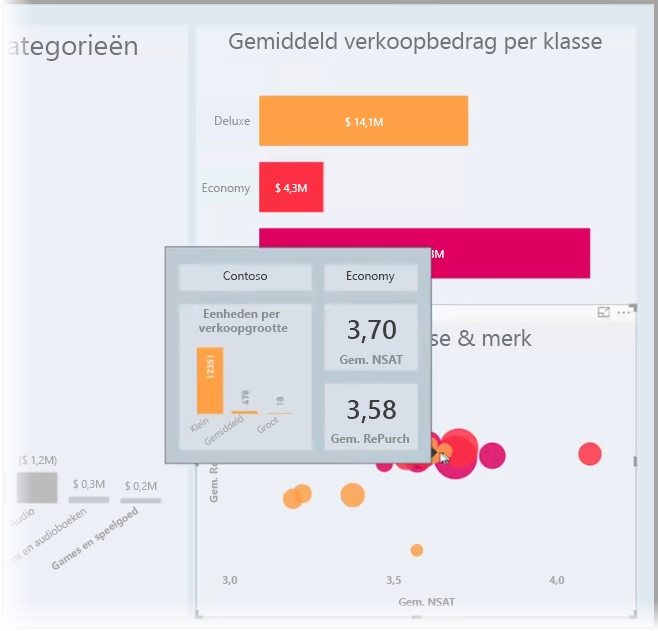

U kunt zoveel knopinfopagina's maken als u wilt. Elke knopinfopagina kan worden gekoppeld aan een of meer velden in uw rapport, zodat wanneer u de muisaanwijzer over een visueel element beweegt dat deel uitmaakt van het geselecteerde veld, de knopinfo wordt weergegeven die u hebt gemaakt op de knopinfopagina wanneer u de muisaanwijzer over het visuele element beweegt, gefilterd op basis van het datapoint waarover uw muis beweegt. 

U kunt allerlei interessante dingen doen met rapportknopinfo. Laten we eens kijken hoe u knopinfo kunt maken en wat u moet doen om ze te configureren.

### Het tooltips-voorbeeld inschakelen 
Aangezien rapportknopinfo momenteel in preview is, moet u ze inschakelen voordat u een rapportknopinfo kunt maken. Als u de preview-functie van rapportknopinfo wilt inschakelen, selecteert u **Bestand > Opties en Instellingen > Opties > Previewfuncties** in Power BI Desktop en schakelt u vervolgens het selectievakje naast **Bladwijzers** in. 

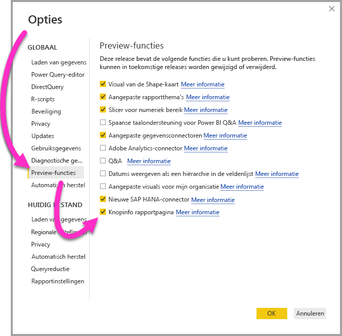

U moet **Power BI Desktop** opnieuw opstarten nadat u de selectie hebt gemaakt om de preview-versie in te schakelen van de knopinfo rapport.

## Een pagina voor rapportknopinfo maken
Om te beginnen, moet u een nieuwe rapportpagina maken door op de **+**-knop te klikken aan de onderkant van het **Power BI Desktop**-canvas in het gedeelte met tabbladen. De knop bevindt zich naast de laatste pagina in het rapport. 

De knopinfo kan van elke grootte zijn, maar houd er rekening mee dat de knopinfo over het rapportcanvas wordt bewogen. U wilt deze daarom redelijk klein houden. In de **indeling** deelvenster in de **paginagrootte** -kaart, ziet u een nieuwe pagina de grootte van de sjabloon *Knopinfo*. Dit biedt een canvasgrootte voor de rapportpagina die gereed is voor uw knopinfo.

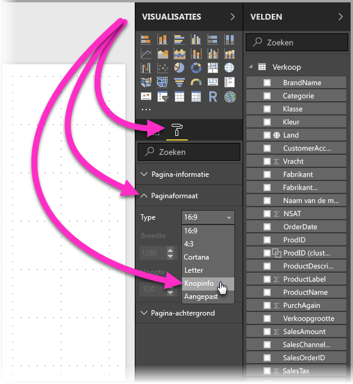

Standaard past **Power BI Desktop** uw rapportcanvas aan op de beschikbare ruimte op de pagina. Dit is vaak goed, maar niet in het geval van knopinfo. Als u een beter idee en zicht wilt hebben hoe de knopinfo eruit komt te zien wanneer u klaar bent, kunt u de **paginaweergave** wijzigen in normale grootte. 

Hiertoe selecteert u het tabblad **Weergave** in het lint. Selecteer **Paginaweergave > Werkelijke grootte**, zoals wordt weergegeven in de volgende afbeelding.

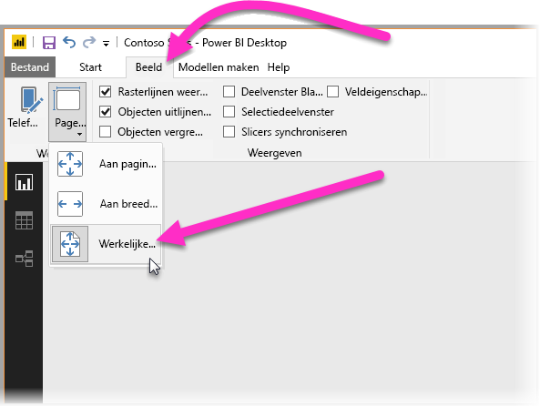

U kunt de rapportpagina ook een naam geven zodat het bedoeling duidelijk is. Selecteer de kaart **Paginagegevens** in het deelvenster **Indeling**, typ dan de naam in het veld **Naam** die u er aantreft. In de volgende afbeelding is de naam van de rapportknopinfo *Knopinfo 1*, maar u kunt gerust uw knopinfo een meer geïnspireerde naam geven.

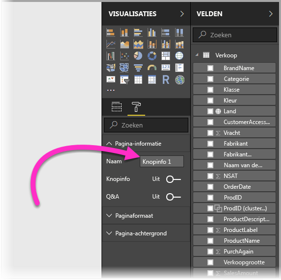

Van hieruit kunt u ongeacht welke visuele elementen maken die u wilt hebben weergegeven in uw knopinfo. In de volgende afbeelding staan twee kaarten en een gegroepeerd staafdiagram op de knopinfopagina, samen met een achtergrondkleur voor de pagina zelf, en de achtergronden voor alle visuele elementen, zodat deze het gewenste uiterlijk krijgt.

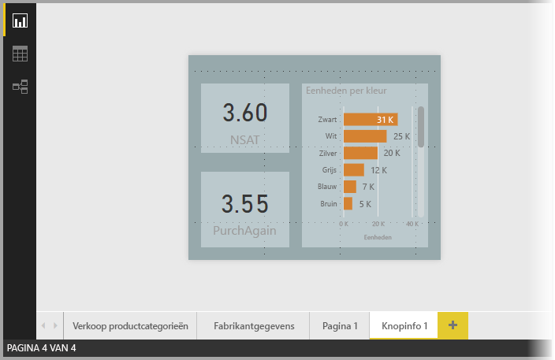

Er zijn meer stappen die u moet uitvoeren voordat de knopinfo rapportpagina gereed is om te werken als knopinfo. U moet enkele configuraties instellen voor de knopinfopagina, zoals beschreven in de volgende sectie. 

## Uw knopinfo rapportpagina configureren

Zodra u de knopinfo rapportpagina hebt gemaakt, moet u de pagina configureren om deze door **Power BI Desktop** te laten registreren als knopinfo en om ervoor te zorgen dat deze wordt weergegeven bij de juiste visuele elementen.

Allereerst moet u de schuifregelaar **Knopinfo** op **Aan** zetten in de kaart **Paginagegevens** om van de pagina een knopinfo maken. 

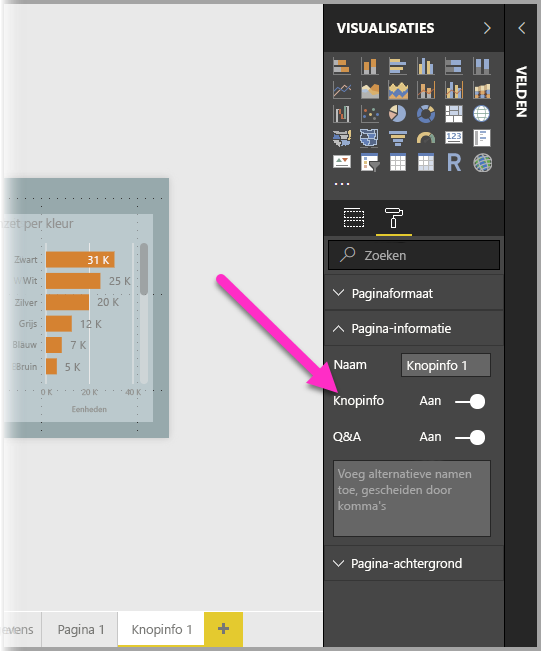

Zodra deze schuifregelaar is ingesteld op Aan, geeft u de velden op waarvoor u wilt dat de rapportknopinfo moet worden weergegeven. De knopinfo voor visuele elementen die deel uitmaken van het veld dat u opgeeft, wordt weergegeven. U geeft op welk veld/welke velden van toepassing zijn door het/deze naar de bucket **Knopinfovelden** te slepen, die te vinden is in de sectie **Velden** van het deelvenster **Visualisaties**. In de volgende afbeelding is het veld *SalesAmount* naar de bucket **Knopinfovelden** gesleept.

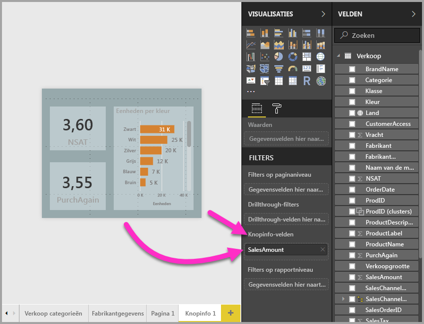
 
U kunt categorische en numerieke velden in de bucket **Knopinfovelden** opnemen, met inbegrip van afmetingen.

Zodra dit is voltooid, wordt de door u gemaakte knopinfo rapportpagina gebruikt als knopinfo in visuele elementen in het rapport met velden die u in de bucket **Knopinfovelden** hebt geplaatst, waardoor de standaardknopinfo van Power BI wordt vervangen.

## Een rapportknopinfo handmatig instellen

Naast het maken van de knopinfo die automatisch wordt weergegeven wanneer met de muiswijzer over een visueel element wordt bewogen dat het opgegeven veld bevat, kunt u handmatig een knopinfo instellen. 

Een visueel element dat ondersteuning biedt voor rapportknopinfo beschikt nu over een kaart **Knopinfo** in het deelvenster **Opmaak**. 

Als u handmatig een knopinfo instelt, selecteert u het visuele element waarvoor u de handmatige knopinfo wilt opgeven. Vervolgens selecteert u in het deelvenster **Visualisaties** de sectie **Opmaak** en vouwt u de kaart **Knopinfo** uit.

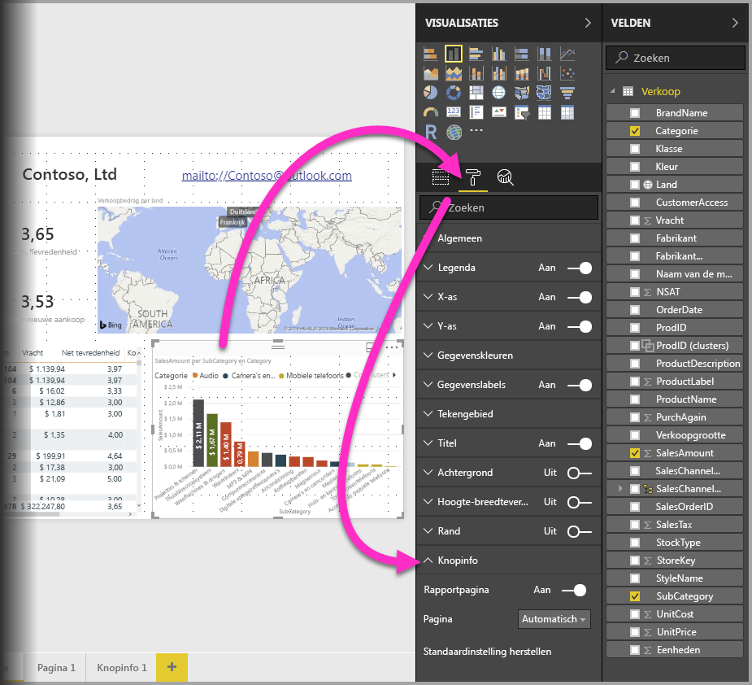

Selecteer daarna in de vervolgkeuzelijst **Pagina** de knopinfopagina die u wilt gebruiken voor het geselecteerde visuele element. Let op dat alleen rapportpagina's die zijn opgegeven als **knopinfo**pagina's in het dialoogvenster worden weergegeven.

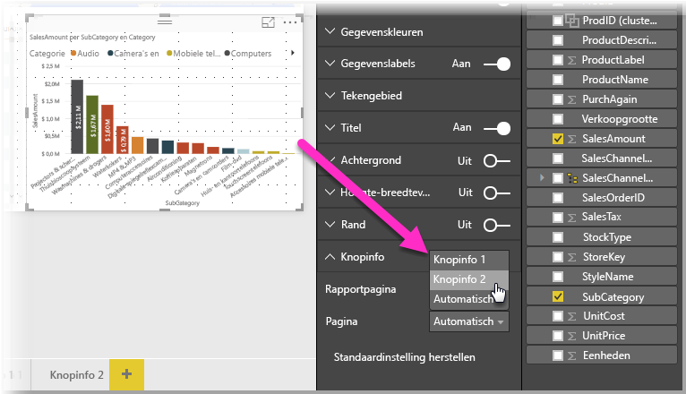

De mogelijkheid om knopinfo handmatig in te stellen biedt vele toepassingen. U kunt een lege pagina voor knopinfo instellen en hiermee de standaardselectie voor Power BI knopinfo overschrijven. Een andere toepassing is wanneer u niet wilt dat de knopinfo wordt gebruikt die automatisch door Power BI wordt geselecteerd. Als u bijvoorbeeld een visueel element hebt dat twee velden bevat, en beide velden beschikken over een bijbehorende knopinfo, selecteert Power BI slechts één om weer te geven. Misschien wilt u niet dat zoiets het geval is, dus kunt u handmatig selecteren welke knopinfo moet worden weergegeven.

## Herstellen van de standaardknopinfo

Als u een handmatige knopinfo voor een visueel element maakt, maar u besluit dat u in plaats daarvan de standaardknopinfo wilt, kunt u altijd terugkeren naar de standaardknopinfo die Power BI biedt. Hiervoor hoeft u, als u een visueel element hebt geselecteerd en de kaart **Knopinfo** hebt uitgevouwen, slechts *Automatisch* te selecteren in de vervolgkeuzelijst **Pagina** als u wilt teruggaan naar de standaardknopinfo.

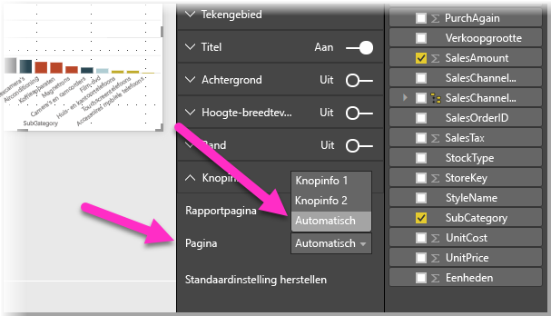

## Aangepaste rapportknopinfo en lijndiagrammen

Er zijn enkele overwegingen waarmee u rekening moet houden wanneer uw rapportknopinfo communiceert met visuele elementen in de vorm van lijndiagrammen, en met visuele elementen bij het kruislings markeren.

### Rapportknopinfo en lijndiagrammen

Wanneer een rapportknopinfo wordt weergegeven voor een lijndiagram, wordt slechts één knopinfo voor alle lijnen in het diagram weergegeven. Dit is vergelijkbaar met het gedrag van standaardknopinfo voor lijndiagrammen, die tevens slechts één knopinfo weergeeft. 

Dit is omdat het veld in de legenda niet wordt doorgelaten als filter voor de knopinfo. In de volgende afbeelding toont de weergegeven knopinfo alle eenheden die op die dag in alle drie klassen zijn verkocht in de rapportknopinfo (in dit voorbeeld Deluxe, Economy en Regular). 

### Rapportknopinfo en kruislings markeren

Wanneer een visueel element in een rapport kruislings gemarkeerd wordt, toont de rapportknopinfo altijd de gegevens die kruislings zijn gemarkeerd, zelfs als u de muisaanwijzer over een vervaagd gedeelte van het gegevenspunt beweegt. In de volgende afbeelding beweegt de muis over het vervaagd gedeelte van het staafdiagram (het gedeelte dat niet is gemarkeerd), maar de rapportknopinfo toont nog steeds gegevens van het gemarkeerde deel van dit datapoint (de gemarkeerde gegevens).

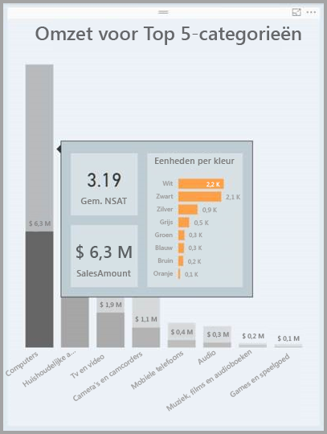

## Beperkingen en overwegingen
In deze preview-versie van rapport**knopinfo** zijn er enkele beperkingen en overweging waarmee u rekening moet houden.

* Rapportknopinfo wordt niet ondersteund bij het weergeven van rapporten in mobiele apps of in geïntegreerde omgevingen, zoals publiceren op het internet. 
* Rapportknopinfo wordt niet ondersteund voor aangepaste visuele elementen. 
* Clusters worden momenteel niet ondersteund als velden die in rapportknopinfo kunnen worden weergegeven. 
* Bij het kiezen van een veld dat u wilt weergeven als rapportknopinfo tonen visuele elementen met dat veld, wanneer u in plaats van een categorie een veld gebruikt, alleen de opgegeven knopinfo wanneer de samenvatting met het geselecteerde veld overeenkomt. 

## Volgende stappen
Raadpleeg de volgende artikelen voor meer informatie over functies die vergelijkbaar zijn of samenwerken met rapportknopinfo:

* [Drillthrough gebruiken in Power BI Desktop](desktop-drillthrough.md)
* [Een dashboardtegel of rapportvisual weergeven in de focusmodus](service-focus-mode.md)

