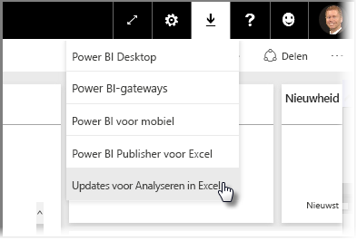
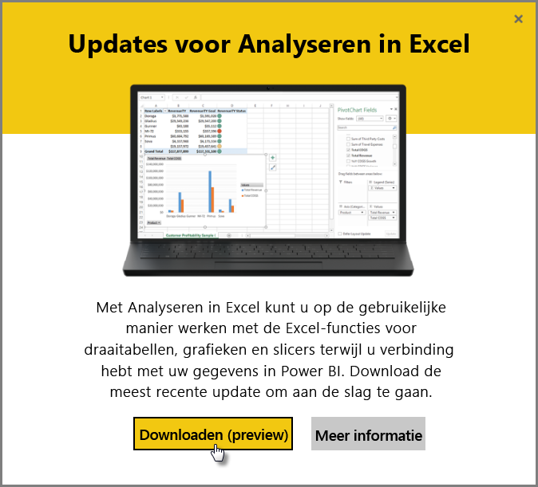
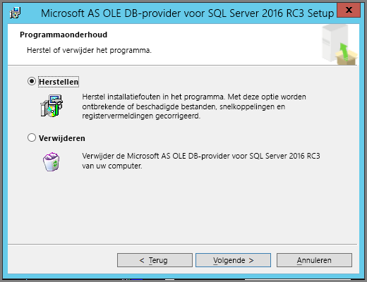
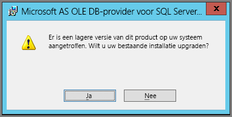

# Problemen met Analyseren in Excel oplossen

Wanneer u Analyseren in Excel gebruikt, krijgt u mogelijk een onverwacht resultaat of werkt de functie niet zoals verwacht. Deze pagina bevat oplossingen voor algemene problemen bij het gebruik van Analyseren in Excel.

> [!NOTE]
> Er is een afzonderlijke pagina beschikbaar waarop [Analyseren in Excel](service-analyze-in-excel.md) wordt beschreven en wordt uitgelegd hoe u dit inschakelt.
> 
> Als u een situatie tegenkomt die hieronder niet wordt vermeld en die problemen veroorzaakt, kunt u om hulp vragen op de [site van de community](http://community.powerbi.com/) of een [ondersteuningsticket](https://powerbi.microsoft.com/support/) aanmaken.
> 
> 

Dit artikel bevat de volgende secties voor probleemoplossing:

* Excel-bibliotheken bijwerken voor de OLE DB-provider
* Bepalen of u uw Excel-bibliotheken moet bijwerken
* Fout: Er kan geen verbinding worden gemaakt
* Fout: Niet-toegestaan
* Geen gegevensmodellen
* Fout: Token verlopen
* Geen toegang tot on-premises Analysis Services
* U kunt niets slepen naar het waardegebied van de draaitabel (geen metingen)

## Excel-bibliotheken bijwerken voor de OLE DB-provider
Als u **Analyseren in Excel** wilt gebruiken, moet op uw computer een actuele AS OLE DB-provider zijn geïnstalleerd. Dit [communitybericht](http://community.powerbi.com/t5/Service/Analyze-in-Excel-Initialization-of-the-data-source-failed/m-p/30837#M8081) vormt een uitstekende bron om uw installatie van de OLE DB-provider te controleren of om een recente versie te downloaden.

De Excel-bibliotheken moeten overeenkomen met uw versie van Windows wat betreft het aantal bits. Als u een 64-bits versie van Windows hebt geïnstalleerd, moet u de 64-bits OLE DB-provider installeren.

Als u de meest recente Excel-bibliotheken wilt downloaden, gaat u naar Power BI, selecteert u de **pijl-omlaag** in de rechterbovenhoek van de Power BI-service en selecteert u **Updates voor Analyseren in Excel**.

Selecteer **Downloaden (preview)** in het dialoogvenster dat verschijnt.

## Bepalen of u uw Excel-bibliotheken moet bijwerken
U kunt de meest recente versie van de Excel-bibliotheken van de OLE DB-provider downloaden via de koppelingen in de vorige sectie. Nadat u de juiste bibliotheek van de OLE DB-provider hebt gedownload en de installatie start, worden controles uitgevoerd met de huidige geïnstalleerde versie.

Als de Excel-clientbibliotheken van uw OLE DB-provider up-to-date zijn, verschijnt een dialoogvenster zoals het volgende:

Als de nieuwe versie die u installeert, nieuwer is dan de versie op uw computer, wordt het volgende dialoogvenster weergegeven:

Als een dialoogvenster wordt weergegeven waarin u wordt gevraagd een upgrade uit te voeren, moet u doorgaan met de installatie om de meest recente versie te downloaden van de OLE DB-provider die op uw computer is geïnstalleerd.

## Fout: Er kan geen verbinding worden gemaakt
De belangrijkste oorzaak van de fout *Er kan geen verbinding worden gemaakt* is het feit dat een van de clientbibliotheken van de OLE DB-provider op uw computer niet actueel is. Voor informatie over hoe u de juiste update bepaalt en voor downloadkoppelingen raadpleegt u **Excel-bibliotheken bijwerken voor de OLE DB-provider**, eerder in dit artikel.

## Fout: Niet-toegestaan
Sommige gebruikers hebben meer dan één Power BI-account. Wanneer Excel probeert verbinding te maken met Power BI met behulp van de huidige referenties, kunnen referenties worden gebruikt die geen toegang hebben tot de gegevensset of het rapport waartoe u toegang wilt.

Als dit het geval is, kan de fout **Niet toegestaan** worden weergegeven, wat betekent dat u mogelijk bij Power BI bent aangemeld met referenties die geen machtigingen voor de gegevensset hebben. Als de fout **Niet toegestaan** optreedt en u wordt gevraagd uw referenties in te voeren, gebruikt u referenties die zijn gemachtigd om toegang te krijgen tot de gegevensset die u probeert te gebruiken.

Als u nog steeds fouten krijgt, meldt u zich aan bij Power BI met het account dat gemachtigd is en controleert u of u in Power BI toegang hebt tot de gegevensset die u probeert te openen in Excel.

## Geen gegevensmodellen
Als u een foutbericht krijgt met de melding **Kan het OLAP-kubusmodel niet vinden**, heeft de gegevensset die u probeert te gebruiken geen gegevensmodel en kan deze daarom niet worden geanalyseerd in Excel.

## Fout: Token verlopen
Als u de fout **Token verlopen** ziet, betekent dit dat u de functie **Analyseren in Excel** niet recentelijk hebt gebruikt op de computer die u gebruikt. Voer gewoon opnieuw uw referenties in of open het bestand opnieuw, waarna de fout zou moeten verdwijnen.

## Geen toegang tot on-premises Analysis Services
Als u probeert toegang te krijgen tot een gegevensset die verbindingen heeft met on-premises Analysis Services-gegevens, wordt er mogelijk een foutbericht weergegeven. **Analyseren in Excel** biedt ondersteuning voor verbindingen met gegevenssets en rapporten in on-premises **Analysis Services** met een verbindingsreeks, mits uw computer zich in hetzelfde domein bevindt als de **Analysis Services**-server en uw account toegang heeft tot die **Analysis Services**-server.

## U kunt niets slepen naar het waardegebied van de draaitabel (geen metingen)
Als **Analyseren in Excel** verbinding maakt met een extern OLAP-model (dit is de manier waarop Excel verbinding maakt met Power BI), vereist de *draaitabel* [dat **metingen** zijn gedefinieerd in het externe model](https://support.microsoft.com/kb/234700) aangezien alle berekeningen op de server worden uitgevoerd. Dit verschilt van werken met een lokale gegevensbron (zoals tabellen in Excel) of van werken met gegevenssets in **Power BI Desktop** of de **Power BI-service**, in welk geval het tabelmodel lokaal beschikbaar is en [u impliciete metingen kunt gebruiken](https://msdn.microsoft.com/library/gg399077.aspx). Dit zijn metingen die dynamisch worden gegenereerd en niet zijn opgeslagen in het gegevensmodel. In deze gevallen verschilt het gedrag van Excel van het gedrag in **Power BI Desktop** of de **Power BI-service**: de gegevens bevatten mogelijk kolommen die kunnen worden behandeld als metingen in Power BI, maar die niet kunnen worden gebruikt als waarden (metingen) in Excel.

U kunt dit probleem op verschillende manieren oplossen:

1. Maak [metingen in uw gegevensmodel in **Power BI Desktop**](desktop-tutorial-create-measures.md), publiceer het gegevensmodel vervolgens in de **Power BI-service** en gebruik die gepubliceerde gegevensset vanuit Excel.
2. Maak [metingen in uw gegevensmodel vanuit Excel PowerPivot](https://support.office.com/article/Create-a-Measure-in-Power-Pivot-d3cc1495-b4e5-48e7-ba98-163022a71198).
3. Als u gegevens hebt geïmporteerd uit een Excel-werkmap die alleen tabellen (en geen gegevensmodel) bevat, kunt u [de tabellen toevoegen aan het gegevensmodel](https://support.office.com/article/Add-worksheet-data-to-a-Data-Model-using-a-linked-table-d3665fc3-99b0-479d-ba09-a37640f5be42) en daarna de stappen in optie 2 hierboven volgen om metingen te maken in het gegevensmodel.

Nadat uw metingen zijn gedefinieerd in het model in de Power BI-service, kunt u ze gebruiken in het gebied **Waarden** in Excel-draaitabellen.

## Volgende stappen
[Analyseren in Excel](service-analyze-in-excel.md)

[Zelfstudie: Uw eigen metingen maken in Power BI Desktop](desktop-tutorial-create-measures.md)

[Metingen in PowerPivot](https://msdn.microsoft.com/library/gg399077.aspx)

[Een meting maken in PowerPivot](https://support.office.com/article/Create-a-Measure-in-Power-Pivot-d3cc1495-b4e5-48e7-ba98-163022a71198)

[Werkbladgegevens toevoegen aan een gegevensmodel met behulp van een gekoppelde tabel](https://support.office.com/article/Add-worksheet-data-to-a-Data-Model-using-a-linked-table-d3665fc3-99b0-479d-ba09-a37640f5be42)

[Verschillen tussen OLAP- en niet-OLAP-draaitabellen in Excel](https://support.microsoft.com/kb/234700)

