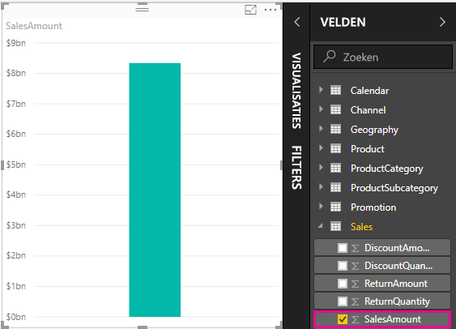
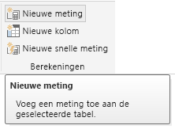
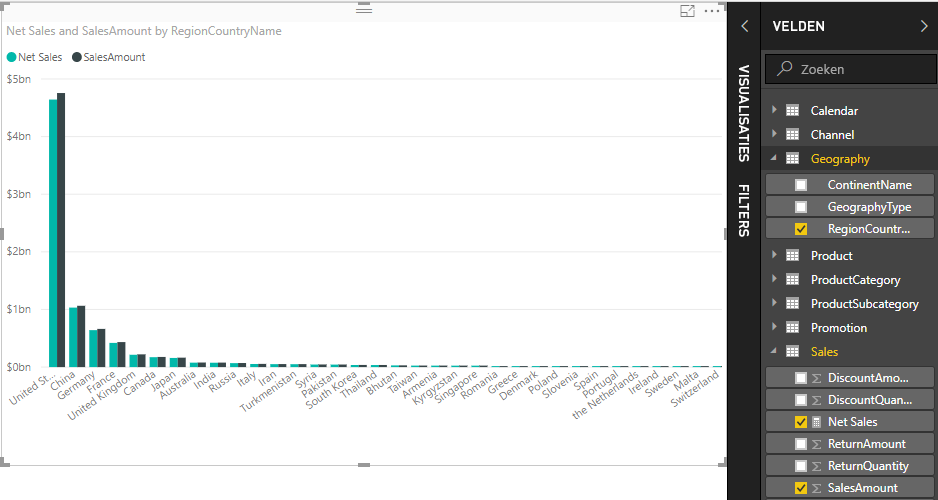
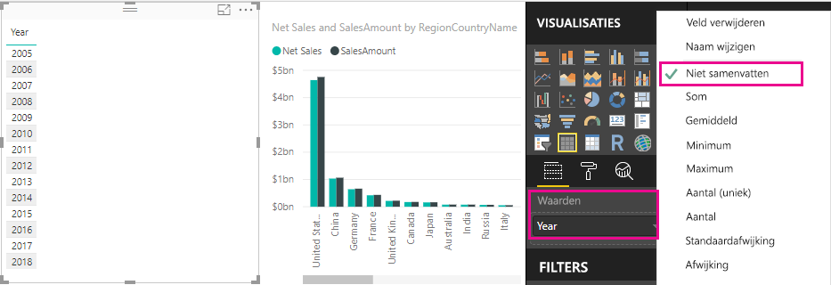
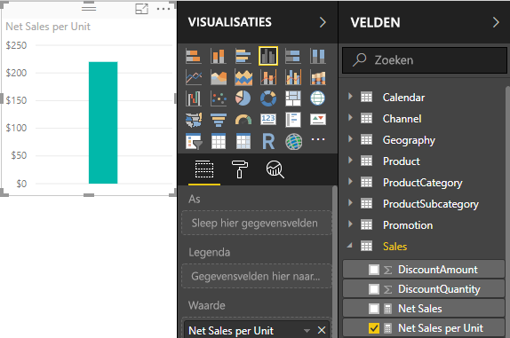

# Zelfstudie: Uw eigen metingen maken in Power BI Desktop
In Power BI Desktop kunnen zeer krachtige gegevensanalyseoplossingen worden gemaakt met behulp van metingen. Metingen zijn nuttig voor het uitvoeren van berekeningen op gegevens bij het werken met rapporten. Deze zelfstudie bevat uitleg en een stapsgewijze procedure voor het maken van een aantal basismetingen in Power BI Desktop.

Dit artikel is bedoeld voor Power BI-gebruikers die al bekend zijn met het gebruik van Power BI Desktop en eraan toe zijn om geavanceerdere modellen te maken. U dient al te weten hoe u Gegevens ophalen en Query-editor gebruikt om gegevens te importeren, hoe u werkt met meerdere verwante tabellen en hoe u velden toevoegt aan het rapportcanvas. Raadpleeg [Aan de slag met Power BI Desktop](desktop-getting-started.md) als u nog geen ervaring hebt met het gebruik van Power BI Desktop.

Om de stappen in deze zelfstudie te voltooien, moet u het bestand [Contoso-verkoopvoorbeeld voor Power BI Desktop](http://download.microsoft.com/download/4/6/A/46AB5E74-50F6-4761-8EDB-5AE077FD603C/Contoso%20Sales%20Sample%20for%20Power%20BI%20Desktop.zip) downloaden. Dit bevat al onlineverkoopgegevens van het fictieve bedrijf Contoso, Inc. Omdat de gegevens in het bestand zijn geïmporteerd uit een database, kunt u geen verbinding maken met de gegevensbron en ook geen gegevens weergeven in Query-editor. Nadat u het bestand hebt gedownload naar uw computer, opent u het in Power BI Desktop.

## Wat zijn metingen?
Metingen worden vaak automatisch voor ons gemaakt, bijvoorbeeld wanneer we het selectievakje naast het veld **SalesAmount** (omzetbedrag) uit de tabel **Sales** (omzet) in de lijst met velden inschakelen, of als we **SalesAmount** naar het rapportcanvas slepen.

Er wordt een nieuwe grafiekvisualisatie weergegeven, die er ongeveer als volgt uitziet:

Wat we krijgen is een kolomdiagram met een totaalbedrag van omzetwaarden uit het veld SalesAmount.  Ons veld SalesAmount is in feite een kolom met de naam SalesAmount in de tabel Sales die we al hebben geïmporteerd.

De kolom SalesAmount bevat meer dan twee miljoen rijen met omzetwaarden. U vraagt zich wellicht af waarom u dan geen tabel met alle rijen en waarden ziet. In Power BI Desktop wordt herkend dat alle waarden in SalesAmount numerieke gegevens zijn en dat u deze waarschijnlijk op een of andere manier wilt aggregeren, door ze bij elkaar op te tellen, het gemiddelde ervan te berekenen, ze te tellen, enzovoort...

Elk veld in de lijst Velden waarbij u het Sigma-pictogram  ziet, is een numeriek veld waarvan de waarden kunnen worden geaggregeerd. In dit geval wordt, wanneer we SalesAmount selecteren, in Power BI Desktop een eigen meting gemaakt en wordt de som van alle omzetbedragen berekend en weergegeven in de grafiek.

Som is de standaardaggregatie wanneer een veld met een numeriek gegevenstype wordt geselecteerd, maar we kunnen dit heel eenvoudig wijzigen in een ander type aggregatie.

Als we in het gebied **Value** (waarde) op de pijl-omlaag naast **SalesAmount** klikken, kunnen we vervolgens **Average** (gemiddelde) selecteren.

De visualisatie wordt gewijzigd in het gemiddelde van alle omzetwaarden in het veld SalesAmount.

We kunnen het type aggregatie wijzigen, afhankelijk van het gewenste resultaat, maar niet elk type aggregatie kan worden toegepast op elk numeriek gegevenstype. Het is bijvoorbeeld wel logisch om de som of het gemiddelde van het veld SalesAmount te berekenen. Dat geldt ook voor het minimum en maximum. Tellen heeft echter niet zo veel zin voor het veld SalesAmount. De waarden zijn weliswaar numeriek, maar betreffen in feite valuta(bedragen).

Het begrijpen van aggregaties is van cruciaal belang voor het begrijpen van metingen, omdat bij elke meting wel een bepaald type aggregatie wordt uitgevoerd. Verderop behandelen we meer voorbeelden van het gebruik van een som-aggregatie, wanneer u zelf enkele metingen gaat maken.

De waarden die worden berekend op basis van metingen, veranderen bij elke wijziging van het rapport. Als we bijvoorbeeld het veld **RegionCountryName** vanuit de tabel **Geography** (geografie) naar de grafiek slepen, wordt het gemiddelde van de omzetbedragen per land berekend en weergegeven.

Wanneer het resultaat van een meting verandert doordat we een wijziging in het rapport aanbrengen, wijzigen we in feite de *context* van de meting. Telkens wanneer u het rapport bewerkt, wijzigt u de context waarin een meting wordt berekend en worden de resultaten daarvan weergegeven.

In de meeste gevallen worden de waarden door Power BI berekend en geretourneerd in overeenstemming met de toegevoegde velden en de gekozen aggregatietypen. In sommige gevallen moet u mogelijk uw eigen metingen maken om ingewikkeldere, unieke berekeningen uit te voeren.

Met Power BI Desktop kunt u uw eigen metingen maken met de formuletaal DAX (Data Analysis Expressions). DAX-formules zijn vergelijkbaar met Excel-formules. In DAX worden vaak dezelfde functies en operatoren gebruikt als in Excel-formules, en ook de syntaxis is vrijwel identiek. DAX-functies zijn echter ontworpen voor het werken met relationele gegevens en meer dynamische berekeningen tijdens het werken met rapporten.

Er zijn meer dan 200 DAX-functies, variërend van eenvoudige aggregaties zoals som en gemiddelde tot complexe statistische functies en filters. We gaan hier niet al te diep in op de DAX-taal. Zie de vele informatiebronnen over DAX voor meer informatie. Raadpleeg [Standaard DAX-bewerkingen in Power BI Desktop](desktop-quickstart-learn-dax-basics.md) nadat u deze zelfstudie hebt doorlopen.

Wanneer we onze eigen metingen maken, worden deze toegevoegd aan de lijst met velden voor de gewenste tabel. Dit noemen we een *model*meting. Deze blijft in de tabel aanwezig als een veld. Een groot voordeel van modelmetingen is dat we ze elke gewenste naam kunnen geven, waardoor ze beter herkenbaar zijn. We kunnen ze ook gebruiken als een argument in andere DAX-expressies en metingen maken waarmee complexe berekeningen zeer snel kunnen worden uitgevoerd.

## Zelf een meting maken
Stel, we willen onze netto-omzet analyseren. Als u de lijst met velden van de tabel Sales (omzet) bekijkt, ziet u dat er geen veld met de naam NetSales (netto-omzet) is. Maar we beschikken wel over de bouwstenen voor het maken van onze eigen meting om de netto-omzet te berekenen.

Hiervoor hebben we een meting nodig waarbij alle kortingen en retouren worden afgetrokken van de omzetbedragen. Omdat we met onze meting een resultaat willen berekenen voor elke context in onze visualisatie, moeten de som van DiscountAmount (kortingsbedrag) en de som van ReturnAmount (retourbedrag) worden afgetrokken van de som van SalesAmount (omzetbedrag). Dit lijkt nu misschien een beetje verwarrend, maar straks wordt alles duidelijk.

### Netto-omzet
1.  Klik met de rechtermuisknop op (of klik op de pijl-omlaag bij) de tabel **Sales** (omzet) in de lijst met velden, en klik vervolgens op **Nieuwe meting**. Hiermee zorgt u ervoor dat de nieuwe meting wordt opgeslagen in de tabel Sales, zodat deze eenvoudiger terug te vinden is.
    
    
    
    > [!TIP]
    > U kunt ook een nieuwe meting maken door te klikken op de knop Nieuwe meting in het lint op het tabblad Start van Power BI Desktop.
    > 
    > 
    > 
    > Wanneer u een meting vanaf het lint maakt, wordt de meting mogelijk gemaakt in alle tabellen. Hoewel een meting niet per se tot een bepaalde tabel hoeft te behoren, is de meting wel gemakkelijker te vinden als u deze maakt in de voor u meest logische tabel. Als u de meting wilt maken in een bepaalde tabel, klikt u eerst op de tabel om deze te activeren. Klik vervolgens op Nieuwe meting. In dit voorbeeld maken we onze eerste meting in de tabel Sales.
    > 
    > 
    
    De formulebalk wordt weergegeven aan de bovenkant van het rapportcanvas. Hier wijzigen we de naam van de meting en voeren we een DAX-formule in.
    
    
    
    Eerst geven we een naam op voor onze nieuwe meting. De standaardnaam voor een nieuwe meting is gewoon Meting. Als we de naam niet wijzigen en nieuwe metingen maken, krijgen die de naam Meting 2, Meting 3, enzovoort. We willen een duidelijk herkenbare naam, dus geven we onze nieuwe meting de naam Netto-omzet.
    
2. Selecteer **Meting** in de formulebalk en typ vervolgens **Netto-omzet**.
    
    Nu kunnen we een formule invoeren.
    
3.  Typ na het gelijkteken een **S**. In een vervolgkeuzelijst wordt een lijst met suggesties weergegeven met alle DAX-functies die beginnen met de letter S. Hoe meer u typt, hoe korter de lijst met suggesties wordt. Ga door tot u de gewenste functie hebt gevonden. Selecteer **SUM** (SOM) door omlaag te schuiven en druk vervolgens op Enter.
    
    
    
    Nadat we op Enter hebben gedrukt, wordt een haakje openen weergegeven en een andere lijst met suggesties, ditmaal voor alle beschikbare kolommen die kunnen worden doorgegeven in de functie SUM.
    
    
    
    Een expressie wordt altijd wordt weergegeven tussen een haakje openen en een haakje sluiten. In dit geval bevat onze expressie slechts één argument dat moet worden doorgegeven aan de functie SUM, namelijk een te totaliseren kolom. We kunnen de lijst met kolommen verfijnen door de eerste letters van de gewenste kolom te typen. In dit voorbeeld is dat de kolom SalesAmount. Wanneer we 'salesam' typen, worden de lijst steeds kleiner tot er twee items over blijven. Beide items zijn in feite dezelfde kolom. Bij het ene item ziet u alleen [SalesAmount], omdat we onze meting maken in dezelfde tabel als de tabel waarin de kolom SalesAmount zich bevindt. Bij het andere item ziet u de naam van de tabel, gevolgd door de naam van de kolom.
    
    
    
    Over het algemeen is het raadzaam om de volledig gekwalificeerde naam van een kolom in te voeren. Hierdoor zijn de formules gemakkelijker te lezen.
    
4. Selecteer **Sales[SalesAmount]**, en typ vervolgens een haakje sluiten.
    
    > [!TIP]
    > Syntaxisfouten zijn meestal te wijten aan een ontbrekend of verkeerd geplaatst haakje-sluiten.
    > 
    > 
    
    Nu willen we de andere twee kolommen hiervan aftrekken.
    
5.  Typ na het haakje-sluiten van de eerste expressie een spatie en een minteken (**-**), gevolgd door nog een spatie. Voer nog een SUM-functie in met de kolom **Sales[DiscountAmount]** kolom als argument.
    
    
    
    We krijgen zo langzamerhand te weinig ruimte voor onze formule. Geen enkel probleem.
    
6.  Klik op de dubbele pijl-omlaag aan de rechterkant van de formulebalk.
    
    
    
    Nu hebben we meer ruimte. Door op Alt+Enter te drukken, kunnen we nieuwe onderdelen aan onze formule toevoegen op een nieuwe regel. We kunnen ook dingen verplaatsen met behulp van de tabtoets.
    
    
    
    Nu kunnen we het laatste gedeelte van onze formule toevoegen.
    
7.  Typ opnieuw een minteken, gevolgd door een SUM-functie met de kolom **Sales[ReturnAmount]** als argument.
    
    
    
    De formule is nu klaar.

8.  Druk op Enter, of klik op het vinkje in de formulebalk om de formule te voltooien. De formule wordt gevalideerd en toegevoegd aan de lijst met velden in de tabel Sales.

### Laten we onze nieuwe meting toevoegen aan een rapport
Nu kunnen we de meting Netto-omzet toevoegen aan het rapportcanvas zodat de netto-omzet wordt berekend voor alle andere velden die we toevoegen aan het rapport. Laten we de netto-omzet per land eens bekijken.

1.  Sleep de meting **Netto-omzet** van de tabel **Sales** naar het rapportcanvas.
    
2. Sleep nu het veld **RegionCountryName** van de tabel **Geography** naar de grafiek.
    
    
    
    Laten we nog enkele gegevens toevoegen.
    
3.  Sleep het veld **SalesAmount** naar de grafiek, zodat u het verschil tussen de netto-omzet en het omzetbedrag kunt zien.
    
    We hebben nu eigenlijk twee metingen in de grafiek. De meting SalesAmount, die automatisch wordt berekend, en de meting Netto-omzet, die we zelf hebben gemaakt. In beide gevallen worden de resultaten berekend in de context van een ander veld in de grafiek: de landen in RegionCountryName.
    
    
    
    We gaan een slicer toevoegen, zodat we de netto-omzet en omzetbedragen verder kunnen uitsplitsen per kalenderjaar.
    
4.  Klik op een leeg gebied naast de grafiek en klik vervolgens, in **Visualisaties**, op de visualisatie Table (Tabel).
    
    
    
    Hiermee maakt u een lege tabel-visualisatie in het rapportcanvas.
    
    
    
5.  Sleep het veld **Year** (jaar) van de tabel **Calendar** (kalender) naar de nieuwe, lege tabel.
    
    
    
    Omdat Year een numeriek veld is, worden de waarden ervan in Power BI Desktop getotaliseerd en weergegeven in een grafiek. Maar dat is nog geen slicer.
    
6. Klik in **Values** (waarden) op de pijl-omlaag naast **Year** (jaar), en klik vervolgens op **Niet samenvatten**.
    
    
    
    Nu kunnen we het veld Year in de tabelvisualisatie wijzigen in een slicer.

    7.  Klik in **Visualizations** (visualisaties) op de visualisatie **Slicer**.

    
    
    Nu is het jaar een slicer. We kunnen elk afzonderlijk jaar of meerdere jaren selecteren om de visualisaties van het rapport dienovereenkomstig te slicen.
    
8. Klik maar eens op **2013**. U ziet de grafiek veranderen. De metingen Netto-omzet en SalesAmount worden opnieuw berekend, waarna de nieuwe resultaten voor 2013 worden weergegeven. Ook dit was een wijziging van de context waarin de metingen worden berekend en de resultaten worden weergegeven.
    
    

## We gaan een andere meting maken
Nu u weet hoe u zelf metingen kunt maken, maken we er nog een.

### Netto-omzet per eenheid
Maar wat als we willen weten van welke producten de omzet per verkochte eenheid het hoogst is?

Dan kunnen we nog een meting maken. In dit geval willen we de netto-omzet delen door het aantal verkochte eenheden. In feite willen we het resultaat van de meting Netto-omzet delen door de som van Sales[SalesQuantity].

1.  Maak een nieuwe meting met de naam **Netto-omzet per eenheid** in de tabel Sales (omzet) of Products (producten).
    
    Voor deze meting maken we gebruik van de meting Netto-omzet die we eerder hebben gemaakt. In een DAX-formule kunnen we verwijzen naar andere metingen.
    
2.  Begin met het typen van **Netto-omzet**. In de lijst met suggesties wordt weergegeven wat we kunnen toevoegen. Selecteer **[Netto-omzet]**.
    
    
    
    U kunt ook verwijzen naar een andere meting door alleen een haakje openen te typen (**[**). In de lijst met suggesties worden alleen de metingen weergegeven die we aan onze formule kunnen toevoegen.
    
    
    
3.  Voer direct na **[Netto-omzet]** een spatie in, en vervolgens een operator voor delen (**/**). Voer vervolgens een SUM-functie in en typ **Quantity** (hoeveelheid). In de lijst met suggesties worden alle kolommen met Quantity in de naam weergegeven. Selecteer **Sales[SalesQuantity]**. De formule moet er nu als volgt uitzien:
    
    > **Netto-omzet per eenheid = [Netto-omzet] / SUM(Sales[SalesQuantity])**
    > 
    > 
    
    Geweldig, toch? Het invoeren van DAX-formules is heel eenvoudig als we de zoek- en suggestiefunctionaliteit van de DAX-editor gebruiken. Eens kijken wat dat oplevert met onze nieuwe meting, Netto-omzet per eenheid.
    
4. Sleep de meting **Netto-omzet per eenheid** naar een leeg gebied in het rapportcanvas.
    
    
    
    Dit is nog niet zo interessant, of wel? Geen zorgen.
    
5.  Wijzig het visualisatietype van de grafiek in **Structuurkaart**.
    
    
    
6. Sleep het veld **ProductCategory** (productcategorie) vanuit de tabel **ProductCategory** omlaag naar het gebied **Group** (groep).
    
    
    
    Dat is nuttige informatie, maar wat als we de netto-omzet per product willen weergeven?
    
7. Verwijder het veld **ProductCategory** en sleep in plaats daarvan het veld **ProductName** (productnaam) vanuit de tabel **Product** naar het gebied **Group**. 
    
    
    
    Nu zijn we gewoon aan het spelen, maar u zult moeten toegeven dat deze functionaliteit geweldig is! We kunnen de structuurkaart natuurlijk op talloze manieren filteren, maar dat valt buiten het bereik van deze zelfstudie.

## Wat hebben we geleerd
Metingen bieden uitgebreide mogelijkheden om gegevens op de gewenste manier inzichtelijk te maken. We hebben geleerd om metingen te maken met behulp van de formulebalk. We kunnen metingen betekenisvolle namen geven. Dankzij de lijst met suggesties kunnen we makkelijk het juiste element opzoeken, selecteren en toevoegen aan onze formules. We hebben ook kennisgemaakt met context, waarbij het resultaat van berekeningen in metingen varieert, afhankelijk van andere velden of andere expressies in de formule voor de meting.

## Volgende stappen
Zie [Standaard DAX-bewerkingen in Power BI Desktop](desktop-quickstart-learn-dax-basics.md) voor meer informatie over DAX-formules en geavanceerde metingen. Dit artikel is voornamelijk gericht op de grondbeginselen van DAX, zoals de syntaxis en functies. Daarnaast gaan we iets dieper in op het begrip context.

Voeg [Naslaginformatie over Data Analysis Expressions (DAX)](https://msdn.microsoft.com/library/gg413422.aspx) toe aan uw favorieten. Hier vindt u gedetailleerde informatie over de syntaxis, operators en meer dan 200 functies van DAX.

