# Zelfstudie: Facebook-analyses met Power BI Desktop

In deze zelfstudie leert u hoe u gegevens uit Facebook importeert en gebruikt in Power BI Desktop. U moet verbinding maken met en gegevens importeren van de Power BI Facebook-pagina, transformaties toepassen op de geïmporteerde gegevens en de gegevens in rapportvisualisaties gebruiken.

## Verbinding maken met een Facebook-pagina

Deze zelfstudie gebruikt gegevens van de [Microsoft Power BI Facebook-pagina](https://www.facebook.com/microsoftbi) (*https://www.facebook.com/microsoftbi*). Met uitzondering van een persoonlijk Facebook-account hebt u geen speciale referenties nodig om verbinding te maken met en gegevens te importeren van deze pagina.

1. Open Power BI Desktop en selecteer **Gegevens ophalen** in het dialoogvenster **Aan de slag** of selecteer op het linttabblad **Start** de optie **Gegevens ophalen** en vervolgens **Meer...** .
   
2. Selecteer in het dialoogvenster **Gegevens ophalen** de optie **Facebook** in de groep **Onlineservices** en selecteer vervolgens **Verbinden**.
   
   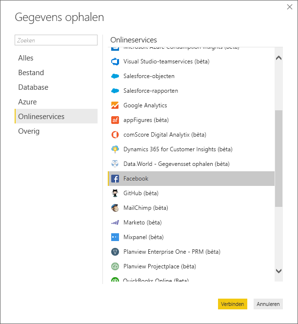
   
   Er verschijnt een dialoogvenster waarin u wordt gewaarschuwd voor de risico's van het gebruik van een service van derden.
   
   
   
3. Selecteer **Doorgaan**. Het dialoogvenster **Facebook** wordt weergegeven.
   
4. Typ of plak de naam van de pagina **microsoftbi** in het tekstvak **Gebruikersnaam**, selecteer **Berichten** in de vervolgkeuzelijst **Verbinding** en selecteer vervolgens **OK**.
   
   
   
5. Wanneer u wordt gevraagd om referenties in te voeren, meldt u zich aan met uw Facebook-account en geeft u Power Bi toegang via uw account.
   
   

   Nadat u verbinding hebt gemaakt met de Power BI Facebook-pagina, ziet u een voorbeeld van de gegevens in de **Berichten** van de pagina. 
   
   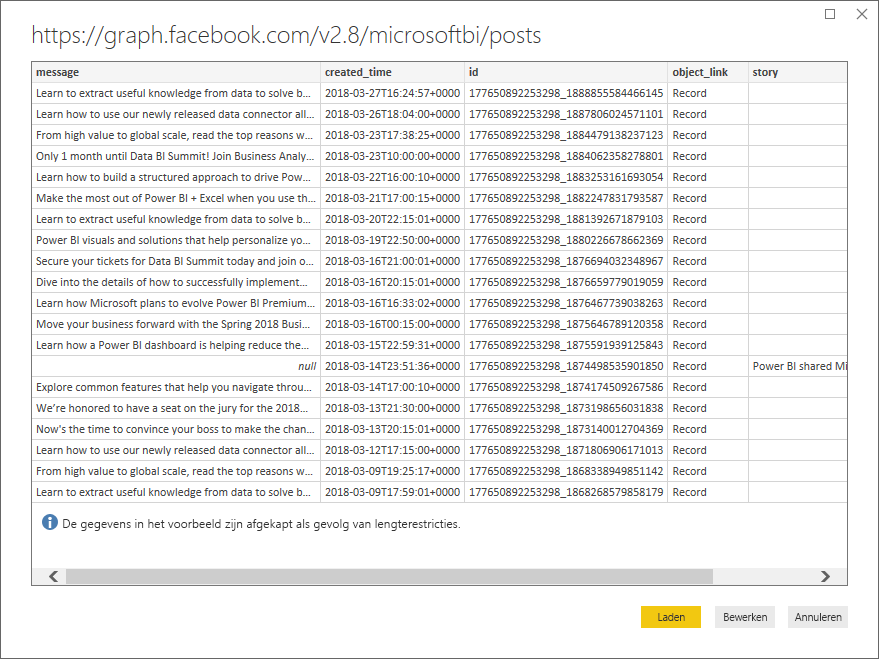
   
## De geïmporteerde gegevens vormgeven en transformeren

U wilt zien en weergeven welke berichten de meeste opmerkingen hebben gedurende een bepaalde periode, maar u ziet dat in het gegevensvoorbeeld **Berichten** de gegevens over de **created_time** moeilijk te lezen en te begrijpen zijn, en dat er helemaal geen gegevens over opmerkingen zijn. U moet een aantal vormgevings- en opschoningsacties op de gegevens uitvoeren om er zoveel mogelijk informatie uit te kunnen halen. U kunt de **Power Query-editor** van Power BI Desktop gebruiken om de gegevens te bewerken voordat of nadat u deze naar Power BI Desktop importeert. 

### De datum/tijd-kolom splitsen

Eerst scheidt u de datum- en tijdwaarden in de kolom **created_time**, zodat deze beter leesbaar zijn. 

1. Selecteer in het Facebook-gegevensvoorbeeld de optie **Bewerken**. 
   
   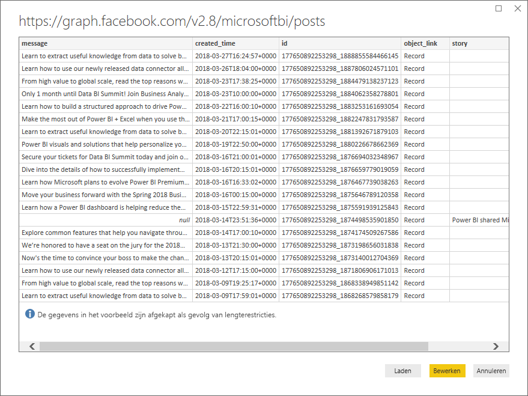
   
   De **Power Query-editor** van Power BI Desktop wordt in een nieuw venster geopend en geeft het voorbeeld van de gegevens van de Power BI Facebook-pagina weer. 
   
   
   
2. Selecteer de kolom **created_time**. U ziet dat er momenteel sprake is van het gegevenstype Tekst, dat wordt aangegeven door het pictogram **ABC**. Klik met de rechtermuisknop op de koptekst en selecteer **Kolom splitsen op scheidingsteken** in de vervolgkeuzelijst of selecteer **Kolom splitsen op scheidingsteken** onder **Transformeren** op het linttabblad Start.  
   
   
   
3. Selecteer in het dialoogvenster **Kolom splitsen op scheidingsteken** de optie **Aangepast** in de vervolgkeuzelijst, voer **T** in (het teken waarmee het tijdgedeelte van de waarden voor created_time begint) in het invoerveld en selecteer **OK**. 
   
   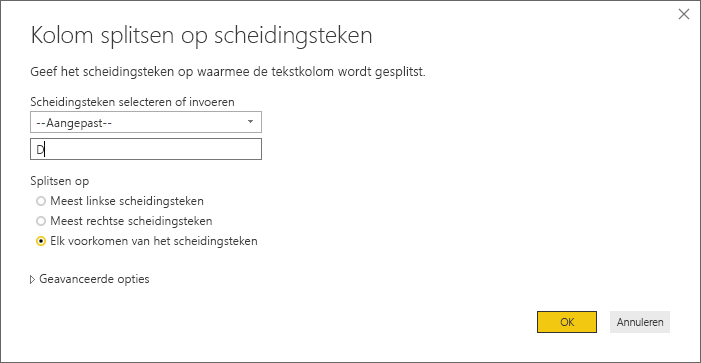
   
   De kolom wordt gesplitst in twee kolommen die de tekenreeksen voor en na het **T**-scheidingsteken bevatten en hebben respectievelijk de naam **created_time.1** en **created_time.2**. U ziet dat Power BI de gegevenstypen automatisch heeft gedetecteerd en gewijzigd in **Datum** voor de eerste kolom en **Tijd** voor de tweede kolom en de datum- en tijdwaarden heeft opgemaakt, zodat deze beter leesbaar zijn.
   
4. Wijzig de naam van de kolommen door te dubbelklikken op elke kolomkop of elke kolom te selecteren. Selecteer vervolgens **Naam wijzigen** in de groep **Elke kolom** van het tabblad **Transformeren** op het lint en typ de nieuwe kolomkoppen, respectievelijk **created_date** en **created_time**.
   
   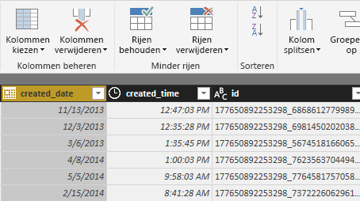
   
### De geneste kolom uitvouwen

Nu de datum- en tijdgegevens worden weergegeven zoals u wilt, geeft u opmerkingsgegevens weer door een geneste kolom uit te vouwen. 

1. Selecteer de kolom **object_link** en selecteer vervolgens het  om het dialoogvenster **Uitvouwen/aggregatie** te openen. Selecteer **connections** en selecteer vervolgens **OK**. 
   
   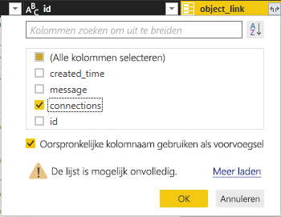
   
   De kolomkop wordt gewijzigd in **object_link.connections**.
2. Selecteer nogmaals het  boven aan de kolom **object_link.connections**, selecteer **comments** en selecteer vervolgens **OK**. De kolomkop wordt gewijzigd in **object_link.connections.comments**.
   
3. Selecteer het  boven aan de kolom **object_link.connections.comments** en selecteer deze keer **Aggregatie** in plaats van Uitvouwen in het dialoogvenster. Selecteer **Aantal id’s** en selecteer **OK**. 
   
   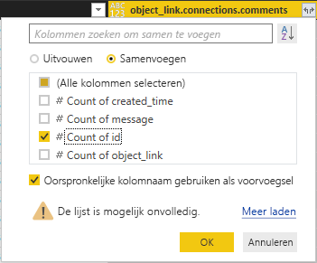
   
   Het aantal opmerkingen voor elk bericht wordt nu weergegeven in de kolom. 
   
4. Wijzig de naam van de kolom **Aantal object_link.connections.comments.id** in **Aantal opmerkingen**.
   
5. Selecteer de pijl omlaag naast het kopje **Aantal opmerkingen** en selecteer **Aflopend sorteren** om de berichten te sorteren van de meeste naar de minste opmerkingen. 
   
   
   
### Querystappen bekijken

Terwijl u gegevens in de **Power Query-editor** hebt vormgegeven en getransformeerd, is elke stap vastgelegd in het gebied **Toegepaste stappen** van het deelvenster **Queryinstellingen** aan de rechterkant van het Power Query-editor-venster. U kunt stap voor stap terug door de toegepaste stappen lopen om precies te zien welke wijzigingen u hebt aangebracht en deze indien nodig bewerken, verwijderen of opnieuw rangschikken (hoewel dit riskant kan zijn, omdat het wijzigen van de voorgaande stappen later fouten kan veroorzaken in stappen). 

Nadat de gegevenstransformaties tot nu toe zijn toegepast, moeten uw toegepaste stappen er als volgt uitzien:
   
   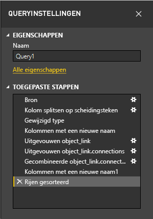
   
   >[!TIP]
   >Onder de Toegepaste stappen liggen formules die geschreven zijn in de **Power Query-taal**, ook wel bekend als de **M**-taal. Als u de formules wilt bekijken en bewerken, selecteert u **Geavanceerde editor** in de groep **Query** van het tabblad Start van het lint. 

### De getransformeerde gegevens importeren

Wanneer u tevreden met de gegevens bent, selecteert u **Sluiten en toepassen** > **Sluiten en toepassen** op het tabblad Start van het lint om deze te importeren in Power BI Desktop. 
   
   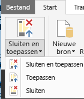
   
   In een dialoogvenster wordt de voortgang weergegeven van het laden van de gegevens in het gegevensmodel van Power BI Desktop. 
   
   
   
   Zodra de gegevens zijn geladen, worden deze in de rapportweergave weergegeven als een nieuwe query in de lijst met velden.
   
   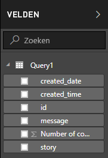
   
## De gegevens in rapportvisualisaties gebruiken 

Nu u de gegevens van de Facebook-pagina hebt geïmporteerd, kunt u snel en eenvoudig inzicht krijgen in uw gegevens met behulp van visualisaties. Het maken van een visualisatie is eenvoudig; u hoeft alleen maar een veld te selecteren in de lijst **Velden** of het te verslepen naar het rapportcanvas.

### Een staafdiagram maken

1. Selecteer in de rapportweergave van Power BI Desktop **bericht** in de veldenlijst of sleep dit veld naar het canvas. Er wordt een tabel met alle berichten weergegeven op het canvas. 
   
   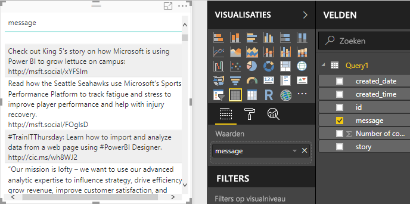
   
2. Selecteer met deze tabel geselecteerd ook **Aantal opmerkingen** in de lijst met velden of sleep het veld naar de tabel. 
   
3. Selecteer het pictogram **Gestapeld staafdiagram** in het deelvenster Visualisaties. De tabel wordt een staafdiagram waarin het aantal opmerkingen per bericht wordt weergegeven. 
   
   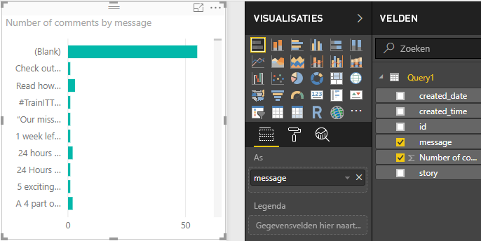
   
4. Selecteer het weglatingsteken (...) in de rechterbovenhoek van de visualisatie en selecteer vervolgens **Sorteren op aantal opmerkingen** om de tabel te sorteren op aflopend aantal opmerkingen. 
   
   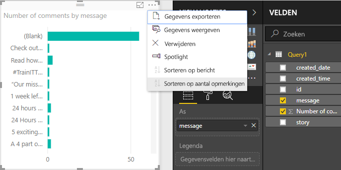
   
5. Merk op dat de meeste opmerkingen zijn gekoppeld aan **lege** berichten (deze berichten zijn artikelen, koppelingen, video's of andere niet-tekstuele inhoud). Als u lege rijen wilt wegfilteren, selecteert u **bericht (alle)** onder **Filters** onderaan in het deelvenster Visualisaties, selecteert u **Alles selecteren** en vervolgens **Leeg** om deze te deselecteren. De filtervermelding wijzigt in **bericht is niet (Leeg)** en de rij Leeg verdwijnt uit de diagramweergave. 
   
   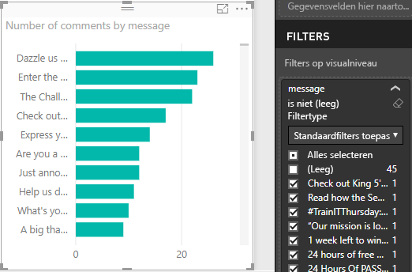
   
### Het diagram opmaken

De visualisatie wordt interessanter, maar u kunt nog niet veel van de berichttekst in het diagram zien. Ga als volgt te werk om meer van de berichttekst weer te geven:

1. Maak het diagram zo groot mogelijk met behulp van de grepen in de diagramweergave. 
   
2. Selecteer met het diagram geselecteerd het **opmaakpictogram** (verfroller) in het visualisatiedeelvenster.
   
3. Selecteer de pijl omlaag naast de **y-as** en sleep de schuifregelaar naast **Maximumgrootte** helemaal naar rechts (50%). 
4. Verklein ook de **Tekengrootte** naar **10**, zodat er meer tekst past.
   
   
   
   Het diagram geeft nu meer van de berichtinhoud weer. 
   
   
   
De x-as (het aantal opmerkingen) van het diagram toont geen exacte waarden, en ziet er een beetje verloren uit aan de onderkant van het diagram. U besluit in plaats daarvan gegevenslabels te gebruiken. 

1. Selecteer het opmaakpictogram en selecteer de schuifregelaar naast de **x-as** om deze **uit** te schakelen. 
   
2. Selecteer de schuifregelaar naast **Gegevenslabels** om deze **in** te schakelen. Het diagram toont nu het exacte aantal opmerkingen voor elk bericht.
   
   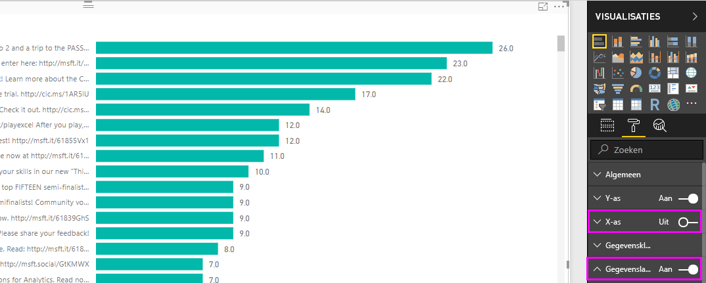
   
### Het gegevenstype bewerken

Dit is beter, maar de gegevenslabels hebben alle een decimaal van **.0** die afleidt en misleidend is, aangezien het **Aantal berichten** een geheel getal moet zijn. U wilt het gegevenstype van de kolom **Aantal berichten** wijzigen in een geheel getal.

1. Als u het gegevenstype wilt bewerken, klikt u met de rechtermuisknop op **Query1** in de veldenlijst of houdt u de muis erboven en selecteert u **Meer opties** weglatingsteken (...) en vervolgens **Query bewerken**. U kunt ook **Query's bewerken** selecteren in het gebied **Externe gegevens** van het tabblad Start op het lint en vervolgens **Query's bewerken** selecteren in de vervolgkeuzelijst. De **Power Query-editor** van Power BI Desktop wordt in een afzonderlijk venster geopend.
   
   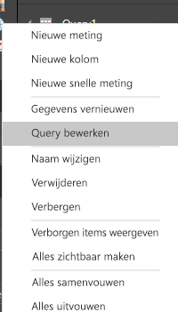     
   
2. Selecteer in de Power Query-editor de kolom **Aantal opmerkingen** en wijzig het gegevenstype in een **Geheel getal** door: 
   - Het pictogram **1.2** naast de kolomkop **Aantal opmerkingen** te selecteren en **Geheel getal** te selecteren in de vervolgkeuzelijst, of
   - Met de rechtermuisknop op de kolomkop te klikken en **Type wijzigen > Geheel getal** te selecteren, of
   - door **Gegevenstype: decimaal getal** te selecteren in de groep **Transformeren** van het tabblad Start of de groep **Elke kolom** van het tabblad **Transformeren** en **Geheel getal** te selecteren.
   
   Het pictogram in de kolomkop verandert in **123**, wat het gegevenstype voor een geheel getal aangeeft.
   
   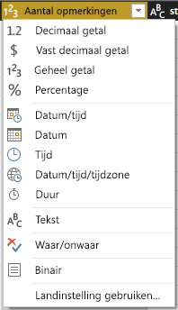
   
3. Selecteer **Sluiten en toepassen** of alleen **Toepassen** om de wijzigingen toe te passen terwijl u het Power Query-editorvenster open houdt. Zodra de wijzigingen zijn geladen, worden de gegevenslabels in het diagram gehele getallen. 
   
   
   
### Een gegevensslicer maken

U wilt het aantal opmerkingen over berichten visualiseren gedurende een bepaalde periode. U kunt een slicervisualisatie maken als u de gegevens in het diagram wilt filteren op andere perioden. 

1. Klik op een leeg gebied van het canvas en selecteer vervolgens het **slicerpictogram** in het visualisatiedeelvenster. Er wordt een lege slicervisualisatie weergegeven. 
   
   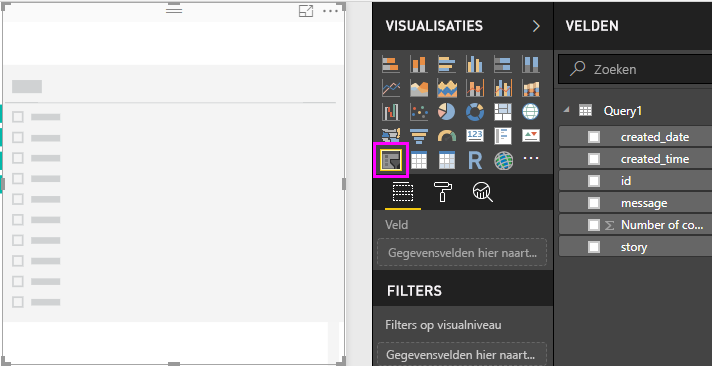
   
2. Selecteer het veld **created_date** in de veldenlijst of sleep het naar de nieuwe slicer. De slicer verandert in een schuifregelaar voor het datumbereik, op basis van het datumgegevenstype van het veld.
   
   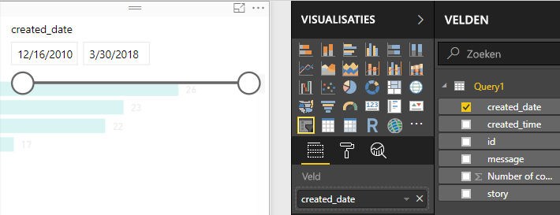
   
3. Verplaats de grepen van de schuifregelaar om verschillende datumbereiken te selecteren en merk op hoe de diagramgegevens op basis daarvan worden gefilterd. U kunt ook de datumvelden selecteren in de slicer en specifieke datums typen of deze kiezen in een pop-upkalender.
    
   
   
### De visualisaties opmaken

U besluit het diagram een aantrekkelijkere en meer beschrijvende titel te geven. 

1. Selecteer met het diagram geselecteerd het **opmaak**pictogram en selecteer de pijl van de vervolgkeuzelijst om **Titel** uit te vouwen.
2. Wijzig de **Titeltekst** in **Opmerkingen per bericht**. 
3. Selecteer de pijl van de vervolgkeuzelijst naast **Tekstkleur** en selecteer een groene kleur die overeenkomt met de groene staven van de visualisatie.
4. Vergroot de **Tekengrootte** in **10** en wijzig de **Lettertypefamilie** in **Segoe (Bold)**.

Experimenteer met andere opmaakopties en -instellingen om het uiterlijk van uw visualisaties te wijzigen. 

## Meer visualisaties maken

Zoals u ziet, is het zeer eenvoudig om visualisaties in uw rapport aan te passen om de gegevens te presenteren op de manieren waarop u wilt. Probeer bijvoorbeeld met behulp van de geïmporteerde Facebook-gegevens dit lijndiagram te maken met het aantal opmerkingen gedurende een bepaalde periode.

Power BI Desktop biedt een naadloze complete ervaring voor het ophalen van gegevens uit een breed scala aan gegevensbronnen en het vormgeven van deze gegevens om te voldoen aan uw analysebehoeften. Zo kunt u deze gegevens op uitgebreide en interactieve manieren visualiseren. Wanneer uw rapport klaar is, kunt u [het uploaden naar de Power BI-service](desktop-upload-desktop-files.md) en op basis van dit rapport dashboards maken die u kunt delen met andere Power BI-gebruikers.

## Volgende stappen
* [Andere zelfstudies voor Power BI Desktop lezen](http://go.microsoft.com/fwlink/?LinkID=521937)
* [Power BI Desktop-video's bekijken](http://go.microsoft.com/fwlink/?LinkID=519322)
* [Een bezoek brengen aan het Power BI-forum](http://go.microsoft.com/fwlink/?LinkID=519326)
* [Het Power BI-blog lezen](http://go.microsoft.com/fwlink/?LinkID=519327)

