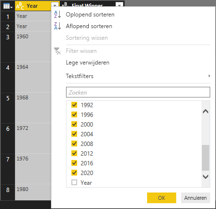
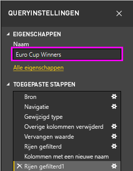
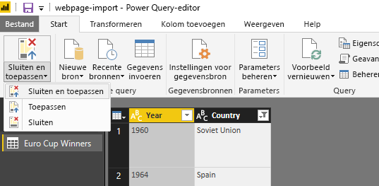
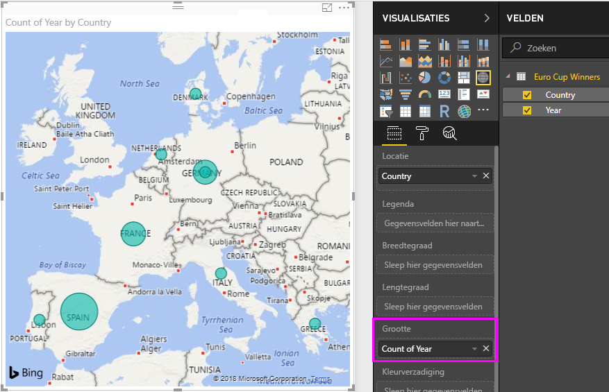

# Gegevens van een webpagina analyseren met Power BI Desktop (zelfstudie)
In deze zelfstudie leert u hoe u een tabel met gegevens uit een webpagina kunt importeren en een rapport kunt maken om deze gegevens te visualiseren. Als onderdeel van dit proces kunt u navigeren tussen tabellen die beschikbaar zijn op een webpagina en gegevenstransformatiestappen uitvoeren om de tabel een andere vorm te geven.

 In dit artikel:

* **Taak 1:** verbinding maken met een webgegevensbron
* **Taak 2:** gegevens vormgeven in de queryweergave
  * Stap 1: andere kolommen verwijderen, zodat alleen kolommen die van belang zijn worden weergegeven
  * Stap 2: waarden vervangen om waarden op te schonen in een geselecteerde kolom
  * Stap 3: waarden in een kolom filteren
  * Stap 4: naam van een kolom wijzigen
  * Stap 5: null-waarden in een kolom filteren
  * Stap 6: naam van een query wijzigen
  * Gemaakte querystappen
* **Taak 3:** visualisaties maken met behulp van de rapportweergave
  * Stap 1: de query voor uw rapport laden
  * Stap 2: een kaartvisualisatie maken

## Taak 1: verbinding maken met een webgegevensbron
 In taak 1 importeert u een wedstrijdsamenvattingstabel van de Wikipedia-pagina over de UEFA (UEFA European Football Championship) (Engelstalig) op de volgende locatie: http://en.wikipedia.org/wiki/UEFA\_European\_Football\_Championship

### Een Wikipedia-pagina toevoegen als gegevensbron
1. Selecteer in het dialoogvenster **Aan de slag** of op het linttabblad **Start** de optie **Gegevens ophalen**.
2. Het dialoogvenster **Gegevens ophalen** wordt geopend. Hierin kunt u voor het importeren van gegevens naar Power BI Desktop een keuze maken uit een breed scala aan gegevensbronnen. Wij selecteren **Web**, dat beschikbaar is onder de groep **Alles** of **Overige**.
3. Plak in het dialoogvenster **Webinhoud** in het tekstvak **URL** de Wikipedia-URL (http://en.wikipedia.org/wiki/UEFA\_European\_Football\_Championship).
4. Klik op **OK**.

Als u verbinding hebt met de webpagina, wordt in het dialoogvenster **Navigator** een lijst weergegeven met tabellen die beschikbaar zijn op deze Wikipedia-pagina (Engelstalig). Klik één keer op elk van deze tabellen om een preview van de gegevens te bekijken.

Selecteer in het linkerdeelvenster van **Navigator** de tabel **Resultaten [bewerken]** voor de wedstrijdsamenvattingsresultaten of selecteer de tabel **Resultaten [bewerken]** en selecteer  **Bewerken**. We kunnen nu de vorm van de tabel wijzigen voordat deze in het rapport wordt geladen, aangezien de gegevens niet de vorm hebben die we nodig hebben voor onze analyse.

Hiermee wordt een preview van de tabel in de queryweergave getoond, waar we een reeks transformatiestappen kunnen uitvoeren om de gegevens op te schonen.

## Taak 2: gegevens vormgeven in de queryweergave
Nu u de onderwerptabel hebt geselecteerd voor uw gegevensquery, leert u hoe u verschillende stappen voor vormgeving en opschoning van gegevens uitvoert.

**Stap 1**: andere kolommen verwijderen, zodat alleen kolommen die van belang zijn worden weergegeven

In deze stap verwijdert u alle kolommen behalve **Year** en **Final Winners**.

1. Selecteer in het raster **Queryvoorbeeld** de kolommen **Year** en **Final Winners** (gebruik **CTRL** + **klik**).
2. Klik met de rechtermuisknop op een kolomkop in het raster **Queryvoorbeeld** en klik op **Andere kolommen verwijderen** om de niet-geselecteerde kolommen te verwijderen. Deze bewerking is ook beschikbaar op het linttabblad **Start**, in de groep **Kolommen beheren**.

**Stap 2**: waarden vervangen om waarden op te schonen in een geselecteerde kolom

In deze stap vervangt u het achtervoegsel van Details in de kolom **Year**. Dit achtervoegsel bevindt zich op een nieuwe regel en is dus niet zichtbaar in de tabelpreview. Als u echter in een van de cellen met een numerieke waarde in de kolom Year klikt, ziet u de volledige waarde in de gedetailleerde weergave.

1. Selecteer de kolom **Year**.
2. Klik op het lint **Queryweergave** op **Waarden vervangen** onder het tabblad **Start** of klik met de rechtermuisknop op de kolom **Year** en klik op **Waarden vervangen** om Details te vervangen door een lege tekenreeks.
3. Typ in het dialoogvenster **Waarden vervangen** Details in het tekstvak **Te zoeken waarde** en laat het tekstvak **Vervangen door** leeg.
4. Klik op **OK**.

 **Stap 3**: waarden in een kolom filteren

In deze stap filtert u de kolom **Year** om rijen weer te geven die geen "Year" bevatten.

1. Klik op de pijl omlaag voor het filter voor de kolom **Year**.
2. Schakel in de vervolgkeuzelijst **Filter** de optie **Year** uit.
3. Klik op **OK**.

**Stap 4**: de naam van een kolom wijzigen

Nu we de gegevens in de kolom **Year** hebben opgeschoond, gaan we werken aan de kolom **Final Winner**.

Omdat we alleen de lijst met winnaars bekijken, kunnen we de naam van deze kolom wijzigen in **Country**.

1. Selecteer de kolom **Final Winner** in de querypreview.
2. Op het lint **Queryweergave** vindt u onder het tabblad **Transformeren** en de groep **Alle kolommen** de optie **Naam wijzigen**.
3. De kolomnaam kan nu worden bewerkt. We wijzigen de naam van deze kolom in **Country**.

**Stap 5**: null-waarden in een kolom filteren

We moeten ook de null-waarden uit de kolom **Country** filteren. Hiervoor kunnen we het filtermenu gebruiken zoals we in stap 3 hebben gedaan, maar kunnen we ook:

1. Met de rechtermuisknop klikken op een van de cellen in de kolom **Country** met een null-waarde.
2. **Tekstfilters -\> Niet gelijk aan** in het contextmenu selecteren.
3. Hiermee maakt u een nieuwe filterstap voor het verwijderen van rijen met null-waarden in de kolom **Country**.

**Stap 6:** een query een naam geven

In deze stap geeft u de uiteindelijke query de naam **Euro Cup Winners**.

1. Voer in het deelvenster **Queryinstellingen** in het tekstvak **Naam** **Euro Cup Winners** in.
   
   

## Taak 3: visualisaties maken met behulp van de rapportweergave
Nu we de gegevens hebben omgezet in de vorm die we nodig hebben voor onze analyse, kunnen we de resulterende tabel laden in ons rapport en een paar visualisaties maken.

**Stap 1**: de query in uw rapport laden

Om de queryresultaten naar Power BI Desktop te laden en een rapport te maken, selecteren we **Sluiten en laden** vanuit het lint **Start**.

Hiermee wordt de query geëvalueerd en wordt de tabeluitvoer naar het rapport geladen. Selecteer in Power BI Desktop het pictogram **rapport** om Power BI Desktop in de rapportweergave weer te geven.

U ziet de resulterende tabelvelden in het deelvenster **Velden** aan de rechterkant van de **rapportweergave**.

**Stap 2**: een kaartvisualisatie maken

Om een visualisatie te maken, kunnen we velden slepen uit de lijst **Veld** en ze neerzetten in het canvas **Rapport**.

1. Versleep het veld **Country** en zet het neer in het **rapportcanvas**. Hiermee wordt een nieuwe visualisatie in het **rapportcanvas** gemaakt. In dit geval wordt er een **kaartvisualisatie** gemaakt, aangezien we een lijst met landen hebben.
   
   
2. We kunnen eenvoudig het type visualisatie wijzigen door op een ander pictogram te klikken in het deelvenster **Visualisatie**.
   
   
3. We houden het type visualisatie ingesteld op **Kaart**. We kunnen de grootte van de visualisatie ook aanpassen door een van de hoeken van de visualisatie tot de juiste grootte te verslepen.
   
   
4. Momenteel hebben alle punten op de kaart dezelfde grootte. We willen dit wijzigen zodat landen die meer Euro Cup-wedstrijden hebben gewonnen met een grotere punt op de kaart worden weergegeven. Hiervoor kunnen we het veld **Year** in de **Veldenlijst** verslepen naar het vak **Waarden** in de onderste helft van het deelvenster **Velden**.
   
   

Zoals u ziet, is het zeer eenvoudig om visualisaties van uw rapport aan te passen om de gegevens te presenteren op de manier waarop u wilt. Power BI Desktop biedt een naadloze complete ervaring voor het ophalen van gegevens uit een breed scala aan gegevensbronnen en het vormgeven van deze gegevens om te voldoen aan uw analysebehoeften. Zo kunt u deze gegevens op uitgebreide en interactieve manieren visualiseren. Wanneer uw rapport klaar is, kunt u [het uploaden naar Power BI](desktop-upload-desktop-files.md) en op basis van dit rapport dashboards maken die u kunt delen met andere Power BI-gebruikers.

Hiermee is de zelfstudie **Gegevens van een webpagina importeren** voltooid. U kunt het voltooide Power BI Desktop-bestand [hier](http://download.microsoft.com/download/1/4/E/14EDED28-6C58-4055-A65C-23B4DA81C4DE/Analyzing_Data_From_The_Web.pbix) downloaden.

## Waar vind ik meer informatie?
* [Andere zelfstudies voor Power BI Desktop lezen](http://go.microsoft.com/fwlink/?LinkID=521937)
* [Power BI Desktop-video's bekijken](http://go.microsoft.com/fwlink/?LinkID=519322)
* [Een bezoek brengen aan het Power BI-forum](http://go.microsoft.com/fwlink/?LinkID=519326)
* [Het Power BI-blog lezen](http://go.microsoft.com/fwlink/?LinkID=519327)

