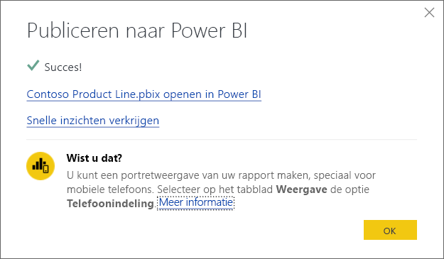

# Publiceren vanuit Power BI Desktop
Als u een **Power BI Desktop**-bestand publiceert naar de **Power BI-service**, worden de gegevens in het model en eventuele rapporten die u in de **rapportweergave** hebt gemaakt, gepubliceerd naar uw Power BI-werkruimte. U ziet een nieuwe gegevensset met dezelfde naam (en eventuele rapporten) in uw werkruimtenavigator.

Het publiceren vanuit **Power BI Desktop** heeft hetzelfde effect als **Gegevens ophalen** gebruiken in Power BI om verbinding te maken met een **Power BI Desktop**-bestand en er gegevens naar te uploaden.

> [!NOTE]
> Als u wijzigingen aanbrengt aan het Power BI-rapport (bijvoorbeeld visuele elementen toevoegen aan, verwijderen uit of wijzigen in rapporten), worden deze niet opgeslagen in het oorspronkelijke **Power BI Desktop**-bestand.
> 
> 

## Power BI Desktop-gegevenssets en -rapporten publiceren
1. In Power BI Desktop via \> **Bestand** \> **Publiceren** \> **Publiceren naar Power BI** of klik op **Publiceren** op het lint.  
   
2. Meld u aan bij Power BI.

Als u klaar bent, ontvangt u een koppeling om uw rapport op uw Power BI-site te openen.  
    

## Een vanuit Power BI Desktop gepubliceerde gegevensset opnieuw publiceren of vervangen
Als u een **Power BI Desktop**-bestand publiceert, worden de gegevensset en eventuele rapporten die u in **Power BI Desktop** hebt gemaakt, geüpload naar uw Power BI-site. Als u uw **Power BI Desktop**-bestand opnieuw publiceert, wordt de gegevensset op uw Power BI-site vervangen door de bijgewerkte gegevensset uit het **Power BI Desktop**-bestand.

Dit is allemaal erg eenvoudig, maar u mag een paar dingen niet vergeten:

* Als u al twee of meer gegevenssets in Power BI hebt met dezelfde naam als het **Power BI Desktop**-bestand, kan het publiceren mislukken. Zorg ervoor dat u slechts één gegevensset in Power BI hebt met dezelfde naam. U kunt het bestand ook een andere naam geven en dit publiceren, waardoor u een nieuwe gegevensset maakt met dezelfde naam als het bestand.
* Als u een kolom of meting verwijdert of een andere naam geeft, raken eventuele visuele elementen die al in Power BI met dat veld voorkomen, beschadigd. 
* Power BI negeert een aantal wijzigingen aan de indeling van bestaande kolommen. Bijvoorbeeld als u de indeling van een kolom wijzigt van 0,25 in 25%.
* Als u een vernieuwingsschema voor uw bestaande gegevensset in Power BI hebt geconfigureerd en u voegt nieuwe gegevensbronnen aan uw bestand toe om ze vervolgens opnieuw te publiceren, moet u zich bij deze gegevensbronnen aanmelden in *Gegevensbronnen beheren* voordat u een nieuwe, geplande vernieuwing uitvoert.

