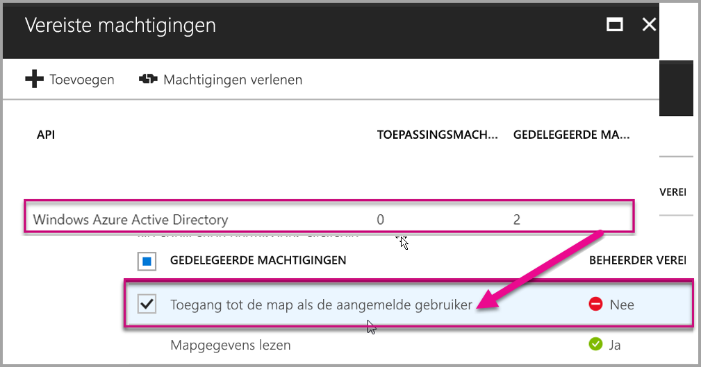
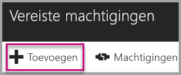
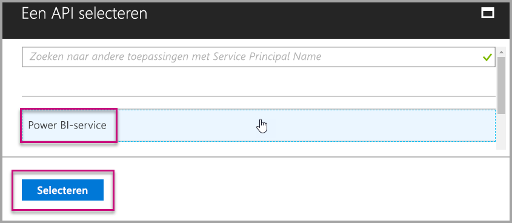
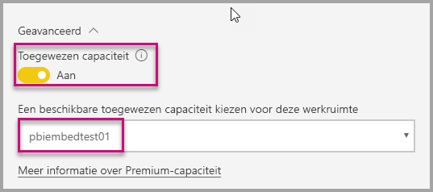

# Zelfstudie: een Power BI-rapport, dashboard of tegel insluiten in een toepassing voor uw klanten
Met **Power BI Embedded in Azure** kunt u rapporten, dashboards en tegels in een toepassing insluiten met de **gegevens waarvan de app eigenaar is**. Als **de app eigenaar is van de gegevens** kunt u een toepassing gebruiken die Power BI gebruikt als ingesloten analytics platform. Dit is doorgaans een scenario voor een **ISV-ontwikkelaar**. Als **ISV-ontwikkelaar** kunt u Power BI-inhoud maken waarmee rapporten, dashboards of tegels worden weergegeven in een toepassing die volledig geïntegreerd en interactief is, zonder dat gebruikers van de toepassing een licentie voor Power BI moeten hebben, of zelfs merken dat achter de schermen Power BI wordt gebruikt. In deze zelfstudie leert u hoe u een rapport in een toepassing kunt integreren met de .NET SDK voor **Power BI** en de JavaScript-API voor **Power BI** bij gebruik van **Power BI Embedded in Azure** voor uw klanten wanneer de **app eigenaar is van de gegevens**.

In deze zelfstudie leert u het volgende:
>[!div class="checklist"]
>* Een toepassing registreren in Azure.
>* Een Power BI-rapport insluiten in een toepassing.

## Vereisten
Als u wilt beginnen, hebt u een **Power BI Pro**-account als **hoofdaccount** en een **Microsoft Azure**-abonnement nodig.

* Als u zich niet hebt geregistreerd voor **Power BI Pro**, [kunt u zich hier aanmelden voor een gratis proefversie](https://powerbi.microsoft.com/en-us/pricing/) voordat u begint.
* Als u nog geen abonnement op Azure hebt, maakt u een [gratis account](https://azure.microsoft.com/free/?WT.mc_id=A261C142F) voordat u begint.
* U moet beschikken over een eigen [Azure Active Directory-tenant ](create-an-azure-active-directory-tenant.md).
* [Visual Studio](https://www.visualstudio.com/) moet zijn geïnstalleerd (versie 2013 of hoger).

## De ingesloten analytische ontwikkelomgeving instellen

Voordat u begint met het insluiten van dashboards, rapporten en tegels in uw toepassing, moet u ervoor zorgen dat uw omgeving is ingesteld voor het insluiten van inhoud. Als onderdeel van het instellingsproces moet u het volgende doen.

### Een toepassing registreren in Azure Active Directory (Azure AD)

U kunt uw toepassing registreren bij Azure Active Directory AD zodat uw toepassing toegang heeft tot de Power BI REST-API's. Hiermee kunt u een identiteit instellen voor uw toepassing en machtigingen opgeven voor Power BI REST-resources.

1. Accepteer de [algemene voorwaarden van de Microsoft Power BI-API](https://powerbi.microsoft.com/api-terms).

2. Meld u aan bij [Azure Portal](https://portal.azure.com).
 
    

3. Kies in het navigatiedeelvenster links **Alle services**, selecteer **App-registraties** en selecteer **Registratie van nieuwe toepassing**.
   
     
    

4. Volg de aanwijzingen en maak een nieuwe toepassing. Als de app eigenaar is van de gegevens, gebruikt **Systeemeigen** als het toepassingstype. Daarnaast moet u een **omleidings-URI** opgeven, die **Azure AD** gebruikt om tokenantwoorden te retourneren. Voer een specifieke waarde in voor uw toepassing (bijvoorbeeld http://localhost:13526/redirect).

    

### Machtigingen toepassen op uw toepassing in Azure Active Directory

U moet extra machtigingen inschakelen voor uw toepassing naast de informatie die u hebt opgegeven op de pagina voor de app-registratie. U moet zijn aangemeld met het *hoofd*account, dat wordt gebruikt voor insluiting, of een globaal beheerdersaccount.

### Azure Active Directory-portal gebruiken

1. Blader naar [App-registraties](https://portal.azure.com/#blade/Microsoft_AAD_IAM/ApplicationsListBlade) in Azure Portal en selecteer de app die u gebruikt voor insluiting.
   
    

2. Selecteer **Instellingen** en selecteer **Vereiste machtigingen**, onder **API-toegang**.
   
    

3. Selecteer **Windows Azure Active Directory** en controleer vervolgens of **De map openen als de aangemelde gebruiker** is geselecteerd. Selecteer **Opslaan**.
   
    

4. Selecteer **Toevoegen**.

    

5. Selecteer **Een API selecteren**.

    

6. Selecteer **Power BI-service** en selecteer vervolgens **Selecteren**.

    

7. Selecteer alle machtigingen onder **Gedelegeerde machtigingen**. U moet deze één voor één selecteren om ze te kunnen opslaan. Selecteer **Opslaan** wanneer u klaar bent.
   
    

8. Selecteer binnen **Vereiste machtigingen** de optie **Machtigingen verlenen**.
   
    De actie **Machtigingen verlenen** is vereist voor de *hoofdaccount* om te voorkomen dat om toestemming wordt gevraagd door Azure AD. Als de account die deze actie uitvoert een globale beheerder is, verleent u machtigingen voor alle gebruikers binnen uw organisatie voor deze toepassing. Als de account die deze actie uitvoert de *hoofdaccount* is en niet een globale beheerder, verleent u alleen machtigingen aan de *hoofdaccount* voor deze toepassing.
   
    

## Uw Power BI-omgeving instellen

### Een app-werkruimte maken

Als u rapporten, dashboards of tegels voor uw klanten insluit, moet u uw inhoud binnen de werkruimte van een app plaatsen. Het *hoofd*account moet een beheerder van de app-werkruimte zijn.

1. Maak eerst de werkruimte. Selecteer **Werkruimten** > **App-werkruimte maken**. Hier wordt de inhoud geplaatst waartoe de toepassing toegang moet hebben.

    

2. Geef een naam op voor de werkruimte. Als de corresponderende **werkruimte-id** niet beschikbaar is, kunt u deze bewerken tot een unieke aanduiding. Dit wordt ook de naam van de app.

    

3. U moet een aantal opties instellen. Als u **Openbaar** kiest, is de inhoud van de werkruimte zichtbaar voor iedereen in de organisatie. Als u **Privé** kiest, is de inhoud alleen zichtbaar voor leden van de werkruimte.

    

    U kunt de instelling Openbaar/Privé niet meer wijzigen nadat u de groep hebt gemaakt.

4. U kunt ook kiezen of leden van de werkruimte rechten voor **bewerken** of **alleen-lezen** krijgen.

    

5. Voeg de e-mailadressen toe van de personen die u toegang tot de werkruimte wilt geven, en selecteer **Toevoegen**. U kunt geen groepsaliassen toevoegen, alleen personen.

6. Bepaal per persoon of deze een lid of een beheerder is. Beheerders kunnen de werkruimte zelf bewerken, en bijvoorbeeld ook andere leden toevoegen. Leden kunnen de inhoud in de werkruimte bewerken, tenzij ze alleen leesrechten hebben. Zowel beheerders als leden kunnen de app publiceren.

Nu kunt u de nieuwe werkruimte weergeven. De werkruimte wordt gemaakt en in Power BI geopend. De werkruimte wordt weergegeven in de lijst met werkruimten waarvan u lid bent. Omdat u een beheerder bent, kunt u het weglatingsteken (...) selecteren om terug te gaan en wijzigingen aanbrengen, bijvoorbeeld nieuwe leden toevoegen of machtigingen van leden wijzigen.

   

### Rapporten maken en publiceren

U kunt de rapporten en gegevenssets maken met Power BI Desktop en de rapporten vervolgens publiceren naar een app-werkruimte. De eindgebruiker die de rapporten naar een app-werkruimte publiceert, moet beschikken over een Power BI Pro-licentie.

1. Download het voorbeeld van de [blogdemo](https://github.com/Microsoft/powerbi-desktop-samples) vanuit GitHub.

    

2. Open het voorbeeld-PBIX-rapport in **Power BI Desktop**.

   

3. Publiceer het rapport naar de **app-werkruimte**.

   

    U kunt het rapport nu weergeven in de Power BI-service online.

   

## Uw inhoud insluiten

Als u voor uw klanten inhoud in uw toepassing wilt insluiten, is een **toegangstoken** vereist voor het hoofdaccount van **Azure AD**. U moet een [Azure AD-toegangstoken ophalen](get-azuread-access-token.md#access-token-for-non-power-bi-users-app-owns-data) voor uw Power BI-toepassing met een app die eigenaar is van de gegevens voordat u de Power BI API kunt aanroepen.

Volg deze stappen om inhoud in te sluiten met een voorbeeldtoepassing.

1. Download het [voorbeeld waarin de app eigenaar is van de gegevens](https://github.com/Microsoft/PowerBI-Developer-Samples) vanuit GitHub om aan de slag te gaan.

    

2. Open het bestand Web.config in de voorbeeldtoepassing. Er zijn vijf velden die u moet invullen voor een correcte uitvoering van de toepassing: **clientID**, **groupId**, **reportId**, **pbiUsername** en **pbiPassword**.

      

    * Vul bij **clientId** de **toepassings-ID** van **Azure** in. **clientId** wordt door de toepassing gebruikt om zich te identificeren bij de gebruikers bij wie ze machtigingen aanvragen. Ga als volgt te werk om de **client-id** op te halen:

    1. Meld u aan bij [Azure Portal](https://portal.azure.com).

        

    2. Kies in het navigatiedeelvenster links **Alle services** en selecteer **App-registraties**.

        
    3. Selecteer de toepassing waarvoor u de **client-id** wilt ophalen.

        

    4. U ziet een **toepassings-ID** die wordt vermeld als een GUID. Gebruik deze **toepassings-ID** als de **client-id** voor de toepassing.

             

    * Vul bij **groupId** informatie over de **app-werkruimte-GUID** uit Power BI in.

        

    * Vul bij **reportId** informatie over de **rapport-GUID** uit Power BI in.

            

    * Vul bij **pbiUsername** het Power BI-account van de hoofdgebruiker in.
    * Vul bij **pbiPassword** het wachtwoord van het Power BI-account van de hoofdgebruiker in.

3. Nu kunt u de toepassing uitvoeren.

    Selecteer eerst **Uitvoeren** in **Visual Studio**.

    

    Selecteer vervolgens **Rapport insluiten**. Selecteer de optie die overeenkomt met het item dat u wilt testen (rapporten, dasboards of tegels).

    
 
    U kunt het rapport nu weergeven in de voorbeeldtoepassing.

    

## Verplaatsen naar productie

Nu u uw toepassing hebt ontwikkeld, is het tijd om aan uw app-werkruimte toegewezen capaciteit toe te voegen. Toegewezen capaciteit is vereist voor het verplaatsen naar productie.

### Een toegewezen capaciteit maken
Als u een toegewezen capaciteit maakt, profiteert u van een toegewezen resource voor uw klant. Werkruimten die niet zijn toegewezen aan een toegewezen capaciteit, bevinden zich in een gedeelde capaciteit. U maakt een toegewezen capaciteit met de oplossing voor [Power BI Embedded-toegewezen capaciteit](https://docs.microsoft.com/azure/power-bi-embedded/create-capacity) in Azure.

>[!Note]
>Insluitingstokens met een PRO-licentie zijn bedoeld voor ontwikkelingstesten, dus een Power BI-hoofdaccount kan maar een beperkt aantal insluitingstokens genereren. U moet een toegewezen capaciteit aanschaffen voor het insluiten van items in een productieomgeving. Met een toegewezen capaciteit kunt u een onbeperkt aantal insluitingstokens genereren. Ga naar [Beschikbare functies ophalen](https://msdn.microsoft.com/library/mt846473.aspx) om de waarde voor het gebruik te controleren. Hiermee wordt het huidige gebruik van insluitingstokens in procenten aangegeven.
>

### App-werkruimte toewijzen aan toegewezen capaciteit

Zodra een toegewezen capaciteit is gemaakt, moet u de app-werkruimte toewijzen aan de toegewezen capaciteit. Ga hiervoor als volgt te werk.

1. Vouw binnen de **Power BI-service** werkruimten uit en selecteer het beletselteken voor de werkruimte waarin u uw inhoud insluit. Selecteer vervolgens **Werkruimten bewerken**.

    

2. Vouw **Geavanceerd** uit, schakel **Toegewezen capaciteit** in en selecteer de toegewezen capaciteit die u hebt gemaakt. Selecteer vervolgens **Opslaan**.

    

Voor een volledig voorbeeld van het gebruik van de JavaScript-API kunt u het [hulpprogramma Playground](https://microsoft.github.io/PowerBI-JavaScript/demo) gebruiken. Hiermee kunt u op een snelle manier verschillende typen Power BI Embedded-voorbeelden uitproberen. Op de [wikipagina voor Power BI JavaScript](https://github.com/Microsoft/powerbi-javascript/wiki) vindt u ook meer informatie over de JavaScript-API.

Als u meer vragen hebt over Power BI Embedded, gaat u naar de pagina met [veelgestelde vragen](embedded-faq.md).  Als u in uw toepassing problemen ondervindt met Power BI Embedded, gaat u naar de pagina voor [probleemoplossing](embedded-troubleshoot.md).

Hebt u nog vragen? [Misschien dat de Power BI-community het antwoord weet](http://community.powerbi.com/)