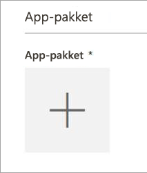
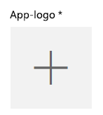

# Aangepaste visuele elementen publiceren naar AppSource
Meer informatie over het publiceren van aangepaste visuele elementen naar AppSource, zodat anderen deze kunnen gebruiken. office

Als u een aangepast visueel element hebt gemaakt, wilt u het wellicht publiceren naar AppSource zodat andere personen het ook kunnen gebruiken. Voordat u kunt dit doen, moet u een aantal voorbereidende stappen uitvoeren. Zie [Ontwikkelhulpprogramma's gebruiken voor het maken van aangepaste visuele elementen](../service-custom-visuals-getting-started-with-developer-tools.md) voor meer informatie over het maken van aangepaste visuele elementen.

Wat is AppSource? Hier vindt u SaaS-apps en -invoegtoepassingen voor uw Microsoft-producten en -service. [AppSource](https://appsource.microsoft.com/marketplace/apps?product=power-bi-visuals) verbindt miljoenen gebruikers van Office 365-, Dynamics 365-, Cortana Intelligence- en andere oplossingen die hen helpen efficiënter, slimmer of netter te werken.

## Voorbereiding voor het indienen van uw aangepaste visuele element
Als u klaar bent met het programmeren en testen van uw aangepaste visuele element en het hebt verpakt in een PBIVIZ-bestand, moet u ook het volgende gereed hebben voor uw indiening.

| Item | Vereist | Beschrijving |
| --- | --- | --- |
| Pbiviz-pakket met alle vereiste metagegevens |Ja |Naam van visuele element Weergavenaam GUID Versie Beschrijving Naam en e-mailadres van auteur |
| Voorbeeld van PBIX-rapportbestand |Ja |Ter promotie van uw visuele element, moet u gebruikers helpen om vertrouwd te raken met het visuele element. U moet de toegevoegde waarde van het visuele element voor de gebruiker benadrukken en voorbeelden geven van het gebruik, opmaakopties, enzovoort. U kunt ook een *hints*-pagina aan het einde toevoegen met een aantal tips en trucs, dingen die men moet vermijden en dergelijke. Het voorbeeld van een pbix-rapportbestand moet offline werken, zonder een externe verbinding |
| Pictogram |Ja |U moet een logo voor het aangepaste visuele element maken. Dit logo wordt in de webwinkel weergegeven. De ondersteunde bestandsindelingen zijn PNG, JPG, JPEG en GIF. Het logo moet een grootte hebben van exact 300 bij 300 pixels (breedte x hoogte). **Belangrijk** Lees de [korte handleiding](https://docs.microsoft.com/en-us/office/dev/store/craft-effective-appsource-store-images) zorgvuldig door voordat u het pictogram verstuurt. |
| Schermopnamen |Ja |U moet ten minste één schermopname aanleveren. De ondersteunde bestandsindelingen zijn PNG, JPG, JPEG en GIF. De schermopname moet een grootte hebben van exact 1366 bij 768 pixels (breedte x hoogte). Het bestand mag niet groter zijn dan 1024 kB. *Voeg tekstballonnen toe met meer informatie over de toegevoegde waarde van de belangrijkste functies die worden weergegeven in elke schermopname.* |
| Koppeling naar ondersteuning voor de download |Ja |Geef de URL op waar klanten terecht kunnen voor ondersteuning bij eventuele problemen met uw visuele element. De URL moet https:// of http:// bevatten. |
| Koppeling naar privacydocument |Ja |Geef een koppeling op naar het privacybeleid voor klanten die gebruikmaken van het visuele element. De koppeling moet https:// of http:// bevatten. |
| Gebruiksrechtovereenkomst |Ja |U moet een bestand met een gebruiksrechtovereenkomst uploaden. U kunt uw eigen gebruiksrechtovereenkomst gebruiken, of de standaardgebruiksrechtovereenkomst voor aangepaste visuele elementen van Power BI in de Office-store. Als u de standaardgebruiksrechtovereenkomst wilt gebruiken, plakt u de volgende URL in het dialoogvenster voor het uploaden van het bestand 'Gebruiksrechtovereenkomst' van het verkoperdashboard: [https://visuals.azureedge.net/app-store/Power BI - Default Custom Visual EULA.pdf](https://visuals.azureedge.net/app-store/Power BI - Default Custom Visual EULA.pdf). |
| Koppeling naar video |Nee |Om de interesse van gebruikers voor uw aangepaste visuele element te vergroten, wordt u aangeraden een koppeling naar een video over het visuele element op te geven. De URL moet https:// of http:// bevatten. |
| GitHub-opslagplaats |Nee |U dient bij voorkeur een geldige [GitHub](https://www.github.com)-opslagplaats en een openbare koppeling daarnaartoe te hebben, met bronnen van uw visuele element en voorbeeldgegevens zodat andere ontwikkelaars feedback kunnen geven en verbeteringen van uw code kunnen voorstellen. |

## Indienen bij Power BI
Eerst verzendt u een e-mailbericht naar het Power BI-team voor indiening van aangepaste visuele elementen. U kunt uw e-mailbericht verzenden naar [pbivizsubmit@microsoft.com](mailto:pbivizsubmit@microsoft.com).

> [!IMPORTANT]
> De volgende velden in het pbiviz.json-bestand moeten worden ingevuld voordat u het .pbiviz-pakket maakt: description, supportUrl, author, name en email.
> 

Voeg het PBIVIZ-bestand en het PBIX-voorbeeldrapportbestand als bijlagen toe aan uw e-mailbericht. Het team van Power BI stuurt u vervolgens een bericht met instructies en een XML-app-pakketbestand dat u moet uploaden. Dit XML-app-pakket is vereist voor het indienen van het visuele element via het Office-ontwikkelaarscentrum.

> [!NOTE]
> Om de kwaliteit te verbeteren en ervoor te zorgen dat bestaande rapporten niet worden verbroken, duurt het twee weken extra voordat wijzigingen in bestaande visuele elementen worden doorgevoerd in de productieomgeving na goedkeuring in de store.
> 
> 

## Verzenden naar AppSource
Wanneer u het XML-app-pakket van het Power BI-team krijgt, navigeert u naar het [ontwikkelaarscentrum](https://sellerdashboard.microsoft.com/Application/Summary) om het visuele element in te dienen bij AppSource.

> [!NOTE]
> U hebt een geldig Office-ontwikkelaarsaccount nodig om te kunnen inloggen bij het [Office-ontwikkelaarscentrum](https://dev.office.com/). Een Office-ontwikkelaarsaccount moet een Microsoft-account zijn (Live ID, zoals hotmail.com of outlook.com).
> 
> [!IMPORTANT]
> U moet een e-mailbericht met het PBIVIZ-bestand en het PBIX-bestand verzenden naar het Power BI-team vóór indiening bij AppSource. Hierdoor kan het Power BI-team de bestanden uploaden naar de openbare shareserver. Anders kunnen de bestanden niet worden opgehaald in de store. U moet de bestanden verzenden bij elke nieuwe indiening van een visueel element, elke wijziging in een bestaand visueel element, en eventuele oplossingen voor inzendingen die zijn geweigerd.
> 
> 

### Indieningsproces voor een visueel element
Voer de volgende stappen uit om de inzending te voltooien.

1. Selecteer **Een nieuwe app toevoegen**.
   
    
2. Selecteer **Aangepast visueel Power BI-element** en vervolgens **Volgende**.
3. Selecteer de **+** onder **App-pakket** en selecteer het XML-bestand van het app-pakket dat u hebt ontvangen van het Power BI-team in het dialoogvenster Bestand openen.
   
    
4. Als het goed is, ontvangt u een goedkeuringsbericht dat dit een geldig Power BI-app-pakket is.
   
    
5. Vul de details van **Algemene informatie** in.
   
   * *Titel van inzending:* naam van uw inzending in het ontwikkelaarscentrum
   * *Versie:* uw versienummer wordt automatisch ingevuld op basis van het app-pakket van uw invoegtoepassing.
   * *Releasedatum (UTC):* selecteer een datum voor de release van uw app in de store. Als u een datum in de toekomst kiest, is uw app pas vanaf die datum beschikbaar in de store.
   * *Categorie:* de eerste categorie wordt automatisch ingevuld als "Gegevensvisualisatie + BI". Alle aangepaste Power BI-visuals worden zo gelabeld. U mag maximaal twee extra categorieën opgeven zodat gebruikers uw visual eenvoudig kunnen vinden.
   * *Testopmerkingen:* optioneel, voor als u bepaalde instructies voor de testers van Microsoft wilt opgeven
   * *Mijn app bevat of gebruikt versleuteling of cryptografie, of roept versleuteling of cryptografie aan:* laat dit selectievakje uitgeschakeld
   * *Deze invoegtoepassing beschikbaar maken in de catalogus met Office-invoegtoepassingen op de iPad:* laat dit selectievakje uitgeschakeld
6. Upload het logo van uw visuele element door **+** te selecteren onder **App-logo**. Selecteer vervolgens het pictogrambestand in het dialoogvenster Bestand openen. Het bestand moet een PNG-, JPG-, JPEG- of GIF-bestand zijn. Het logo moet exact 300 bij 300 pixels (breedte x hoogte) zijn en het bestand mag niet groter zijn dan 512 kB.
   
    
7. Vul de details van **Ondersteuningsdocumenten** in.
   
   * Koppeling naar ondersteuningsdocument
   * Koppeling naar privacydocument
   * Koppeling naar video
   * Gebruiksrechtovereenkomst
     
       U moet een bestand met een gebruiksrechtovereenkomst uploaden. U kunt uw eigen gebruiksrechtovereenkomst gebruiken, of de standaardgebruiksrechtovereenkomst voor aangepaste visuele elementen van Power BI in de Office-store. Als u de standaardgebruiksrechtovereenkomst wilt gebruiken, plakt u de volgende URL in het dialoogvenster voor het uploaden van het bestand 'Gebruiksrechtovereenkomst' van het verkoperdashboard: [https://visuals.azureedge.net/app-store/Power BI - Default Custom Visual EULA.pdf](https://visuals.azureedge.net/app-store/Power BI - Default Custom Visual EULA.pdf).
8. Selecteer **Volgende** om door te gaan naar de pagina **Details**.
9. Selecteer **Taal** en kies een taal in de lijst.
   
    
10. Vul de details van Beschrijving in.
    
    * *App-naam (voor deze taal):* voer de titel van uw app in, zoals die moet worden weergegeven in de webwinkel.
    * *Korte beschrijving:* voer de korte beschrijving van uw app in (maximaal 100 tekens), zoals die moet worden weergegeven in de webwinkel. Deze beschrijving wordt weergegeven op de pagina's van het hoogste niveau, samen met het logo. U kunt de beschrijving van het PBIVIZ-pakket gebruiken.
    * *Lange beschrijving:* geef een gedetailleerde beschrijving van uw app op. Deze beschrijving wordt weergegeven voor klanten op de pagina met detailgegevens van uw app. Als u uw visuele element wilt laten verbeteren door de community door het visuele element open source te maken, geeft u hier de koppeling naar de openbare opslagplaats, zoals GitHub, op.
11. Upload ten minste één schermopname. De ondersteunde bestandsindelingen zijn PNG, JPG, JPEG en GIF. De schermopname moet een grootte hebben van exact 1366 bij 768 pixels (breedte x hoogte). Het bestand mag niet groter zijn dan 1024 kB. *Voeg tekstballonnen toe met meer informatie over de toegevoegde waarde van de belangrijkste functies die worden weergegeven in elke schermopname.*
12. Als u meer talen wilt toevoegen, selecteert u **Een taal toevoegen** en herhaalt u stap 10 en 11. Het toevoegen van meer talen helpt uw gebruikers om de details van het aangepaste visuele element weer te geven in hun eigen taal. Als de gebruiker een taal selecteert die u niet hebt toegevoegd, wordt standaard de taal gebruikt die u als eerste hebt toegevoegd.
13. Wanneer u klaar bent met het toevoegen van talen, selecteert u **Volgende** om door te gaan naar de pagina **Toegang blokkeren**.
14. Als u wilt voorkomen dat klanten in specifieke landen of regio's uw app kunnen gebruiken of kopen, schakelt u het selectievakje in en selecteert u de landen in de lijst.
15. Selecteer **Volgende** om door te gaan naar de pagina **Prijzen**.
16. Op dit moment worden alleen *gratis* visuele elementen ondersteund en zijn aanvullende aankopen binnen het visuele element (in-app aankopen) niet toegestaan. Selecteer **Deze app is gratis**. 
    
    > [!NOTE]
    > Als u een andere optie dan gratis selecteert of als het element inhoud bevat voor een in-app aankoop, wordt de inzending geweigerd.
    > 
    > 
17. U kunt nu **Opslaan als concept** selecteren en de visual later indienen, of **Indienen voor goedkeuring** selecteren om de aangepaste visual in te dienen bij de Office-store.

## Status en gebruik van de inzending bijhouden
U kunt de [validatiebeleidsregels](https://dev.office.com/officestore/docs/validation-policies#13-power-bi-custom-visuals) controleren.

Na het indienen kunt u de status van uw inzending volgen in het [app-dashboard](https://sellerdashboard.microsoft.com/Application/Summary/).

## Het visuele element certificeren
Nadat het visuele element is gemaakt, kunt u het desgewenst laten certificeren. Dit betekent dat het kan worden uitgevoerd in de Power BI-service en kan worden gebruikt met andere functies van de service, zoals exporteren naar PowerPoint. Zie [Een aangepast visueel element laten *certificeren*](../power-bi-custom-visuals-certified.md) voor meer informatie.

## Volgende stappen
[Aangepaste visuele elementen maken met behulp van ontwikkelhulpprogramma's](../service-custom-visuals-getting-started-with-developer-tools.md)  
[Visualisaties in Power BI](../power-bi-report-visualizations.md)  
[Aangepaste visualisaties in Power BI](../power-bi-custom-visuals.md)  
[Een aangepast visueel element laten *certificeren*](../power-bi-custom-visuals-certified.md)

Nog vragen? [Misschien dat de Power BI-community het antwoord weet](http://community.powerbi.com/)

