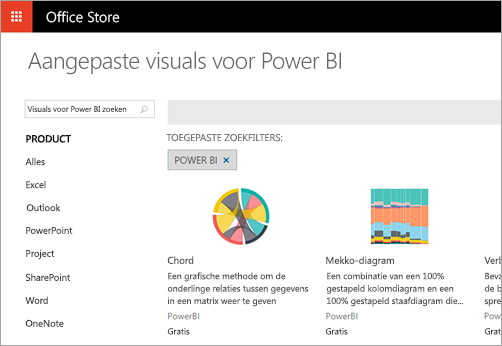

# Wat kunnen ontwikkelaars doen met Power BI?
Power BI biedt tal van opties voor ontwikkelaars. Dit varieert van het insluiten van items tot aangepaste visuals en het streamen van gegevenssets.

## Insluiten
De Power BI-service en Power BI Embedded in Azure bieden samen een enkele API voor het insluiten van uw dashboards en rapporten. Dit houdt in dat u één API-service, een consistente set mogelijkheden en toegang tot de nieuwste functies van Power BI (zoals dashboards, gateways en app-werkruimten) gebruikt voor het insluiten van uw inhoud. Zie [Insluiten met Power BI](embedding.md) voor meer informatie.

## Aangepaste visuele elementen
Met aangepaste visuele elementen kunt u uw eigen visuele elementen maken voor gebruik in Power BI-rapporten. Aangepaste visuele elementen worden geschreven in TypeScript. Dit is een hoofdverzameling van JavaScript die sommige geavanceerde functies en vroege toegang tot ES6/ES7-functionaliteit ondersteunt. De stijl van visuele elementen wordt afgehandeld met behulp van Cascading Styles Sheets (CSS). Voor uw gemak gebruiken we de Less-precompiler die enkele geavanceerde functies ondersteunt, zoals nesten, variabelen, combinaties, voorwaarden, lussen, enzovoort. Als u geen van deze functies wilt gebruiken, kunt u gewone css gebruiken in het Less-bestand.

Zie [Aangepaste visuele elementen publiceren in de Office Store](office-store.md) voor meer informatie over het ontwikkelen en publiceren van een aangepast visueel element.

## Gegevens pushen naar Power BI
U kunt de Power BI-API gebruiken om gegevens naar een gegevensset te pushen. Hiermee kunt u een rij aan een tabel in een gegevensset toevoegen. De nieuwe gegevens kunnen vervolgens worden weergegeven in tegels op een dashboard en in visuele elementen binnen uw rapport.

Voor meer informatie raadpleegt u [Gegevens in een dashboard pushen](walkthrough-push-data.md)

## Volgende stappen
[Insluiten met Power BI](embedding.md)  
[Inhoud van de Power BI Embedded-werkruimteverzameling migreren naar Power BI](migrate-from-powerbi-embedded.md)  
[Git-opslagplaats voor JavaScript-API](https://github.com/Microsoft/PowerBI-JavaScript)  
[Git-opslagplaats voor Power BI C#](https://github.com/Microsoft/PowerBI-CSharp)  
[Aangepaste visuele elementen publiceren in de Office Store](office-store.md)  
[Git-opslagplaats voor visuele elementen van Power BI](https://github.com/Microsoft/PowerBI-visuals)  
[Voorbeeld van het insluiten van JavaScript](https://microsoft.github.io/PowerBI-JavaScript/demo/)  
[Technisch document over Power BI Premium](https://aka.ms/pbipremiumwhitepaper)  
Nog vragen? [Misschien dat de Power BI-community het antwoord weet](http://community.powerbi.com/)

