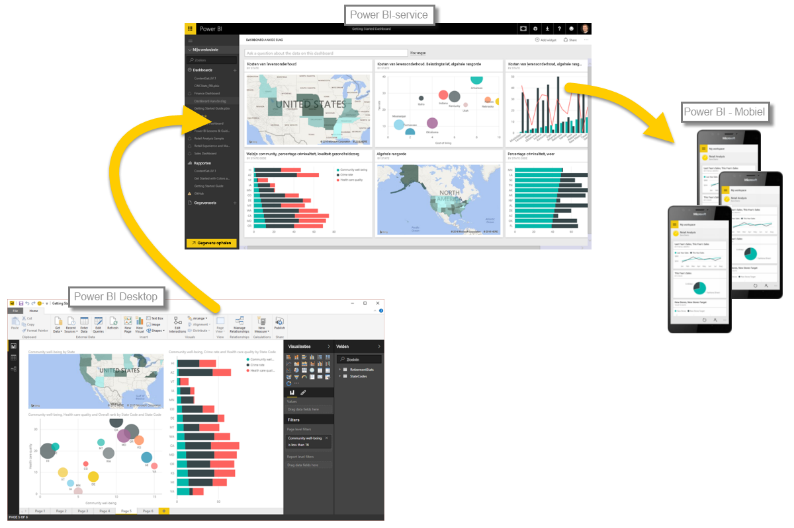

Nu u de basisprincipes van Power BI kent, kunt u deze praktijkvoorbeelden en de rondleiding bekijken. Uw gids voor deze rondleiding is **Will Thompson**, Program Manager van het Power BI-team van Microsoft. Verderop in de cursus komen ook een aantal gasten aan het woord.

Will laat u zien wat u allemaal kunt doen met Power BI. Alle activiteiten en analyses die u met Power BI kunt uitvoeren volgen doorgaans een algemene stroom. De **algemene stroom** van activiteiten in Power BI is als volgt:

* Gegevens overzetten naar Power BI Desktop en een rapport maken.
* Publiceren naar de Power BI-service, waar u nieuwe visualisaties kunt maken of dashboards kunt bouwen
* Uw dashboards delen met anderen, met name met mensen die onderweg zijn
* Gedeelde dashboards en rapporten in Power BI - Mobiel-apps weergeven en gebruiken

Het kan zijn dat u alleen maar tijd spendeert aan de **Power BI-service** om gegevens op te halen en dashboards te maken Iemand anders in uw team spendeert alle van de tijd in **Power BI Desktop**, dat is fijn te. Om u een volledig inzicht in Power BI en de mogelijkheden te geven, laten we u hier echter alles zien. Vervolgens kunt u zelf bepalen hoe u Power BI optimaal kunt gebruiken.

Will laat u alle mogelijkheden met Power BI zien. Als eerste moet u weten wat de basisbouwstenen van Power BI zijn. Deze vormen een solide basis om te leren hoe u met Power BI gegevens kunt omzetten in fraaie rapporten en visualisaties.

