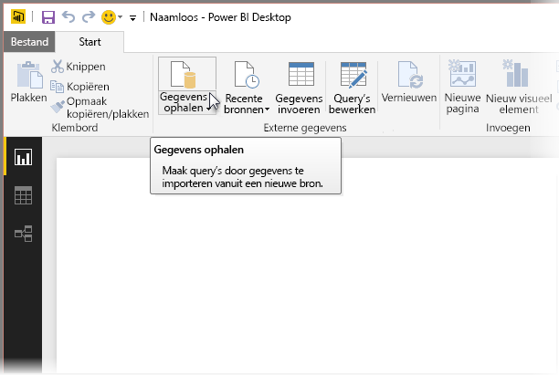
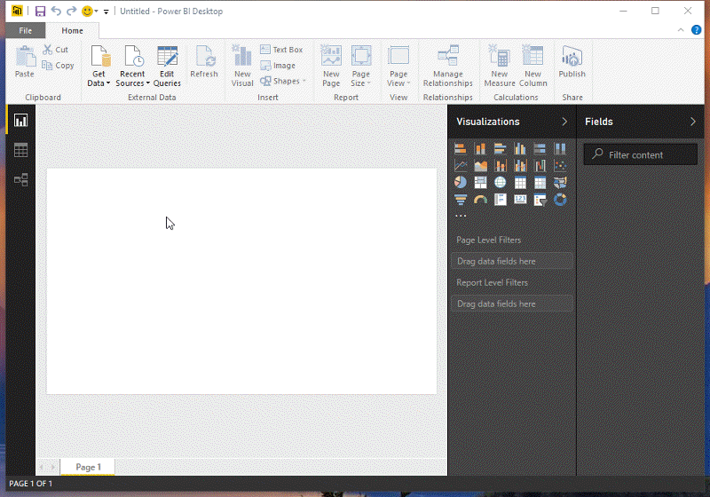
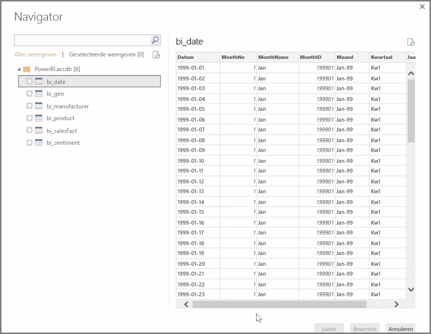
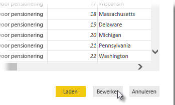

In **Power BI Desktop** kunt u gebruikmaken van verschillende gegevensbronnen, zoals on-premises databases, Excel-werkbladen en cloudservices. Momenteel hebben meer dan 59 verschillende cloudservices als GitHub en Marketo specifieke connectors en u kunt algemene bronnen via XML, CSV, tekst en ODBC gebruiken. Power BI kan tabellaire gegevens zelfs rechtstreeks van een website-URL verzamelen. Maar laten we bij het begin beginnen door Power BI Desktop te openen en verbinding te maken met de gegevens.

Wanneer u **Power BI Desktop** start en doorgaat op het scherm Start, kunt u Gegevens ophalen kiezen op het lint in het tabblad **Start**.

Er zijn maandelijkse updates voor Power BI Desktop en bij elke update wordt de pagina **Wat is er nieuw** bijgewerkt met informatie over de updates, koppelingen naar de blog en een downloadkoppeling.

In Power BI Desktop zijn allerlei verschillende gegevensbronnen beschikbaar. Selecteer een bron om een verbinding tot stand te brengen. Afhankelijk van uw selectie wordt u gevraagd de bron op uw computer of in het netwerk te zoeken of moet u zich aanmelden voor een service voor verificatie van uw aanvraag.

Wanneer u verbinding maakt, is het eerste venster dat u ziet het venster **Navigator**. In dit venster worden de tabellen of entiteiten van uw gegevensbron weergegeven. Als u op een tabel of entiteit klikt, ziet u een voorbeeld van de inhoud. U kunt vervolgens direct uw geselecteerde tabellen of entiteiten importeren. U kunt ook **Bewerken** selecteren en uw gegevens wissen voordat u importeert.

Nadat u de tabellen hebt geselecteerd die u wilt gebruiken in Power BI Desktop, kunt u deze in Power BI Desktop laden door de knop **Laden** in de rechterbenedenhoek van **Navigator** te selecteren. Mogelijk wilt u echter wijzigingen aanbrengen in deze tabellen voordat u deze in Power BI Desktop laadt. Of misschien wilt u alleen een subset van klanten gebruiken of de omzetgegevens filteren op een bepaald land. In deze gevallen kunt u de knop Bewerken selecteren en de gegevens filteren of transformeren voordat u deze in Power BI Desktop gebruikt.

We starten vanaf hier en bewerken onze gegevens in de volgende sectie.

