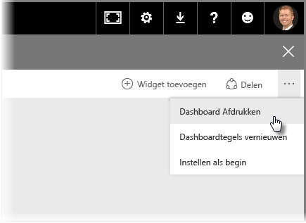
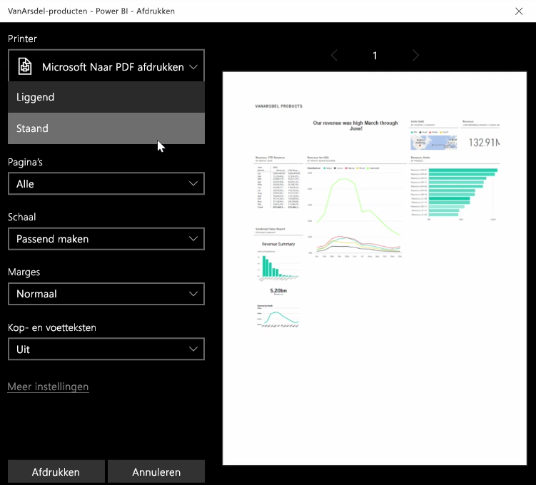
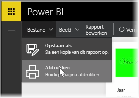

Het kan zijn dat u een afgedrukt rapport of afgedrukte dashboard wilt overbrengen naar een vergadering, zodat u deze met anderen kunt delen. Met Power BI zijn er een paar manieren om afdrukken van uw visualisaties te maken.

Selecteer in de Power BI-service het weglatingsteken (drie puntjes) rechtsboven in de service en selecteer vervolgens **Dashboard afdrukken**.

Het dialoogvenster **Afdrukken** wordt weergegeven, waarin u de printer kunt selecteren waarnaar u het dashboard wilt verzenden, evenals de standaardafdrukopties, zoals *Staand* of *Liggend*.

## Gegevens uit een visualisatie exporteren
U kunt de gegevens ook exporteren vanuit een visualisatie in de Power BI-service. Selecteer het weglatingsteken op een visualisatie en selecteer vervolgens de knop **Gegevens exporteren** (de middelste knop). Er wordt vervolgens een .CSV-bestand gemaakt en gedownload naar uw computer en er verschijnt een melding in uw browser (zoals voor alle downloads die u vanuit uw browser doet) met het bericht dat het downloaden is voltooid.

U kunt ook direct vanuit een rapport afdrukken of exporteren. Wanneer u een rapport in Power BI-service hebt geopend, selecteert u **Bestand > Afdrukken** om het afdrukvenster te openen.

En net als bij een dashboard kunt u gegevens van een visualisatie in een rapport exporteren door de knop Exporteren in de visualisatie te selecteren.

