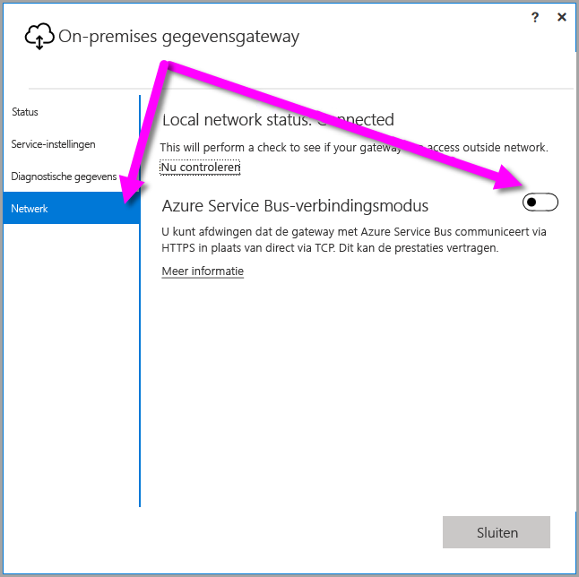
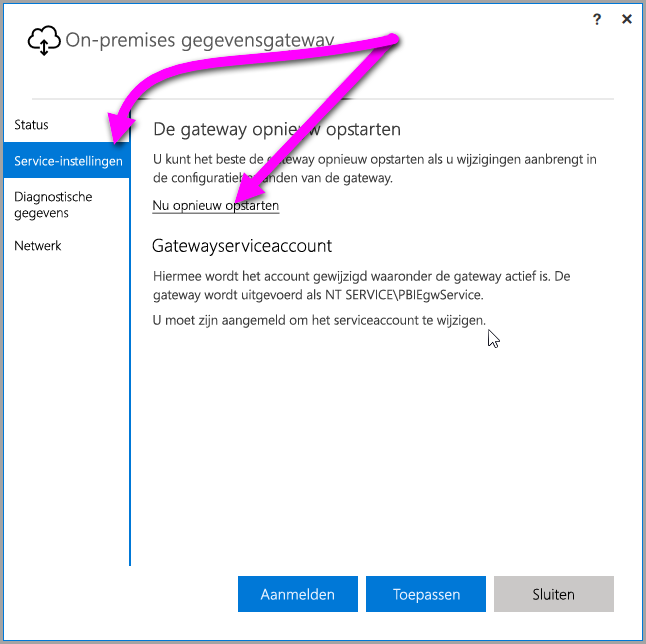

## <a name="sign-in-account"></a>Aanmeldingsaccount

Gebruikers melden zich aan met een werk- of schoolaccount. Dit account is uw **organisatieaccount**. Als u zich hebt geregistreerd voor een Office 365-aanbieding en niet het echte e-mailadres van uw werk hebt opgegeven, kan dit eruit zien als nancy@contoso.onmicrosoft.com. Uw account wordt opgeslagen in een tenant van Azure Active Directory (AAD). In de meeste gevallen komt de UPN van uw AAD-account overeen met het e-mailadres.

## <a name="windows-service-account"></a>Windows-serviceaccount

De On-premises gegevensgateway is zo geconfigureerd dat *NT SERVICE\PBIEgwService* wordt gebruikt voor de aanmeldingsreferenties voor Windows-services. Standaard heeft deze het recht om in te loggen als een service in de context van de machine waarop u de gateway installeert. Het account is niet hetzelfde account waarmee verbinding wordt gemaakt met on-premises gegevensbronnen. Het account is ook geen werk- of schoolaccount waarmee u zich aanmeldt bij cloudservices.

> [!NOTE]
> Als u de persoonlijke modus hebt geselecteerd, configureert u het Windows-serviceaccount apart.

Als u verificatieproblemen tegenkomt met uw proxyserver, kunt u het Windows-serviceaccount wijzigen in het account van een domeingebruiker of een beheerde service. Raadpleeg [Proxyconfiguratie](../service-gateway-proxy.md#changing-the-gateway-service-account-to-a-domain-user) voor meer informatie.

## <a name="ports"></a>Poorten

De gateway maakt een uitgaande verbinding naar Azure Service Bus. De gateway communiceert via uitgaande poorten: TCP 443 (standaard), 5671, 5672, 9350 t/m 9354.  De gateway vereist geen inkomende poorten.

Het wordt aanbevolen de IP-adressen voor uw gegevensgebied op de goedgekeurde lijst voor de firewall te plaatsen. Hiervoor kunt u de [lijst met IP-adressen van Microsoft Azure-datacenters](https://www.microsoft.com/download/details.aspx?id=41653) downloaden. Deze lijst wordt wekelijks bijgewerkt. U kunt de lijst met vereiste poorten ook verkrijgen door de [test voor netwerkpoorten](../service-gateway-onprem-tshoot.md#network-ports-test) op de on-premises gegevensgatewaytoepassing uit te voeren. De gateway communiceert met Azure Service Bus via het IP-adres, in combinatie met de volledig gekwalificeerde domeinnaam (FQDN). Als u afdwingt dat de gateway communiceert via HTTPS, gebruikt de gateway alleen de FQDN en vindt er geen communicatie plaats met behulp van IP-adressen.


> [!NOTE]
> De adressen in de lijst met IP-adressen van Azure-datacenters worden vermeld in de CIDR-notatie. 10.0.0.0/24 betekent dus bijvoorbeeld niet 10.0.0.0 t/m 10.0.0.24. Meer informatie over de [CIDR-notatie](http://whatismyipaddress.com/cidr).

Hier volgt een lijst met de volledige domeinnamen die worden gebruikt door de gateway.

| Domeinnamen | Uitgaande poorten | Beschrijving |  |
|-----------------------------|----------------|--------------------------------------------------------------------------------------------------------------------|---|
| *.download.microsoft.com | 80 | Wordt gebruikt om het installatiebestand te downloaden. Dit wordt ook gebruikt door de gegevensgateway-app om te controleren op de versie en gatewayregio. |  |
| *.powerbi.com | 443 | Wordt gebruikt voor het identificeren van het relevante Power BI-cluster. |  |
| *.analysis.windows.net | 443 | Wordt gebruikt voor het identificeren van het relevante Power BI-cluster. |  |
| *.login.windows.net | 443 | Wordt gebruikt voor het verifiëren van de gegevensgateway-app met Azure Active Directory/OAuth2. |  |
| *.servicebus.windows.net | 5671-5672 | Wordt gebruikt voor Advanced Message Queuing Protocol (AMQP). |  |
| *.servicebus.windows.net | 443, 9350-9354 | Wordt gebruikt door listeners op Service Bus Relay via TCP (voor het ophalen van tokens voor toegangsbeheer is 443 vereist). |  |
| *.frontend.clouddatahub.net | 443 | Afgeschaft - niet meer vereist. Wordt in de toekomst uit de documentatie verwijderd. |  |
| *.core.windows.net | 443 | Wordt gebruikt door gegevensstromen in Power BI om gegevens naar Azure Data Lake te schrijven. |  |
| login.microsoftonline.com | 443 | Wordt gebruikt voor het verifiëren van de gegevensgateway-app met Azure Active Directory/OAuth2. |  |
| *.msftncsi.com | 443 | Wordt gebruikt om de internetverbinding te testen en om te testen of de gateway onbereikbaar is voor de Power BI-service. |  |
| *.microsoftonline-p.com | 443 | Wordt gebruikt voor het verifiëren van de gegevensgateway-app met Azure Active Directory/OAuth2. |  |
| | |

> [!NOTE]
> Nadat de gateway is geïnstalleerd en geregistreerd, zijn alleen de poorten/IP-adressen vereist die nodig zijn voor Azure Service Bus (servicebus.windows.net hierboven). U kunt de lijst met vereiste poorten verkrijgen door de [test voor netwerkpoorten](../service-gateway-onprem-tshoot.md#network-ports-test) op de on-premises gegevensgatewaytoepassing uit te voeren.

## <a name="forcing-https-communication-with-azure-service-bus"></a>HTTPS-communicatie met Azure Service Bus afdwingen

U kunt afdwingen dat de gateway met Azure Service Bus communiceert via HTTPS in plaats van direct via TCP.

> [!NOTE]
> Vanaf de release van juni 2019 gebruiken nieuwe installaties (geen updates) standaard HTTPS in plaats van TCP op basis van de aanbevelingen van Azure Service Bus.

Om communicatie via HTTPS af te dwingen wijzigt u het bestand *Microsoft.PowerBI.DataMovement.Pipeline.GatewayCore.dll.config* door de waarde van `AutoDetect` in `Https` te wijzigen, zoals te zien is in het onderstaande codefragment. Dit bestand bevindt zich standaard in *C:\Program Files\On-premises data gateway*.

```xml
<setting name="ServiceBusSystemConnectivityModeString" serializeAs="String">
    <value>Https</value>
</setting>
```

De waarde voor de parameter *ServiceBusSystemConnectivityModeString* is hoofdlettergevoelig. Geldige waarden zijn *AutoDetect* en *Https*.

U kunt ook afdwingen dat de gateway deze methode gebruikt met behulp van de gebruikersinterface van de gateway. Hiervoor selecteert u in de gateway **Netwerk** en zet u vervolgens de optie **Azure Service Bus-verbindingsmodus** op **Aan**.



Wanneer u na deze wijziging de knop **Toepassen** selecteert (deze knop wordt alleen weergegeven wanneer u een wijziging aanbrengt) wordt de *Windows-gatewayservice* automatisch opnieuw opgestart zodat de wijziging van kracht wordt.

U kunt de *Windows-gatewayservice* overigens ook opnieuw starten vanuit het dialoogvenster in de gebruikersinterface, met door **Service-instellingen** te selecteren en vervolgens op *Nu opnieuw opstarten* te klikken.



## <a name="support-for-tls-12"></a>Ondersteuning voor TLS 1.2

De on-premises gegevensgateway maakt standaard gebruik van Transport Layer Security (TLS) 1.2 om te communiceren met de Power BI-service. Om ervoor te zorgen dat al het verkeer van en naar de gateway gebruikmaakt van TLS 1.2, moet u wellicht de volgende registersleutels toevoegen of wijzigen op de computer waarop de gateway-service wordt uitgevoerd:

```
[HKEY_LOCAL_MACHINE\SOFTWARE\Microsoft\.NETFramework\v4.0.30319]"SchUseStrongCrypto"=dword:00000001
[HKEY_LOCAL_MACHINE\SOFTWARE\Wow6432Node\Microsoft\.NETFramework\v4.0.30319]"SchUseStrongCrypto"=dword:00000001
```

> [!NOTE]
> Door deze registersleutels toe te voegen of te wijzigen, wordt deze wijziging toegepast voor alle .NET-toepassingen. Zie [Transport Layer Security (TLS) registry settings](https://docs.microsoft.com/windows-server/security/tls/tls-registry-settings) (Registerinstellingen voor Transport Layer Security (TLS)) voor meer informatie over registerwijzigingen die invloed hebben op TLS voor andere toepassingen.

## <a name="how-to-restart-the-gateway"></a>De gateway opnieuw starten

De gateway wordt uitgevoerd als een Windows-service. U kunt deze dan ook starten en stoppen zoals iedere andere Windows-service. Hier volgt hoe u kunt dit kunt doen vanaf de opdrachtprompt.

1. Start een opdrachtprompt met beheerdersrechten op de machine waarop de gateway wordt uitgevoerd.
2. Gebruik de volgende opdracht om de service te stoppen.
   
   net stop PBIEgwService
3. Gebruik de volgende opdracht om de service te starten.
   
   net start PBIEgwService

