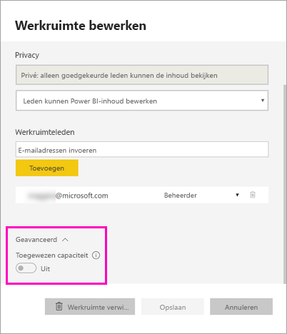
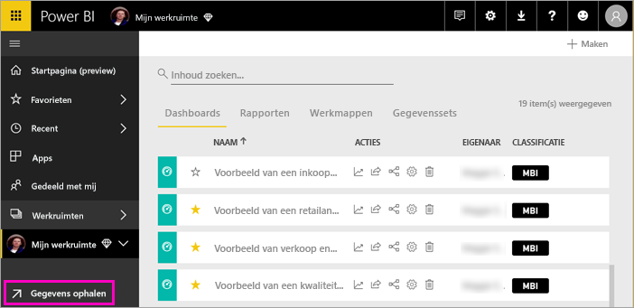
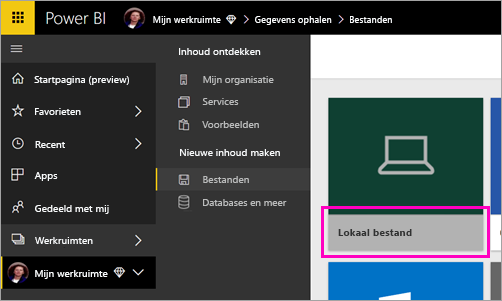
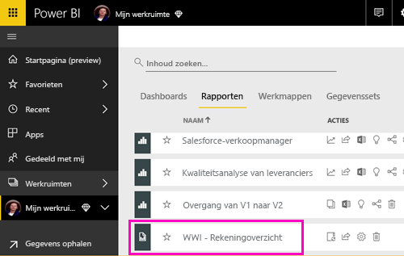
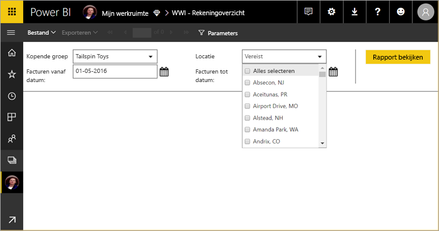

# Een gepagineerd rapport publiceren in de Power BI-service (preview)

In dit artikel krijgt u informatie over het publiceren van een gepagineerd rapport in de Power BI-service door het te uploaden vanaf de lokale computer. U kunt gepagineerde rapporten uploaden naar Mijn werkruimte of een andere ruimte, zolang deze werkruimte zich maar in een Premium-capaciteit bevindt. Ga naar het ruitvormige pictogram  naast de naam van een werkruimte. 

Als de gegevensbron van het rapport on-premises is, moet u [een gateway maken](#create-a-gateway-to-an-on-premises-data-source) nadat u het rapport hebt geüpload.

## Een werkruimte toevoegen aan een Premium-capaciteit

Als u naast de naam van de werkruimte het ruitvormige pictogram  niet ziet, moet u de werkruimte toevoegen aan een Premium-capaciteit. 

1. Selecteer **Werkruimten** en selecteer het beletselteken (**...**) naast de naam van de werkruimte. Selecteer vervolgens **Werkruimte bewerken**.

    

1. Vouw in het dialoogvenster **Werkruimte bewerken** de optie **Geavanceerd** uit. Schuif **Toegewezen capaciteit** vervolgens naar **Aan**.

    

   Mogelijk kunt u dit niet wijzigen. Zo niet, vraag de beheerder van de Power BI Premium-capaciteit dan om u toewijzingsrechten te verlenen om uw werkruimte toe te voegen aan een Premium-capaciteit.

## Een gepagineerd rapport uploaden

1. Maak uw gepagineerde rapport in Report Builder en sla het op de lokale computer op.

1. Open de Power BI-service in een browser en blader naar de Premium-werkruimte waarin u het rapport wilt publiceren. U ziet nu het ruitvormige pictogram  naast de naam. 

1. Selecteer **Gegevens ophalen**.

    

1. Selecteer in het vak **Bestanden** de optie **Ophalen**.

    

1. Selecteer **Lokaal bestand** > blader naar het gepagineerde rapport > **Openen**.

    

1. Selecteer **Doorgaan** > **Referenties bewerken**.

    

1. Configureer uw referenties > **Aanmelden**.

    

   Het rapport wordt weergegeven in de lijst met rapporten.

    

1. Selecteer het rapport om het te openen in de Power BI-service. Als het rapport parameters bevat, moet u deze selecteren voordat u het rapport kunt weergeven.
 
    

## Een gateway maken

Als de gegevensbron van het rapport on-premises is, moet u, net als bij elk ander Power BI-rapport, een gateway maken of verbinding maken met een gateway om de gegevens te openen.

1. Selecteer naast de rapportnaam de optie **Beheren**.

   

1. Zie het artikel van de Power BI-service [Een gateway installeren](service-gateway-install.md) voor de details en de volgende stappen.

### Beperkingen van een gateway

Momenteel bieden gateways geen ondersteuning voor parameters met meerdere waarden.

## Volgende stappen

- [Een gepagineerd rapport weergeven in de Power BI-service](paginated-reports-view-power-bi-service.md)
- [Wat zijn gepagineerde rapporten in Power BI Premium? (Preview)](paginated-reports-report-builder-power-bi.md)

