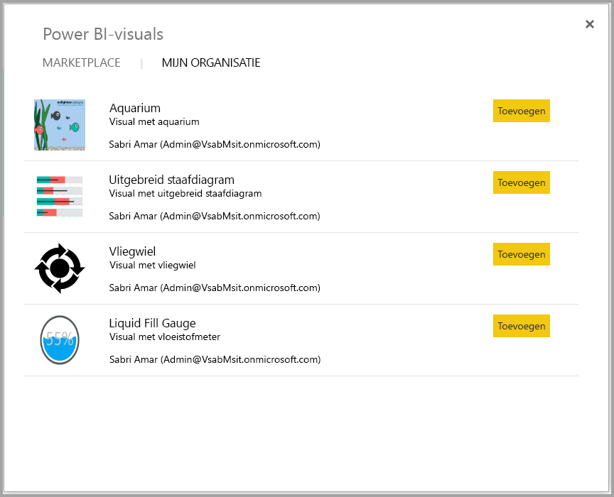
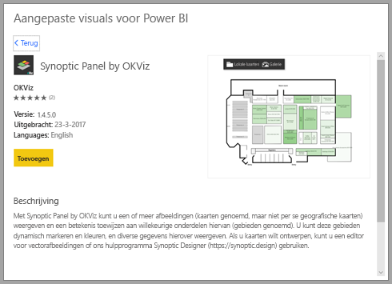
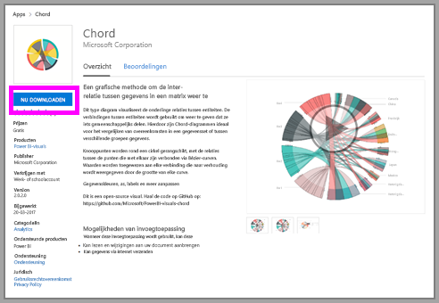
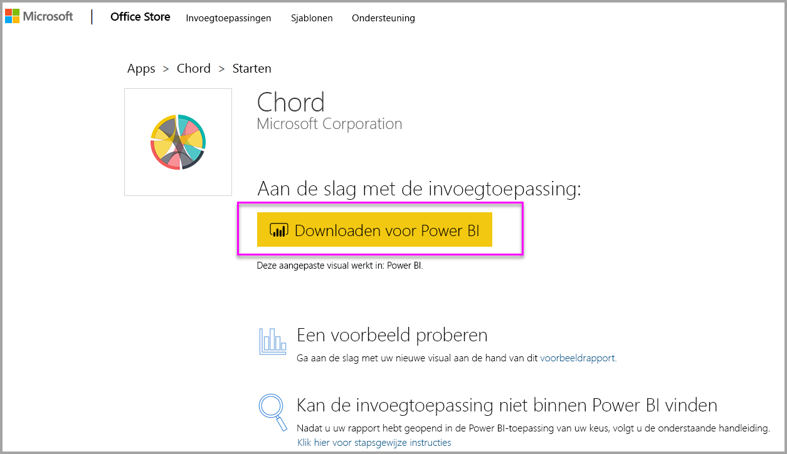

# Aangepaste visualisaties in Power BI

Bij het maken of bewerken van een Power BI-rapport, kunt u veel verschillende soorten visuele elementen. De pictogrammen voor deze visuele elementen worden weergegeven in de **visualisaties** deelvenster. Deze visualisaties worden vooraf verpakte geleverd wanneer u downloadt [Power BI Desktop](https://powerbi.microsoft.com/desktop/) of open de [Power BI-service](https://app.powerbi.com).

U zijn echter niet beperkt tot deze set visualisaties. Als u de weglatingstekens (...) aan de onderkant selecteert, verandert in een andere bron van rapportvisualisaties beschikbaar -*aangepaste visuele elementen*.

Ontwikkelaars maken aangepaste visuele elementen met behulp van de SDK voor aangepaste visuals. Deze visuele elementen inschakelen zakelijke gebruikers om hun gegevens op een manier die het beste past bij hun bedrijf te bekijken. Auteurs kunnen vervolgens de bestanden met aangepaste visuals in hun rapporten importeren en ze gebruiken ze net als elke andere Power BI-visuals. Aangepaste visuele elementen zijn eersteklas burgers in Power BI en kunnen worden gefilterd, gemarkeerd, bewerkt, gedeeld, enzovoort.

Aangepaste visuele elementen worden geïmplementeerd op drie manieren:

* Bestanden met aangepaste visuals
* Organisatievisuals
* Visuals uit de marketplace

## Bestanden met aangepaste visuals

Aangepaste visuals zijn pakketten met code voor het renderen van de gegevens die ze ontvangen. Iedereen kan maken van een aangepast visueel element en verpakt u deze als één `.pbiviz` -bestand, dat vervolgens kan worden geïmporteerd in een Power BI-rapport.

> [!WARNING]
> Een aangepaste visual kan code bevatten met beveiligings- of privacyrisico. Zorg ervoor dat u de auteur en bron van de aangepaste visual vertrouwt voordat u ze aan uw rapport importeert.

## Organisatievisuals

Power BI-beheerders goedkeuren en implementeren van aangepaste visuele elementen binnen hun organisatie die auteurs kunnen eenvoudig ontdekken, bijwerken en gebruiken. Beheerders kunnen eenvoudig beheren (bijvoorbeeld versie bij te werken, in-/ uitschakelen) deze visuele elementen.

 [Meer informatie over de organisatie visuele elementen](power-bi-custom-visuals-organization.md).

## Visuals uit de marketplace

Leden van de community en Microsoft hebben bijgedragen hun aangepaste visuals voor openbare benefit en deze gepubliceerd op de [AppSource](https://appsource.microsoft.com/marketplace/apps?product=power-bi-visuals) marketplace. U kunt deze downloaden visuele elementen toevoegen aan uw Power BI-rapporten. Microsoft heeft getest en goedgekeurd deze aangepaste visuals van functionaliteit en kwaliteit.

Wat is [AppSource](developer/office-store.md)? Dit is de plaats die u kunt apps, invoegtoepassingen en extensies voor uw Microsoft-software vinden. [AppSource](https://appsource.microsoft.com/) verbindt miljoenen gebruikers van producten zoals Office 365, Azure, Dynamics 365, Cortana en Power BI, oplossingen die hen helpen werk gedaan efficiënt, plek, krijgen en prachtig dan voorheen.

### Gecertificeerde visuals

Gecertificeerd voor Power BI visuals zijn marketplace visuele elementen die zijn geslaagd voor de extra strenge kwaliteit te testen en worden ondersteund in aanvullende scenario's, zoals [e-mailabonnementen](https://docs.microsoft.com/power-bi/service-report-subscribe), en [exporteren naar PowerPoint](https://docs.microsoft.com/power-bi/service-publish-to-powerpoint).
Zie [Getting a custom visual certified](https://docs.microsoft.com/power-bi/power-bi-custom-visuals-certified) (Aangepaste visualisaties insturen voor certificering) voor de lijst met gecertificeerde aangepaste visualisaties. Hier leest u ook hoe u uw eigen aangepaste visualisaties kunt insturen.

Bent u een webontwikkelaar en bent u geïnteresseerd in het maken van uw eigen visualisaties en wilt u deze toevoegen aan AppSource? Zie [ontwikkelen van een aangepast visueel element voor een Power BI](developer/custom-visual-develop-tutorial.md) en leer hoe u [aangepaste visuals naar AppSource](https://docs.microsoft.com/power-bi/developer/office-store).

### Een aangepaste visual vanuit een bestand importeren

1. Selecteer het beletselteken vanaf de onderkant van de **visualisaties** deelvenster.

    

2. Selecteer **Importeren vanuit bestand** in de vervolgkeuzelijst.

    

3. Selecteer in het menu bestand openen de `.pbiviz` -bestand dat u wilt importeren en selecteer vervolgens **Open**. Pictogram van het aangepaste visuele element wordt toegevoegd aan de onderkant van uw **visualisaties** deelvenster en is nu beschikbaar voor gebruik in uw rapport.

    

### Organisatievisuals importeren

1. Selecteer het beletselteken vanaf de onderkant van de **visualisaties** deelvenster.

    

2. Selecteer **Importeren uit de marketplace** in de vervolgkeuzelijst.

    

3. Selecteer **MIJN ORGANISATIE** in het menu met tabbladen bovenaan.

    

4. Blader door de lijst om de visualisatie te vinden die u wilt importeren.

    

5. Selecteer **toevoegen** voor het importeren van het aangepaste visuele element. Het pictogram wordt toegevoegd aan de onderkant van uw **visualisaties** deelvenster en is nu beschikbaar voor gebruik in uw rapport.

    

## Aangepaste visualisaties downloaden of importeren uit Microsoft AppSource

U hebt twee opties voor het downloaden en importeren van aangepaste visuele elementen: van Power BI en vanaf de [AppSource-website](https://appsource.microsoft.com/).

### Aangepaste visualisaties importeren vanuit Power BI

1. Selecteer het beletselteken vanaf de onderkant van de **visualisaties** deelvenster.

    

2. Selecteer **Importeren uit de marketplace** in de vervolgkeuzelijst.

    

3. Blader door de lijst om de visualisatie te vinden die u wilt importeren.

    

4. Als u meer wilt weten over een van de visualisaties, selecteert u deze.

    

5. Op de detailpagina kunt u vervolgens schermafbeeldingen, video's, gedetailleerde beschrijvingen en meer bekijken.

    

6. Schuif naar beneden om beoordelingen te bekijken.

    

7. Selecteer **toevoegen** voor het importeren van het aangepaste visuele element. Het pictogram wordt toegevoegd aan de onderkant van uw **visualisaties** deelvenster en is nu beschikbaar voor gebruik in uw rapport.

    

### Aangepaste visualisaties downloaden en importeren uit Microsoft AppSource

1. Ga naar [Microsoft AppSource](https://appsource.microsoft.com) en selecteer het tabblad **Apps**.

    

2. Ga naar de[overzichtspagina met apps](https://appsource.microsoft.com/marketplace/apps), waar de belangrijkste apps voor elke categorie worden weergegeven, inclusief *Power BI-apps*. We op zoek bent naar aangepaste visuele elementen, dus selecteer **Power BI-visuals** uit de lijst van de navigatiebalk aan de linkerkant om het Beperk de resultaten.

    

3. In AppSource ziet u nu een tegel voor elke aangepaste visualisatie.  Elke tegel heeft een momentopname van een aangepaste visual met een korte beschrijving en een downloadkoppeling. Selecteer de tegel als u meer informatie wilt bekijken.

    

4. Op de detailpagina kunt u vervolgens schermafbeeldingen, video's, gedetailleerde beschrijvingen en meer bekijken. Selecteer **nu downloaden** voor het downloaden van het aangepaste visuele element en vervolgens akkoord gaan met de gebruiksvoorwaarden.

    

5. Selecteer de koppeling om de aangepaste visualisatie te downloaden.

    

    De downloadpagina bevat ook instructies voor het importeren van het aangepaste visuele element in Power BI Desktop en Power BI-service.

    U kunt ook een voorbeeldrapport downloaden waarin de mogelijkheden van de aangepaste visualisatie worden gedemonstreerd.

    

6. Sla de `.pbiviz` bestands- en open vervolgens Power BI.

7. Importeren van de `.pbiviz` -bestand in uw rapport. (Raadpleeg de bovenstaande sectie [Een aangepaste visual vanuit een bestand importeren](#import-a-custom-visual-from-a-file).)

## Overwegingen en beperkingen

* Een aangepaste visualisatie wordt bij het importeren toegevoegd aan een specifiek rapport. Als u de visualisatie in een ander rapport wilt gebruiken, moet u de visualisatie ook in dat rapport importeren. Wanneer een rapport met een aangepaste visualisatie wordt opgeslagen met de optie **Opslaan als**, wordt er een kopie van de aangepaste visualisatie opgeslagen met het nieuwe rapport.

* Als er geen een **visualisaties** in het deelvenster dat betekent dat u hebt geen machtigingen bewerken rapport.  U kunt alleen aangepaste visualisaties toevoegen aan rapporten die u kunt bewerken, niet aan rapporten die met u zijn gedeeld.

## Problemen oplossen

Als u wilt oplossen, Zie [het oplossen van uw aangepaste visuals van Power BI](power-bi-custom-visuals-troubleshoot.md).

## Veelgestelde vragen

Voor meer informatie en antwoorden op vragen gaat u naar [Veelgestelde vragen over aangepaste visuals voor Power BI](power-bi-custom-visuals-faq.md#organizational-custom-visuals).

## Volgende stappen

* [Visualisaties in Power BI-rapporten](visuals/power-bi-report-visualizations.md)

Hebt u nog vragen? [Misschien dat de Power BI-community het antwoord weet](http://community.powerbi.com/).
