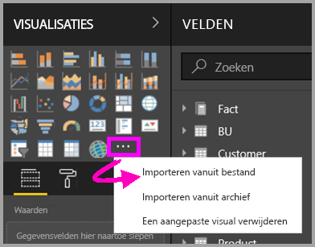

# Aangepaste visualisaties in Power BI
Bij het maken of bewerken van een Power BI-rapport kunt u kiezen uit allerlei verschillende soorten visualisaties. Deze visualisaties worden weergeven in het deelvenster **Visualisaties**. Wanneer u Power BI Desktop downloadt of de Power BI-service opent (op app.powerbi.com), ziet u standaard deze visualisaties. 

Maar u bent niet beperkt tot deze set visualisaties. Als u het beletselteken selecteert, krijgt u toegang tot een andere bron van rapportvisualisaties: *aangepaste visualisaties*.

Aangepaste visualisaties worden gemaakt door leden van de community en door Microsoft en worden gehost in [AppSource](https://appsource.microsoft.com/marketplace/apps?product=power-bi-visuals). Deze visualisaties kunnen worden gedownload en toegevoegd aan Power BI-rapporten. Al deze aangepaste visualisaties zijn goedgekeurd door Microsoft en ze gedragen zich zoals de standaardvisualisaties van Power BI. Dit betekent dat u ze kunt filteren, markeren, bewerken, delen, enzovoort. 

Wat is AppSource? Hier vindt u apps, invoegtoepassingen en uitbreidingen voor uw Microsoft-software. [AppSource](https://appsource.microsoft.com) is de plek waar miljoenen gebruikers van producten zoals Office 365, Azure, Dynamics 365, Cortana en Power BI oplossingen vinden die hen helpen efficiënter, slimmer of netter te werken.

## Twee typen aangepaste visualisaties

De aangepaste visualisaties voor Power BI die beschikbaar zijn vanuit AppSource kunnen worden onderverdeeld in twee categorieën: **goedgekeurd** en **gecertificeerd**. *Goedgekeurde* visualisaties in AppSource kunnen worden uitgevoerd in browsers, rapporten en dashboards.  Visualisaties die zijn *gecertificeerd voor Power BI* zijn uitvoerig getest en worden ondersteund in aanvullende scenario's, zoals [e-mailabonnementen](service-report-subscribe.md) en [exporteren naar PowerPoint](service-publish-to-powerpoint.md).

Zie [Getting a custom visual certified](power-bi-custom-visuals-certified.md) (Aangepaste visualisaties insturen voor certificering) voor de lijst met gecertificeerde aangepaste visualisaties. Hier leest u ook hoe u uw eigen aangepaste visualisaties kunt insturen.

Bent u een webontwikkelaar en bent u geïnteresseerd in het maken van uw eigen visualisaties en wilt u deze toevoegen aan AppSource?  Zie [Use developer tools to create custom visuals](service-custom-visuals-getting-started-with-developer-tools.md) (Aangepaste visualisaties maken met hulpprogramma's voor ontwikkelaars) en leer hoe u [aangepaste visualisaties publiceert naar AppSource](https://appsource.microsoft.com/marketplace/apps?product=power-bi-visuals).

## Aangepaste visualisaties downloaden of importeren uit Microsoft AppSource
Er zijn twee manieren om aangepaste visualisaties te downloaden en te importeren; vanuit Power BI en vanaf de AppSource-website. 

###    Aangepaste visualisaties importeren vanuit Power BI
1. Selecteer het beletselteken (...) onder aan het deelvenster Visualisaties. 

    

2. Selecteer **Importeren uit de store** in de vervolgkeuzelijst.

    

3. Blader door de lijst om de visualisatie te vinden die u wilt importeren. 

    

4.  Als u meer wilt weten over een van de visualisaties, selecteert u deze.

    

5.  Op de detailpagina kunt u vervolgens schermafbeeldingen, video's, gedetailleerde beschrijvingen en meer bekijken. 

    

6. Schuif naar beneden om beoordelingen te bekijken.

    

7.    Importeer de aangepaste visualisatie door **Toevoegen** te selecteren. Het pictogram voor de aangepaste visualisatie wordt toegevoegd aan de onderkant van het deelvenster Visualisaties en is nu beschikbaar voor gebruik in uw rapport.

       

###    Aangepaste visualisaties downloaden en importeren uit Microsoft AppSource

1. Ga naar [Microsoft AppSource](https://appsource.microsoft.com) en selecteer het tabblad **Apps**. 

    

2. Hiermee gaat u naar de[overzichtspagina met apps](https://appsource.microsoft.com/en-us/marketplace/apps), waar de belangrijkste apps voor elke categorie worden weergegeven, inclusief *Power BI-apps*. Maar we zijn op zoek naar aangepaste visualisaties, dus verfijnen we de resultaten door in de lijst met invoegtoepassingen aan de linkerkant **Power BI visuals** te selecteren.

    

3. In AppSource ziet u nu een tegel voor elke aangepaste visualisatie.  Elke tegel bevat een momentopname van de aangepaste visualisatie, plus een korte beschrijving en een downloadkoppeling. Selecteer de tegel als u meer informatie wilt bekijken. 

    

4. Op de detailpagina kunt u vervolgens schermafbeeldingen, video's, gedetailleerde beschrijvingen en meer bekijken. Download de aangepaste visualisatie door **Nu downloaden** te selecteren en vervolgens akkoord te gaan met de gebruiksvoorwaarden. 

    

5. Selecteer de koppeling om de aangepaste visualisatie te downloaden.

    

    De downloadpagina bevat ook instructies voor het importeren van de aangepaste visualisatie in Power BI Desktop en de Power BI-service.

    U kunt ook een voorbeeldrapport downloaden waarin de mogelijkheden van de aangepaste visualisatie worden gedemonstreerd.

    

6. Sla het bestand .pbiviz op en open vervolgens Power BI.    
7. Open het rapport waaraan u de visualisatie wilt toevoegen en selecteer onder aan het deelvenster **Visualisaties** het beletselteken > **Importeren vanuit bestand**.  

      

8. Selecteer het bestand met de aangepaste visualisatie om het pictogram voor die visualisatie toe te voegen aan het deelvenster **Visualisaties**. De aangepaste visualisatie is nu beschikbaar voor gebruik in uw rapport.

    
    
##    Aandachtspunten en probleemoplossing

- Een aangepaste visualisatie wordt bij het importeren toegevoegd aan een specifiek rapport. Als u de visualisatie in een ander rapport wilt gebruiken, moet u de visualisatie ook in dat rapport importeren. Wanneer een rapport met een aangepaste visualisatie wordt opgeslagen met de optie **Opslaan als**, wordt er een kopie van de aangepaste visualisatie opgeslagen met het nieuwe rapport.

- Als u geen deelvenster **Visualisaties** ziet, betekent dit dat u niet bevoegd bent om het rapport te bewerken.  U kunt alleen aangepaste visualisaties toevoegen aan rapporten die u kunt bewerken, niet aan rapporten die met u zijn gedeeld.

Hebt u nog vragen? [Misschien dat de Power BI-community het antwoord weet](http://community.powerbi.com/)

