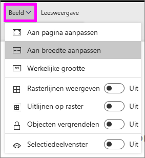
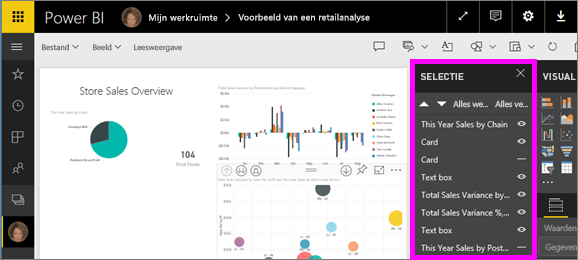

# Instellingen voor de paginaweergave in een Power BI-rapport
We beseffen dat het is essentieel om het perfecte houden van uw rapport is ingedeeld. Soms, kan het lastig, omdat u en uw collega's rapporten op schermen met verschillende verhoudingen en afmetingen weergeven kunnen. 

De standaardweergave is **Aanpassen aan pagina** en standaardgrootte van de weergave is **16:9**. Als u een andere hoogte-breedteverhouding wilt vastleggen of uw rapport op een andere manier wilt aanpassen, kunt u twee opties gebruiken: ***Paginaweergave*** instellingen en ***paginaformaat*** instellingen.

<iframe width="560" height="315" src="https://www.youtube.com/embed/5tg-OXzxe2g" frameborder="0" allowfullscreen></iframe>

## Waar vind ik instellingen voor paginaweergave in de Power BI-service en Power BI Desktop
Instellingen voor paginaweergave zijn beschikbaar in de Power BI-service en de Power BI Desktop, maar de interface is enigszins anders. De volgende secties wordt uitgelegd waar u de weergave-instellingen in elke Power BI-tool kunt vinden.

### In Power BI Desktop
Selecteer in de rapportweergave het tabblad **Weergeven** om de Instellingen voor paginaweergave en de instellingen voor de telefoonindeling te openen.

  

### In de Power BI-service (app.powerbi.com)
Open een rapport en selecteer in de Power BI-service **weergave** vanuit de menubalk linksboven.

Instellingen voor paginaweergave zijn beschikbaar voor zowel [leesweergave en Bewerkweergave](consumer/end-user-reading-view.md). Eigenaar van een rapport kan instellingen voor paginaweergave toewijzen aan afzonderlijke rapportpagina's in de weergave bewerken, en deze instellingen worden opgeslagen met het rapport. Wanneer collega’s dat rapport openen in de leesweergave, worden de rapportpagina's weergegeven volgens de instellingen van de eigenaar. In de leesweergave, collega's kunnen wijzigen *sommige* van de **paginaweergave** instellingen, maar de wijzigingen zijn niet opgeslagen wanneer ze het rapport afsluiten.

## Instellingen voor paginaweergave
De eerste set met instellingen voor paginaweergave Hiermee bepaalt u de weergave van de rapportpagina ten opzichte van het browservenster. Kies tussen:

* **Passend op pagina** (standaard): De inhoud worden geschaald om aan te passen op de pagina
* **Passend in breedte**: De inhoud worden geschaald om aan te passen binnen de breedte van de pagina
* **Werkelijke grootte**: Inhoud wordt weergegeven op volledige grootte

De tweede set paginabesturingselementen van het weergave-instellingen voor de plaatsing van de objecten op het rapportcanvas. Kies tussen:

* **Rasterlijnen weergeven**: Schakel rasterlijnen in om u te helpen bij het plaatsen van objecten op het rapportcanvas.
* **Uitlijnen op raster**: Gebruiken met **rasterlijnen weergeven** om nauwkeurig te plaatsen en objecten uitlijnen op het rapportcanvas. 
* **Objecten vergrendelen**: Vergrendel alle objecten op het canvas zodat deze kunnen niet worden verplaatst of gewijzigd.
* **Selectiedeelvenster**: De **selectie** deelvenster geeft een lijst van alle objecten op het canvas. U kunt bepalen welke om weer te geven en te verbergen.

    

## Instellingen voor paginaformaat

**Paginaformaat** instellingen zijn alleen beschikbaar voor rapporteigenaren. In de Power BI-service (app.powerbi.com) betekent dit dat u kunt het rapport openen in [Bewerkweergave](consumer/end-user-reading-view.md). **Paginaformaat** instellingen zijn de **visualisaties** deelvenster en beheer de verhoudingen en werkelijke grootte (in pixels) van het rapportcanvas:   

* 4:3-verhouding
* 16:9-verhouding (standaard)
* Cortana
* Letter
* Aangepast (hoogte en breedte in pixels)

## Volgende stappen
[Rapportweergave in Power BI Desktop](desktop-report-view.md)

[Paginaweergave en instellingen voor paginaformaat in uw eigen Power BI-rapporten wijzigen](consumer/end-user-report-view.md)

Lees meer over [rapporten in Power BI](consumer/end-user-reports.md)

[Basisconcepten van Power BI-service consumenten](consumer/end-user-basic-concepts.md)

Hebt u nog vragen? [Misschien dat de Power BI-community het antwoord weet](http://community.powerbi.com/)

