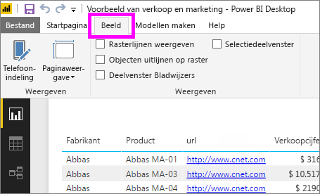

# Instellingen voor de paginaweergave in een Power BI-rapport
We begrijpen dat het essentieel is dat uw rapport perfect is ingedeeld. Dit kan lastig zijn omdat uw collega's dezelfde rapporten weergeven op schermen met verschillende verhoudingen en afmetingen. 

De standaardweergave is **Aanpassen aan pagina** en standaardgrootte van de weergave is **16:9**. Als u een andere hoogte-breedteverhouding wilt vastleggen of uw rapport op een andere manier wilt aanpassen, kunt u twee opties gebruiken: instellingen voor ***Paginaweergave*** en instellingen voor ***Paginaformaat***.

<iframe width="560" height="315" src="https://www.youtube.com/embed/5tg-OXzxe2g" frameborder="0" allowfullscreen></iframe>

## Locatie van de instellingen voor Paginaweergave in de Power BI-service en Power BI Desktop
De instellingen voor de paginaweergave zijn zowel in de Power BI-service als in Power BI Desktop beschikbaar, maar de interfaces zijn niet helemaal hetzelfde. In de twee onderstaande gedeelten wordt uitgelegd waar u de weergave-instellingen in elke Power BI-tool kunt vinden.

### In Power BI Desktop
Selecteer in de rapportweergave het tabblad **Weergeven** om de Instellingen voor paginaweergave en de instellingen voor de telefoonindeling te openen.

  

### In de Power BI-service (app.powerbi.com)
Open in de Power BI-service een rapport en selecteer **Weergeven** in de menubalk linksboven.

Instellingen voor paginaweergave zijn beschikbaar voor zowel de [leesweergave als de bewerkingsweergave](service-reading-view-and-editing-view.md). De rapporteigenaar kan in de bewerkweergave instellingen voor paginaweergave toewijzen aan afzonderlijke rapportpagina's. Deze instellingen worden opgeslagen bij het rapport. Wanneer collega’s dat rapport openen in de leesweergave, worden de rapportpagina's weergegeven volgens de instellingen van de eigenaar.  In de leesweergave kunnen collega’s *een aantal* instellingen voor de paginaweergave wijzigen, maar de wijzigingen worden niet opgeslagen wanneer ze het rapport afsluiten.

##    Instellingen voor paginaweergave
De eerste set met instellingen voor *Paginaweergave* bepalen hoe de rapportpagina ten opzichte van het browservenster wordt weergegeven.  Kies tussen:

* **Aanpassen aan pagina** (standaard): inhoud worden geschaald om op de pagina te passen
* **Aanpassen aan breedte**: inhoud worden geschaald om te passen binnen de breedte van de pagina
* **Werkelijke grootte**: inhoud wordt weergegeven op volledige grootte

De tweede set met instellingen voor *Paginaweergave* bepalen hoe objecten op het rapportcanvas worden geplaatst.

* **Rasterlijnen weergeven**: schakel rasterlijnen in om objecten op het rapportcanvas te plaatsen
* **Uitlijnen op raster**: gebruik deze optie in combinatie met **Rasterlijnen weergeven** om objecten nauwkeurig te plaatsen en uit te lijnen op het rapportcanvas 
* **Vergrendelen van objecten**: vergrendel alle objecten op het canvas zodat deze niet kunnen worden verplaatst of gewijzigd
* **Selectiedeelvenster**: het selectiedeelvenster bevat alle objecten op het canvas; u kunt bepalen welke objecten u wilt weergeven of verbergen

    

## Instellingen voor paginaformaat

De instellingen voor *Paginaformaat* zijn alleen beschikbaar voor rapporteigenaren. In de Power BI-service (app.powerbi.com) betekent dit dat u het rapport kunt openen in de [bewerkweergave](service-reading-view-and-editing-view.md). Deze instellingen bepalen de verhoudingen en de werkelijke grootte (in pixels) van het rapportcanvas.   

* 4:3-verhouding
* 16:9-verhouding (standaard)
* Cortana
* Letter
* Aangepast (hoogte en breedte in pixels)

## Volgende stappen
[Informatie over het gebruiken van instellingen voor paginaweergave en de paginaformaat in uw eigen Power BI-rapporten](power-bi-change-report-display-settings.md).

Meer informatie over [rapporten in Power BI](service-reports.md)

[Power BI - basisconcepten](service-basic-concepts.md)

Hebt u nog vragen? [Misschien dat de Power BI-community het antwoord weet](http://community.powerbi.com/)

