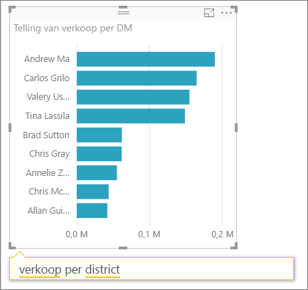
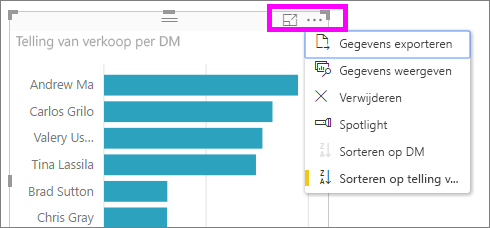

# Power BI Q & A gebruiken voor uw gegevens verkennen en visuele elementen maken

Soms krijgt u het snelst een antwoord uit uw gegevens wanneer u een vraag stelt in natuurlijke taal. De functie Q & A in Power BI kunt u al uw gegevens in uw eigen woorden.  Het eerste deel van dit artikel laat zien hoe u Q & A in dashboards in Power BI-service gebruikt. Het tweede gedeelte ziet u wat u kunt doen met Q & A bij het maken van rapporten in de Power BI-service of Power BI Desktop. Zie voor meer achtergrondinformatie de [Q & A voor consumenten](consumer/end-user-q-and-a.md) artikel. 

[Q & A in de mobiele Power BI-apps](consumer/mobile/mobile-apps-ios-qna.md) en [Q & A met Power BI Embedded](developer/qanda.md) worden behandeld in afzonderlijke artikelen. 

Q & A is interactief en zelfs leuk. Een vraag leidt vaak tot anderen aangezien de visualisaties interessante paden te oefenen. Kijk hoe Amanda demonstreert hoe ze met Q&A visualisaties maakt, dieper op deze visuals ingaat en deze aan dashboards vastmaakt.

<iframe width="560" height="315" src="https://www.youtube.com/embed/qMf7OLJfCz8?list=PL1N57mwBHtN0JFoKSR0n-tBkUJHeMP2cP" frameborder="0" allowfullscreen></iframe>

## Deel 1: Q & A gebruiken op een dashboard in Power BI-service

In Power BI-service (app.powerbi.com) bevat een dashboard tegels die zijn vastgemaakt vanuit een of meer gegevenssets, zodat u over een van de gegevens in elk van deze gegevenssets vragen kunt stellen. Als u wilt zien welke rapporten en gegevenssets zijn gebruikt voor het maken van het dashboard, selecteert u **gerelateerde items weergeven** in de menubalk.

Het vak Q & A bevindt zich in de linkerbovenhoek van het dashboard, waar u uw vraag in natuurlijke taal typt. Ziet u niet het Q & A-vak? Zie [aandachtspunten en probleemoplossing](consumer/end-user-q-and-a.md#considerations-and-troubleshooting) in de **Q & A voor consumenten** artikel.  Q & A herkent de woorden die u typt, en zoekt uit waar (in welke gegevensset) als u wilt het antwoord vinden. Ook helpt Q&A u uw vraag te formuleren door middel van automatisch aanvullen, anders formuleren en andere tekstuele en visuele hulpmiddelen.

Het antwoord op uw vraag wordt weergegeven als een interactieve visualisatie en wordt bijgewerkt als u de vraag wijzigt.

1. Open een dashboard en plaats de cursor in het vragenvak. Selecteer in de rechterbovenhoek **nieuwe Q & A-ervaring**.

    

1. Voordat u begint te typen, worden in een nieuw scherm suggesties weergegeven om u te helpen uw vraag te formuleren. U Zie zinnen en volledige vragen met de naam van de tabellen in de onderliggende gegevenssets en mogelijk zelfs volledige vragen als eigenaar van de gegevensset is gemaakt [aanbevolen vragen](service-q-and-a-create-featured-questions.md),

   

   U kunt een van deze vragen als beginpunt kiezen en verder verfijnen van de vraag voor een specifieke antwoord vinden. Of gebruik een tabelnaam wordt opgegeven voor een nieuwe vraag te formuleren.

2. Selecteer in de lijst met vragen, of begin uw eigen vraag te typen en selecteer suggesties uit de vervolgkeuzelijst.

   

3. Als u een vraag typt, kiest Q & A de beste visualisatie om uw antwoord weer te geven.

   

4. De visualisatie verandert dynamisch als u de vraag wijzigt.

   

1. Wanneer u een vraag typt, zoekt Power BI het beste antwoord op via gegevenssets die een tegel op dat dashboard hebben.  Als alle tegels van *gegevenssetA* zijn, is het antwoord afkomstig van *gegevenssetA*.  Als er tegels van *Gegevensseta* en *Gegevenssetb*, klikt u vervolgens Q & A wordt gezocht naar het beste antwoord in deze 2 gegevenssets.

   > [!TIP]
   > Wanneer u dus slechts een tegel van *gegevenssetA* hebt en u deze van uw dashboard verwijdert, heeft Q&A niet langer toegang tot *gegevenssetA*.
   >

5. Wanneer u tevreden bent met het resultaat, pincode de visualisatie aan een dashboard door het speldpictogram in de rechterbovenhoek te selecteren. Als het dashboard met u is gedeeld of deel uitmaakt van een app, kunt u de visualisatie niet vastmaken.

   

## Deel 2: Q&A gebruiken in een rapport in Power BI-service of Power BI Desktop

Verken met Q&A om uw gegevensset te verkennen en visualisaties aan het rapport en dashboards toe te voegen. Een rapport is gebaseerd op een enkele gegevensset en kan volledig leeg zijn of pagina's vol met visualisaties bevatten. Maar omdat een rapport leeg is, betekent dit nog niet dat er geen gegevens zijn om te verkennen--de gegevensset is gekoppeld aan het rapport en wacht tot u visualisaties verkent en maakt.  Als u wilt zien welke gegevensset wordt gebruikt om een rapport te maken, opent u het rapport in de leesmodus van Power BI-service en selecteert u **Gerelateerde items weergeven** op de menubalk.

Voor het gebruik van Q & A in rapporten, hebt u bewerkingsmachtigingen voor het rapport en de onderliggende gegevensset. In de [Q & A voor consumenten](consumer/end-user-q-and-a.md) artikel, verwijzen we naar dit als een *Maker* scenario. Als je in plaats daarvan *verbruikt* een rapport dat is gedeeld met u Q & A is niet beschikbaar.

1. Open een rapport in de bewerkingsweergave (Power BI-service) of rapportweergave (Power BI Desktop) en selecteer **een vraag stellen** in de menubalk.

    **Power BI Desktop**    
    

    **Service**    
    

2. Een vak met Q&A-vragen wordt op het rapportcanvas weergegeven. In het onderstaande voorbeeld wordt het vragenvak weergegeven boven op een andere visualisatie. Dat is prima, maar mogelijk is het beter om een lege pagina aan het rapport toe te voegen voordat u een vraag stelt.

    

3. Plaats de cursor in het vraagvak. Terwijl u typt, geeft Q&A suggesties om u te helpen met het stellen van uw vraag.

   

4. Als u een vraag typt, kiest de Q&A-functie de beste [visualisatie](visuals/power-bi-visualization-types-for-reports-and-q-and-a.md) om uw antwoord weer te geven. De visualisatie wordt dynamisch gewijzigd als u de vraag wijzigt.

   

5. Wanneer u de visualisatie hebt die u wilt, selecteert u ENTER. U slaat de visualisatie met het rapport op door **Bestand > Opslaan** te selecteren.

6. Interactie met de nieuwe visualisatie. Het maakt niet uit hoe u de visualisatie gemaakt -- u hebt de beschikking over dezelfde interactiviteit, opmaak en functies.

   

   Als u de visualisatie in Power BI-service hebt gemaakt, kunt u deze zelfs [vastmaken aan een dashboard](service-dashboard-pin-tile-from-q-and-a.md).

## Aangeven welke visualisatie Q&A moet gebruiken
U kunt met Q&A niet alleen de gegevens voor zichzelf laten spreken, u kunt in Power BI ook aangeven hoe de gegevens moeten worden weergegeven. U hoeft alleen maar 'as a <visualization type>' aan het einde van uw vraag te typen.  Bijvoorbeeld 'show inventory volume by plant as a map' en 'show total inventory as a card'.  Probeer het zelf maar eens.

## Aandachtspunten en probleemoplossing
- Als u verbinding hebt gemaakt met een gegevensset met behulp van een live-verbinding of de gateway, moet u Q&A [inschakelen voor deze gegevensset](service-q-and-a-direct-query.md).

- U hebt een rapport geopend en ziet de optie Q&A niet. Zorg ervoor, als u de Power BI-service gebruikt, dat het rapport in de bewerkingsweergave is geopend. Als u de bewerkweergave, betekent dit dat u geen bewerkingsmachtigingen voor het rapport hebt en u Q & A kunt gebruiken bij dat specifieke rapport niet openen.

## Volgende stappen

- [Q & A voor consumenten](consumer/end-user-q-and-a.md)   
- [Tips voor het stellen van vragen in Q&A](consumer/end-user-q-and-a-tips.md)   
- [Een werkmap voorbereiden voor Q&A](service-prepare-data-for-q-and-a.md)  
- [Een on-premises gegevensset voorbereiden voor Q & A](service-q-and-a-direct-query.md)   
- [Een tegel vastmaken aan het dashboard vanuit Q&A](service-dashboard-pin-tile-from-q-and-a.md)
